# 开发日志（DEVLOG）

## 2026-07-01 docs: 新增 AI_GUIDELINES.md + DEVLOG.md

**效果**：
1. 项目根目录新增两份持续维护的文档——`AI_GUIDELINES.md`（AI 生成规范）和本文件 `DEVLOG.md`（开发日志）
2. 之后 AI 生成代码有规范要求与避坑指南，并且每次提交前都需要在 DEVELOG.md 对改动进行白盒记录,提交从下往上是最新的提交,并且要对同一个功能进行分类,无需分类的提交单独作为二级标题

**流程**：
- Git 提交规范对齐仓库里实际的提交历史（`type(scope): 中文描述`，无 AI 署名——用 `git log` 核对过近期提交）

## 网页版

### 2026-07-23 feat(web): 搜索兜底在线补充

**效果**：

1. 搜本周刚上架、本地索引还没收录的新番也能搜到了 —— 本地一条都搜不到时，自动退回一次 BGM 在线搜。
2. 结果如实标来源：在线补上来的那批，列表顶上写「本地索引里没有，以下是 BGM 在线补充」。
3. 补不上也说人话：「BGM 限流了，过会儿再试」/「连 BGM 超时了」/「在线补充暂停中，约 N 分钟后恢复」，不糊成「网络请求失败」。

```
本地有结果 → 根本不进来（路由层保证：local.length 非 0 就 return）
├ 缓存命中（30min，含空结果）→ 不联网
├ 冷却中（连挂 3 次 → 停 10min）→ 不联网
├ 超每小时 40 次 → 不联网
├ 距上次不足 2s → 不联网（不排队：让用户干等不如让他改个词）
└ 打一次，失败不重试
```

### 2026-07-22 feat(web): 追番新增搜索功能

**效果**：

1. 追番不再只能从周历（当季）加 —— 新增「加番」搜索，覆盖 **BGM 全量约 3 万部动画**：老番 / 剧场版 / 往季都搜得到（2007 的 sola、辉夜大小姐全季…），搜到即加。
2. **搜索全程本地、零 BGM 在线请求** —— 搜的是本地 SQLite 索引（数据来自 BGM 官方离线档，每周同步一次，见下）。
3. **模糊匹配**：只记大概名字也搜得到（搜「漫画咖啡厅」出「漫画咖啡屋」），像 BGM 那样按共享片段排。
4. 加番自动补封面 + 标签（离线档没封面，加番时那一次 detail 顺带取，填进新追番）。

**数据来源**：BGM 官方数据档（`bangumi/Archive`，每周三更新，419MB zip）。`scripts/build-bgm-index.ts` 下档 → 流式解压取 `subject.jsonlines` → 只留 `type=2`（动画）→ 灌进**独立只读** `bgm_index.db`（原子替换；搜索端按 mtime 变化自动重开，不必重启）：

```
扫 65.8 万条 subject → 收录 3.05 万部动画（索引仅 5.6MB）
```

**模糊搜索**（`anime-index.ts`）—— 查询拆 **CJK 相邻二元组**、按命中片段数排，就软了：

```ts
// 漫画咖啡厅 → [漫画,画咖,咖啡,啡厅]；「漫画咖啡屋」共享 漫画/画咖/咖啡 三个 → 浮上来（拉丁词整段不拆）
const grams = queryGrams(q)
// WHERE 任一片段命中；ORDER BY 精确 > 前缀 > 整串子串 > 部分命中, 再按命中数、BGM 评分
```

搜索**只是查询层改动、不动索引**。加番默认「想看」；封面取 detail 的 `images.large`（前端 `coverUrl` 改写成 `/api/cover` 代理）。

**索引更新**：落在数据目录 `/opt/mapletools-data/bgm_index.db`，上线后先手跑一次，之后 cron 每周四（档周三更新，留一天余量）：

```bash
su -s /bin/bash mapletools -c 'cd /opt/mapletools/web && DATA_DIR=/opt/mapletools-data npm run sync:index'
```

- `DATA_DIR` **必须显式给**：那是 pm2 配置里的变量，cron / 手敲的 shell 不继承，漏了就写进部署目录里、线上永远读不到。
- 跑的时候**站点不用停也不用重启 pm2**（写 `.tmp` → rename 原子替换 → 服务端按 mtime 自动重开句柄）。
- `/api/search?q=` 空查询只回 `{ready,total,builtAt}`，当「索引同步到哪天了」的健康检查。

### 2026-07-22 fix(web): 修复稀饭直连失败问题

**效果**：

1. 追番卡片「继续看」按钮激活（原是灰占位）：点一下 → 定位到稀饭对应番剧 → 直接开播到**下一集**（EP = 已看 +1），跳过「开稀饭 → 搜索 → 输验证码 → 找番 → 翻集」整套。这就是 012 说的「追番 = 在线观看的快捷定位引擎」落地。
2. **首次点弹「选择稀饭片源」**让用户确认是哪部（按名字匹配周表候选），确认即**建绑定并记住**；之后同一部直接是链接、秒开，不再弹。
3. **绑定跨季持久**：周表换季后原番从周表消失，绑定仍在、照常开播。
4. **播放页参考 app 播放器重做**：标题 + EP 徽标、**集数网格**（整季一格一集、当前高亮，点即换集，从 watch 页扒集数列表）、线路卡片，玫瑰主色对齐 app/web 暗色主题。
5. **网盘下载型线路秒切 iframe**：`apn.moedot.net`→`pan.wo.cn/openapi/download` 这类**下载链接**，`<video>` 喂它会触发浏览器**下载 400MB**（还播不了）、白等几秒才切套娃 —— 现在按 URL **直接判死**走 iframe，不碰 `<video>`（`classify()` 里加的规则，各端一致、非 localhost 专属）。

**关键机制**：追番存 **BGM id**，稀饭播放页要**稀饭自己的 animeId**，两套编号、无确定映射，唯一联系是标题；而稀饭 search 有验证码（过不了）。突破口 = 稀饭「追番周表」的数据接口**不设验证码**，直接给出 animeId：

```
追番卡片「继续看」
  ├─ 已绑定 ───────────────────────────────→ 播放页(animeId, EP=已看+1)
  └─ 未绑定 → 周表匹配(免验证码) → 候选选择框 → [点确认 = 建绑定·落库] ─┘（之后走上面那条）
```

```ts
// server/xifan/weekday.ts —— POST 一个中文星期就回那天全部在播番，每条自带 animeId
//   POST /index.php/ds_api/weekday   body: weekday=一   (一/二/…/日)
//   → { code:1, list:[{ vod_id:3552, vod_name:"最强废渣皇子…", vod_remarks:"03|周一22:00" }] }
// vod_id 就是 animeId、vod_name 是中文名 —— 拿它跟追番标题比，把 bgmId 定位到 animeId
```

```tsx
// 卡片：绑过 → 原生 <a>（无异步、不吃弹窗拦截）；没绑 → 点了去周表定位、弹候选让用户确认
{binding
  ? <a href={playPageUrl(binding.xifanId, nextEp(t))} target="_blank">继续看 EP {ep}</a>
  : <button onClick={onContinue}>继续看 EP {ep}</button>}
```

播放路由（`resolve.ts` `classify()`）—— 下载型链接直接判 iframe：

```ts
if (/\.m3u8(\?|$)/i.test(url)) return 'hls'                                   // hls.js
if (/apn\.moedot\.net|pan\.wo\.cn|\/openapi\/download/i.test(url)) return 'iframe' // 302→网盘 download，直接套娃
return 'mp4'                                                                  // xfvod 干净直链 → <video> 直连
```

### 2026-07-21 test(web): 新增稀饭在线观看

**效果**：

1. web 新增稀饭在线观看后端 + 播放器原型（`server/xifan.ts` + `server/xifan/resolve.ts`）：给定稀饭 animeId → **浏览器直连源 CDN 播放，视频字节不经服务器**（零视频带宽，符合 012「视频不给服务器加码」）。目前是独立测试页 `/api/xifan/play-page`，**还没接追番卡片「继续看」按钮**。
2. **懒加载选线**：打开只抓 **1 次**（拿线路 1 地址 + 全部线路名单），线路 2/3 **点了才解析**。不并发、不自动选最优 —— 一串请求砸向稀饭像爬虫、会触发反爬 / 限流。
3. **按类型播 + 套娃兜底**：`.mp4` → `<video>` 直连；`.m3u8` → hls.js（CDN 回 ACAO 直连分片 + 深缓冲 10min、暂停也灌）；直连播不了 → 嵌稀饭真实播放器 iframe，兜住 content-disposition / 空壳 manifest / 编码。
4. **免验证码 + 秒回**：验证码只在 search，播放页 / 周表页都不设 → 当季番从周表页直接拿 animeId；解析结果进共享缓存，刷新 / 换人秒回。

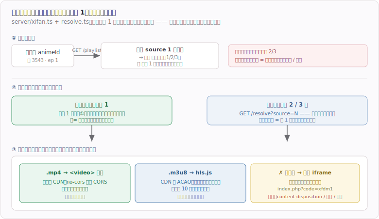

**关键代码**：

打开只抓 **source 1 页一次**，就同时拿到「线路 1 地址」和「全部线路名单」—— 名单靠正则扒源 tab（web 侧不为几个 `<a>` 加 cheerio），**不用逐条解析**；线路 2/3 等用户点了才抓：

```ts
// server/xifan/resolve.ts —— getPlaylist
const body  = await fetchHtml(`/watch/${animeId}/1/${ep}.html`) // 一次
const first = parsePlayerData(body)?.url        // 线路 1 地址（顺手，打开即播）
const lines = parseSourceTabs(body)             // 源 tab → [{source,name}]，全部线路名，零额外请求
// 线路 N 等 resolveLine(animeId, ep, N) 在点击时才抓，绝不一次性并发（防反爬）
```

### 2026-07-17 feat(web): 新增我的追番

**效果**：

1. **周历卡片上能追番了**：hover 海报 → 右上角「＋追番」；已追的**整卡描边高亮**，逛周历一眼看出哪些在追。未登录不显示这个按钮。
2. **新增「我的追番」页**（`#/tracks`）：卡片墙 + 「今天更新」置顶分组（只算「在追」且今天放送的）。全部 / 在追 / 想看 / 看完四个 tab，搜索（**标题 + 别名**）、类型过滤（弹窗多选、按钮角标显示选了几个）。
3. **点封面开编辑弹窗**：改状态 / 进度 / 总集数 / 自定义标签，**没有保存按钮，改完即生效**。BGM 带来的标签不可编辑，自定义标签点一下删。
4. 进度 +/- 直接做在卡上。**在线观看按钮先占位置灰** —— 播放页还没做，位置是 `CalendarPage.tsx` 原注释就留好的。
5. 沿用 app 的既定语义：`totalEpisodes == null` = **连载中**（不是 0），徽章即手填入口；进度推满**不**自动切「看完」（用户填 12 不一定是看到 12）；只有「想看」首次 +1 自动转「在追」。

**关键代码**：

**写入一律「字段级 patch」，绝不整条替换**（ideas/012 的同步铁律）。现在还没接 app 同步，但这条从第一天就得立住，否则将来 app 推富记录过来会被 web 的瘦数据抹掉。body 里没给的字段**保持沉默、原样不动**：

```ts
// server/tracks.ts —— 只写 body 里明确给了的字段
if ('episode' in body) { sets.push('episode = ?'); args.push(...) }
if ('userTags' in body) { ... }
// 没给 → 那一列压根不进 UPDATE 语句
```

表结构同理为同步留好位置：瘦列（status / episode / 标签…）供 web 查询展示，`extra` JSON 列存 app-only 字段（goodEpisodes / bindings…）**原样过服务器往返**，现在空着但列先建好，将来接同步不用改表。

周历接口**不返标签也不返别名**，只有条目详情有 —— 没有这一步「按类型过滤」永远是空的、搜别名也搜不到。所以加追番后异步补一次 detail（服务端版的 app `ensureBgmTagsFilled`），三个细节都照抄 app：

```ts
// server/tracks.ts —— 抖动 800-2000ms 再发（防连点打出一串请求）
const jitterMs = 800 + Math.random() * 1200
setTimeout(() => {
  const recheck = oneStmt.get(uid, bgmId)          // ← 发前二次检查：这段时间用户可能已取消追番
  if (!recheck || parseList(recheck.bgm_tags).length > 0) return
  const d = await fetchSubjectDetail(bgmId)        // ← 一次请求同时拿回 标签 + 别名 + 放送日期
  // 不动 updated_at —— 这是系统回填，不是用户操作，不该影响「后写者胜」
}, jitterMs)
```

### 2026-07-17 fix(web): 番剧周历封面太糊

**效果**：

1. **周历封面从 150×211 换成 400×563**（11KB → 约 56KB）。原来取周历自带的 `images.common`，注释写「≈200px，卡片够清晰」——实测只有 **150×211**；卡片约 220px，在视网膜屏上是 440 物理像素，等于把 150 的图放大 3 倍，糊得没法看。
2. 全量 112 部约 5.8MB（原 1.2MB），但卡片是 `loading="lazy"`，实际只加载视口内那十几张 ≈ 1MB 上下。**注意周历的 14 天缓存只缓存 JSON，图片不经它**——图片挡在浏览器缓存（`immutable` 30 天）后面，服务器这边每个新访客的首屏都要真代取一次。
3. **没魔法的用户不受影响**：浏览器请求的仍是同源的 `/api/cover/...`，由海外 VPS 代取，链路改前改后一样。

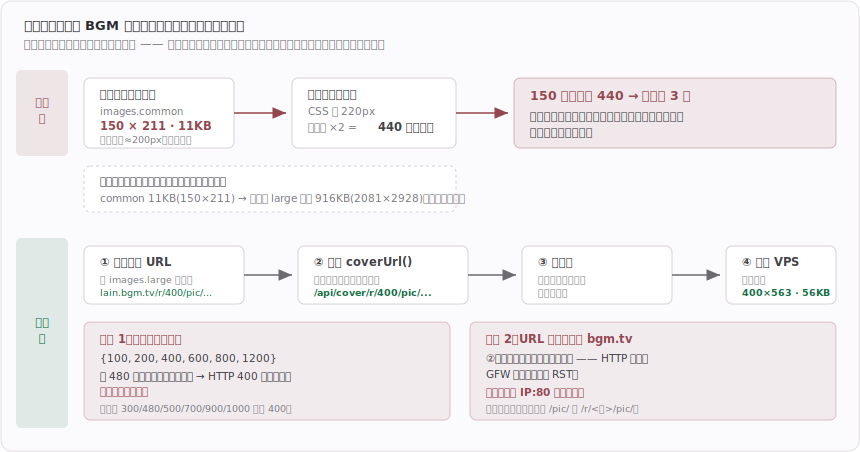

**关键代码**：

周历那套老式路径没有中间档：`common` 之上直接跳到 `large`（2081×2928、916KB），只能改走图床的实时缩放接口 `/r/<宽>/pic/...`（底图就是 large）。**宽度只认白名单 `{100, 200, 400, 600, 800, 1200}`，填 480 这种看着合理的数会 HTTP 400 拿到空图、封面全裂**：

```ts
const COVER_WIDTH = 400
const m = (images.large ?? '').match(/^https?:\/\/[^/]+(\/pic\/.+)$/)
if (m) return `https://lain.bgm.tv/r/${COVER_WIDTH}${m[1]}`
```

封面代理原来只放行 `/pic/` 前缀，新形态是 `/r/400/pic/...`，白名单要跟着放宽——但仍然只认 `pic/` 那一段，不放行图床上的任意路径：

```ts
const COVER_PATH_RE = /^\/(r\/\d{2,4}\/)?pic\//
```

### 2026-07-17 fix(web): 番剧周历缓存丢失

**效果**：

1. **周历的 14 天缓存现在落盘**（`$DATA_DIR/calendar-cache.json`），重启后还在。之前缓存是进程内的 `let cache`，跟进程同生死 —— 而每次上线更新都要重启一次，于是「14 天 TTL」实际上是「14 天或到下次重启为止」，等于没有。开发期重启十几次就等于向 BGM 拉十几次。

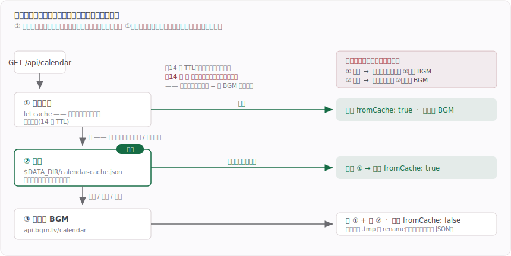

**关键代码**：

`DATA_DIR` 的解析从 `db.ts` 抽到新的 `server/data-dir.ts`。不直接从 `db.ts` 导出，是因为 `calendar.ts` 只要那个目录，为此 import `db.ts` 会把 `better-sqlite3`（原生模块，`vite.config.ts` 里标了 `ssr.external`）拖进周历的 import 图。

写盘先落临时文件再 `rename`——直接覆盖会在崩溃 / 满盘时留下半个 JSON，之后每次启动都读到坏文件；同分区 `rename` 是原子的，要么旧的要么新的：

```ts
const tmp = `${CACHE_FILE}.${process.pid}.tmp`
writeFileSync(tmp, JSON.stringify(entry))
renameSync(tmp, CACHE_FILE)
```

### 2026-07-17 chore(web): 降低后端为低权限

**效果**：

1. **后端不再用 root 跑**（见下图）。改用专用低权限用户 `mapletools`（系统账号、密码位锁死、无 authorized_keys，登不进来）。原来是 root：万一后端出 RCE，攻击者拿到的直接就是整台机器 —— 读 SSH 私钥顺藤摸到别的机器、删光备份、改 nginx 劫持流量。现在同样的漏洞只能拿到「读写网页版自己那个库」，`/etc/shadow`、root 的 `.ssh`、备份目录、nginx 配置、`sudo` 全部 `Permission denied`。
2. **备份目录故意留给 root**（`/opt/mapletools-backup`，700 root:root）。应用用户读不到也删不掉 —— 勒索软件第一步就是毁备份，备份和它保护的东西不能待在同一个权限域里。
3. **新增 [`docs/术语.md`](docs/术语.md)** —— RCE / 权限隔离 / 纵深防御 这些词的速查，只收这个项目真碰到过的。

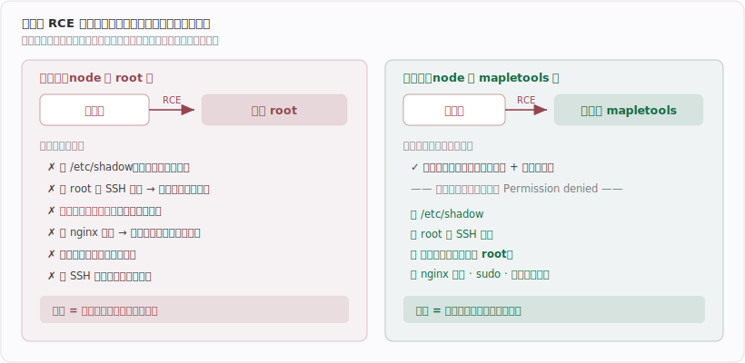

**关键代码**：

应用换用户后，pm2 守护进程是**按用户各一份**的 —— root 敲 `pm2 list` 会是空的。正确命令得 `su` + **`cd`**，而少了那个 `cd` 会报一个指向 node 的假错误（`spawn /usr/bin/node EACCES`，其实是 cwd 继承了 root 的 `/root`、700 进不去）。这种东西靠文档提醒人早晚出事，焊进 `/usr/local/bin/mtweb`：

```bash
exec su -s /bin/bash mapletools -c "cd /opt/mapletools/web && pm2 $*"
```

root 的 cron 备份会**悄悄夺走库文件属主**：root 打开 SQLite 时若 WAL/SHM 不存在，会新建成 root 所有，应用从此写不了自己的库 —— 而且要等到凌晨 4 点之后才爆。备份脚本末尾补一行：

```bash
chown mapletools:mapletools /opt/mapletools-data/web.db{,-wal,-shm}
```

### 2026-07-17 fix(web): 堵住能绕过 HTTPS 的后端直连端口 + 登录限流 + 数据库备份

**效果**：

1. **公网直连 `:3000` 关掉了**（见下图）。node 之前绑 `0.0.0.0` 且服务器没防火墙，`http://<ip>:3000` 从公网直接通 —— nginx 白装：登录密码明文过公网、HSTS/证书全不生效、`X-Forwarded-For` 随便伪造。改成只绑 `127.0.0.1`。
2. **登录 / 注册加了限流**。原来只有 `/forgot` 有 —— 因为密保答案熵低、想得到；`/login` 反而裸奔，连打错密码只会一直 401，从不 429。现在登录按 **IP 20 次 + 账号 10 次 / 15 分钟**双维度挡，注册按 IP 5 次/小时。
3. **数据库有备份了**。每天 04:00 `sqlite3 .backup` + gzip、留 14 天；库文件权限 `644 → 600`。之前线上有真用户数据、零备份。
4. **nginx 补了 HSTS + nosniff + X-Frame-Options + Referrer-Policy**。
5. **设置页「已保存」不再把整行按钮顶下去**，改成占按钮右边的常驻空位。删掉一批自曝式文案（数据存哪、为什么不回显问题、周历缓存多久…）—— 界面自明的东西再解释一遍只剩噪音，理由写进 docs 就够。
6. **补上了实际在用的部署文档**：`docs/web/唐人云部署保姆教程.md`。`docs/web/` 之前只有 Vercel 和 Oracle 两份**备选**方案的教程，真正在跑的这套（git pull + pm2 + nginx + certbot）反而没有，换机器就得从头摸。

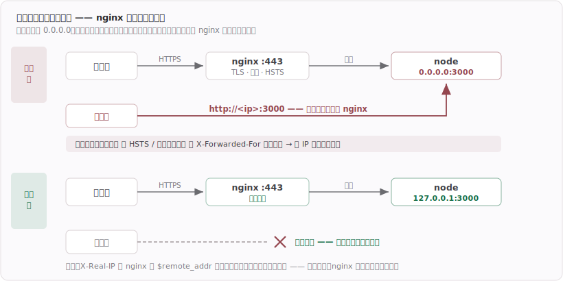

**关键代码**：

限流的 IP 只能认 `X-Real-IP`。`X-Forwarded-For` 是**追加**的（`$proxy_add_x_forwarded_for` 把真 IP 拼在客户端伪造值的**后面**），所以退化时要取最后一段；而 `X-Real-IP` 被 nginx 用 `$remote_addr` 整个覆写，伪造不了。这两个头可信的前提，正是效果 1 那条 —— nginx 之外没人进得来：

```ts
// server/node.ts —— 默认绑回环，要裸跑再显式给 HOST
const hostname = process.env.HOST || '127.0.0.1'
serve({ fetch: app.fetch, port, hostname }, …)

// server/auth.ts
function clientIp(c: Context): string {
  const real = c.req.header('x-real-ip')
  if (real) return real
  return c.req.header('x-forwarded-for')?.split(',').pop()?.trim() || 'local'
}
```

登录两个维度都要挡，且**放在 `verifySecret` 之前** —— scrypt 很吃 CPU，先限流顺带挡住拿登录接口打 CPU 的玩法。成功后要清账，否则用户自己打错几次的额度会留着替攻击者扣：

```ts
const ipKey = `login-ip:${clientIp(c)}`
const userKey = `login-user:${username.toLowerCase()}`
// 只按账号挡不住「换着号猜」，只按 IP 挡不住「多 IP 盯一个号猜」
if (rateLimited(ipKey, LOGIN_MAX_PER_IP, WINDOW) || rateLimited(userKey, LOGIN_MAX_PER_USER, WINDOW)) {
  return c.json({ error: '尝试次数过多，请 15 分钟后再试' }, 429)
}
const ok = row ? await verifySecret(password, row.pass_hash) : await verifySecret(password, 'x:x')
if (!row || !ok) return c.json({ error: '用户名或密码错误' }, 401)
buckets.delete(ipKey); buckets.delete(userKey)   // ← 登录成功即清账
```

### 2026-07-16 feat(web): 顶栏导航 + 设置页 + 找回密码

**效果**：

1. **顶栏导航**取代原来塞在周历页右上角的登录入口 —— app 是侧边栏（桌面应用的语言），网页的惯例是顶栏，这里不照搬 app。左边品牌 + 「番剧周历」，右边未登录 = 「登录 / 注册」，已登录 = 用户名 chip → 下拉（设置 / 退出）。周历页的面包屑一并去掉：顶栏已经指明在哪，再来一层是冗余。
2. **设置页**（`#/settings`）：左栏身份卡 + 模块导航（个人信息 / 账号安全，「追番偏好 / 数据同步」占位待开发），右栏模块面板。加了 20 行 hash 路由 —— 只有两个页面，引 react-router 不划算，但纯 state 会让地址栏不变、设置页刷新就回周历也收藏不了。
3. **找回密码**：账号 + 密保问题 + 答案 + 新密码。密保问题走**预设下拉**而不是自由填写 —— 自由填写找回时要一字不差重打一遍（没人记得住），按用户名把问题显示出来又等于泄露给任何知道你用户名的人；预设下拉两头都躲开。**问题和答案设置后都不回显**，只报「设没设」（问题本身也是秘密，泄露了等于告诉别人该去查什么）。答案跟密码同样走 scrypt 哈希、比对前 trim + 转小写。
4. **账号安全设置**：新密码留空 = 只改密保。改密码和改密保**两条路都强制验原始密码** —— 否则别人借你没锁屏的电脑就能悄悄把密保换成自己的，从此随时能接管账号。
5. **改密码 / 找回密码现在能真正踢掉所有设备**（见下图）。用户名上限 20 → **12**（顶栏 chip 按内容伸缩，12 个中文 ≈ 205px 放得下，20 个会到 ≈305px）。密保没设时登录后给一条提示条引导去设置（不强制）。

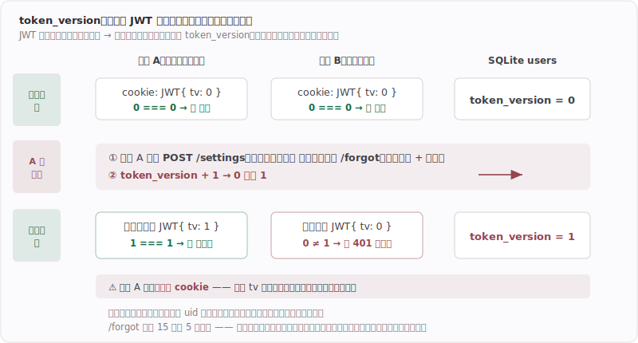

**关键代码**：

无状态 JWT 默认**没法吊销** —— 它自证，验的时候不查库，所以改了 `pass_hash` 那张老 token 照样有效。加一列 `token_version` 塞进 payload，验签后再比一次，就有了真吊销：

```ts
// server/auth.ts —— 验证时多比一次 tv
export async function getSession(c: Context): Promise<Session | null> {
  const payload = (await verify(token, SECRET, 'HS256')) as unknown as Session
  const row = findById.get(payload.uid) as UserRow | undefined
  if (!row || row.token_version !== payload.tv) return null // ← 改过密码 → 老 token 当场作废
  return { uid: row.id, username: row.username, tv: row.token_version }
}

// 改密码 → tv+1 让所有老 token 失效，但得给本机补发，否则自己也被踢下线
bumpPassword.run(await hashSecret(next), s.uid)
const fresh = findById.get(s.uid) as UserRow
await issueSession(c, { uid: fresh.id, username: fresh.username, tv: fresh.token_version })
```

自绘下拉 `Select.tsx` 把 `AI_GUIDELINES`「UI/样式」新增的两条固化成组件（原生 `<select>` 展开是系统弹层跟设计系统无关；浮层宽度要对齐触发器）——顶栏用户名 chip 的下拉同一套做法：外层 `relative` 收缩包裹，浮层 `w-full` 自动跟触发器同宽，用户名多长下拉多宽。

```tsx
<div className="relative">
  <button className="w-full …">…</button>
  <div className="absolute left-0 w-full …">…</div>   {/* ← 100% = 触发器宽 */}
</div>
```

### 2026-07-15 feat(web): 新增注册 / 登录

**效果**：

1. 网页版加**开放注册 + 登录**：注册（用户名 + 密码 + 确认密码）/ 登录（用户名 + 密码）/ 登出；会话是 httpOnly 签名 cookie，刷新 / 换设备自动保持登录态。数据落**本地 SQLite**（`better-sqlite3`），用户名大小写不敏感唯一，密码 **scrypt** 哈希（Node 内置，不加依赖）。
2. 登录入口**融入周历页右上角**：未登录 = 「登录 / 注册」按钮 → 弹窗（压在暗化周历上、MD3 卡片、登录 / 注册分段切换）；已登录 = 用户名 chip + 退出。**周历本身公开**，登录只是附加层（app 版没有账号，这是网页版独有）。

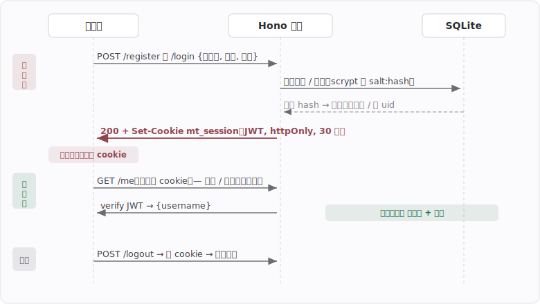

**关键代码**：

密码 scrypt 存 `salt:hash`、校验走定时安全比较（防时序侧信道）；会话不建 session 表，直接签 JWT 进 httpOnly cookie：

```ts
// server/auth.ts
async function hashPassword(pw: string) {
  const salt = randomBytes(16)
  const derived = (await scryptAsync(pw, salt, 64)) as Buffer
  return `${salt.toString('hex')}:${derived.toString('hex')}` // 存 salt:hash
}
// 登录 / 注册成功 → 签发会话 cookie
const token = await sign({ uid, username, exp }, SECRET, 'HS256')
setCookie(c, 'mt_session', token, { httpOnly: true, secure: PROD, sameSite: 'Lax', maxAge: 30 * 86400 })
```

DB 文件位置有部署铁律：必须放 `/opt/web` 之外（部署一条龙 `rm -rf /opt/web` 会清空），生产走 env `DATA_DIR=/opt/mapletools-data`、dev 落 `web/data/`；上线还要设 `AUTH_SECRET`（JWT 密钥）。详见 `docs/ideas/012-网页版.md`。

### 2026-07-15 fix(web): 修复封面无法显示问题

**效果**：

封面代理从「查询参数带完整图床 URL」（`/api/cover?u=https://lain.bgm.tv/...`）改成**路径式** `/api/cover/pic/...`：前端把图床 URL 的路径拼到 `/api/cover` 后，host 由服务器写死 `lain.bgm.tv`、只放行 `/pic/`。封面 URL 里**不出现被墙域名**，国内免魔法访问时封面也能正常显示；host 写死顺带把 SSRF 面堵死。（查询参数版为什么在国内失败，见 `docs/ideas/012-网页版.md` 的「部署纪要」。）

**关键代码**：

```ts
// server/index.ts
app.get('/api/cover/*', async (c) => {
  const path = c.req.path.replace(/^\/api\/cover/, '')   // /pic/cover/c/48/4a/xxx.jpg
  if (!path.startsWith('/pic/')) return c.text('forbidden', 403)
  const up = await fetch(`https://lain.bgm.tv${path}`, { signal: AbortSignal.timeout(15000) })
  c.header('Cache-Control', 'public, max-age=2592000, immutable')
  return c.body(up.body)
})
```

```tsx
// src/api.ts —— 前端把图床 URL 重写成不含 bgm.tv 的路径
export function coverUrl(raw: string): string {
  const m = raw.match(/^https?:\/\/[^/]+(\/.*)$/)
  return m ? `/api/cover${m[1]}` : ''
}
```

### 2026-07-15 feat(web): 新增网页版 - 番剧周期表

**效果**：

1. 新增 `web/` 子项目 = 网页版（Vite + React + Tailwind 前端 + Hono 后端），**同仓库、结构隔离**：自带独立 `package.json` / `node_modules`，根 `package.json` 一行不动，app 的 tsconfig / electron-vite / electron-builder 都扫不到它 → 对 app 零影响。开发 `cd web && npm run dev`（app 仍是根目录 `npm run dev`，两者不同目录 / 不同运行时，不会混）。
2. 首个功能 **番剧周期表** 端到端跑通：前端 → Hono `/api/calendar` → 抓 `api.bgm.tv/calendar` → 渲染。设计**照搬 app 的 AnimeCalendar**（MD3 色 token / Inter+Space Grotesk 字体 / 3:4 海报卡 / `<1200px` 切「选天 + 多列网格」响应式）；图标改**内联 SVG**（弃 material-symbols 的 3.9MB 字体 —— 网页版按网络下载算这 3.9MB 太亏，app 本地读则无所谓）。
3. 抓取逻辑从 app `src/main/bgm` **拷来、只换传输层**（Electron `net` → `fetch`），app 侧零改动（见 `docs/ideas/012-网页版.md`）。
4. 服务器 / 部署定**海外香港 CN2 VPS**（阿里云大陆机实测 `curl` BGM 超时、够不着 → 走海外）；后端 Hono 一套代码本地 / Vercel / VPS 通吃（`server/node.ts` = `@hono/node-server` 服务 `dist` + `/api` 的生产入口）。

**关键代码**：

封面必须走服务器代理 —— **BGM 图床 `lain.bgm.tv` 国内被墙**，浏览器直连拿不到（国内免魔法用户封面会全裂）；由海外服务器代取，只放行 `bgm.tv` 防 SSRF，并取 `common` 小图（937KB → 11KB，省 6M 小机带宽）：

```ts
// server/index.ts
const COVER_HOST_RE = /(^|\.)bgm\.tv$/
app.get('/api/cover', async (c) => {
  const url = new URL(c.req.query('u')!)
  if (url.protocol !== 'https:' || !COVER_HOST_RE.test(url.hostname)) return c.text('forbidden', 403)
  const up = await fetch(url.toString(), { signal: AbortSignal.timeout(15000) })
  c.header('Cache-Control', 'public, max-age=2592000, immutable')
  return c.body(up.body)
})
```

传输层可挂代理 —— Node 的 `fetch`（undici）默认**不读系统代理**，跟 app 当年 Node `https` 直连 fake-ip 黑洞是同一个坑；`EnvHttpProxyAgent` 认 `HTTPS_PROXY` 环境变量（本地 Clash 非 TUN 时用得上，香港机 / Vercel 没这变量 → 直连）：

```ts
// server/http.ts
setGlobalDispatcher(new EnvHttpProxyAgent())
```

## 妙语库

### 2026-07-13 fix: 妙语库进页面无提示「云端有更新」

**效果**：

1. 别的设备上传后,这台设备一进「妙语库」页,同步条就**主动**显示「云端有更新」;本地有没传的改动显示「本地未上传」,两边都改显示「本地与云端都有变化」——配色/文案跟追番、锦囊妙计一模一样。之前只有点上传/拉取时才知道云端状态。
2. 冲突判定沿用同一套:上传时云端 rev 比上次同步新 / 拉取时本地有未推送改动 → 二次确认才覆盖。

**数据 / 状态流**：

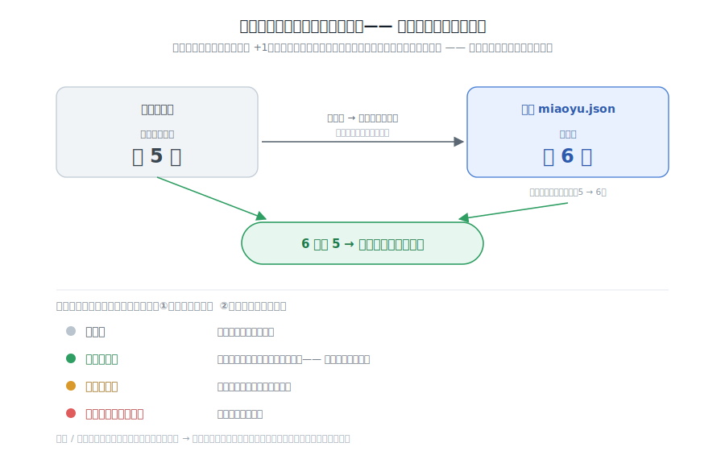

**关键代码**：

进页面后台 pull 一次读 `_rev` → `remoteRev`,`cloudNewer = remoteRev > lastSyncedRev`;push / pull 后把 `remoteRev` 和 `lastSyncedRev` 一起改成新值,自己刚同步不误报。

```tsx
// pages/MiaoyuLibrary.tsx
useEffect(() => {
  window.webdavApi.pull('miaoyu')
    .then((s) => setRemoteRev(parseRemoteBlob(s).rev))
    .catch(() => {})            // 未配置 / 无远端 / 网络 → 静默
}, [])
const cloudNewer = remoteRev !== null && remoteRev > lastSyncedRev
```

这一探测拉的是整份 blob（含图片 base64、体积可能不小）—— 只进页面探一次、不轮询,是为与另两处一致的主动提示而接受的代价（推翻了原来"太重不探测"的注释）。

## 在线观看

### 2026-07-13 style: 优化自定义源播放页样式结构

**效果**：

1. **双滚动条的违和感没了**。自定义源(webview 嵌真实播放页)那页原先是「16:9 矮盒子里塞整张网页」——盒子外是 app 的页面滚动条,盒子里是网页自己的滚动条,鼠标压在 webview 上滚的永远是网页那条,想滚 app 那条得把鼠标挪到盒子和窗口之间的缝里。现在**整页固定高度、页面自身不滚动**,webview 吃掉标题/切换器下方的全部剩余高度,**只剩站点自己的一条滚动条**,且永远在鼠标底下。
2. **应用内「铺满」按钮删了**。播放区右上角那个「铺满/退出」按钮连同它的 state、Esc 监听一并去掉——它做的是「webview 铺满窗口但显示整张网页(导航/广告位都在)」,不是用户要的「只剩视频画面」。
3. **全屏 = 只剩视频画面、覆盖整扇窗**(对齐稀饭/Girigiri/B 站原生 `<video>` 全屏)。点站点播放器自己的全屏按钮:之前 webview 只在「盒子」里全屏、顶部 app chrome 还露着(用户实拍);现在铺满整窗,只剩视频。

**关键代码/决策**：

**全屏靠站点自己的按钮 + 监听 webview 全屏事件把容器铺满窗口**。根因:webview 内 `<video>` 请求 HTML5 全屏时窗口是全屏了,但 app 布局把 webview 钉在 `flex-1` 盒子里、顶部标题栏没让位,所以只在盒子里全屏。修法——

```tsx
// pages/OnlinePlayer.tsx
const [embedFs, setEmbedFs] = useState(false)
el.addEventListener('enter-html-full-screen', () => setEmbedFs(true))
el.addEventListener('leave-html-full-screen', () => setEmbedFs(false))
// 容器:平时 relative 盒子,全屏时整块 fixed inset-0 铺满窗口(webview 原地不动)
<div className={embedFs ? 'fixed inset-0 z-[80] bg-black' : 'relative flex-1 min-h-0 …'}>
```

`enter-html-full-screen` / `leave-html-full-screen` 是 Electron `<webview>` 的 DOM 事件,由站点自己的全屏按钮(guest 调 `requestFullscreen`)触发;退出(站点按钮 / Esc)自动派发 leave,**不用自己接键盘**。只切容器 class、webview 元素原地不动 ⇒ **不重载、不丢播放进度**(与被删的旧「铺满」同一套「不 remount」手法,只是触发源从我们的按钮换成站点全屏事件)。

### 2026-07-11 feat: 自定义源新增应用内播放

**效果**：

1. 加过的自定义链接（B 站以外的番剧站，多是盗版站）现在**在应用里直接看**，不用再开浏览器进站搜番。用的是站点自己的播放页 —— 剧集列表、画质菜单、播放器全在，换任何站都有。
2. **弹窗广告拦了**。盗版站点哪弹哪的 `window.open` 被拦死（实测 guest 里返回 `null`，不弹新窗）。
3. **能铺满窗口全屏看**。播放区右上角一个「铺满」按钮把网页铺满整个应用窗口，Esc 退出；站点自己的全屏按钮也照常能用。
4. 顺带做了两件隐性的：自定义站换到独立分区 `persist:webplay`（不受信站点的 cookie/storage 跟应用默认会话隔开）；「添加观看源」弹窗文案改成「应用内直接播放」（旧文案只说"chip 在浏览器打开"）。

**关键代码**：

① 主进程硬化（对所有 webview 生效，B 站分区也一样）：

```ts
// main/index.ts
app.on('web-contents-created', (_e, contents) => {
  if (contents.getType() === 'webview') contents.setWindowOpenHandler(() => ({ action: 'deny' }))
  contents.on('will-attach-webview', (_evt, webPreferences) => {
    delete webPreferences.preload
    webPreferences.nodeIntegration = false
  })
})
```

`<webview>` 不带 `allowpopups` 时默认就拦弹窗，这道 handler 是**第二层**防御（防以后手滑开 `allowpopups` + 拦 guest 自己派生的子 webContents），不是从零到一的新能力。

② 铺满切换**不重载 webview**——容器 class 在「16:9 盒子 / `fixed inset-0`」间切，但 webview 保持在树里同一位置（换位置会 remount → 页面重载 → 丢播放进度）：

```tsx
// pages/OnlinePlayer.tsx
<div className={embedExpanded ? 'fixed inset-0 z-[70] bg-black' : 'relative aspect-video …'}>
  <webview key={`${view.url}#${webviewKey}`} src={view.url}
    partition={view.isBili ? 'persist:bili' : 'persist:webplay'} className="h-full w-full" />
</div>
```

### 2026-07-10 feat(bili): B 站源在线播放 —— 真 1080P + 扫码登录

**效果**：

播放：

1. **画质是真的了**。之前用 B 站官方外链播放器（`player.bilibili.com/player.html`），它的画质菜单里明明列着 1080P，**点了没反应**——那个「进入哔哩哔哩，观看更高清」的浮层就是它在告诉你被锁在 360P，登不登录都一样。现在自己问 API 要地址，1080P/720P/480P/360P 四档任选，选哪档就是哪档。
2. **暂停不再弹一堆推荐视频**，画面上也没有任何引流层——播放器是我们自己的 `<video>`。
3. **合集终于有集数列表了**。像 `BV1zAQGB8Eqq` 这种「1-12 话全集」的稿件，12 个分 P 直接铺成集数网格，点第 5 集就是 `&p=5` 那一集。单 P 稿件就一格，形态和稀饭/Girigiri 一致。
4. 番剧链接（`/bangumi/play/ep…`）仍走原来的外链播放器——它是另一套 pgc 接口，这次没动。

登录：

5. 扫码能登进去了。之前弹一个 BrowserWindow 加载 `passport.bilibili.com/login` 让用户扫官方页面的码，手机上点「确认」直接报 **API校验密匙错误**——B 站 2026-06 起收紧了 **web 端**扫码接口的风控（同期 downkyi 等工具一起中招）。
6. 登录入口进了「设置 → 通用 → B 站账号」，扫一次长期有效，不用每次进播放页才能登。播放页提示条上的登录按钮还在，点开是同一个扫码弹窗。
7. 顺手修了提示条上「登录 B 站」按钮的下划线：整个按钮加 `hover:underline`，而图标是**字体字形**、基线和文字不同，下划线被画成高低两截。改成只给文字那个 `<span>` 加下划线。

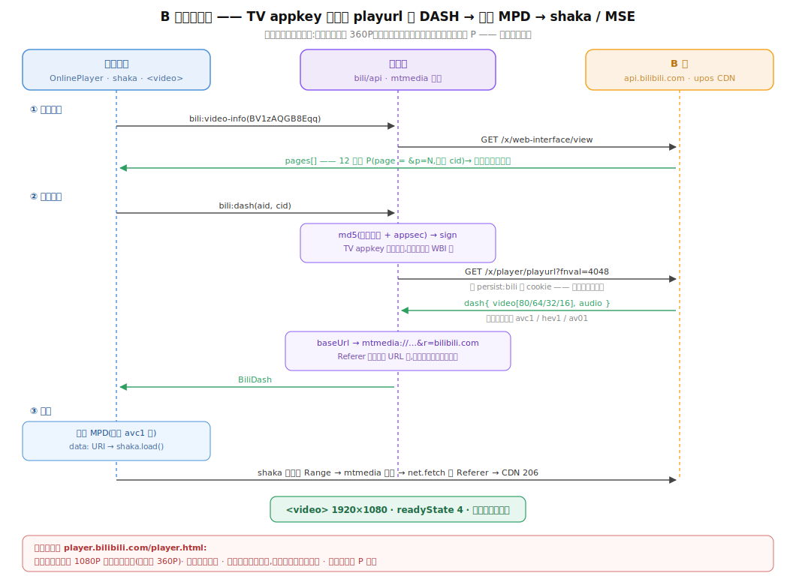

**关键决策（都是实测出来的，别推翻）**：

- **1080P 只存在于 DASH 里**。mp4 直链（`fnval=0/1`）的 `accept_quality` 只有 `[64, 16]`，容器本身封顶 720P。想要 1080P 就必须走音视频分轨 + MSE，没有第二条路。
- **画质由登录态决定**。匿名最高 480P，登录后 `dash.video` 里才出现 `id=80`。所以自研播放的 B 站源也要查登录态、也放登录入口，不是只有 webview 那条才需要。
- **MPD 里只放 avc1**。B 站每档画质同时给 avc1 / hev1 / av01 三种编码；三者编码不同不能塞进同一个 AdaptationSet，而 avc1 是唯一各平台都能硬解的。
- **画质档只列「真有」的**。`accept_quality`（账号能选的）与 `dash.video`（这个稿件实际存在的）求交后才上屏——外链播放器摆着点不动的 1080P 就是这么坑人的，别重蹈。
- **ABR 关掉**。用户点了 1080P 就该一直是 1080P，不能让自适应在背后偷偷降档。
- **不给 `mtmedia` 加 `corsEnabled`**（011 已经踩过一次）：shaka 的 fetch 和 hls.js 一样直通，加了反而要补 ACAO。
- **登录改 TV 端扫码**，不走 web 扫码：TV 端（`/x/passport-tv-login/qrcode/*`）用 appkey + appsec 的 md5 签名校验，不吃 web 那套风控；代价是登录成功后**不发 `Set-Cookie`**，cookie 在响应体里，要自己逐条写进 `persist:bili` 分区。

**关键代码**：

① 签名——固定 appsec，参数排序拼接后 md5，不需要运行时反推（登录 / playurl 共用）：

```ts
// bili/api.ts - signParams()
const query = Object.keys(all).sort().map((k) => `${k}=${encodeURIComponent(all[k])}`).join('&')
const sign = createHash('md5').update(query + TV_APPSEC).digest('hex')
```

② TV 端登录不发 `Set-Cookie`，凭证在响应体里，逐条写进分区：

```ts
// bili/api.ts - tvPoll()
for (const c of env.data.cookie_info?.cookies ?? []) {
  await ses.cookies.set({ url: 'https://bilibili.com/', domain: '.bilibili.com', name: c.name, value: c.value, /* … */ })
}
```

③ Referer 钉在代理 URL 上——B 站 CDN 不带 Referer 一律 403（实测 403 → 206），而 shaka 是在**渲染进程**里逐段发 Range 的，直取必死。所以主进程取到地址时就把 Referer 封进 `mtmedia://`，渲染层永远见不到裸签名链，也就不可能忘了带头：

```ts
// bili/api.ts - toTrack()
baseUrl: toMediaProxyUrl(t.baseUrl, BILI_REFERER),

// shared/media-proxy.ts - protocol.handle()
if (referer && /^https?:\/\//i.test(referer)) headers['Referer'] = referer
```

④ B 站只给 dash JSON 不给 MPD，但每路轨都是「单文件 fMP4 + SegmentBase 字节范围」，正好是 DASH 的 on-demand profile——一个 `<BaseURL>` 加一个 `<SegmentBase indexRange>` 就描述完了：

```ts
// utils/biliMpd.ts - representation()
`<BaseURL>${xmlEscape(t.baseUrl)}</BaseURL>`,
`<SegmentBase indexRange="${t.indexRange}"><Initialization range="${t.initRange}"/></SegmentBase>`,
```

顺带给 `netRequest` 补了 **POST body** 和 **session**（用某个分区的 cookie 罐发请求）两个能力。`session` 一传就自动开 `useSessionCookies`——net 默认**不带**该 session 的 cookie，两个开关分开只会制造「传了 session 却没带 cookie」的静默失败。

**这不算违反「不自动重试」红线**：扫码每 2s 问一次「扫了没」是 B 站定义的轮询协议，只在弹窗开着、二维码有效时问，关窗即停；请求真出错就停下来报错，交给用户点重试。

**已验**（CDP 驱动真实 app）：

- 播放：`BV1zAQGB8Eqq` 播起来 1920×1080、`readyState=4`、时间轴推进、零 error；集数网格 12 格；画质条 4 档；点 720P 后 `videoHeight` 真的变 720；切第 5 集正常续播且保留画质档；页面上不存在「进入哔哩哔哩」字样。`file://` 与 `http://127.0.0.1` 两种 origin 各跑一遍（011 早期栽在 origin 上）。脚本 `verify-bili-play.mjs` / `verify-bili-dev-origin.mjs`。
- 登录：`bili:qr-create` 返回合法 authCode + PNG data URL，首次 `bili:qr-poll` 返回 `pending`（不再是「API校验密匙错误」）；设置页「B 站账号」区块正常渲染并如实显示登录态。脚本 `verify-bili-qr.mjs`。

### 2026-07-10 fix: 播放页默认从「卡片上显示的那一集」开始播

**效果**：

1. 之前：追番卡片写着 `1 / 12`，点「播放」却从**第 2 集**开始（默认选的是「下一集」`episode + 1`）；现在：**所见即所播** —— 卡片写 1 就从第 1 集播，写 2 就从第 2 集播。
2. 边界收敛：`episode = 0`（还没看过）→ 第 1 集；`N` 超出该线路的集数（BD 线只有特典之类）→ 最后一集。想看别的集，集数网格里照样随便点。

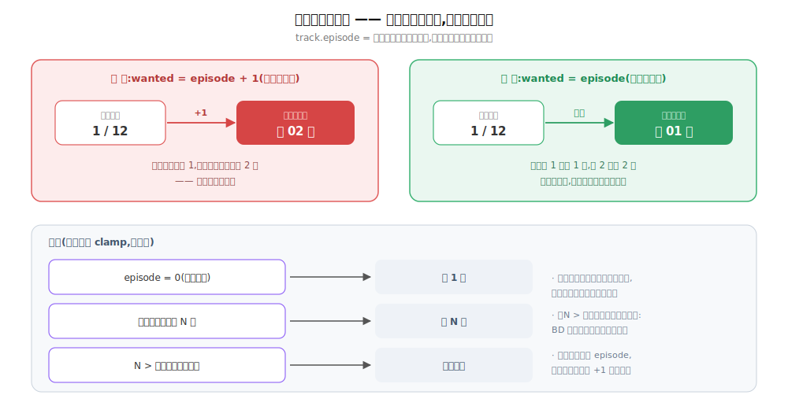

**关键代码**：

`track.episode` 的语义是「最后看到的那一集」，正是卡片上那个数字 —— 所以直接拿它当默认选集，不再 `+1`。选不中时 clamp，不报错：

```tsx
// pages/OnlinePlayer.tsx —— 集列表就绪后定默认选集
const wanted = track?.episode ?? 0
const last = eps[eps.length - 1]
const target =
  eps.find((e) => e.idx === wanted) ??      // 该线路有第 N 集 → 第 N 集
  (wanted > last.idx ? last : eps[0])       // 超出 → 最后一集;否则(含 0)→ 第一集
setEp(target.idx)
```

播放页只读 `track.episode`、**不回写**，观看进度仍由卡片上的 `+1` 手动推进（沿用原状，本次不动）。

### 2026-07-10 fix: Girigiri 换域名后搜索与在线播放全部失败

**效果**：

1. Girigiri 的搜索 / 下载 / 在线播放恢复可用 —— 站点主域从 `bgm.girigirilove.com` 换到了 `ani.girigirilove.com`（旧域名现在 301 过去）。
2. 顺带修掉一个潜伏的传输层 bug：`netRequest` 的 `redirect:'manual'` 从来没处理过 3xx，**任何**重定向都会以 `Redirect was cancelled` 失败。修完之后站点再换域名，只是多跟一跳而已。

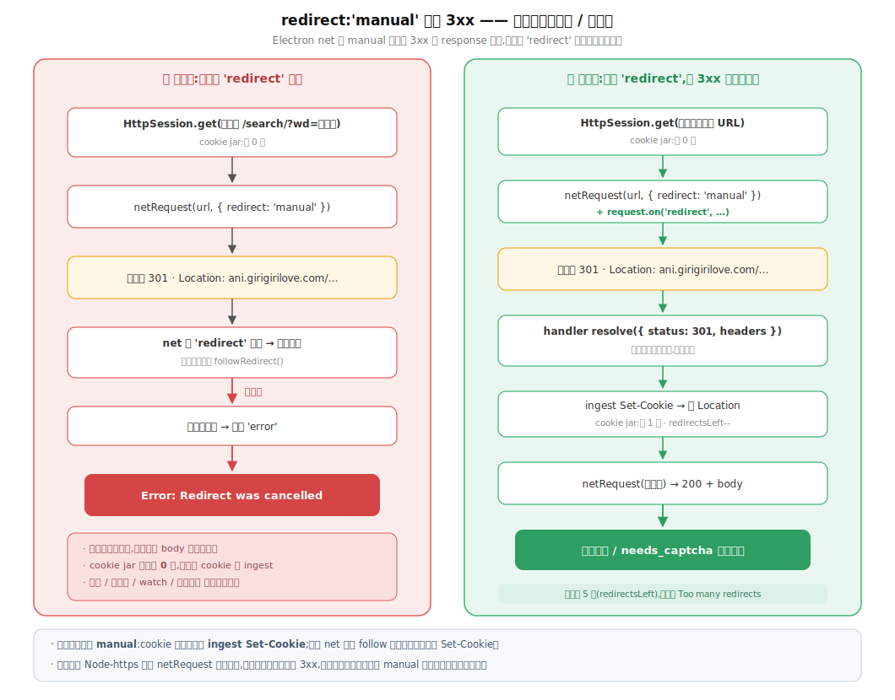

**关键代码**：

① 传输层——manual 模式必须接 `redirect` 事件，把 3xx 原样交回调用方：

```ts
// shared/net-request.ts - netRequest()
if (redirect === 'manual') {
  request.on('redirect', (statusCode, _method, _redirectUrl, responseHeaders) => {
    // 3xx 的 status/headers 原样 resolve 出去(body 空),让 HttpSession 自己读
    // Location、ingest Set-Cookie 再跟下一跳。不接这个事件,请求会被作废。
    finish(() => resolve({
      status: statusCode,
      headers: responseHeaders as Record<string, string | string[] | undefined>,
      body: Buffer.alloc(0),
    }))
    try { request.abort() } catch { /* 已结束 */ }
  })
}
```

② 主域收敛成单一事实源，`download.ts` 注 cookie 时也跟着它走（写死旧域名的话，站点换域后 cookie 落在错误的 domain 上，注进去等于没注）：

```ts
// girigiri/api.ts
export const BASE_DOMAIN = 'https://ani.girigirilove.com'

// girigiri/download.ts - captureM3u8()
ses.cookies.set({ url: BASE_DOMAIN, name, value })
```

### 2026-07-10 feat: 新增Girigiri在线播放

**效果**：
1. Girigiri 源可在线播放
2. 播放页默认选中的源改成「任一已绑定的内置源」

**数据流**：

播放地址直接从播放页 HTML 的 `player_aaaa` 解析（`encrypt=2` → base64 再 urldecode），一次 GET 就够，**不用起隐藏窗口截流**（截流降级为兜底，站点改版时才走）；拿到的可能是 m3u8 也可能是 mp4，按后缀分流。HLS 那条把播放列表 / 分片全部经 mtmedia 代理，主进程把列表里每条 URI 重写成 `mtmedia://` 再回给 hls.js。

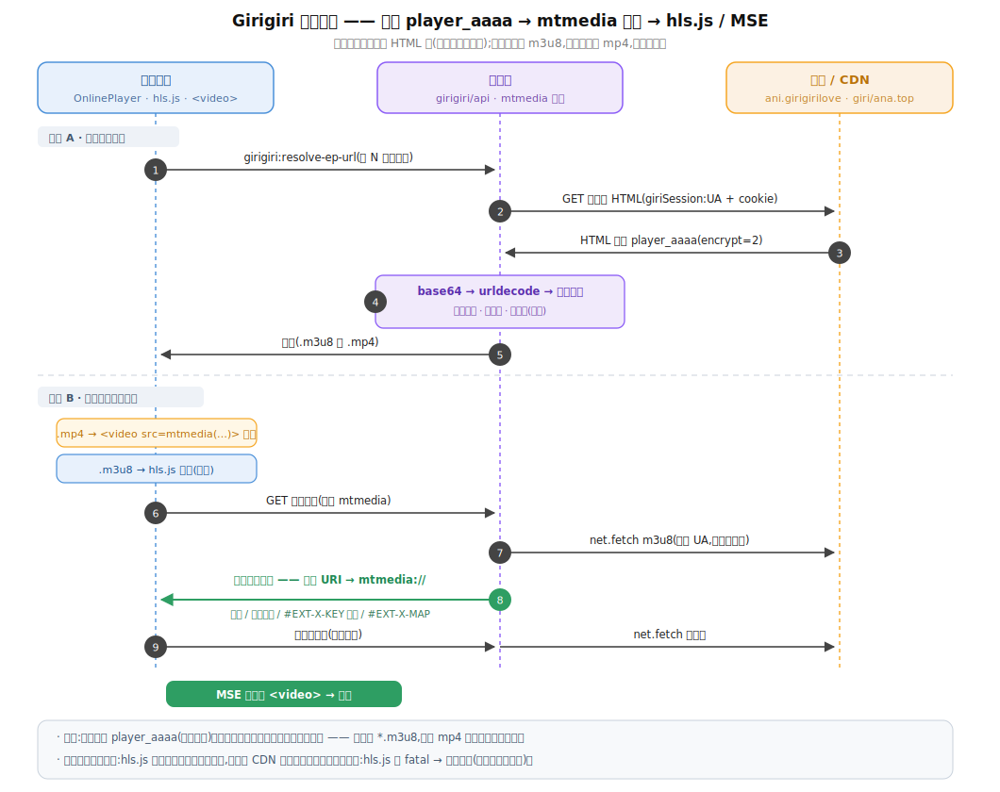

**关键代码**：

① 地址解析——`player_aaaa` 是 MacCMS 通用结构（与稀饭同源），`encrypt` 决定 url 的编码方式：

```ts
// girigiri/api.ts - extractPlayerUrl()
const decoded =
  data.encrypt === 2 ? decodeURIComponent(Buffer.from(raw, 'base64').toString('utf-8'))
  : data.encrypt === 1 ? decodeURIComponent(raw)
  : raw
return /^https?:\/\//i.test(decoded) ? decoded : ''
```

② 播放列表重写——hls.js 是在**渲染进程里**逐条取变体列表 / 分片 / `#EXT-X-KEY` 密钥的，拿原始 CDN 地址会被跨源策略拦（那些 CDN 不带 CORS 头）。所以主进程把列表里每条地址都换成同源的 `mtmedia://`；相对地址按**重定向后的最终列表地址**解析，否则 302 过的列表会解错：

```ts
// shared/media-proxy.ts - rewritePlaylist()
const abs = (u: string): string => toMediaProxyUrl(new URL(u, baseUrl).href)

// # 开头是标签行:只有 #EXT-X-KEY / #EXT-X-MAP / #EXT-X-MEDIA 把地址放在 URI="..." 里
if (line.startsWith('#')) return raw.replace(/URI="([^"]+)"/i, (_m, u) => `URI="${abs(u)}"`)
return abs(line) // 分片,或 master 列表里的变体列表
```

③ girigiri **不全是 HLS**——部分老番线路直接给 `.mp4` 直链，按后缀分流，mp4 走和稀饭一样的直喂路径：

```tsx
// pages/OnlinePlayer.tsx - resolveStreamUrl()
return { url, isHls: /\.m3u8(\?|$)/i.test(url) }
```

④ 失败接线——HLS 的 `fatal` 错误接到既有的线路兜底（换下一条线路的同一集）；非 fatal 交给 hls.js 自己重试。HLS 时 `<video>` 不设 `src`、不挂 `onError`，免得同一次失败触发两遍换线路：

```tsx
hls.on(Hls.Events.ERROR, (_e, data) => { if (data.fatal) onFatalRef.current() })
```

### 2026-07-09 refactor: 优化自动更换线路结构

**效果**：

1. 之前：换集 / 手动切线路 / 点重试都会清空「已试线路」记忆；现在：记忆在整部番的
   一次观看里持续累积，只在**换站 / 换番**时清零。


### 2026-07-09 feat: 011 在线观看 —— 应用内播放页 + 三源切换 + mtmedia 流代理 + 线路兜底

**效果**：
1. 追番卡片新增「在线观看」按钮，进应用内沉浸式播放页（/play）：稀饭 / Girigiri / 嗷呜三源常驻切换 + 该番自定义链接（B 站等）追加，换集 / 换源 / 全屏都在应用内；原「在线观看」行的源 chips 外跳浏览器行为保留。
2. 稀饭 / 嗷呜解析 mp4 直链用 `<video>` 播放；B 站用 `<webview partition="persist:bili">` 嵌官方外链播放器（登录后第一方 cookie 完整观看）；Girigiri（HLS）应用内播放暂占位（TODO，待 hls.js）。
3. 未播出条目不显示播放按钮（airDate 三态判定）。
4. 播放失败自动切下一条线路兜底，三条都失败才报错。

**底层关键决策 / 踩过的坑**：

**1. mtmedia 同源流代理（`src/main/shared/media-proxy.ts`）** —— 同一条稀饭主线直链，浏览器 / 打包版能播，dev 里 `<video>` 报 code 4，差在**页面 origin**：dev 的 `http://localhost` 下 Chromium 拒绝播放带 `content-disposition: attachment` 的跨源媒体，打包后 `file://` 不拦，所以**只在 dev 复现**

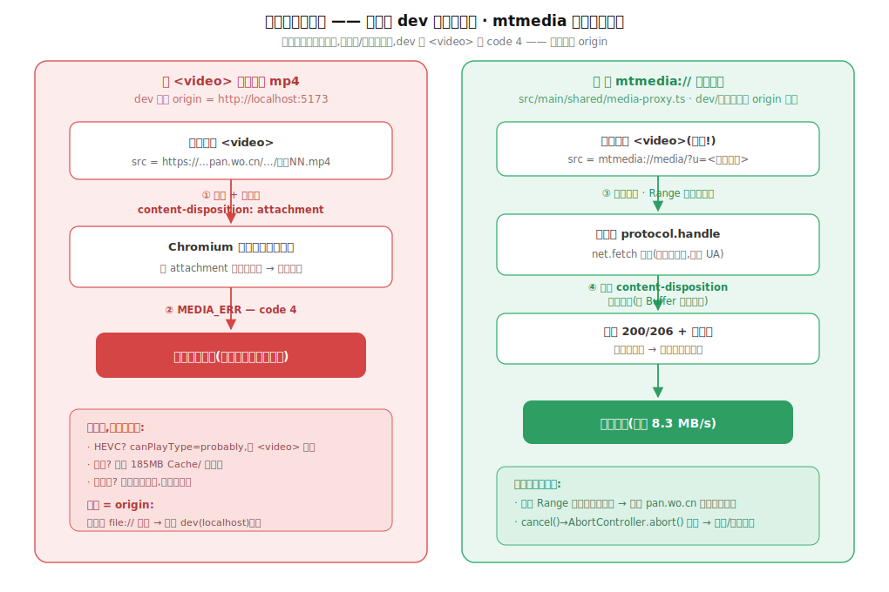

**2. 线路兜底** —— 播放失败切下一条线路的**同一集**（不是跳集），三条都试完才报错。

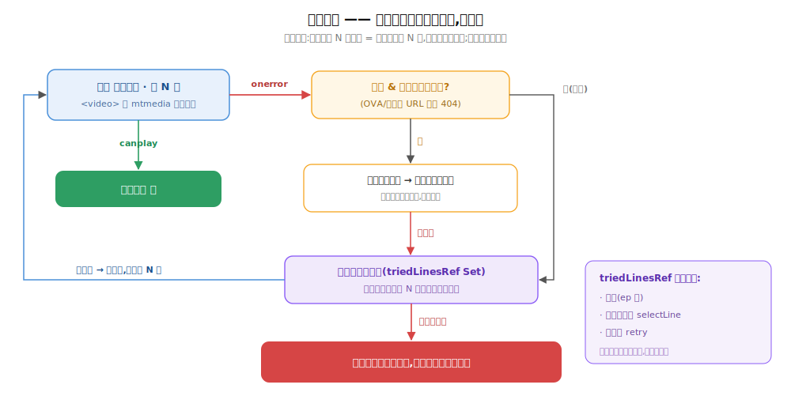

**3. airDate 三态（`src/renderer/src/utils/airDate.ts`）** —— 未播出条目不显示播放按钮，判定三态零迁移。

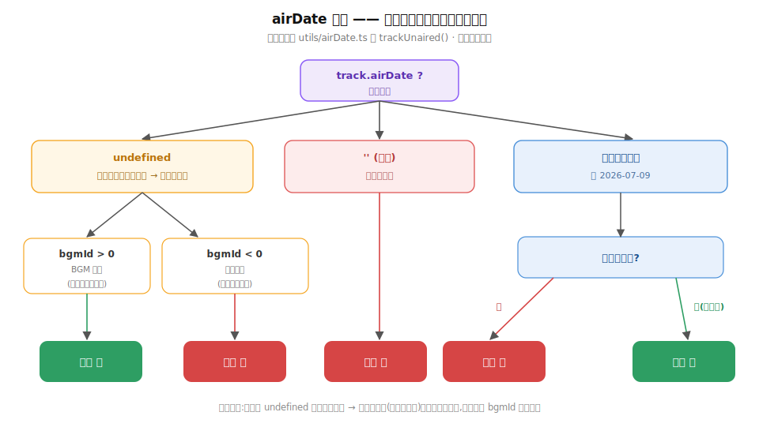

**4. B 站 webview** —— main 开 `webviewTag`；登录窗与播放 webview 共用 `persist:bili` 分区、同 UA，cookie 第一方；分区**惰性初始化**（`session.fromPartition` 必须等 app ready）。

调研 / 踩坑全纪要与 TODO 见 `docs/ideas/011-在线观看.md`。

## BGM登陆功能

### 2026-07-06 fix: BGM 登录状态不一致bug

**效果**：

1. 之前：每次启动 chip 从「已登录」跳「未登录」，点「登录」窗口秒关又显示已登录，实际搜索**一直**走匿名通道（提速从 06-29 上线起就没真正生效过）；现在：登录窗/verify/带登录 cookie 的搜索统一用同一个 UA，令牌真正可复用，关窗后立刻 verify 自证，UI 显示的登录态即真实登录态
2. 之前：BGM 偶发 502/限流时 `verifyBgmLogin` 会把还有效的 cookie 误判过期清掉；现在：只有 HTTP 200 的页面才有资格下「过期」结论，非 200 保持原状
3. 补齐观测盲区：登录捕获 / verify 结论 / 每页搜索的「耗时 + 服务端实际登录态」都落 main.log，不用再猜提速有没有生效

**底层逻辑**（登录时发生了什么、搜索为什么一直带错 UA——修复前后对比）：


**修法**（关键代码）：

① 总根因——登录窗分区固定 UA，token绑在和 verify / 搜索同一个 UA 上：

```ts
// bgm/credentials.ts - openBgmLogin()
const part = session.fromPartition('persist:bgm-login')
part.setUserAgent(DESKTOP_USER_AGENT)
```

② 搜索请求的 UA 分两种情况——**未登录：随机伪装 UA 照旧；已登录：固定 UA 顶掉伪装**。

随机伪装 UA 的来源（app 每次启动随机挑一个 Chrome 版本，整个会话期固定不变）：

```ts
// shared/browser-session.ts —— 反爬伪装层,和登录无关
function pickRandomVariant(): UAVariant {
  const pool = chromeVariants(process.platform) // Chrome 119~123 五个版本的 UA
  return pool[Math.floor(Math.random() * pool.length)]
}

export class BrowserSession {
  private readonly variant: UAVariant = pickRandomVariant() // 构造时随机挑定

  headers(extra: Record<string, string> = {}): Record<string, string> {
    const h: Record<string, string> = {
      // ...
      'sec-ch-ua': this.variant.secChUa, // 和 UA 版本号保持一致,防指纹自相矛盾
      'User-Agent': this.variant.ua,     // ← 随机伪装 UA 在这里进入每一个请求
      // ...
    }
    // ...
  }
}
```

搜索发请求时先拿到上面这套伪装头，然后**只在有登录 cookie 时**才改写 UA：

```ts
// bgm/search.ts - rawGet()
const headers = session.headers({ ... }) // 此刻 User-Agent = 随机伪装 UA

const loginCookie = getBgmCookie()
if (loginCookie) {
  // —— 已登录分支 ——
  headers['Cookie'] = mergeCookieHeader(headers['Cookie'], loginCookie)
  // BGM 把登录态绑定在登录时的 UA 上。带登录 cookie 时必须用登录窗同款固定
  // UA 顶掉 jar 的随机伪装 UA,否则登录 cookie 形同虚设。
  headers['User-Agent'] = DESKTOP_USER_AGENT
  // sec-ch-ua 一并对齐——只换 UA 不换客户端提示会造成 (UA, sec-ch-ua) 版本
  // 自相矛盾的指纹(jar 变体是随机 Chrome 119~123,UA 却固定 120),比不发更
  // 可疑;DESKTOP_USER_AGENT 又写死 Windows,在 macOS 上还会平台对不上。
  headers['sec-ch-ua'] = DESKTOP_SEC_CH_UA
  headers['sec-ch-ua-platform'] = DESKTOP_SEC_CH_UA_PLATFORM
}
// —— 未登录分支 ——
// 不进 if,headers 没有任何改动:User-Agent / sec-ch-ua 原样保留
// session.headers() 给的随机伪装变体,匿名请求的反爬伪装策略完全不变。

const res = await netRequest(url, { headers, timeoutMs: 25000 })
```

配套常量的定义——sec-ch-ua 的版本号**直接从 UA 串里解析**，单一事实源，升级 UA 只改一处、提示头自动跟随，杜绝「改了 UA 忘了改 sec-ch-ua」：

```ts
// shared/download-types.ts
export const DESKTOP_USER_AGENT =
  'Mozilla/5.0 (Windows NT 10.0; Win64; x64) AppleWebKit/537.36 (KHTML, like Gecko) Chrome/120.0.0.0 Safari/537.36'

// 与 DESKTOP_USER_AGENT 配套的客户端提示头 —— (UA, sec-ch-ua) 版本不一致的
// 指纹自相矛盾,反而可疑。版本号直接从上面的 UA 串里解析,单一事实源:
// 将来升级 UA 只改上面一处,这里自动跟随,不存在「改了 UA 忘了改提示头」。
// 平台写死 Windows:DESKTOP_USER_AGENT 本身就刻意全平台统一用 Windows UA。
const CHROME_MAJOR = /Chrome\/(\d+)/.exec(DESKTOP_USER_AGENT)?.[1] ?? '120'
export const DESKTOP_SEC_CH_UA = `"Not.A/Brand";v="8", "Chromium";v="${CHROME_MAJOR}", "Google Chrome";v="${CHROME_MAJOR}"`
export const DESKTOP_SEC_CH_UA_PLATFORM = '"Windows"'
```

③ 捕获不再「见到 `chii_auth` 秒关窗」——等落地页加载完再取最终 cookie，关窗后立刻自证：

```ts
// bgm/credentials.ts - openBgmLogin()
// 实测:「即见即存即关窗」会掐断登录后的落地页导航,存下半成品。等落地页
// did-finish-load 再缓 800ms(容纳尾部 Set-Cookie/二跳)取最终 cookie,10s 兜底防悬死。
const scheduleFinalize = (): void => {
  if (finalizeScheduled || settled || win.isDestroyed()) return
  finalizeScheduled = true
  if (win.webContents.isLoading()) {
    win.webContents.once('did-finish-load', () => {
      setTimeout(() => { void capture() }, 800)
    })
    setTimeout(() => { void capture() }, 10000)
  } else {
    setTimeout(() => { void capture() }, 800)
  }
}

win.on('closed', () => {
  // ...
  if (settled) {
    // 捕获成功后立刻实测令牌在窗口外能否复用 —— UI 拿到的是实测过的登录态,
    // 日志立辨真伪,不再出现「显示已登录、实际匿名」的假象
    void verifyBgmLogin().then(resolve)
  } else {
    resolve(getBgmAuthStatus())
  }
})
```

④ verify 加 200 门槛——BGM 偶发 502/限流的错误页同样没有 `/logout`，不能当「过期」证据：

```ts
// bgm/credentials.ts - verifyBgmLogin()
if (res.status !== 200) {
  // 非 200(限流/502/CF 拦截)不能下「过期」结论 —— 否则 BGM 偶发故障
  // 会把还有效的登录态误清掉。保持原状态,下次再查。
  logInfo('bgm-auth', `verify 探测无效(HTTP ${res.status}),保持原登录状态`)
  return getBgmAuthStatus()
}
const html = res.body.toString('utf-8')
if (!html.includes('/logout')) {
  // 200 且无「退出」入口 = 服务端确实不认这份 cookie。本地 + 登录窗分区一起清。
  clearBgmCookie()
}
```

⑤ 堵死旧死循环入口——本地未登录时，进登录页前清空分区残留（否则残留的 `chii_auth` 会让捕获逻辑秒判成功、把死 cookie 原样存回）；退出登录 / verify 判失效也同步清分区：

```ts
// bgm/credentials.ts
void win.loadURL(LOGIN_SPLASH).then(async () => {
  // 存储层认为未登录时,分区残留的 chii_auth 多半是已被服务端作废的旧凭证,
  // 不清掉的话 capture 一看到它就「秒登录成功」——假登录死循环的入口。
  if (!cookie) await clearLoginPartitionCookies()
  if (!win.isDestroyed()) void win.loadURL('https://bgm.tv/login')
})

export function clearBgmCookie(): void {
  setBgmCookie('')
  // 分区一起清:退出/失效后留着旧 chii_auth 只会制造「假登录成功」
  void clearLoginPartitionCookies()
}
```

### 2026-06-29 feat: BGM 登录状态UI(设置账号区 + 查询页登录提示)

**效果**：

1. 动漫查询页顶部新增登录状态：未登录/过期显示「点此登录提速」按钮，已登录显示「BGM 已登录」（可点重新校验）
2. 之前登录状态只能在设置页看，容易忘记去看；将自动检查改为进入动漫查询 tab 时自动检查一次

**状态流转**（`BgmLoginChip` 组件）：


节流判断是这个组件的核心——不是"每 24 小时查一次"，是按自然天的 8 点分界（早于 8 点算前一天）：

```ts
// utils/bgmAuth.ts
// 同一个"逻辑日"（8点到次日8点算一天）只自动查一次，避免每次切 tab 都打一次 BGM 的验证接口
function windowStart(ts: number): number {
  const d = new Date(ts)
  if (d.getHours() < 8) d.setDate(d.getDate() - 1) // 8点前算"昨天"的窗口
  d.setHours(8, 0, 0, 0)
  return d.getTime()
}
export function needsAutoVerify(): boolean {
  if (!cachedStatus) return true            // 从没查过，必须查一次
  return cachedAt < windowStart(Date.now())  // 上次查的时间早于本次窗口起点 → 已跨天，要重查
}
```

### 2026-06-29 feat: BGM 搜索带登录cookie提速 + 修正限流/CF报错分类

**效果**：
1. 之前：匿名搜索被 BGM 故意拖慢到 ~16s，10s 超时直接报错；现在：带登录 cookie 后 ~0.6s 秒回，未登录也放宽到 25s 等真实响应，不再误报「请求超时」
2. 之前：诊断信息里出现裸 `cloudflare` 字样就判定被拦截（BGM 诊断串本身恒带 `server=cloudflare`，会把正常 5xx 也误判成拦截）；现在：只认强特征

**数据流向**（一次搜索请求会怎么被分类）：


**"只认强特征"——失败时 UI「Show details」里真实会看到的内容**

场景 A：BGM 后端偶发 502，CF 只是照常转发，没拦任何东西：

```bash
[bgm-search-diag] HTTP 502 on https://bgm.tv/subject_search/xxx
  status=502 server=cloudflare cf-ray=8a1e2f9d3b1c-SJC cf-mitigated=- cf-cache-status=- via=- content-type=text/html retry-after=- | body[0:300]=<html><title>502 Bad Gateway</title><body>upstream connect error or disconnect/reset before headers...
```

场景 B：CF 真的弹出人机验证拦了这次请求：

```bash
[bgm-search-diag] HTTP 403 on https://bgm.tv/subject_search/xxx
  status=403 server=cloudflare cf-ray=9c2f3a8e4d5b-SJC cf-mitigated=challenge cf-cache-status=- via=- content-type=text/html retry-after=- | body[0:300]=<html><title>Just a moment...</title><body class="no-js">...
```

两条都有 `server=cloudflare 。区别在 `cf-mitigated`：场景 A 是 `-`（没值 = 没动作），场景 B 是 `challenge`（有值 = CF 真的拦了）；场景 B 的 body 里还有 "Just a moment" 原文，场景 A 没有。

判断代码只认这两个信号：

```ts
// utils/errorMessage.ts
const cfBlocked =
  /cf-mitigated=\s*(challenge|block|managed)/i.test(msg) || // 场景B命中，场景A不命中(值是"-")
  lower.includes('just a moment') ||                        // 场景B的body命中，场景A不命中
  lower.includes('cf-chl') ||
  lower.includes('attention required')
```

**两个 cookie 到底怎么用——流程**


- 匿名 cookie jar（`BrowserSession`）是反爬虫伪装的一部分，跟登录无关
- 固定 UA/请求头 + 把服务器发的 `Set-Cookie` 存下来下次带上，
- 让请求看起来像"同一个人在持续访问"，而不是每次都是零 cookie 的全新访客。
- 登录后两个 cookie 一起带——这就是真实浏览器本来的行为。
- 浏览器的 Cookie 机制不区分"登录 cookie"和"其他 cookie"，
- 同一域名下所有没过期的 cookie 都在同一个罐子里，每次请求原样一起发出去；
- 登录不会清掉你登录前就有的 cookie，只是往罐子里加新的。
- 反过来登录后特意把匿名 cookie 摘掉、只发登录 cookie，才是不像真实浏览器的可疑做法。

### 2026-06-29 feat: BGM 令牌 + 内嵌登录窗自动填充鉴权

**效果**：
1. 设置页填「BGM 访问令牌」后，`api.bgm.tv` 请求（详情/别名搜索）带登录态，限额更宽松
2. 新增「登录 BGM」按钮：弹内嵌真实登录页，登录成功自动关窗，不用手动复制 cookie

**登录流程**（点击"登录 BGM"之后，数据怎么流动）：


「怎么判断登录成功了」——监听 cookie 变化，只认 `chii_auth` 这个 BGM 的关键登录态 cookie：

```ts
// bgm/credentials.ts
const captureIfLoggedIn = async () => {
  const cookies = await part.cookies.get({ domain: 'bgm.tv' })
  const hasAuth = cookies.some((c) => c.name === 'chii_auth' && c.value) // 这个cookie出现=登录成功
  if (!hasAuth) return
  setBgmCookie(cookies.map((c) => `${c.name}=${c.value}`).join('; ')) // 存下全部cookie，供后续搜索请求用
  win.close() // 自动关掉登录窗，用户不用手动关
}
part.cookies.on('changed', (_e, c, _cause, removed) => {
  if (!removed && c.domain?.includes('bgm.tv') && c.name === 'chii_auth') captureIfLoggedIn()
})
```

「怎么判断登录过期了」——不是猜 cookie 有效期，是主动拉一次首页看有没有退出链接：

```ts
// bgm/credentials.ts
const html = res.body.toString('utf-8')
if (!html.includes('/logout')) setBgmCookie('') // 页面上没有"退出"入口 = 其实没登录了，清掉本地cookie
// 这行在try块里，请求本身失败（网络问题）会走catch、不清cookie —— 避免把"网络抖了一下"误判成"登录过期"
```

有 token 时给 API 请求加认证头，跟上面的 cookie 是两套独立的凭证（token 管 API，cookie 管网页搜索）：

```ts
// bgm/api-client.ts
const token = getBgmToken()
if (token) headers['Authorization'] = `Bearer ${token}`
```

