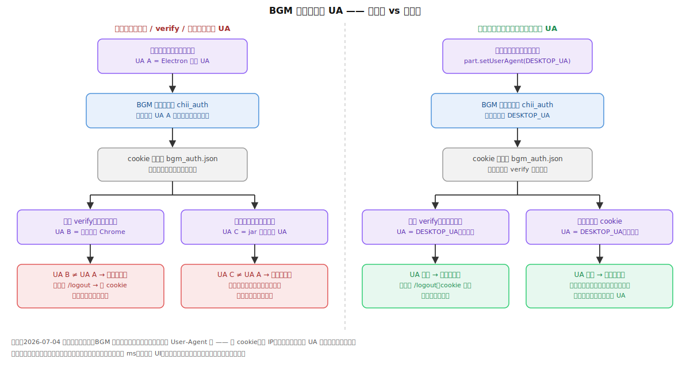
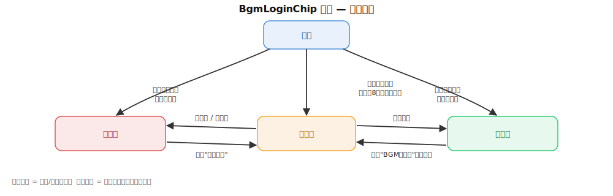
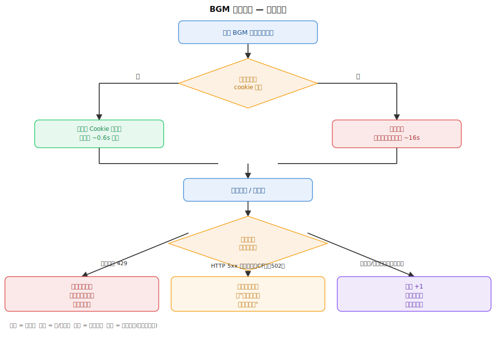
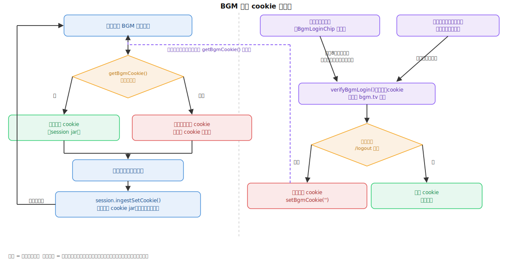
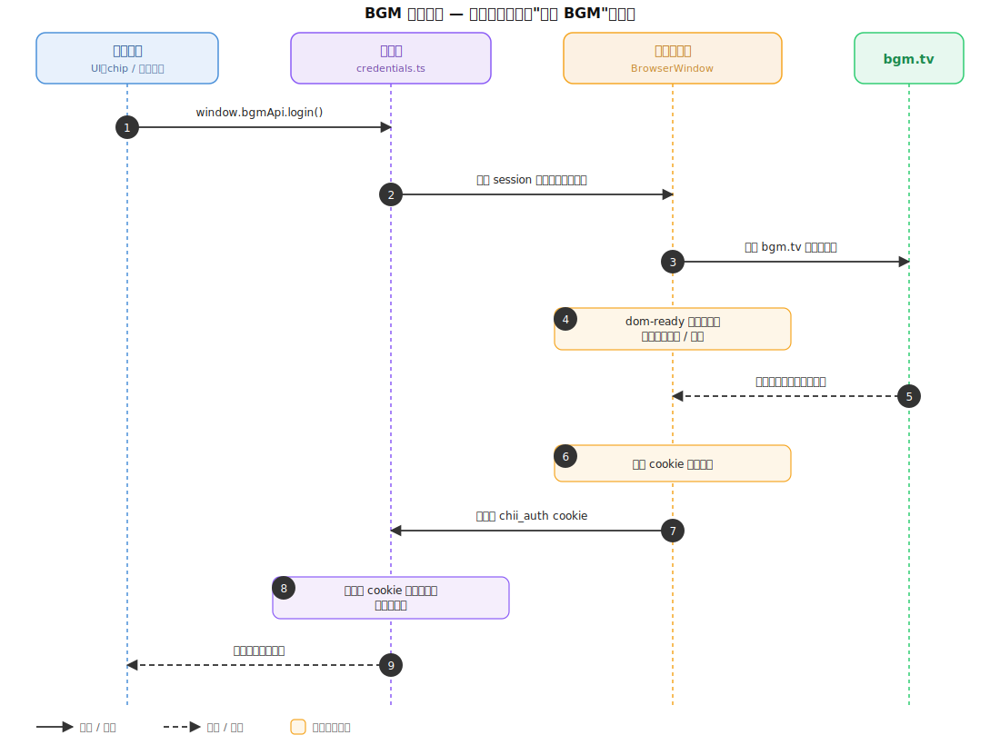

# 开发日志（DEVLOG）

## 2026-07-01 docs: 新增 AI_GUIDELINES.md + DEVLOG.md

**效果**：
1. 项目根目录新增两份持续维护的文档——`AI_GUIDELINES.md`（AI 生成规范）和本文件 `DEVLOG.md`（开发日志）
2. 之后 AI 生成代码有规范要求与避坑指南，并且每次提交前都需要在 DEVELOG.md 对改动进行白盒记录,提交从下往上是最新的提交,并且要对同一个功能进行分类,无需分类的提交单独作为二级标题

**流程**：
- Git 提交规范对齐仓库里实际的提交历史（`type(scope): 中文描述`，无 AI 署名——用 `git log` 核对过近期提交）

## BGM登陆功能

### 2026-07-06 fix: BGM 登录状态不一致bug

**效果**：

1. 之前：每次启动 chip 从「已登录」跳「未登录」，点「登录」窗口秒关又显示已登录，实际搜索**一直**走匿名通道（提速从 06-29 上线起就没真正生效过）；现在：登录窗/verify/带登录 cookie 的搜索统一用同一个 UA，令牌真正可复用，关窗后立刻 verify 自证，UI 显示的登录态即真实登录态
2. 之前：BGM 偶发 502/限流时 `verifyBgmLogin` 会把还有效的 cookie 误判过期清掉；现在：只有 HTTP 200 的页面才有资格下「过期」结论，非 200 保持原状
3. 补齐观测盲区：登录捕获 / verify 结论 / 每页搜索的「耗时 + 服务端实际登录态」都落 main.log，不用再猜提速有没有生效

**底层逻辑**（登录时发生了什么、搜索为什么一直带错 UA——修复前后对比）：



**修法**（关键代码）：

① 总根因——登录窗分区固定 UA，token绑在和 verify / 搜索同一个 UA 上：

```ts
// bgm/credentials.ts - openBgmLogin()
const part = session.fromPartition('persist:bgm-login')
part.setUserAgent(DESKTOP_USER_AGENT)
```

② 搜索请求的 UA 分两种情况——**未登录：随机伪装 UA 照旧；已登录：固定 UA 顶掉伪装**。

随机伪装 UA 的来源（app 每次启动随机挑一个 Chrome 版本，整个会话期固定不变）：

```ts
// shared/browser-session.ts —— 反爬伪装层,和登录无关
function pickRandomVariant(): UAVariant {
  const pool = chromeVariants(process.platform) // Chrome 119~123 五个版本的 UA
  return pool[Math.floor(Math.random() * pool.length)]
}

export class BrowserSession {
  private readonly variant: UAVariant = pickRandomVariant() // 构造时随机挑定

  headers(extra: Record<string, string> = {}): Record<string, string> {
    const h: Record<string, string> = {
      // ...
      'sec-ch-ua': this.variant.secChUa, // 和 UA 版本号保持一致,防指纹自相矛盾
      'User-Agent': this.variant.ua,     // ← 随机伪装 UA 在这里进入每一个请求
      // ...
    }
    // ...
  }
}
```

搜索发请求时先拿到上面这套伪装头，然后**只在有登录 cookie 时**才改写 UA：

```ts
// bgm/search.ts - rawGet()
const headers = session.headers({ ... }) // 此刻 User-Agent = 随机伪装 UA

const loginCookie = getBgmCookie()
if (loginCookie) {
  // —— 已登录分支 ——
  headers['Cookie'] = mergeCookieHeader(headers['Cookie'], loginCookie)
  // BGM 把登录态绑定在登录时的 UA 上。带登录 cookie 时必须用登录窗同款固定
  // UA 顶掉 jar 的随机伪装 UA,否则登录 cookie 形同虚设。
  headers['User-Agent'] = DESKTOP_USER_AGENT
  // sec-ch-ua 一并对齐——只换 UA 不换客户端提示会造成 (UA, sec-ch-ua) 版本
  // 自相矛盾的指纹(jar 变体是随机 Chrome 119~123,UA 却固定 120),比不发更
  // 可疑;DESKTOP_USER_AGENT 又写死 Windows,在 macOS 上还会平台对不上。
  headers['sec-ch-ua'] = DESKTOP_SEC_CH_UA
  headers['sec-ch-ua-platform'] = DESKTOP_SEC_CH_UA_PLATFORM
}
// —— 未登录分支 ——
// 不进 if,headers 没有任何改动:User-Agent / sec-ch-ua 原样保留
// session.headers() 给的随机伪装变体,匿名请求的反爬伪装策略完全不变。

const res = await netRequest(url, { headers, timeoutMs: 25000 })
```

配套常量的定义——sec-ch-ua 的版本号**直接从 UA 串里解析**，单一事实源，升级 UA 只改一处、提示头自动跟随，杜绝「改了 UA 忘了改 sec-ch-ua」：

```ts
// shared/download-types.ts
export const DESKTOP_USER_AGENT =
  'Mozilla/5.0 (Windows NT 10.0; Win64; x64) AppleWebKit/537.36 (KHTML, like Gecko) Chrome/120.0.0.0 Safari/537.36'

// 与 DESKTOP_USER_AGENT 配套的客户端提示头 —— (UA, sec-ch-ua) 版本不一致的
// 指纹自相矛盾,反而可疑。版本号直接从上面的 UA 串里解析,单一事实源:
// 将来升级 UA 只改上面一处,这里自动跟随,不存在「改了 UA 忘了改提示头」。
// 平台写死 Windows:DESKTOP_USER_AGENT 本身就刻意全平台统一用 Windows UA。
const CHROME_MAJOR = /Chrome\/(\d+)/.exec(DESKTOP_USER_AGENT)?.[1] ?? '120'
export const DESKTOP_SEC_CH_UA = `"Not.A/Brand";v="8", "Chromium";v="${CHROME_MAJOR}", "Google Chrome";v="${CHROME_MAJOR}"`
export const DESKTOP_SEC_CH_UA_PLATFORM = '"Windows"'
```

③ 捕获不再「见到 `chii_auth` 秒关窗」——等落地页加载完再取最终 cookie，关窗后立刻自证：

```ts
// bgm/credentials.ts - openBgmLogin()
// 实测:「即见即存即关窗」会掐断登录后的落地页导航,存下半成品。等落地页
// did-finish-load 再缓 800ms(容纳尾部 Set-Cookie/二跳)取最终 cookie,10s 兜底防悬死。
const scheduleFinalize = (): void => {
  if (finalizeScheduled || settled || win.isDestroyed()) return
  finalizeScheduled = true
  if (win.webContents.isLoading()) {
    win.webContents.once('did-finish-load', () => {
      setTimeout(() => { void capture() }, 800)
    })
    setTimeout(() => { void capture() }, 10000)
  } else {
    setTimeout(() => { void capture() }, 800)
  }
}

win.on('closed', () => {
  // ...
  if (settled) {
    // 捕获成功后立刻实测令牌在窗口外能否复用 —— UI 拿到的是实测过的登录态,
    // 日志立辨真伪,不再出现「显示已登录、实际匿名」的假象
    void verifyBgmLogin().then(resolve)
  } else {
    resolve(getBgmAuthStatus())
  }
})
```

④ verify 加 200 门槛——BGM 偶发 502/限流的错误页同样没有 `/logout`，不能当「过期」证据：

```ts
// bgm/credentials.ts - verifyBgmLogin()
if (res.status !== 200) {
  // 非 200(限流/502/CF 拦截)不能下「过期」结论 —— 否则 BGM 偶发故障
  // 会把还有效的登录态误清掉。保持原状态,下次再查。
  logInfo('bgm-auth', `verify 探测无效(HTTP ${res.status}),保持原登录状态`)
  return getBgmAuthStatus()
}
const html = res.body.toString('utf-8')
if (!html.includes('/logout')) {
  // 200 且无「退出」入口 = 服务端确实不认这份 cookie。本地 + 登录窗分区一起清。
  clearBgmCookie()
}
```

⑤ 堵死旧死循环入口——本地未登录时，进登录页前清空分区残留（否则残留的 `chii_auth` 会让捕获逻辑秒判成功、把死 cookie 原样存回）；退出登录 / verify 判失效也同步清分区：

```ts
// bgm/credentials.ts
void win.loadURL(LOGIN_SPLASH).then(async () => {
  // 存储层认为未登录时,分区残留的 chii_auth 多半是已被服务端作废的旧凭证,
  // 不清掉的话 capture 一看到它就「秒登录成功」——假登录死循环的入口。
  if (!cookie) await clearLoginPartitionCookies()
  if (!win.isDestroyed()) void win.loadURL('https://bgm.tv/login')
})

export function clearBgmCookie(): void {
  setBgmCookie('')
  // 分区一起清:退出/失效后留着旧 chii_auth 只会制造「假登录成功」
  void clearLoginPartitionCookies()
}
```

### 2026-06-29 feat: BGM 登录状态UI(设置账号区 + 查询页登录提示)

**效果**：

1. 动漫查询页顶部新增登录状态：未登录/过期显示「点此登录提速」按钮，已登录显示「BGM 已登录」（可点重新校验）
2. 之前登录状态只能在设置页看，容易忘记去看；将自动检查改为进入动漫查询 tab 时自动检查一次

**状态流转**（`BgmLoginChip` 组件）：



节流判断是这个组件的核心——不是"每 24 小时查一次"，是按自然天的 8 点分界（早于 8 点算前一天）：

```ts
// utils/bgmAuth.ts
// 同一个"逻辑日"（8点到次日8点算一天）只自动查一次，避免每次切 tab 都打一次 BGM 的验证接口
function windowStart(ts: number): number {
  const d = new Date(ts)
  if (d.getHours() < 8) d.setDate(d.getDate() - 1) // 8点前算"昨天"的窗口
  d.setHours(8, 0, 0, 0)
  return d.getTime()
}
export function needsAutoVerify(): boolean {
  if (!cachedStatus) return true            // 从没查过，必须查一次
  return cachedAt < windowStart(Date.now())  // 上次查的时间早于本次窗口起点 → 已跨天，要重查
}
```

### 2026-06-29 feat: BGM 搜索带登录cookie提速 + 修正限流/CF报错分类

**效果**：
1. 之前：匿名搜索被 BGM 故意拖慢到 ~16s，10s 超时直接报错；现在：带登录 cookie 后 ~0.6s 秒回，未登录也放宽到 25s 等真实响应，不再误报「请求超时」
2. 之前：诊断信息里出现裸 `cloudflare` 字样就判定被拦截（BGM 诊断串本身恒带 `server=cloudflare`，会把正常 5xx 也误判成拦截）；现在：只认强特征

**数据流向**（一次搜索请求会怎么被分类）：




**"只认强特征"——失败时 UI「Show details」里真实会看到的内容**

场景 A：BGM 后端偶发 502，CF 只是照常转发，没拦任何东西：

```bash
[bgm-search-diag] HTTP 502 on https://bgm.tv/subject_search/xxx
  status=502 server=cloudflare cf-ray=8a1e2f9d3b1c-SJC cf-mitigated=- cf-cache-status=- via=- content-type=text/html retry-after=- | body[0:300]=<html><title>502 Bad Gateway</title><body>upstream connect error or disconnect/reset before headers...
```

场景 B：CF 真的弹出人机验证拦了这次请求：

```bash
[bgm-search-diag] HTTP 403 on https://bgm.tv/subject_search/xxx
  status=403 server=cloudflare cf-ray=9c2f3a8e4d5b-SJC cf-mitigated=challenge cf-cache-status=- via=- content-type=text/html retry-after=- | body[0:300]=<html><title>Just a moment...</title><body class="no-js">...
```

两条都有 `server=cloudflare 。区别在 `cf-mitigated`：场景 A 是 `-`（没值 = 没动作），场景 B 是 `challenge`（有值 = CF 真的拦了）；场景 B 的 body 里还有 "Just a moment" 原文，场景 A 没有。

判断代码只认这两个信号：

```ts
// utils/errorMessage.ts
const cfBlocked =
  /cf-mitigated=\s*(challenge|block|managed)/i.test(msg) || // 场景B命中，场景A不命中(值是"-")
  lower.includes('just a moment') ||                        // 场景B的body命中，场景A不命中
  lower.includes('cf-chl') ||
  lower.includes('attention required')
```

**两个 cookie 到底怎么用——流程**



- 匿名 cookie jar（`BrowserSession`）是反爬虫伪装的一部分，跟登录无关
- 固定 UA/请求头 + 把服务器发的 `Set-Cookie` 存下来下次带上，
- 让请求看起来像"同一个人在持续访问"，而不是每次都是零 cookie 的全新访客。
- 登录后两个 cookie 一起带——这就是真实浏览器本来的行为。
- 浏览器的 Cookie 机制不区分"登录 cookie"和"其他 cookie"，
- 同一域名下所有没过期的 cookie 都在同一个罐子里，每次请求原样一起发出去；
- 登录不会清掉你登录前就有的 cookie，只是往罐子里加新的。
- 反过来登录后特意把匿名 cookie 摘掉、只发登录 cookie，才是不像真实浏览器的可疑做法。

### 2026-06-29 feat: BGM 令牌 + 内嵌登录窗自动填充鉴权

**效果**：
1. 设置页填「BGM 访问令牌」后，`api.bgm.tv` 请求（详情/别名搜索）带登录态，限额更宽松
2. 新增「登录 BGM」按钮：弹内嵌真实登录页，登录成功自动关窗，不用手动复制 cookie

**登录流程**（点击"登录 BGM"之后，数据怎么流动）：



「怎么判断登录成功了」——监听 cookie 变化，只认 `chii_auth` 这个 BGM 的关键登录态 cookie：

```ts
// bgm/credentials.ts
const captureIfLoggedIn = async () => {
  const cookies = await part.cookies.get({ domain: 'bgm.tv' })
  const hasAuth = cookies.some((c) => c.name === 'chii_auth' && c.value) // 这个cookie出现=登录成功
  if (!hasAuth) return
  setBgmCookie(cookies.map((c) => `${c.name}=${c.value}`).join('; ')) // 存下全部cookie，供后续搜索请求用
  win.close() // 自动关掉登录窗，用户不用手动关
}
part.cookies.on('changed', (_e, c, _cause, removed) => {
  if (!removed && c.domain?.includes('bgm.tv') && c.name === 'chii_auth') captureIfLoggedIn()
})
```

「怎么判断登录过期了」——不是猜 cookie 有效期，是主动拉一次首页看有没有退出链接：

```ts
// bgm/credentials.ts
const html = res.body.toString('utf-8')
if (!html.includes('/logout')) setBgmCookie('') // 页面上没有"退出"入口 = 其实没登录了，清掉本地cookie
// 这行在try块里，请求本身失败（网络问题）会走catch、不清cookie —— 避免把"网络抖了一下"误判成"登录过期"
```

有 token 时给 API 请求加认证头，跟上面的 cookie 是两套独立的凭证（token 管 API，cookie 管网页搜索）：

```ts
// bgm/api-client.ts
const token = getBgmToken()
if (token) headers['Authorization'] = `Bearer ${token}`
```
