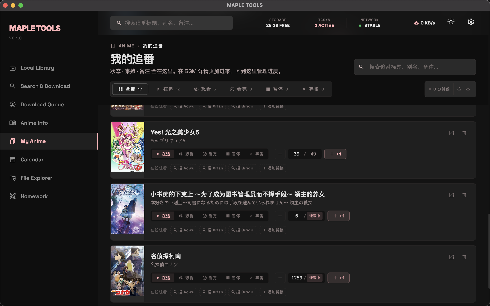
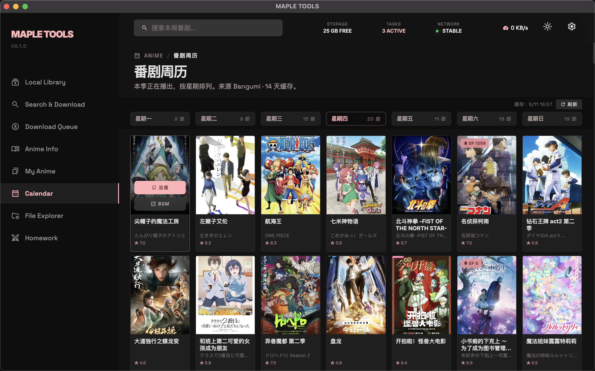
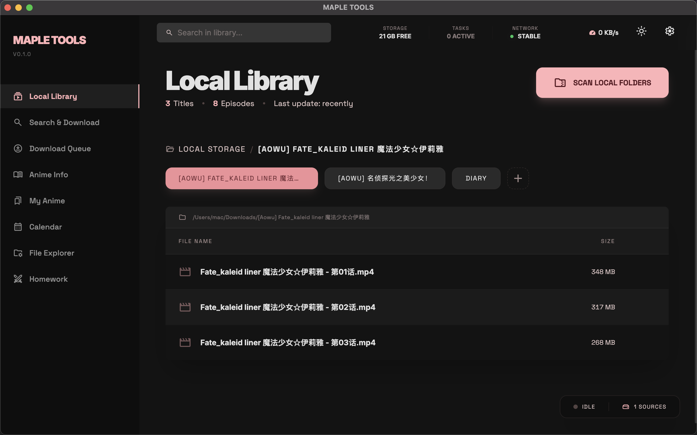

# MapleTools

基于 Electron + React + Tailwind 构建的桌面端动漫管理应用。整合多源搜索与下载、Bangumi 元数据浏览、追番进度追踪、本季番剧周历、本地媒体库扫描，配合坚果云同步在多设备间保持进度一致。整体采用 Material 3 风格的深色界面。

<p align="center">
  
</p>

## 功能一览

- **多源搜索与下载** — 同时检索 Aowu、Xifan、Girigiri 三个流媒体站点的资源，串行队列下载，支持暂停 / 续传 / 单集重试 / 切换备源。
- **追番管理** — 在 BGM 详情页或搜索卡片一键追番；「我的追番」汇总页统一管理观看状态、当前集数与绑定的观看链接；总集数缺失（长寿番 / 季番初期）也能手动填写。
- **多源绑定与跳转观看** — 一部番可同时绑定 Aowu / Xifan / Girigiri / 自定义 URL（如 B 站）多个来源，行尾一键在外部浏览器打开对应播放页继续观看。
- **本季番剧周历** — 按周一-周日展示本季更新计划，当日列自动高亮。
- **Bangumi 元数据整合** — 自动拉取 BGM 元数据、Staff、剧情简介，剧场版额外展示片长；简介为日语原文时回退到萌娘百科中文版。
- **云同步（坚果云 WebDAV）** — 追番列表跨设备同步，附带冲突检测与确认弹窗，明确显示本地 / 远端差异避免误覆盖。
- **本地媒体库** — 扫描配置好的目录树，自动提取 ffmpeg 缩略图，按番剧组织展示。
- **文件浏览器** — 内置跨平台文件管理，支持视频 / 图片 / 文档预览，删除支持移到回收站 / 永久删除。

## 截图

| 番剧周历 | 搜索与下载 |
|---|---|
|  |  |

| 番剧详情 | 本地媒体库 |
|---|---|
|  |  |

## 平台支持

| 平台 | 架构 | 状态 |
|---|---|---|
| Windows 10/11 | x64 | ✅ 主测平台 |
| macOS 11+ | arm64（Apple Silicon） | ✅ 主测平台 |
| macOS Intel | x86_64 | ❌ 暂不发布 |
| Linux | — | ❌ 暂不发布 |

## 前置依赖

> [!Note]
> **必须在系统 PATH 中安装 ffmpeg**。本应用不内置 ffmpeg，下载视频与提取本地缩略图均依赖系统 ffmpeg。
>
> - Windows：从 [ffmpeg.org](https://ffmpeg.org/download.html) 下载，将 `bin` 目录加入 PATH
> - macOS：`brew install ffmpeg`

> [!Tip]
> macOS 首次打开提示"无法验证开发者"时，请右键 App → 选择"打开"，
> 或执行 `xattr -d com.apple.quarantine /Applications/MapleTools.app`。

## 目录结构

```
.
├── src/              Electron 源码（main / preload / renderer）
├── scripts/          构建脚本（Windows 打包、主题生成等）
├── resources/        应用图标等静态资源
├── docs/             设计稿、方案、排错记录
├── package.json
├── electron.vite.config.ts
└── ...
```

## 依赖与运行指南

### 1. 安装依赖

```bash
npm install
```

### 2. 本地开发运行

启动开发环境，支持热更新（推荐）：

```bash
npm run dev
```

### 3. 项目打包分发

生成适用于当前操作系统的安装包及可执行文件。

```bash
npm run dist
```

打包产物输出在 `dist/` 目录下（如 `.exe`, `.dmg` 等）。
