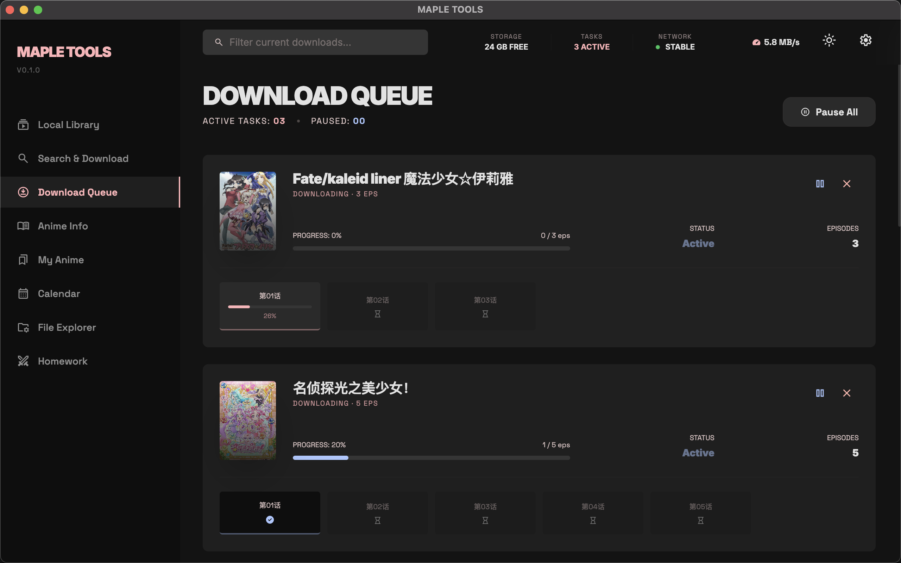

# MapleTools

基于 Electron + React + Tailwind 构建的桌面端动漫管理应用，整合多个流媒体源的搜索与下载、Bangumi 元数据浏览、本地媒体库扫描等能力。整体采用 Material 3 风格的深色界面。

<p align="center">
  
</p>

## 功能一览

- **多源搜索与下载** — 同时检索 Xifan、Girigiri 两个流媒体站点的资源，串行队列下载，支持暂停 / 续传 / 个别集优先。
- **Bangumi 详情整合** — 自动拉取 BGM 元数据、Staff、剧情简介，剧场版额外展示片长。简介为日语原文时回退到萌娘百科中文版。
- **本地媒体库** — 扫描配置好的目录树，自动提取 ffmpeg 缩略图，按番剧组织展示。
- **文件浏览器** — 内置跨平台文件管理，支持视频 / 图片 / 文档预览。
- **BiuSync** — 与远端配置同步，启动时探测远端 rev，dirty 状态准确化。
- **阵容知识库** — 角色阵容查询（独立工具页）。

## 截图

| 搜索与下载 | 下载队列 |
|---|---|
|  |  |

| 番剧详情 | 本地媒体库 |
|---|---|
|  |  |

## 平台支持

| 平台 | 架构 | 状态 |
|---|---|---|
| Windows 10/11 | x64 | ✅ 主测平台 |
| macOS 11+ | arm64（Apple Silicon） | ✅ 主测平台 |
| macOS Intel | x86_64 | ❌ 暂不发布 |
| Linux | — | ❌ 暂不发布 |

## 前置依赖

> [!Note]
> **必须在系统 PATH 中安装 ffmpeg**。本应用不内置 ffmpeg，下载视频与提取本地缩略图均依赖系统 ffmpeg。
>
> - Windows：从 [ffmpeg.org](https://ffmpeg.org/download.html) 下载，将 `bin` 目录加入 PATH
> - macOS：`brew install ffmpeg`

> [!Tip]
> macOS 首次打开提示"无法验证开发者"时，请右键 App → 选择"打开"，
> 或执行 `xattr -d com.apple.quarantine /Applications/MapleTools.app`。

## 目录结构

```
.
├── src/              Electron 源码（main / preload / renderer）
├── scripts/          构建脚本（Windows 打包、主题生成等）
├── resources/        应用图标等静态资源
├── python/           独立的 Python / Node 原型脚本（非 Electron 应用的一部分）
├── docs/             设计稿、方案、排错记录
├── package.json
├── electron.vite.config.ts
└── ...
```

## 依赖与运行指南

### 1. 安装依赖

```bash
npm install
```

### 2. 本地开发运行

启动开发环境，支持热更新（推荐）：

```bash
npm run dev
```

### 3. 项目打包分发

生成适用于当前操作系统的安装包及可执行文件。

```bash
npm run dist
```

打包产物输出在 `dist/` 目录下（如 `.exe`, `.dmg` 等）。
