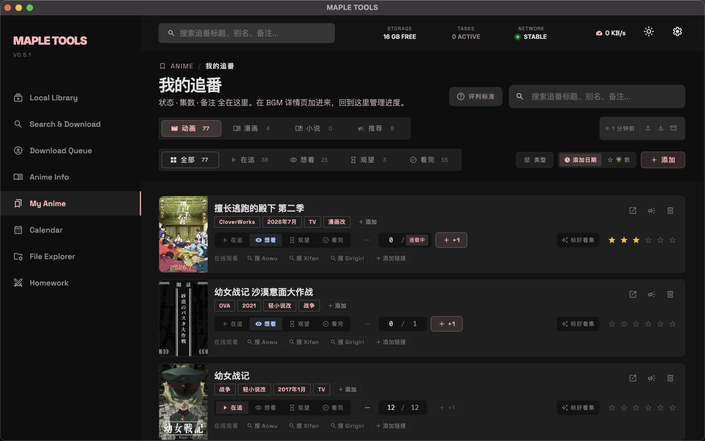
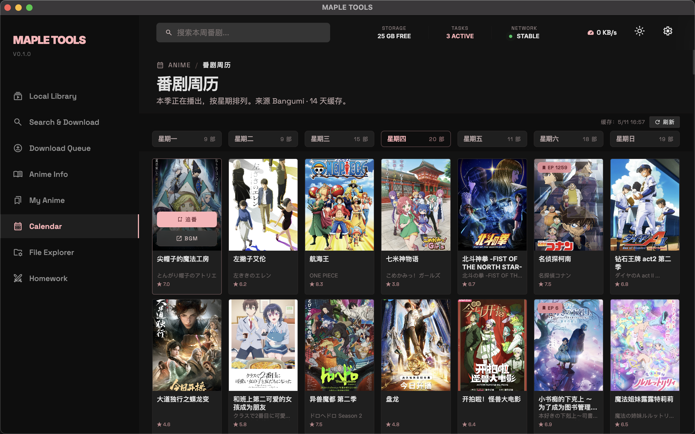
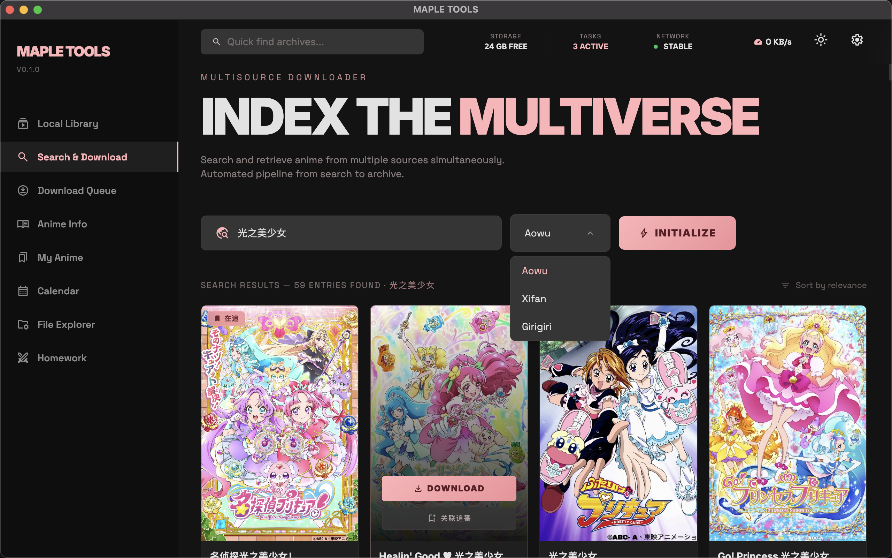
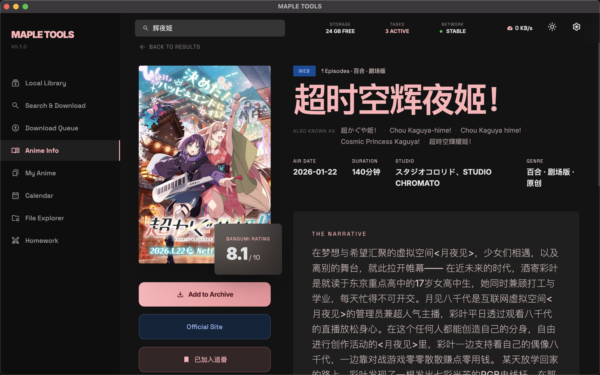
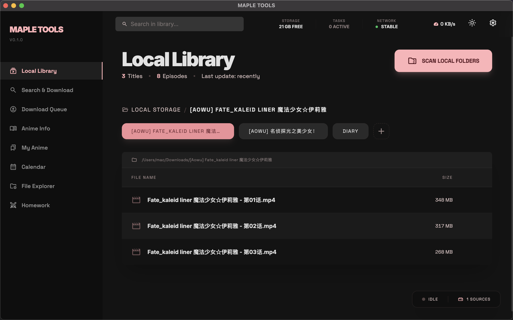

# MapleTools

基于 Electron + React + Tailwind 构建的桌面端动漫管理应用。整合多源搜索与下载、Bangumi 元数据浏览、追番进度追踪、本季番剧周历、本地媒体库扫描，配合坚果云同步在多设备间保持进度一致。整体采用 Material 3 风格的深色界面。

<p align="center">
  
</p>

## 功能一览

- **多源搜索与下载** — 同时检索 Aowu、Xifan、Girigiri 三个流媒体站点的资源，串行队列下载，支持暂停 / 续传 / 单集重试 / 切换备源。
- **追番管理** — 在 BGM 详情页或搜索卡片一键追番；「我的追番」汇总页统一管理观看状态、当前集数与绑定的观看链接；总集数缺失（长寿番 / 季番初期）也能手动填写。
- **多源绑定与跳转观看** — 一部番可同时绑定 Aowu / Xifan / Girigiri / 自定义 URL（如 B 站）多个来源，行尾一键在外部浏览器打开对应播放页继续观看。
- **本季番剧周历** — 按周一-周日展示本季更新计划，当日列自动高亮。
- **Bangumi 元数据整合** — 自动拉取 BGM 元数据、Staff、剧情简介，剧场版额外展示片长；简介为日语原文时回退到萌娘百科中文版。
- **云同步（坚果云 WebDAV）** — 追番列表跨设备同步，附带冲突检测与确认弹窗，明确显示本地 / 远端差异避免误覆盖。
- **本地媒体库** — 扫描配置好的目录树，自动提取 ffmpeg 缩略图，按番剧组织展示。
- **文件浏览器** — 内置跨平台文件管理，支持视频 / 图片 / 文档预览，删除支持移到回收站 / 永久删除。

## 截图

| 番剧周历 | 搜索与下载 |
|---|---|
|  |  |

| 番剧详情 | 本地媒体库 |
|---|---|
|  |  |

## 平台支持

| 平台 | 架构 | 状态 |
|---|---|---|
| Windows 10/11 | x64 | ✅ 主测平台 |
| macOS 11+ | arm64（Apple Silicon） | ✅ 主测平台 |
| macOS Intel | x86_64 | ❌ 暂不发布 |
| Linux | — | ❌ 暂不发布 |

## 前置依赖

> [!Note]
> **必须在系统 PATH 中安装 ffmpeg**。本应用不内置 ffmpeg，下载视频与提取本地缩略图均依赖系统 ffmpeg。
>
> - Windows：从 [ffmpeg.org](https://ffmpeg.org/download.html) 下载，将 `bin` 目录加入 PATH
> - macOS：`brew install ffmpeg`

> [!Tip]
> macOS 首次打开提示"无法验证开发者"时，请右键 App → 选择"打开"，
> 或执行 `xattr -d com.apple.quarantine /Applications/MapleTools.app`。

## 配置与密钥

**桌面应用不需要任何环境变量或密钥文件**，克隆后可直接启动运行。所有可选凭据都在应用内「设置」页按需配置，只存本机（`userData`），不进仓库、不参与同步：

| 凭据 | 设置页入口 | 作用 | 不配置的影响 |
| --- | --- | --- | --- |
| BGM 账号（访问令牌 / 网页登录） | BGM 账号 | 令牌让 API 走登录态（限额更宽，详情 / 别名搜索可用）；网页登录把 HTML 抓取提速（匿名约 16s → 登录约 0.6s）。令牌生成：[next.bgm.tv/demo/access-token](https://next.bgm.tv/demo/access-token) | 功能可用，搜索明显变慢 |
| 坚果云 WebDAV | 云同步 | 追番列表 WebDAV 备份 | 无跨设备备份 |
| 稀饭账号 | 稀饭账号 | 在线观看源登录态 | 部分源不可用 |
| QQ 邮箱授权码 | 邮件提醒 | 周历刷新后自动发邮件提醒 | 不发邮件 |

**网页版（`web/`）**：部署密钥（`AUTH_SECRET`、SMTP 发信、Google 登录等）全部走**进程环境变量**，代码不读任何 `.env` 文件；做法见 [`web/README.md`](web/README.md) 的「环境变量」章节。

## 目录结构

```
.
├── src/              Electron 源码（main / preload / renderer）
├── scripts/          构建脚本（Windows 打包、主题生成等）
├── resources/        应用图标等静态资源
├── docs/             开发文档（scraping/抓取手册 · regression/回归用例 · release/发布 · design/设计 · troubleshooting/排错 · archive/归档）
├── archive/          历史原型（Python/JS 旧版，不参与构建，仅留档）
├── package.json
├── electron.vite.config.ts
└── ...
```

## 依赖与运行指南

### 安装依赖

```bash
npm install
```

### 本地开发运行

启动开发环境，支持热更新（推荐）：

```bash
npm run dev
```

#### 联调本地网页版（网页版账号同步功能）

桌面应用的「网页版账号」登录 / 同步默认连的是线上 `https://anime.alcmaple.cn`。如果你在本地 `web/` 起了一个开发环境（`npm run dev`，默认 `http://localhost:5173`），要用同一份数据联调，必须把桌面应用指向这个本地地址，否则用本地注册的账号登录桌面应用会报"用户名或密码错误"（查的是线上库，不是本地库）：

```bash
MAPLETOOLS_WEB_URL=http://localhost:5173 npm run dev
```

### 项目打包分发

生成适用于当前操作系统的安装包及可执行文件。

```bash
npm run dist
```

打包产物输出在 `dist/` 目录下（如 `.exe`, `.dmg` 等）。

## 参与开发

这个项目目前由我一个人维护。一个人写久了难免遇到瓶颈，很多功能也只是顺着我自己的使用习惯长出来的——所以很欢迎有新的想法、新的视角加进来一起做。

- **随便提** — 有想法、踩到 Bug、想要某个功能，都欢迎开 [Issue](https://github.com/AlcMaple/tools/issues)。
- **直接动手** — 想加功能 clone 下来该写写，写完发 [Pull Request](https://github.com/AlcMaple/tools/pulls) 就行。有活你就直接往里加。
- **审核归我，但门槛不高** — 是否合并最终由我把关，主要是保证整体方向和代码风格一致；只要理由站得住、不破坏现有体验，基本都会采纳。

不挑经验，新人完全 OK——很多时候反而是新人能带来我想不到的角度。
上手路径：想知道某个功能的代码在哪，看 [`docs/功能索引.md`](docs/功能索引.md)（功能 → 文件地图）。
另外 [`AI_GUIDELINES.md`](AI_GUIDELINES.md) 最初是写给 AI 看的——用 AI 辅助开发的话，可以让它先读一遍；不用 AI 也一样，自己翻翻就能大致了解这套代码的一些约定。这些约定只是参考，不会卡得很严，放心写就好。
