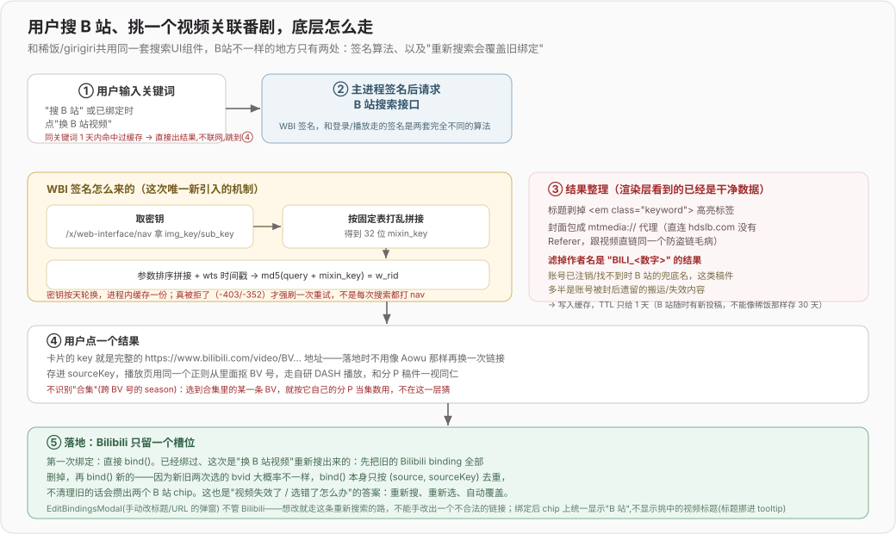

# B 站源（2026）

> 专题开发日志。新记录在上；记录规则和总入口见 [`DEVLOG.md`](../../DEVLOG.md)。

## 2026-08-20 fix(bili): 修复老版兼容手动添加的 B 站源

**效果**：

1. 老版手动贴 bilibili.com 链接的追番，不再被误判成"没搜过 B 站"：追番行正确显示「换 B 站视频」而不是「搜 B 站」，重新搜索时会连老的 Custom 绑定一起清掉，不会攒出两条
2. 在线播放页进页默认不再跳到空的「B 站」搜索位——老链接本来就能解析播放，只是没被选中过

**边界 / 风险**：

1. 判定仍是纯正则（URL 含 `bilibili.com`），不解析具体页面类型；如果哪天 Custom 源出现非 B 站但域名巧合命中的链接，会被误吸进 Bilibili 槽位——目前手动加链接的场景里不存在这种域名冲突

## 2026-08-17 feat(bili): B 站源重构为搜索关联

**效果**：

1. 追番行/在线播放页里 B 站变成和稀饭/Girigiri/嗷呜一样的第四个内置源：未关联时点「搜 B 站」弹出搜索框，关键词搜、挑一个视频、自动落地成 binding
2. 已经关联的 B 站源允许改：按钮变成「换 B 站视频」，重新搜索、重新选，新选择会**覆盖**旧的（只留一个槽位，不会攒出好几个 B 站 chip）
5. 老数据兼容：以前手动贴的 bilibili.com 链接还是 `source:'Custom'`，完全没动；播放页识别「是不是 B 站视频」统一用正则抠 BV 号，不看 `source` 字段，新老两种写法混着用也没问题
6. 已绑定的 B 站 chip 统一显示"B 站"

**关键流程**：

**关键决策**：

- WBI 签名是这次唯一新引入的机制（登录、播放地址走的是另一套 TV 端 appkey 签名，互不相关），参照 `/Users/mac/Downloads/biu` 项目 `electron/ipc/api/wbi.ts` 的同一套算法：`/x/web-interface/nav` 取 `img_key`/`sub_key` → 按固定表打乱拼接成 32 位 `mixin_key` → 参数排序拼接 + `wts` 时间戳 → `md5(query + mixin_key)`。密钥按天轮换，进程内缓存一份，真被拒了（`-403`/`-352`）才强刷一次重试，不是每次搜索都打一遍 `nav`。用真实接口跑过一遍验证算法正确（`code:0`，拿到了带 `<em class="keyword">` 高亮标签的真实标题）
- 不识别"合集"（跨 BV 号的 season）：只搜普通投稿视频，选到合集里的某一条 BV 就按它自己的分 P 当集数用，不在这一层猜测/拉取整个合集。选错了走"换 B 站视频"重新搜索覆盖即可
- Bilibili 的"改绑"不走 `EditBindingsModal`（手动改标题/URL 那个弹窗）——那边已经把 Bilibili 排除掉了。想换视频只能重新搜索，不能手改出一个不合法的链接
- 复用了稀饭/Girigiri 共用的那一整套搜索 UI（`SearchSourceModal`/`useSourceSearch`/`SearchCard`），只在 `Source` 类型里加了 `'Bilibili'`、加一个 `normalizeBilibili`，UI 层没有另起一套
- 搜索缓存 TTL 单独给了 1 天，比稀饭/Girigiri/嗷呜的 30 天短得多：那三个源收录的是站内固定条目，同一关键词长期都是同一批老番；B 站是全站实时投稿索引，同一关键词随时可能冒出新视频，缓存太久等于让新投稿"隐身"。命中缓存这套逻辑本身没有后台静默刷新（`useSourceSearch` 里未过期的命中会直接同步返回、完全不碰网络），所以 TTL 就是"用户能搜到多新的结果"的硬上限
- 缓存桶按源加了版本号（`CACHE_VERSION_BY_SOURCE`），只在 `SearchCard` 归一化逻辑真正变化时才加

**边界 / 风险**：

- WBI 密钥依赖 `/x/web-interface/nav` 匿名可访问且返回 `wbi_img`；B 站如果哪天把这个接口也收进登录门槛，签名会整体失效，需要改成登录态下取密钥
- 过滤"BILI_<数字>"是按经验现象加的规则，不是官方文档行为；如果 B 站以后把这个兜底名格式改了，过滤会失效
