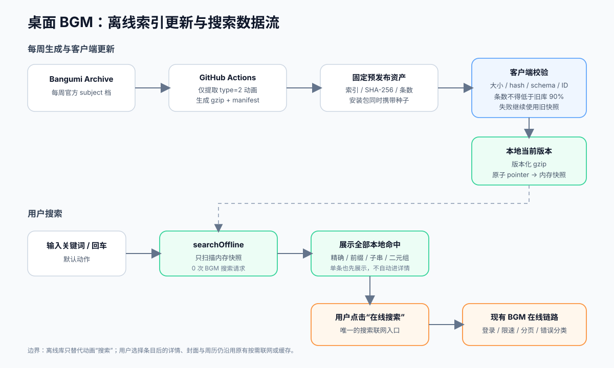

# 动漫查询（2026）

> 专题开发日志。新记录在上；记录规则和总入口见 [`DEVLOG.md`](../../DEVLOG.md)。

## 2026-08-18 feat(bgm): 离线索引收录本篇集数，老番加番自动填总集数

**效果**：

1. 老番加进追番立刻带总集数，不用再手敲；新番仍为空（= 连载中，用户想填自己填），**即使 BGM 已给出集数也不填**
2. 集数来自本地离线索引，加番不为此多打一次 BGM 请求；索引缺这条时才由既有的后台详情回填兜底
3. 「今天更新」贴纸改看首播日期：往季老番不再因为放送星期恰好是今天就一直顶着该贴纸；新番手填了集数也不会掉出当天分组

**集数是怎么来的**：

```text
subject.jsonlines 没有集数字段（官方 schema 里就没有）
  → 集数在另一个成员 episode.jsonlines，逐集一行、subject_id 关联、type=0 为本篇
  → 建索引扫两遍同一个 zip（已在本地，不重新下载）：
      pass1 subject → 插 anime 行 + 收 anime id 集合（约 3 万）
      pass2 episode → 只数集合内 subject_id 的 type=0 行 → 一个事务批量 UPDATE eps
```

只数集合内的 id 是为了内存：档里的 episode 覆盖漫画/游戏等全类型，全收会涨到百万级 Map，限定动画后只剩约 3 万条

**关键决策**：

- **新老判据只看 `airDate`，绝不看 `totalEpisodes`**，抽到 `web/shared/anime-age.ts` 前后端共用（同时被「继续看」的周表/搜索分流、加番填集数、「今天更新」贴纸三处使用）。用「total 为空 = 连载中」当判据的话，一旦开始给老番自动补集数，判据就自我污染了
- `eps = 0` 一律表示**「不知道」而非「0 集」**，贯穿索引列、`epsOf()`、`SubjectDetail.eps` 三处；0 就退回下一级来源，绝不当确定值写库
- **`eps` 列要防部署顺序**：线上索引由 cron 每周重建，代码先上线那段时间读到的是旧结构。`epsOf` 每次换库后用 `PRAGMA table_info` 探一次列，没有就返回 0 —— 否则一句 `SELECT eps` 的 no such column 会把整条搜索路径带挂。实测旧索引（30502 条、无 eps 列）读取正常
- `detail.ts` 早先显式丢弃集数，注释理由是「周历 eps 恒为 0」—— 那个观察针对 `/calendar`，而详情走的是 `/v0/subjects/{id}`，后者有真值（实测 420628 = 24）。当初把周历的结论套到了详情上
- 后台回填判新老用**详情返回的 `date`** 而不是库里的 `air_date`：详情这一趟刚把日期补上，此刻库里那列可能还是空的，空串会被判成新番、白白错过补集数的机会
- 回填沿用既有的「不动 `updated_at` / 不 bump rev」策略：这是系统补全不是用户操作，bump 了会把桌面端顶出 409

**边界 / 风险**：

1. 判据阈值 180 天 ≈ 两季。判宽（老番被当新番）只是回到「手填」的现状，判窄才会写错数据，所以阈值向新番一侧留了余量
2. episode 成员缺失不致命：整列留 0、索引照常替换，加番退回在线详情补
3. 索引需重跑一次 `npm run sync:index` 才有集数；跑之前所有条目都走在线兜底，行为等同改动前

## 2026-08-15 feat(bgm): 动漫查询优先使用自动更新的离线索引

**效果**：

1. 动画搜索默认只扫描桌面主进程中的本地索引，0 条也不会自动联网；本地结果无在线过滤和 30 条截断，按“精确 → 前缀 → 整串 → CJK 二元组”相关度返回全部命中
2. 搜索结果始终先展示，一条也不自动打开详情；本地为空、索引未就绪或结果不理想时，用户可明确点击“在线搜索”，再进入原有登录、限速、分页与错误反馈链路
3. 旧 `search_cache_bgm` 与后台 SWR 不再读取；进入查询页也不再自动联网校验 BGM 登录态



**关键代码决策**：

- 离线与在线使用两个明确 IPC：`searchOffline` 只读内存快照，`searchOnline` 才调用原 `searchBgm`，不复用含义为“绕过在线缓存”的 `update` 参数
- 客户端启动后静默检查固定发布资产，后续每 24 小时最多一轮；多个通道优先信任 GitHub 直连清单、以查询参数避免可变 tag 旧缓存。新索引先完整验证，再写版本化 gzip 并原子切换 `current.json`。更新中、断网、坏 hash、坏 schema 或条数骤降都继续服务旧快照
- 安装包种子、用户目录更新与 `web/` 的 SQLite 索引相互独立

**边界**：

- 本次只替换“搜索”数据源；用户选择条目后的 BGM 详情、封面、周历仍沿用原有按需联网或缓存
- 官方离线档按周更新，刚新增的条目可能尚未进入本地结果，此时由用户主动在线补查

## 2026-08-15 ci(bgm): 每周发布桌面离线索引

**效果**：

1. GitHub Actions 从 BGM 官方 Archive 提取动画条目，生成紧凑的 gzip 索引与校验清单，并在固定的预发布版本中每周覆盖；应用发版时也会把同一份索引装入安装包
3. 生成阶段会校验上游压缩包 SHA-256，只保留 `type=2` 动画，按 BGM ID 去重并稳定排序；空库、坏行异常或条数低于生产安全线时直接失败，不发布残缺数据

**关键数据流**：

```text
bangumi/Archive latest.json
  → 下载并校验约 400 MB 官方压缩包
  → 流式读取 subject.jsonlines
  → 提取动画标题 / 中文名 / 别名 / 日期 / 评分
  → bgm-offline-index-v1.json.gz + manifest
  ├─ 固定 prerelease：供已安装客户端自动更新
  └─ release artifact：作为新安装包的离线种子
```

## 2026-08-06 fix(bgm): 搜索无精确结果时显示前三个候选

**效果**：

1. 只记得大概番名时，不再因为应用的严格匹配把 BGM 已返回的候选全部过滤掉；搜「今天的猫」会显示 BGM 相关度最高的 3 条，其中包含《能干的猫今天也忧郁》
2. BGM 本身没有返回任何条目时仍显示“未找到”，网络错误与限流错误也继续原样反馈

**关键代码**：

```ts
// bgm/search.ts
if (matched.length === 0) {
  matched.push(...allItems.slice(0, 3))
}
```
