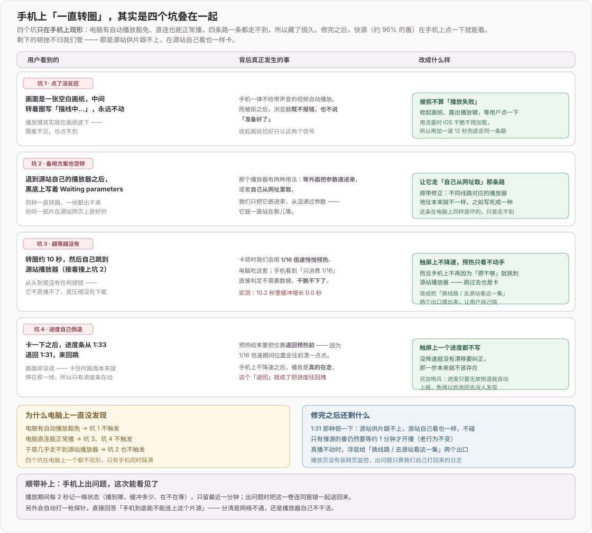
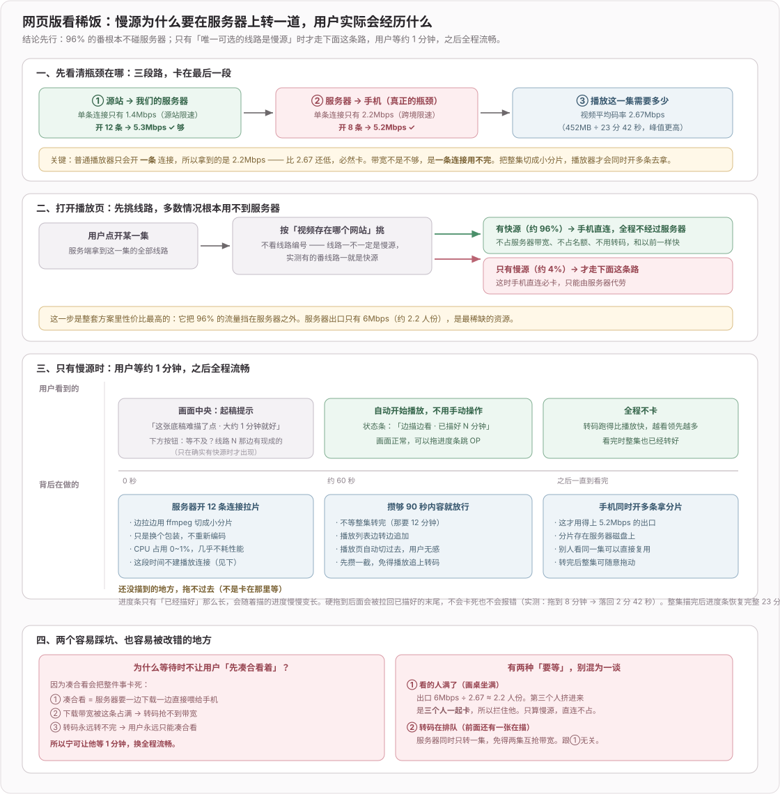
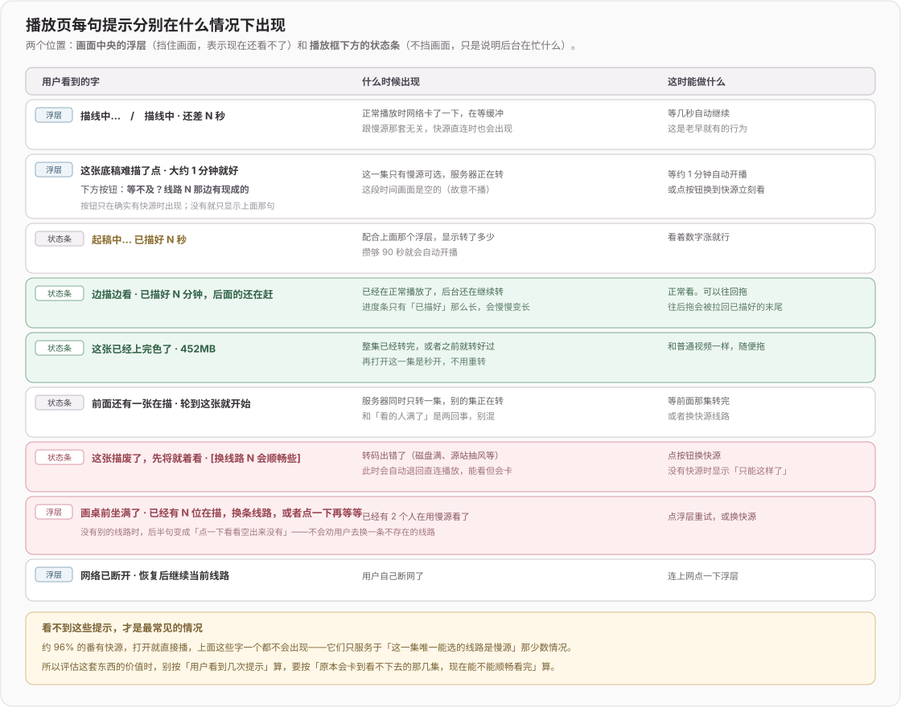
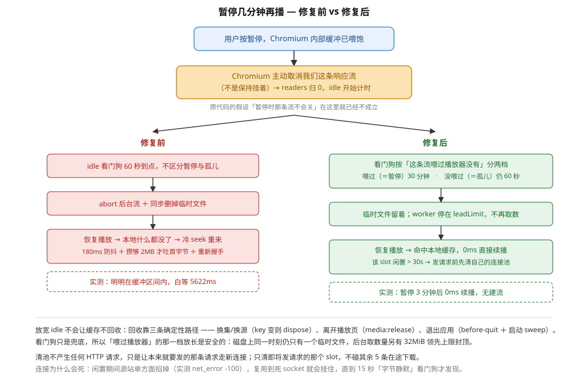
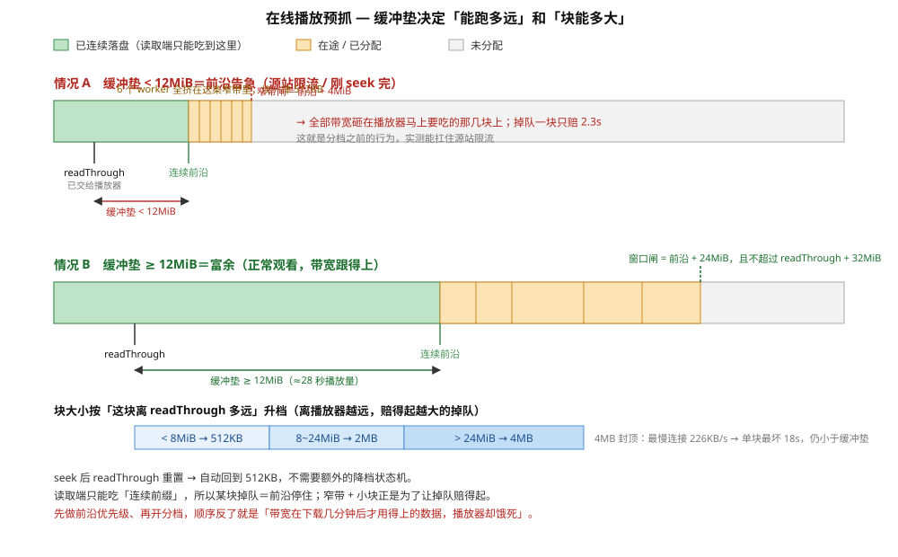
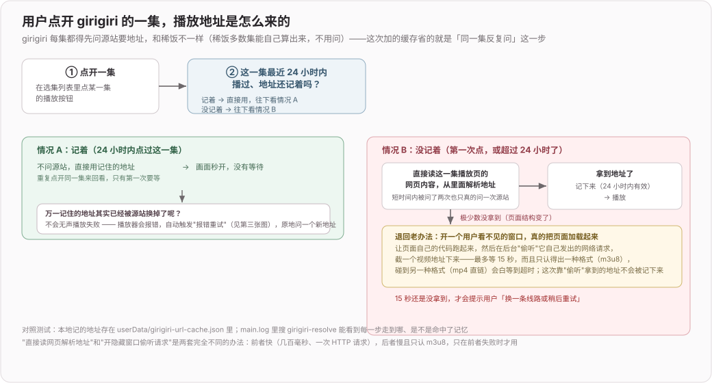
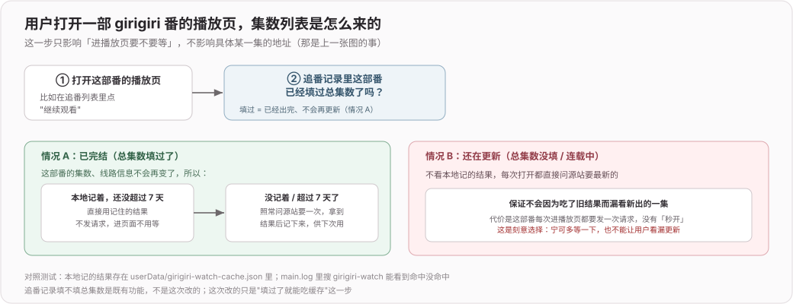
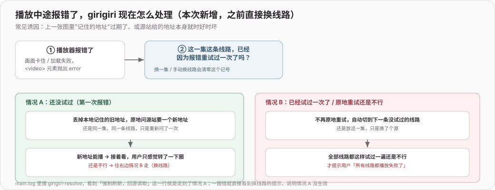

# 在线观看（2026）

> 专题开发日志。新记录在上；记录规则和总入口见 [`DEVLOG.md`](../../DEVLOG.md)。

## 2026-08-28 fix(web): 修复手机端在线观看卡死与进度倒退

**效果**：

1. 手机上点开任意线路不再「一直转圈」
2. 播放中不再出现「进度条自己往回跳、画面却没退」
3. 真播不动时，浮层给「换线路 / 去源站看这一集」两个出口，而不是默默退到一个同样转圈的播放器



**关键点 · 播放页的监控要单独打一份**（四个坑里三个是**没有任何报错**的，只能自己打点）

```text
npm run build ①vite build（会清空 dist） → ②打 @sentry/browser 成自托管 IIFE
                                            顺序不能反，产物 dist/player-monitor.js
/api/xifan/monitor.js  发出去          →  CSP 只放行 'self'，也避开国内加载 CDN（同 hls.js）
DSN / env / release                    →  运行时读进程环境，不是构建时快照
```

`slog()` 三个去处：每条进面包屑（出异常时整条时间线跟着走）、带胶片的失败类才真开一条上报、
始终打一份进服务端 stdout。页面报过就带 `sdk` 标记，服务端跳过自己那份，免得同一件事
在两个项目里各开一个 issue。胶片＝每 2 秒采一格 `t / ahead / readyState`，环形留最近一分钟。

**边界 / 风险 / 还存在的问题**：

1. **剩下的顿挫不归我们管**：源站供片跟不上时该卡还是卡，在源站自己看也一样
   我们只保证不倒退、不误退
2. **触屏判据不是设备判据**：触屏笔记本会走触屏那套（不降速、不退套娃）
   降速预热这件事本来就没什么必要，只是桌面上暂时留着不动它
3. Session Replay 不装：它录 DOM，而 `currentTime / buffered` 是 `<video>` 内部状态，恰恰录不到这次这类问题
4. **播放页监控没法走临时热传**：产物不进 git，改了必须走正常发布
   浏览器 DSN 走 `PLAYER_SENTRY_DSN`，与服务端那份是**两个项目**，别混用
5. **`/api/xifan/client-log` 无鉴权**：胶片上限卡死 40 行 × 120 字，别让它变成往日志里写东西的入口

## 2026-08-27 feat(web): 「继续看」新增源站跳转

**效果**：

1. 追番卡片的「继续看」不再直接开稀饭播放页，改成弹一张和泉纱雾口吻的便签（`.dlg` 弹窗，
   跟本页绑定 / 搜索流程同一套语汇；**稀饭 / Girigiri × 在纱雾这儿看（我们的播放页）/ 跳去源站看（新标签直达源站站内页）**
2. 已绑定的源直接开；没绑定的先走原有定位 → 候选 / 全站搜索（验证码仍在我们站里过），
   认出来后按当时选的「站内 / 源站」落地
3. 本地开发的抓取时**自动探测本地代理并整体切过去** ——浏览器能开的站服务端就能抓

**关键点一 · `mode: 'online' | 'source'`**：一路带过 `continueWatch` → `PickerState` → 搜索弹窗，
因为首次继续看要等绑定建好才知道该跳哪个 URL。源站直链拼法跟服务端保持一份：
稀饭 `anime.xifanacg.com/watch/{id}/1/{ep}.html`（同 `server/xifan/resolve.ts`），
Girigiri `ani.girigirilove.com/play{id}-1-{ep}/`（同 `server/girigiri.ts` 的 `officialPage()`）。
候选行 / 搜索结果行本身是 `<a>`，`href` 按 `mode` 切，点击在用户手势内原生开，不吃弹窗拦截。

**关键点二 · 代理自动对齐**（`server/http.ts` 的 `autoAlignProxy` + `proxyReady`）：

```text
仅当  非生产 && 没设代理 env && 直连 HEAD 稀饭失败  才探测：
  1. macOS `scutil --proxy`（浏览器「用系统代理」时的那份）
  2. Clash/Mihomo 外部控制器 :9090/:9097 的 /configs → mixed-port
  3. 常见端口兜底 7890 / 7897 / 1087 …
每个候选真发一次 HEAD 验证，通过才 setGlobalDispatcher(new ProxyAgent(url))
```

探测是异步的，各抓取封装（`xifan/session` `requestOnce`、`xifan/weekday`、`xifan/resolve`
`fetchAnonymous`、`girigiri/resolve` `fetchHtml`、`girigiri/search`、`girigiri/weekday`）发请求前
`await proxyReady`，保证首个请求不会抢在探测定盘前走错传输层

## 2026-08-21 feat(web): 网页版稀饭慢源改走服务端转 HLS

**效果**：

1. 网页版遇到只有慢源的番，从「播几秒卡一下、最后退成官方 iframe」变成
   **等约 1 分钟 → 全程流畅播完，可随意拖进度条**。
2. 约 96% 的番自动走直连快源，**完全不经过服务器**——不占带宽、不占名额、不转码。
3. 慢源同时最多 2 人观看，第 3 人看到排队提示而不是三个人一起卡。





**一、瓶颈不是带宽不够，是一条连接用不完**（全部实测）

```text
入口  源站 → 服务器   单路 1.4Mbps  →  12 路并发 5.3Mbps        ✓
出口  服务器 → 手机   单连接 2.2Mbps <  码率 2.67Mbps           ✗
                      同一条链路 8 连接 5.22Mbps                ✓
```

服务器出口能力本身没问题（speedtest 上下行均 5.66Mbps）。卡的原因是 `<video>` 只开
**一条**连接，跨境单连接被限速到 2.2Mbps，剩下的带宽它没有第二条连接去用。
即使只有一个人看、6Mbps 全给他也一样卡——**所以 12 路并发只能解决入口，出口必须切片**。

> 走到这一步之前的两个错误结论（都是拿单次异常测量下的判断）：一次把线路一判成「VPS 上
> 无解」，一次把服务器出口判成「只有 1Mbps」。复测都推翻了。**测速要多次、要区分链路段。**

**补充：为什么代理只能放服务端** —— 最终签名地址 `pan.wo.cn` **一见 `Origin` 头就 403**
（不带是 206）：

```text
浏览器 fetch + MSE 自己开多路  → 必带 Origin → 403                    ✗
<video> 裸直连                 → 不带 Origin 能播，但 JS 读不到字节     ✗
服务端代理                     → 不带 Origin，且能开多路               ✓
```

另有一处**加了又删**的尝试，教训值得留着：曾在 `canplay` 后用 0.0625 倍速静音"偷偷预缓冲"，
实测**有害**——浏览器判定缓冲远超消费速度就主动限流，10.9 秒只攒到 2.7 秒缓冲，
而同一时刻直接 fetch 同一地址能跑 772KB/s。起播慢的原因是带宽不是时机。

**二、默认线路按域名挑，不按线路编号**

线路号和源站没有固定对应关系——实测 `animeId=3498` 的「线路一」就是 `play.xfvod.pro`
（直连快源），3535 的线路一才是 `apn.moedot.net`（慢源）。所以：

```text
抓 source 1（原有的一次请求）
├─ 不需要代理 → 直接用，不多打任何请求（懒加载原意不变）
└─ 需要代理   → 才多花一次请求看下一条是不是直连；是就换
```

这一步性价比最高：把 96% 的流量挡在服务器之外。白名单在 `proxy-hosts.ts` 单独成文件，
解析层和传输层共用。

**三、慢源路径：预转 HLS + 边转边播**

- `ffmpeg -c copy` 只换封装不重编码，**CPU 0~1%、内存 60MB**，2 核机器毫无压力。
- 分片用 **fMP4 不用 TS**：TS 的 188 字节包头让体积涨 12%，fMP4 整集实测与源等大。
- playlist 用 **EVENT 不用 VOD**：攒够 15 片（90 秒内容）就放行开播，不必等整集转完
  （那要 12.5 分钟）。ffmpeg 结束时自动补 `#EXT-X-ENDLIST`，就地变完整 VOD。
  生产实测：**78 秒起稿 → 约 90 秒自动开播 → 缓冲持续增长**。
- **拖到还没转出的位置不会卡死**：播放器认为整集就只有已转出那么长，硬拖会被拉回末尾
  （实测拖到 8 分钟 → 落回 2 分 42 秒），进度条随转码变长，转完恢复完整 23 分 42 秒。

**四、六个死锁 / 竞态，都是实测撞出来的**

1. **首次观看的死锁**：代理直连占满入口 → 让位逻辑冻住 remux → 永远转不出来 → 用户
   一直卡着看。根子是代理直连注定不够快，**播它本身就没意义**。改为慢源未就绪时干脆
   不建代理连接，入口全留给 remux。触发点也从 `/stream` 挪到 `/prepared` 轮询——轮询
   不占入口，不会自己把自己冻住。
2. **让位冻结后 ffmpeg 必挂**：`SIGSTOP` 冻超 60 秒，代理会话被 idle 看门狗收摊，
   输入流断掉，退出码 255，一个分片都产不出。ffmpeg 的 HTTP 输入**默认不重连**，
   必须显式加 `-reconnect`。
3. **多读取端互抢内存块**：Chromium 开一个 mp4 会连开 4 条请求再 abort 掉 3 条，
   块一发出就释放的话它们会抢同一批块，两边都攒不出连续前缀——播放器一个字节都拿不到。
   会话改为可挂多个读取端，新的接管时旧的安静退场。
4. **首个请求不带 Range 却回 206**：206 只能回应 Range 请求，媒体栈会把响应体整个丢掉，
   现象是响应头到了但 `encodedBodySize` 恒为 0。没有 Range 就回 200。
5. **moov 尾部探测顶掉会话**：Chromium 开 mp4 先探文件尾找 moov，那条 `bytes=N-` 会被
   当成冷 seek 把整个会话重开，前面攒的窗口全丢。尾部/带结束位的小段改走单路直连透传，
   完全不碰会话（对齐桌面端 `TAIL_DIRECT_BYTES`）。
6. **两道闸门互相顶死**：照搬桌面端的起播闸门（攒够 2MB 再回流）却漏了它的开场豁免，
   而播放页的缓冲闸门只等 10 秒——开场建连要十几秒才攒满 2MB，两边顶死，播放器一个
   字节都拿不到。文件开场豁免起播闸门。

**五、两种「要等」互不相关，不能混为一谈**

| | 判据 | 为什么 |
|---|---|---|
| 看的人满了 | 出口 6Mbps ÷ 2.67 ≈ 2.2 人 | 第 3 人挤进来是**三个人一起卡**，不是他自己卡。按 IP 计人头（同一人 seek 会开多条流），只挡新面孔，已在看的重连一律放行 |
| 转码在排队 | 服务器同时只转一集 | 免得两集互抢入口带宽。跟观看名额无关 |

名额只算慢源，直连的人不占。`<video>` 收到 503 只有一个没有响应体的 error 事件，
分不清「名额满」和「真播不了」，所以加了无副作用的 `GET /slots` 供播放页预检。

**六、配额与回收**

默认 15G（约 34 集），LRU 排序键是**最后被读到的时间**（分片被请求时 touch），不是转好的时间。
跳过正在转的和 30 分钟内被读过的；单会话内存超顶时**请出最慢的读取端**而不是丢块——
丢掉某人正要读的块正好就是「看着看着突然卡」。腾不够则拒绝新任务，绝不动正在被看的那份。

**还存在的问题**：

1. **只支持顺序转码**：拖到未转区域只能等，做不到「从第 8 分钟开始转」——HLS playlist
   无法表达「中间有一段是空的」，要另起一份 playlist 并在跳转时整个重载。考虑到转码
   跑 1.7x 快于播放、等待时间递减，暂不投入。
2. **没有自动预备**：老番连看、新番按更新时段预判都没做。默认走直连后这两件事只覆盖
   3~4% 的场景，收益存疑。
3. **进度条不显示整集真实长度**：边转边播期间只显示已转出的时长，用户不知道整集多长。
4. **6 人规模下带宽先于容量撞墙**：容量 34 集对 6 人宽裕，但出口只够 2.2 人同时看慢源。
   要支持 3~4 人同看，只能升带宽，代码解决不了。

## 2026-08-21 perf(player): 稀饭线路一并发从 6 路提到 12 路

**效果**：

1. 桌面端稀饭线路一聚合吞吐从 5.25Mbps 提到 **18.8Mbps**（本机实测，约 3.5 倍）。
   该集平均码率 2.67Mbps，原先 6 路只有 2 倍余量，抖动一下就要吃缓冲。

**实测叠加曲线**（每路 12s，全程无一非 206 响应）：

| 并发 | 本机 | 香港 VPS |
|---|---|---|
| 6 路 | 5.25 Mbps | 3.53 Mbps |
| 12 路 | **18.8 Mbps** | **4.93 Mbps** |
| 24 路 | 34.7 Mbps | 4.59（已饱和） |

**为什么停在 12 而不是 24**：12 路已是码率的 7 倍，再往上对播放没有意义，只是多占
源站连接、徒增被风控的面；VPS 上 24 路更是已经饱和，纯属摊薄。

**关键：光改 `FETCH_CONCURRENCY` 没用**，`FRONTIER_BAND_BYTES` 必须同步放大：

```text
告急窗口 4MiB  vs  12 路 × 512KiB = 6MiB
  → 一半 worker 抢不到活，在窗口边缘干等
  → 网页版实测：只提并发不动窗口，吞吐反而 5.25 → 1.9Mbps
```

所以窗口跟着并发走（留 2 倍余量让下一轮块也在路上），4MiB → 12MiB。这个坑是网页版
那套代理（见上一条）先踩到的，两边同源同参数，改动一并对齐。

**风险 / 回溯点**：

1. 并发翻倍会同时占用 12 个独立 Electron Session 的连接。目前实测没触发任何限流或
   封禁，但这不是保证——若日后出现「某几路长时间卡住不动、其余正常」，优先怀疑这里，
   把 `FETCH_CONCURRENCY` 调回 6 即可回到旧行为。
2. 本次只改了两个常量，**没有动调度逻辑**，回滚成本极低。

## 2026-08-19 fix(play): 断网恢复时保持当前线路继续播放

**效果**：

1. 应用版与网页版遇到数秒至 1–2 分钟的间歇断网时，不再把当前线路标坏、不刷新签名地址、不自动切下一线路 / iframe；网络恢复后回到原网站、原线路、原集数和原时间点继续播放
2. MP4 / HLS / DASH 的重试预算收口：HTTP 4xx/5xx 不重试，HLS 全部 loader 与 Shaka 单请求不再自动补第二轮；MP4 只对明确传输中断做最多 2 次共享错峰续传，六个 worker 不会同一 tick 一起冲
3. 换集、换线路、换网站和退出播放器都会先同步销毁 HLS/Shaka、拆掉 `<video>`，再中止 MP4 缓存、HLS 预取与直通代理；旧请求不能在 release 后重新建 session
4. 嗷呜加密接口从无超时的 Node `https` 迁到认系统代理 / PAC 的 Electron `net`，请求有 15 秒上限和外部 abort；稀饭、Girigiri、嗷呜的地址强刷都改为成功后覆盖，失败不先删除旧缓存

**断网与线路故障的分流**：

```text
媒体 error / HLS fatal / Shaka error
  ├─ navigator 明确 offline ───────────────┐
  └─ 仍显示 online → 一次全局连通性确认    │
       ├─ 不通 ────────────────────────────┤
       │   保存 source + line + ep + time  │
       │   不刷新 URL / 不记 triedLines     │
       │   等 online 事件（不周期探测）      │
       │           ↓                       │
       │   确认恢复 → 同线路只重开一次 ──────┘
       └─ 全局网络正常
           ├─ 当前签名地址强刷一次（成功后替换缓存）
           ├─ 仍失败 → 当前站内下一条含本集的线路
           └─ 全部失败 → ErrorPanel / iframe
```

恢复按“断网代次”加闩锁：同一次断网最多恢复一次；`online` 先到、旧 HLS fatal 后到的竞态仍归入同一代，不能再启动第二份请求。恢复点还绑定 `bgmId + sourceKey + line + ep`，换番 / 换源不会误套旧时间。

**请求所有权与预算**：

```text
换集 / 换源
  → hls.destroy() / shaka.destroy()
  → video pause + remove src
  → media:release
      ├─ abort MP4 session + 删除临时文件
      ├─ abort HLS 预取代次 + 清内存
      └─ abort 未拿响应头 / 仍在透传的代理请求
  → 新代次才可发请求
```

- `media-proxy` 给响应头 15 秒 deadline、播放列表 body 30 秒 deadline；release 会推进 proxy generation，旧 seek 即使还在 180ms 防抖窗口也不能创建新 session
- HLS 当前片没有预取时只走一次直连，同时只预取后续片；预取拿到 4xx/5xx 后保留失败墓碑，正式播放不会重复直连同一片
- MP4 的 HTTP 状态、Range 结构错误是确定性失败；只有 `RangeTransportError` / 截断 / 字节静默 abort 可续传，六 worker 共用下一次重连时刻并至少错开 500ms

**验证**：

1. Chrome 故障注入（网页版稀饭 MP4）：离线 error → 健康检查 0、iframe 0；恢复 → 健康检查 +1、同 URL 媒体请求 +1；在线 error → 健康检查 +1 后 iframe +1
2. 隔离 Electron 主进程 + 本地可控端点：503 请求 1 次；无响应头 socket 断开仅 Chromium 内部补 1 次（总计 2，应用层无追加）；release 命中 seek 防抖时上游请求 0；失败 HLS 预取片请求 1 次且正式播放不直连重取
3. 应用版 `npm run build`、网页版 `npm run build`、渲染层与网页版 TypeScript 检查通过；两张服务端生成播放页的内联脚本经模板替换后单独编译通过

**边界 / 风险**：

1. 极低带宽持续有字节流入但低于视频码率时只能继续缓冲，无法凭状态机创造带宽；本次只解决断网误切线、恢复和请求放大
2. Safari / iOS 原生 HLS 不经过 hls.js 的零重试配置，行为仍由系统播放器控制
3. 地址 / 集数解析 IPC 的旧结果已有代次丢弃，但底层解析请求还不能跨 IPC 主动 abort；它们不会覆盖新播放器，仍可能完成一笔已经不需要的元数据请求
4. 下载队列的断网暂停与恢复是另一套任务状态机，本次未混入在线播放提交

## 2026-08-18 fix(play): 修复暂停重缓冲与白打站点搜索

**效果**：

1. 暂停几分钟再播不再转圈重新缓冲（修复前实测白等 5622ms），恢复即 `0ms 命中本地缓存`
2. 进入播放页不再白打一发站点搜索
4. 块大小按缓冲垫厚度升到 2~4MB，整集请求数约降到 1/4；带宽不足时自动退回 512KB，卡顿与旧行为持平

**一、暂停后被误收摊（`media-cache.ts`）**

原代码假设「`<video>` 暂停时那条响应流不会关」，于是把 `readers > 0` 当成「播放器还连着」。实际 Chromium 在暂停且内部缓冲喂饱时会主动取消响应流：`readers` 归 0 → 60 秒 idle 看门狗 abort 并**删掉临时文件** → 恢复播放只能冷 seek 重来



判据改成「这条流有没有真的喂过播放器」（`readThrough > 0`）：喂过＝暂停，宽限 30 分钟；没喂过＝孤儿，仍 60 秒。看门狗自身仍每 60 秒复查一次

**二、前沿优先级 + 块大小分档（本次最深的改动）**

读取端只能消费「从起点起连续落盘的前缀」，所以**某块掉队＝前沿停住**。块调大能压请求数（请求数是「像不像正常播放器」的主要特征），但直接开分档实测会卡，原因不是掉队耗时，是**带宽优先级错配**：worker 平权领块，一判定富余就散布在 32MiB 跨度上啃大块（实测前沿还在 1.5MB，已有 worker 在 41/45/54MB 上取 4MB 块），源站一限流前沿只分到 1/6 带宽



所以先补前沿优先级，再开分档。时间轴模拟（500MB 一集，播放消耗 422KB/s）三方对照：

| 带宽 | 前沿优先级＋分档 | 只有分档 | 固定 512KB（旧） |
|---|---|---|---|
| 3MB/s | 157 块 / 卡 1.0s | 146 块 / 1.0s | 1000 块 / 1.0s |
| 1MB/s | 168 块 / 3.0s | 151 块 / 3.0s | 1000 块 / 3.0s |
| 500KB/s | 260 块 / **6.1s** | 193 块 / **8.9s** | 1000 块 / **6.1s** |
| 300KB/s | 1000 块 / 507s | 1000 块 / 507s | 1000 块 / 507s |

关键是第三行：卡顿与旧行为持平而请求数只有 1/4；只有分档的那版会退化成 8.9s。300KB/s 已低于播放码率，任何策略都躲不掉，此时档位自动全退回 512KB

调度随之从「块序号 × 固定大小」换成**字节游标**（`nextOffset` / `contiguousEnd` / 按起始偏移记账的 `completed`）。这块动的正是「连续前缀」这个不变量，写错不会报错、只会把带空洞的文件喂给播放器（花屏），所以收尾双向断言：连续前缀铺满整个区间，且 `completed` 无孤岛块。铺满不变量另用时间轴模拟按随机完成顺序验证过（500MB/73MB/3MB/600KB × 开场/冷 seek）。首块由 0 号 worker 直接消费那个现成响应，`nextOffset` 必须先把它占掉，否则会被重复分配

**三、连接自愈**

- **块内断点续传**：「收足才算完成」的严格判据保留（少一字节就是空洞），但已收字节已按正确偏移落盘，出错时用出参交回 `received`，重发只要 `bytes=(start+received)-end`。上限 2 次，用尽则整条 session 失败，回落到既有换线路路径
- **字节静默看门狗**：判据是「多久没收到**新字节**」而非单块总耗时——慢但在流的连接绝不打断（打断＝已下字节白扔、请求数反涨），静止 15 秒才 abort 换连接
- **按 slot 清连接池**：某 slot 闲置超 30 秒，下次发请求前先 `closeAllConnections()`。判据用「连接闲置时长」而非「用户是否暂停」：worker 停在 `leadLimit` 上时用户正常观看、无暂停事件可捕获，而源站只看闲了多久

**边界 / 风险**：

1. 分档的收益依赖前沿优先级，两者不可拆开上线；日后若想再调大块，得先确认前沿在带宽稀缺时仍能独占带宽
3. 首块（开场那个现成响应）不走续传路径，断了仍是整条 session 失败回落直连，与改动前一致

## 2026-08-18 perf(web): 老番「继续看」跳过周表定位直连搜索

**效果**：

1. 网页版稀饭 / girigiri 源，追番里的老番点「继续看」直接打开全站搜索弹窗，不再先跑一趟必然落空的周表定位（冷缓存时那一趟要等源站顺序抓 7 天 ≈ 2–3s）
2. 周表定位零候选时不再弹「没找到」空框，直接落到搜索 —— 少一次多余点击
3. 新番路径完全不变；服务端未改动

**关键决策**：

- 新老判定用本地已有的 `Track.airDate`，零网络：首播距今 < 180 天（含未播的负值）算新番，`airDate` 解析不出（老记录没回填）也算新番退回周表路径。不用「查周表里有没有」来判，因为那就是 `locate()` 本身，等于把同一件事做两遍
- 180 天 ≈ 两季，跨季续看的番也兜得住；判宽了只是多走一次缓存命中的周表匹配，代价接近零
- 零候选自动落搜索这条比新老分流更值：它同时兜住「新番但周表名字对不上」和「airDate 判错」两种情况，所以两条都留

## 2026-08-17 feat(girigiri): 新增视频地址与集数缓存

**效果**：

1. girigiri 源每集最终播放地址按播放页 URL 落到 `userData/girigiri-url-cache.json`，24 小时内重复点同一集直接复用；`<video>` 报错时先对当前线路强制回源刷新一次，仍失败才换线路
2. 追番记录已填总集数的完结番，重新进入播放器命中本地 7 天内的 watch 缓存时不再产生任何请求；未填总集数的连载番不受影响，仍按站点最新结果来，不会漏看新更新的集数
3. 同一播放页 / watch 页并发请求会合并为一次，不再各打各的

**关键流程**：

用户点开一集，播放地址是怎么来的：



用户打开番剧播放页，集数列表是怎么来的：



播放中途报错了，怎么重试：



**关键决策**：

- girigiri 没有稀饭那种"模板算地址"的路径 —— 每集地址本来就要请求播放页解析 `player_aaaa`，所以这里的缓存收益只是省掉「重复点开同一集」时的那一次请求，不像稀饭能做到「连载中大多数集数零请求」
- 解析失败（`extractPlayerUrl` 返回空串）不写入缓存，避免把一次失败结果缓存 24 小时，导致后续的截流兜底（`captureM3u8`）一直被跳过；截流兜底成功播放同样不写缓存，这条路径本身就不产生地址缓存条目
- watch 三层解析全部失败（`sources.length === 0`）时不写入 watch 缓存，避免把「没解析出线路」缓存 7 天；稀饭没有这层判断，因为它拿不到数据时在更早的地方就直接抛错了
- 复用 `shared/json-store.ts` 的 `JsonStore`，与稀饭共用同一套持久化 / 淘汰机制（内存为权威值、写合并落盘、退出前同步 flush），没有另起一套

**边界 / 风险**：

- `girigiri-url-cache.json` / `girigiri-watch-cache.json` 与稀饭对应文件结构一致但完全独立，互不影响；升级后旧版本没有这两个文件，首次运行按空缓存处理，不需要迁移。

## 2026-08-14 test: 调试Windows tls握手失败

**效果**：

1. 点开在线观看，等待期间不再出现「只有声音、没有画面」的播放声；暂停后、退出播放页后也不再有残留声音。
2. 不再出现「稀饭安全检查未完成」报错、但其实能正常播放的矛盾情况。
5. 报错文案会指出**当时真正卡在哪一步**（等待首次加载 / 等待导航落到稀饭域 / 安全检查中 / 页面正在被刷新），不再一律说成「安全检查未完成」。
6. 搜索/取集数速度变快

**关键流程**：

点一次「在线观看」，整条链路怎么走（两个平台同一条路径）：


其中主进程隐藏窗口与渲染层播放器的分工，以及本次实测耗时：


**边界 / 还存在的问题**：

- **拦截跨源子资源有风险**：若稀饭日后把安全检查改成依赖**跨源**脚本，那个脚本会被过滤器拦掉，表现为检查永远过不去（不是报错，是卡住直到超时）。现有判断是「UAM 的 `fl_ua` 机制与 Cloudflare `/cdn-cgi/` 挑战都是同源」，属于判断而非证据。真出现这种情况，改法是把规则收细成「只拦第三方的 script / image / font / stylesheet」，而不是整个撤掉过滤器 —— 撤掉就退回 45 秒超时。
- 过滤器让后台页不再加载图片和样式，所以它**渲染出来是残缺的**。这不影响读 HTML（我们只要 DOM），但如果日后需要对这张页截图或做视觉判断，得先意识到这一点。
- `dumpInflight` 保留：只在超时时打一次，直接点名是谁没结束。下次再有第三方资源拖垮加载，不用重新加日志就能定位。
- **后台窗口不再常驻的代价**：以前是「一次检查、后续复用同一张已验证的页」，现在每次读页都要新建窗口重新导航。cookie 存在持久分区里，安全检查通常不会重来；但若站点把 UAM 检查放回来，最坏情况是每读一次页都可能重走一次检查。当前站点已很少下发检查页，这笔交换划算；若日后检查回归，正确做法是**把窗口存活期限定在一次播放会话内**，而不是退回无限期常驻。
- 验证码 / 登录 / 登出走「复用当前文档发同源 fetch」，必须留住文档，因此这条路显式把窗口续期 **10 分钟**，到期由定时器回收。这个时长覆盖的是**人的操作时间**（取到验证码图 → 看 → 输入 → 提交），不是几个请求的耗时；调短会正好卡在用户输入中途销毁窗口，验证码上下文丢失。
- `React.StrictMode` 只在开发模式下让播放页挂载两次，因此 dev 日志会出现「已有相同 watch 页在请求中,合并本次调用」。生产构建只挂载一次，没有这行。两种都正常。
- `stopPageMedia` 只处理主文档里的 `<video>/<audio>`，**不进 iframe**。若站点日后把播放器挪进 iframe 这层会失效；不过窗口读完即销毁，仍能兜住。
- 播放中 `media-cache` 偶尔同一偏移（如 32768）被请求两次、均 0ms 命中本地缓存。不产生额外下载，未深究。
- `videoAudit`（每秒审计播放器状态并写 `main.log`）是这次排查加的**临时诊断代码**，问题已定位，确认稳定后应删除。

## 2026-08-14 fix(player): 修复暂停/退出后仍有声音、开播加载缓慢、缓冲时没有任何提示

**效果**：

1. 暂停后、返回或切走播放页、进播放页还显示「解析播放地址中…」时不再有声音；恢复播放不会变成两路声音叠加。
2. 点开一集到出画面明显变快，开场那段不会重复加载。
3. 缓冲时播放区中央有转圈 + 「缓冲中…」：地址解析完到真正出画面之间不再是一整块纯黑。播放中途卡顿、跳转等待同样显示；用户主动暂停不显示。
4. 退出播放页后 temp 目录里的 `play-*.part`（一集几百 MB）会在几秒内真正删掉，不再要等下次启动才被扫掉；
5. `main.log` 的「建流」日志一次正常观看只出第 1 次，可以判断有没有重复下载。

**关键流程**：


**边界 / 还存在的问题**：

- 「靠近文件末尾的请求直连、不建流」按**距文件末尾 4MiB 以内**判定。真的把进度条拖到最后 4MiB（约 1 分钟）以内时，那一段退化成直连：能播，但没有预抓加速，可能比拖到别处更容易卡一下。
- 临时文件的后台重删只试 200ms / 800ms / 3s 三轮。若这三轮里文件仍被占着（几乎只会发生在应用正在退出、进程来不及跑完），仍旧回到由下次启动的 `sweepMediaCacheDir` 收拾，行为与从前一致。
- 缓冲转圈延迟 300ms 才出现，避免几十毫秒的微小卡顿闪一下。代价是极短的卡顿不会有任何提示——这是故意的。
- 「没动进度条却打印『命中本地缓存，0ms 直接续播』」是**正常**的，不是重复下载：Chromium 播一个 mp4 本来就会发好几条 Range，这些被本地文件 0ms 服务掉正是缓存生效。查重复下载看「建流」的次数。

## 2026-08-12 fix(xifan): 稀饭源无法在线观看

**效果**：

1. 稀饭的 `Checking your Browser` 自动检查在不可见的 Chromium WebContents 中完成，播放页不弹出稀饭网页；等待期间只显示「解析播放地址中…」，取到地址后进入播放器。
2. 检查页结束立即读取最终 HTML；站点刷新时 Electron 给出的 `(-3)` / `ERR_ABORTED` 作可恢复的导航交接处理，不当成页面打不开。
3. 每条稀饭线路每一集的最终 MP4 地址按播放页 URL 落到 `userData/xifan-url-cache.json`，24 小时内重复点同一集直接复用；缓存过期或 `<video>` 报错后，才在同一后台页面重新读取该集的 `player_aaaa.url`。同一集的并发解析合并为一次。
4. 已通过检查的页面、验证码和账号接口复用同一浏览器分区，不用主进程 HTTP 再补打一遍。站点的普通图片验证码走现有应用内 `needs_captcha` 界面，不开网站窗口。
5. 自动检查 45 秒仍未结束回到应用错误态：给站点偶发约 28 秒的首访刷新留余量，但不沿用可见窗口时代允许人工操作的 90 秒挂起，也不自动重试。
6. 追番记录里已经填过总集数的番，重新进入播放器时若命中本地 7 天内的 watch 缓存（`userData/xifan-watch-cache.json`），直接用缓存的总集数/线路/地址模板，不产生任何请求，也不会触发后台安全检查；未填总集数的连载番不受影响，仍按站点最新结果来，不会漏看新更新的集数。缓存按 watch 页 URL 存，同名番/不同线路不会串，每次真实请求成功后都覆盖写入，保证下次能命中。
7. 稀饭源站过载/超时时，边缘代理（Peekabo）会渲染一页 `GATEWAY_TIMEOUT` 错误页返回给后台 Chromium。应用识别出这类页面后，会明确提示「站点服务器暂时不可用（网关/源站故障，非本应用问题）」。
8. 稀饭在线播放的每个阶段——请求 watch 页、后台安全检查开始与放行、命中 watch 或 URL 缓存、回源解析某一集、拿到集数、拿到播放地址、搜索页要求验证码——都会记一行日志到 `main.log`（设置 → 关于 →「打开日志目录」查看；开发模式下同时打印到终端），可以据此看到卡在哪一步、当时请求的是哪个 URL。

**关键流程**：

```text
进入稀饭播放器
├─ 追番记录有总集数 → 命中 7 天内的 watch 缓存 → 直接用（零请求）
│                    → 未命中/过期 → 走下方"点开一集"流程，请求成功后写回缓存
└─ 追番记录没填总集数（连载番）→ 照常走下方"点开一集"流程，同样写回缓存

点开稀饭一集
└─ 后台 Chromium 加载对应 watch 页面
   ├─ 首次遇到 Checking your Browser → 站点脚本自行等待 / 刷新（应用只显示「解析播放地址中…」）
   └─ 页面正常 → 读取 player_aaaa.url
      ├─ 该集 24h MP4 缓存命中 → 直接交给 mtmedia://
      └─ 未命中 → 模板直链或在同一后台页面按需读取一次
         └─ 缓存最终 MP4 地址 → 进入 media-cache-state-flow.svg 的原有缓存流程
```

**边界 / 风险**：

- 250ms 轮询不属于站点请求；真正的稀饭 HTML 导航统一经过 400–600ms 的共享间隔器。缓存命中、同一集并发合并和 `<video>` 失败后的单次强制刷新共同避免连续点集形成回源突发。
- 不在 HTTP 层复刻站点脚本、伪造验证请求或模拟验证码点击。若站点将来改成不同于现有图片验证码的人工交互挑战，需要先扩展应用内验证码界面，不能暗中绕过。
- watch 缓存只按 URL 做 7 天 TTL，不联动追番记录总集数被改小的情况——用户事后手动改小总集数，旧缓存不会立即失效，要等过期或被换出才刷新，可接受。老番若小概率补更新集数，最长有 7 天延迟才会在集数网格里出现，期间已缓存范围内的集数仍能正常播放。
- 源站错误页识别只按 HTML 里的固定字符串（`GATEWAY_TIMEOUT` / `ORIGIN_ERROR` 等）匹配，不依赖真实 HTTP 状态码——因为后台 Chromium 页面读出的状态目前固定按 200 处理，拿不到 Peekabo 真实返回的状态。如果代理换了错误页模板、不再包含这些字符串，会退回旧的「解析失败」误判，需要照抓包更新 `scrape-guard.ts` 里的标记列表。
- 阶段日志只在状态**切换**时落一行（比如安全检查命中/放行各记一次，不是每 250ms 轮询都记），避免刷屏；`console.log` 本身不落盘，这里统一走 `logInfo`，保证卡住时事后翻 `main.log` 也能看到完整链路。

## 2026-08-09 perf(player): 优化拖动进度条快进

**效果**：

1. 按住滑块拖动进度条时，手划过的中间位置不再各自去下载一遍。以前是拖过几十个位置就发起几十轮下载（每轮 6 条连接），现在只有**手停下来**的位置才真的开始下载。实测一次长拖动划过 60 个位置，只发起了 4 轮下载，其余 60 条请求全被挡掉。
2. 手停在某处但还没松开，就已经在为这个位置缓冲了，不用等松手——所以松手时经常是立刻就能播。
3. 拖回之前经过、已经缓存到的位置，仍然是 0 等待。
4. 代价：点一下跳转、且该位置本地没缓存时，比上一版多等 0.18 秒。本地有缓存的跳转不受影响，仍是 0 等待。

**关键流程**：

```text
播放器请求某个位置
├─ 本地已经缓存到 → 立刻给数据（0 等待）
└─ 本地没有 → 先等 0.18 秒
   ├─ 期间没有新位置进来（手停了）→ 开始下载这个位置
   └─ 期间又来了新位置（还在拖）→ 这条先挂着不动，等新下载的数据覆盖到它、
                                  再把数据补给它
```

## 2026-08-09 perf(player): 稀饭线路一冷 seek 起播错峰 + 复用已解析链接，压缩跳转恢复播放耗时

**效果**：

1. 播放稀饭线路一时，跳到之前看过（或已经预下载到）的位置，直接秒开，不会有任何等待。
2. 跳到完全没看过的新位置，会有一小段等待（目标压到约 3 秒左右），之后连续播放不会再中途卡顿——不再是「跳过去播两三秒卡一下、再播两三秒再卡一下」反复好几次。
3. 暂停、继续播放不受影响，继续播放依然是秒接的。

**关键流程**：


**还存在的问题 / 使用时要注意的地方**：

1. **约 3 秒是目标，不是已经量出来的保证值**。这版把"跳到新位置要等多久"从实测约 9.5 秒压下来靠两件事：一是不再让 6 条并发连接各自重新问源站要一次地址（复用第一条连接已经问到的地址），二是把每次要的数据块切小（512KiB），让最慢的那一小块也能在 2~3 秒内到位。这两点目前只是分析加小范围验证，还没有拿真机在各种网络环境下正式测过，实际感受可能比目标好，也可能个别情况下更慢。
2. **"复用同一个地址给 6 条连接"这件事本身有过前车之鉴**：早年确实试过复用地址导致某一集播放卡死，后来才改成每条连接各自重新问一次地址。这次复用回去，是因为查证据后判断当年卡死更可能是别的原因（不同连接挤在同一条底层通道上互相卡住），而不是"同一个地址不能被多条连接同时用"，而且下载功能一直是这么做且很稳。但这只是推理判断，不是 100% 确定——如果这次判断错了，症状会是**某一条连接长时间卡住不动、其它几条正常**，而不是整体变慢。

## 2026-08-08 perf(player): 优化稀饭线路一跳转后卡顿

**效果**：

1. 稀饭线路一跳转进度后不再让一条低速连接贴着播放进度追赶；播放器先得到一段连续缓冲，再由当前位置后方的并发窗口持续补充，把「播几秒、停几秒」收敛成一次可预期的加载。
2. 开场仍按真实落盘进度边下边播，不为并发等待首块；Chromium 的开头 / moov 尾部探测也不会立刻扇出多路请求，避免视频刚打开就白打十几次 302。
3. 预抓最多领先播放器 32MiB、最早缺口后最多 12 块；换集、换源、离开播放页和退出应用立即中止并清掉临时文件，不会以「优化播放」为由在后台下完整集。

**关键数据流**：

```text
<video> bytes=N-
  ├─ 开场 / 元数据探测 → 首个 2MiB 单流边写边播 → 稳定后再展开窗口
  └─ 冷 seek            → 6 个独立 Electron Session
                           ├─ 每块 2MiB，各自重取新签名链
                           ├─ 按文件偏移并发落盘
                           └─ 只推进无空洞的连续前缀
                                      ↓
                              连续 6MiB 后开始回流
                                      ↓
                               mtmedia:// → <video>
```

同一个 Electron Session 会把请求复用到同一 HTTP/2 连接池，代码层写了 6 个 Promise 也不等于 6 条有效下载链；因此固定复用 6 个**独立的内存 Session**。每个 worker 都从原始稀饭地址重新走 302，不能复用 pan.wo 最终签名；签名链复用的并发限制仍保持原结论。


## 2026-08-08 feat(bili): 新增独立短信登录并重构登录入口

**效果**：

1. B 站「扫码登录」恢复为纯二维码功能，不再在二维码弹窗里塞短信页签或「登录窗打开中」占位；设置页与播放页都改成「扫码登录 / 短信登录」两个语义明确的并列入口。
2. 短信登录使用独立表单：手机号 → 极验 → 发送短信 → 6 位验证码登录。关闭极验窗会立即回到可操作状态，接口失败会落在表单的常驻反馈位，不再靠整张官方登录页的窗口生命周期猜登录结果。
3. 登录成功后，短信与 TV 扫码写入同一个 `persist:bili` 分区；设置页登录态和 B 站 DASH 播放无需分辨登录渠道。
4. 窄窗口下登录方式会移到说明文字下方，不挤压说明、不产生横向滚动；二维码弹窗本身未改协议与轮询行为。

**短信协议实践**：

```text
GET  /x/passport-login/captcha?source=main_web
  → initGeetest({ gt, challenge, product: 'bind' })
  → validate / seccode / challenge / token
POST /x/passport-login/web/sms/send            (multipart/form-data)
  → captcha_key
POST /x/passport-login/web/login/sms           (multipart/form-data)
  → Set-Cookie(SESSDATA …)
```


**状态与凭证边界**：

- `captcha_key` 只在主进程内存保留 10 分钟，renderer 只拿一次性 `flowId`；手机号改变时表单立即丢弃旧 `flowId`，退出 B 站时清空主进程全部 flow。
- 极验组件的 15 秒计时只检查「组件有没有 ready」，不限制用户完成图片 / 滑块验证的时间；取消、组件错误和 B 站接口错误都只结束本次动作，不做自动重试。
- `login/sms` 返回成功后还会 `flushStore()` 并再次检查 `SESSDATA`；没有真正写入共享分区就不向 UI 报登录成功。

## 2026-07-30 perf(player): 稀饭 mp4 预抓缓存 + Girigiri 分片并发预取

**效果**：
1. 稀饭（mp4 直链）边下边看：后台一条顺序流一直往前跑，播放位置前方攒出越来越厚的缓冲，突发延迟被吃掉；整集只解析一次签名链（原先**每个 Range 都重走一次 302**）
2. Girigiri（HLS）分片提前 6 片并发预取，不再是 hls.js 默认的「单连接一片接一片」；播放路径用上和下载路径同一档并发
3. 离开播放页 / 换集换源 / 退出应用都会收摊：中止后台流、删临时文件、清分片内存；被强杀留下的临时文件下次启动扫掉

**关键代码/决策**：两条路径卡的机制不同，所以是两个模块，不是一套「并发下载」。

```
mtmedia:// 请求进来
├ .m3u8  → 重写地址时把分片顺序记进 hls-prefetch（rememberPlaylist）
├ 分片   → tryServeSegment 命中内存 → 顺带并发预取后 6 片（8 路信号量，与 girigiri/download.ts 同口径）
└ .mp4   → tryServeFromCache：开放式 Range（bytes=N-）接管，带结束位的小段（moov）放行直连
```

临时文件的清理

```
换集/换源      → 新 target 顶掉旧 session
离开 /play     → 渲染层 media:release
退出应用       → app 'before-quit'（**同步** rmSync：dev 下紧接着 process.exit(0)，异步 unlink 等不到）
强杀/崩溃/占用 → 下次启动 sweepMediaCacheDir() 扫 play-*.part
```

idle 看门狗（60s 无人读）**只在没有读取流挂着时**动手：`<video>` 暂停时它那条响应流并不关，强行收摊会把流 error 掉，用户恢复播放直接变播放失败。

## 2026-07-30 perf(xifan): 修复稀饭源点开播放缓慢

**效果**：
1. 稀饭在线播放点开即播（原先要先等 3~6 条线路全部解析完）——改为用户没点的线路一次请求都不发
2. 下载配置面板照旧一次性列出全部线路,但改成并发拉齐,不再一条等一条
3. 面板被稀饭限流 / CF 拦截时提示真实原因 + 倒计时重试,不再显示成「这几条线路没源」

**关键代码/决策**：`watch()` 里除当前激活源外,每条线路的 `template` 都得各回一次它自己的播放页才能拿到。旧实现在 `for` 里逐条 `await`,一部番常见 3~6 条源,单条几百 ms 顺序累加就是几秒,而**播放器只用得到一条**——稀饭网站本身也只在用户点某条线路时才加载它。

所以按调用方的真实需求分成两条路径,而不是简单把 `for` 换成 `Promise.all`(那仍是为播放器付了 N 条线路的钱)：

```
watch()  → 只解析 idx===1,其余源 template: null,name/epPage/epLabels 用本页 HTML 填(零请求)
├ 播放器(OnlinePlayer)      → 不补全,切线路时走 resolveStream() 已有的兜底按需解析那一集
└ 下载配置面板(AnimeInfo /   → 要展示全部线路供选,调新增 xifan:resolve-all-sources
   SearchDownload)             → resolveAllSources() 对 template === null 的源 Promise.all 补全
```

`resolveAllSources(animeId, sources)` 幂等:已有 `template` 的源原样透传,不重复请求。`XifanSource` 因为要跨 IPC 传,从 `types/xifan.ts` 里 `export` 出来。

1. **补节流**。同域一瞬间打 3~6 个是明显的 bot-like 突发,而稀饭这条链路上原本一个限流器都没有。加 `sourceLimiter`,只错开**发起时刻**、不退回排队：

```ts
// 150~400ms 远小于单条请求本身的几百 ms → 请求仍然重叠,面板照样快
const sourceLimiter = new RateLimiter({ minGapMs: 150, jitterMs: 250, name: 'xifan-source' })
```

不设滚动窗口配额:面板是用户手点触发、低频,没有累计预算要守。

2. **`fetchSourceEp1` 不再 `catch {}` 全吞**。旧实现把所有异常压成 `template: null`,于是被限流时 UI 显示的是「这几条线路没源」——用户只会去换线路反复点,把限流踩得更深。现在分两类：

```
解析不出播放数据(站点改版 / 该源真空)  → template: null,只损失这一条,其余照常展示
HTTP 非 2xx / CF 拦截(限流、风控、故障) → assertScrapePageOk 抛错 → Promise.all reject
                                       → ErrorPanel 走 friendlyError + 倒计时重试按钮
```

## 2026-07-28 style: 消除播放页原生控件的焦点描边

**效果**：

1. **按 Tab 全程无感**。原先 Tab 会依次停进 Chromium 原生播放器控件,每停一站都甩出跟随系统强调色的焦点描边(macOS 上是黄框),停在静音键上还会把音量条**展开**。现在 Tab 直接从播放区一侧跨到另一侧,焦点不进控件。对齐参照站(稀饭网页版,自研播放器)的观感。
2. **页内 Tab 该有的都还在**。只绕开 `<video>` 本身,内联搜索框、B 站登录弹窗、各类表单的 Tab 跳转不受影响,也不会把焦点困在播放区。
3. **空格暂停变可靠**。以前只有焦点恰好落在 `<video>` 上才管用,点过下方线路按钮后空格就是翻页;现在播放页自己接管空格,不看焦点在哪。
4. 全局去掉原生焦点描边:原来只管 `button`,Tab 走一圈会发现链接 / `tabindex` 容器 / `<video>` 都还会冒出同一圈框。

**关键代码/决策**：

**`<video>` 前后各放一个哨兵,焦点要落进去时按方向交给对应一侧**。原生控件在 UA shadow DOM 里,描边压不住,只能不让焦点进。

```tsx
// pages/OnlinePlayer.tsx —— 哨兵必须紧贴 <video>,焦点才能从这一侧直接跨到那一侧
<span ref={tabHopPreRef} tabIndex={0} className="pointer-events-none absolute h-px w-px opacity-0" />
<video ref={videoRef} controls … />
<span ref={tabHopPostRef} tabIndex={0} className="pointer-events-none absolute h-px w-px opacity-0" />
```

```ts
// hooks/usePlayerKeys.ts —— 两条进入路径都要堵,少一条就漏
const onKeyDown = (e) => {
  if (e.key === 'Tab') {
    tabDir = e.shiftKey ? -1 : 1
    // 路径 B:焦点已在 video 上,再按 Tab 不会触发 focusin,只能在这里截
    if (document.activeElement?.tagName === 'VIDEO') { e.preventDefault(); hop(!e.shiftKey) }
    return
  }
  …空格:preventDefault + 直接切 videoRef 的 play/pause(输入框内放行)
}
// 路径 A:焦点在 video 外面按 Tab
const onFocusIn = (e) => {
  if (!tabDir) return                                   // 鼠标点进来的不弹开
  if (e.target.tagName !== 'VIDEO') return
  hop(tabDir > 0)
}
```

`tabDir` 由 `keydown`/`keyup` 在**捕获阶段**维护 —— `focusin` 是在 Tab 的默认行为里同步派发的,方向标记必须先于它落定。鼠标点击时 `tabDir` 为 0、不弹开,`document.activeElement === video` 得以保留(空格接管虽已不依赖它,但原生控件的其余键位还要用)。

焦点流向

```
路径 A  前一个元素 → [video 控件] ⇢ post 哨兵 → 下一个元素     (focusin 拦)
路径 B  video(点过画面) → [video 控件] ⇢ post 哨兵 → 下一个元素 (keydown 拦,focusin 不触发)
Shift+Tab 同理,反向落到 pre 哨兵
```

## 2026-07-13 style: 优化自定义源播放页样式结构

**效果**：

1. **双滚动条的违和感没了**。自定义源(webview 嵌真实播放页)那页原先是「16:9 矮盒子里塞整张网页」——盒子外是 app 的页面滚动条,盒子里是网页自己的滚动条,鼠标压在 webview 上滚的永远是网页那条,想滚 app 那条得把鼠标挪到盒子和窗口之间的缝里。现在**整页固定高度、页面自身不滚动**,webview 吃掉标题/切换器下方的全部剩余高度,**只剩站点自己的一条滚动条**,且永远在鼠标底下。
2. **应用内「铺满」按钮删了**。播放区右上角那个「铺满/退出」按钮连同它的 state、Esc 监听一并去掉——它做的是「webview 铺满窗口但显示整张网页(导航/广告位都在)」,不是用户要的「只剩视频画面」。
3. **全屏 = 只剩视频画面、覆盖整扇窗**(对齐稀饭/Girigiri/B 站原生 `<video>` 全屏)。点站点播放器自己的全屏按钮:之前 webview 只在「盒子」里全屏、顶部 app chrome 还露着(用户实拍);现在铺满整窗,只剩视频。

**关键代码/决策**：

**全屏靠站点自己的按钮 + 监听 webview 全屏事件把容器铺满窗口**。根因:webview 内 `<video>` 请求 HTML5 全屏时窗口是全屏了,但 app 布局把 webview 钉在 `flex-1` 盒子里、顶部标题栏没让位,所以只在盒子里全屏。修法——

```tsx
// pages/OnlinePlayer.tsx
const [embedFs, setEmbedFs] = useState(false)
el.addEventListener('enter-html-full-screen', () => setEmbedFs(true))
el.addEventListener('leave-html-full-screen', () => setEmbedFs(false))
// 容器:平时 relative 盒子,全屏时整块 fixed inset-0 铺满窗口(webview 原地不动)
<div className={embedFs ? 'fixed inset-0 z-[80] bg-black' : 'relative flex-1 min-h-0 …'}>
```

`enter-html-full-screen` / `leave-html-full-screen` 是 Electron `<webview>` 的 DOM 事件,由站点自己的全屏按钮(guest 调 `requestFullscreen`)触发;退出(站点按钮 / Esc)自动派发 leave,**不用自己接键盘**。只切容器 class、webview 元素原地不动 ⇒ **不重载、不丢播放进度**(与被删的旧「铺满」同一套「不 remount」手法,只是触发源从我们的按钮换成站点全屏事件)。

## 2026-07-13 feat: 自定义源新增应用内播放

**效果**：

1. 加过的自定义链接（B 站以外的番剧站，多是盗版站）现在**在应用里直接看**，不用再开浏览器进站搜番。用的是站点自己的播放页 —— 剧集列表、画质菜单、播放器全在，换任何站都有。
2. **弹窗广告拦了**。盗版站点哪弹哪的 `window.open` 被拦死（实测 guest 里返回 `null`，不弹新窗）。
3. **能铺满窗口全屏看**。播放区右上角一个「铺满」按钮把网页铺满整个应用窗口，Esc 退出；站点自己的全屏按钮也照常能用。
4. 顺带做了两件隐性的：自定义站换到独立分区 `persist:webplay`（不受信站点的 cookie/storage 跟应用默认会话隔开）；「添加观看源」弹窗文案改成「应用内直接播放」（旧文案只说"chip 在浏览器打开"）。

**关键代码**：

① 主进程硬化（对所有 webview 生效，B 站分区也一样）：

```ts
// main/index.ts
app.on('web-contents-created', (_e, contents) => {
  if (contents.getType() === 'webview') contents.setWindowOpenHandler(() => ({ action: 'deny' }))
  contents.on('will-attach-webview', (_evt, webPreferences) => {
    delete webPreferences.preload
    webPreferences.nodeIntegration = false
  })
})
```

`<webview>` 不带 `allowpopups` 时默认就拦弹窗，这道 handler 是**第二层**防御（防以后手滑开 `allowpopups` + 拦 guest 自己派生的子 webContents），不是从零到一的新能力。

② 铺满切换**不重载 webview**——容器 class 在「16:9 盒子 / `fixed inset-0`」间切，但 webview 保持在树里同一位置（换位置会 remount → 页面重载 → 丢播放进度）：

```tsx
// pages/OnlinePlayer.tsx
<div className={embedExpanded ? 'fixed inset-0 z-[70] bg-black' : 'relative aspect-video …'}>
  <webview key={`${view.url}#${webviewKey}`} src={view.url}
    partition={view.isBili ? 'persist:bili' : 'persist:webplay'} className="h-full w-full" />
</div>
```

## 2026-07-11 feat(bili): B 站源在线播放 —— 真 1080P + 扫码登录

**效果**：

播放：

1. **画质是真的了**。之前用 B 站官方外链播放器（`player.bilibili.com/player.html`），它的画质菜单里明明列着 1080P，**点了没反应**——那个「进入哔哩哔哩，观看更高清」的浮层就是它在告诉你被锁在 360P，登不登录都一样。现在自己问 API 要地址，1080P/720P/480P/360P 四档任选，选哪档就是哪档。
2. **暂停不再弹一堆推荐视频**，画面上也没有任何引流层——播放器是我们自己的 `<video>`。
3. **合集终于有集数列表了**。像 `BV1zAQGB8Eqq` 这种「1-12 话全集」的稿件，12 个分 P 直接铺成集数网格，点第 5 集就是 `&p=5` 那一集。单 P 稿件就一格，形态和稀饭/Girigiri 一致。
4. 番剧链接（`/bangumi/play/ep…`）仍走原来的外链播放器——它是另一套 pgc 接口，这次没动。

登录：

5. 扫码能登进去了。之前弹一个 BrowserWindow 加载 `passport.bilibili.com/login` 让用户扫官方页面的码，手机上点「确认」直接报 **API校验密匙错误**——B 站 2026-06 起收紧了 **web 端**扫码接口的风控（同期 downkyi 等工具一起中招）。
6. 登录入口进了「设置 → 通用 → B 站账号」，扫一次长期有效，不用每次进播放页才能登。播放页提示条上的登录按钮还在，点开是同一个扫码弹窗。
7. 顺手修了提示条上「登录 B 站」按钮的下划线：整个按钮加 `hover:underline`，而图标是**字体字形**、基线和文字不同，下划线被画成高低两截。改成只给文字那个 `<span>` 加下划线。


**关键决策（都是实测出来的，别推翻）**：

- **1080P 只存在于 DASH 里**。mp4 直链（`fnval=0/1`）的 `accept_quality` 只有 `[64, 16]`，容器本身封顶 720P。想要 1080P 就必须走音视频分轨 + MSE，没有第二条路。
- **画质由登录态决定**。匿名最高 480P，登录后 `dash.video` 里才出现 `id=80`。所以自研播放的 B 站源也要查登录态、也放登录入口，不是只有 webview 那条才需要。
- **MPD 里只放 avc1**。B 站每档画质同时给 avc1 / hev1 / av01 三种编码；三者编码不同不能塞进同一个 AdaptationSet，而 avc1 是唯一各平台都能硬解的。
- **画质档只列「真有」的**。`accept_quality`（账号能选的）与 `dash.video`（这个稿件实际存在的）求交后才上屏——外链播放器摆着点不动的 1080P 就是这么坑人的，别重蹈。
- **ABR 关掉**。用户点了 1080P 就该一直是 1080P，不能让自适应在背后偷偷降档。
- **不给 `mtmedia` 加 `corsEnabled`**（011 已经踩过一次）：shaka 的 fetch 和 hls.js 一样直通，加了反而要补 ACAO。
- **登录改 TV 端扫码**，不走 web 扫码：TV 端（`/x/passport-tv-login/qrcode/*`）用 appkey + appsec 的 md5 签名校验，不吃 web 那套风控；代价是登录成功后**不发 `Set-Cookie`**，cookie 在响应体里，要自己逐条写进 `persist:bili` 分区。

**关键代码**：

① 签名——固定 appsec，参数排序拼接后 md5，不需要运行时反推（登录 / playurl 共用）：

```ts
// bili/api.ts - signParams()
const query = Object.keys(all).sort().map((k) => `${k}=${encodeURIComponent(all[k])}`).join('&')
const sign = createHash('md5').update(query + TV_APPSEC).digest('hex')
```

② TV 端登录不发 `Set-Cookie`，凭证在响应体里，逐条写进分区：

```ts
// bili/api.ts - tvPoll()
for (const c of env.data.cookie_info?.cookies ?? []) {
  await ses.cookies.set({ url: 'https://bilibili.com/', domain: '.bilibili.com', name: c.name, value: c.value, /* … */ })
}
```

③ Referer 钉在代理 URL 上——B 站 CDN 不带 Referer 一律 403（实测 403 → 206），而 shaka 是在**渲染进程**里逐段发 Range 的，直取必死。所以主进程取到地址时就把 Referer 封进 `mtmedia://`，渲染层永远见不到裸签名链，也就不可能忘了带头：

```ts
// bili/api.ts - toTrack()
baseUrl: toMediaProxyUrl(t.baseUrl, BILI_REFERER),

// shared/media-proxy.ts - protocol.handle()
if (referer && /^https?:\/\//i.test(referer)) headers['Referer'] = referer
```

④ B 站只给 dash JSON 不给 MPD，但每路轨都是「单文件 fMP4 + SegmentBase 字节范围」，正好是 DASH 的 on-demand profile——一个 `<BaseURL>` 加一个 `<SegmentBase indexRange>` 就描述完了：

```ts
// utils/biliMpd.ts - representation()
`<BaseURL>${xmlEscape(t.baseUrl)}</BaseURL>`,
`<SegmentBase indexRange="${t.indexRange}"><Initialization range="${t.initRange}"/></SegmentBase>`,
```

顺带给 `netRequest` 补了 **POST body** 和 **session**（用某个分区的 cookie 罐发请求）两个能力。`session` 一传就自动开 `useSessionCookies`——net 默认**不带**该 session 的 cookie，两个开关分开只会制造「传了 session 却没带 cookie」的静默失败。

**这不算违反「不自动重试」红线**：扫码每 2s 问一次「扫了没」是 B 站定义的轮询协议，只在弹窗开着、二维码有效时问，关窗即停；请求真出错就停下来报错，交给用户点重试。

**已验**（CDP 驱动真实 app）：

- 播放：`BV1zAQGB8Eqq` 播起来 1920×1080、`readyState=4`、时间轴推进、零 error；集数网格 12 格；画质条 4 档；点 720P 后 `videoHeight` 真的变 720；切第 5 集正常续播且保留画质档；页面上不存在「进入哔哩哔哩」字样。`file://` 与 `http://127.0.0.1` 两种 origin 各跑一遍（011 早期栽在 origin 上）。脚本 `verify-bili-play.mjs` / `verify-bili-dev-origin.mjs`。
- 登录：`bili:qr-create` 返回合法 authCode + PNG data URL，首次 `bili:qr-poll` 返回 `pending`（不再是「API校验密匙错误」）；设置页「B 站账号」区块正常渲染并如实显示登录态。脚本 `verify-bili-qr.mjs`。

## 2026-07-10 fix: 播放页默认从「卡片上显示的那一集」开始播

**效果**：

1. 之前：追番卡片写着 `1 / 12`，点「播放」却从**第 2 集**开始（默认选的是「下一集」`episode + 1`）；现在：**所见即所播** —— 卡片写 1 就从第 1 集播，写 2 就从第 2 集播。
2. 边界收敛：`episode = 0`（还没看过）→ 第 1 集；`N` 超出该线路的集数（BD 线只有特典之类）→ 最后一集。想看别的集，集数网格里照样随便点。


**关键代码**：

`track.episode` 的语义是「最后看到的那一集」，正是卡片上那个数字 —— 所以直接拿它当默认选集，不再 `+1`。选不中时 clamp，不报错：

```tsx
// pages/OnlinePlayer.tsx —— 集列表就绪后定默认选集
const wanted = track?.episode ?? 0
const last = eps[eps.length - 1]
const target =
  eps.find((e) => e.idx === wanted) ??      // 该线路有第 N 集 → 第 N 集
  (wanted > last.idx ? last : eps[0])       // 超出 → 最后一集;否则(含 0)→ 第一集
setEp(target.idx)
```

播放页只读 `track.episode`、**不回写**，观看进度仍由卡片上的 `+1` 手动推进（沿用原状，本次不动）。

## 2026-07-10 fix(girigiri): 修复换域名后搜索与在线播放全部失败

**效果**：

1. Girigiri 的搜索 / 下载 / 在线播放恢复可用 —— 站点主域从 `bgm.girigirilove.com` 换到了 `ani.girigirilove.com`（旧域名现在 301 过去）。
2. 顺带修掉一个潜伏的传输层 bug：`netRequest` 的 `redirect:'manual'` 从来没处理过 3xx，**任何**重定向都会以 `Redirect was cancelled` 失败。修完之后站点再换域名，只是多跟一跳而已。


**关键代码**：

① 传输层——manual 模式必须接 `redirect` 事件，把 3xx 原样交回调用方：

```ts
// shared/net-request.ts - netRequest()
if (redirect === 'manual') {
  request.on('redirect', (statusCode, _method, _redirectUrl, responseHeaders) => {
    // 3xx 的 status/headers 原样 resolve 出去(body 空),让 HttpSession 自己读
    // Location、ingest Set-Cookie 再跟下一跳。不接这个事件,请求会被作废。
    finish(() => resolve({
      status: statusCode,
      headers: responseHeaders as Record<string, string | string[] | undefined>,
      body: Buffer.alloc(0),
    }))
    try { request.abort() } catch { /* 已结束 */ }
  })
}
```

② 主域收敛成单一事实源，`download.ts` 注 cookie 时也跟着它走（写死旧域名的话，站点换域后 cookie 落在错误的 domain 上，注进去等于没注）：

```ts
// girigiri/api.ts
export const BASE_DOMAIN = 'https://ani.girigirilove.com'

// girigiri/download.ts - captureM3u8()
ses.cookies.set({ url: BASE_DOMAIN, name, value })
```

## 2026-07-10 feat(girigiri): 支持应用内在线播放

**效果**：
1. Girigiri 源可在线播放
2. 播放页默认选中的源改成「任一已绑定的内置源」

**数据流**：

播放地址直接从播放页 HTML 的 `player_aaaa` 解析（`encrypt=2` → base64 再 urldecode），一次 GET 就够，**不用起隐藏窗口截流**（截流降级为兜底，站点改版时才走）；拿到的可能是 m3u8 也可能是 mp4，按后缀分流。HLS 那条把播放列表 / 分片全部经 mtmedia 代理，主进程把列表里每条 URI 重写成 `mtmedia://` 再回给 hls.js。


**关键代码**：

① 地址解析——`player_aaaa` 是 MacCMS 通用结构（与稀饭同源），`encrypt` 决定 url 的编码方式：

```ts
// girigiri/api.ts - extractPlayerUrl()
const decoded =
  data.encrypt === 2 ? decodeURIComponent(Buffer.from(raw, 'base64').toString('utf-8'))
  : data.encrypt === 1 ? decodeURIComponent(raw)
  : raw
return /^https?:\/\//i.test(decoded) ? decoded : ''
```

② 播放列表重写——hls.js 是在**渲染进程里**逐条取变体列表 / 分片 / `#EXT-X-KEY` 密钥的，拿原始 CDN 地址会被跨源策略拦（那些 CDN 不带 CORS 头）。所以主进程把列表里每条地址都换成同源的 `mtmedia://`；相对地址按**重定向后的最终列表地址**解析，否则 302 过的列表会解错：

```ts
// shared/media-proxy.ts - rewritePlaylist()
const abs = (u: string): string => toMediaProxyUrl(new URL(u, baseUrl).href)

// # 开头是标签行:只有 #EXT-X-KEY / #EXT-X-MAP / #EXT-X-MEDIA 把地址放在 URI="..." 里
if (line.startsWith('#')) return raw.replace(/URI="([^"]+)"/i, (_m, u) => `URI="${abs(u)}"`)
return abs(line) // 分片,或 master 列表里的变体列表
```

③ girigiri **不全是 HLS**——部分老番线路直接给 `.mp4` 直链，按后缀分流，mp4 走和稀饭一样的直喂路径：

```tsx
// pages/OnlinePlayer.tsx - resolveStreamUrl()
return { url, isHls: /\.m3u8(\?|$)/i.test(url) }
```

④ 失败接线——HLS 的 `fatal` 错误接到既有的线路兜底（换下一条线路的同一集）；非 fatal 交给 hls.js 自己重试。HLS 时 `<video>` 不设 `src`、不挂 `onError`，免得同一次失败触发两遍换线路：

```tsx
hls.on(Hls.Events.ERROR, (_e, data) => { if (data.fatal) onFatalRef.current() })
```

## 2026-07-10 refactor: 优化自动更换线路结构

**效果**：

1. 之前：换集 / 手动切线路 / 点重试都会清空「已试线路」记忆；现在：记忆在整部番的
   一次观看里持续累积，只在**换站 / 换番**时清零。


## 2026-07-09 feat: 011 在线观看 —— 应用内播放页/三源切换/mtmedia 流代理/线路兜底

**效果**：
1. 追番卡片新增「在线观看」按钮，进应用内沉浸式播放页（/play）：稀饭 / Girigiri / 嗷呜三源常驻切换 + 该番自定义链接（B 站等）追加，换集 / 换源 / 全屏都在应用内；原「在线观看」行的源 chips 外跳浏览器行为保留。
2. 稀饭 / 嗷呜解析 mp4 直链用 `<video>` 播放；B 站用 `<webview partition="persist:bili">` 嵌官方外链播放器（登录后第一方 cookie 完整观看）；Girigiri（HLS）应用内播放暂占位（TODO，待 hls.js）。
3. 未播出条目不显示播放按钮（airDate 三态判定）。
4. 播放失败自动切下一条线路兜底，三条都失败才报错。

**底层关键决策 / 踩过的坑**：

**1. mtmedia 同源流代理（`src/main/shared/media-proxy.ts`）** —— 同一条稀饭主线直链，浏览器 / 打包版能播，dev 里 `<video>` 报 code 4，差在**页面 origin**：dev 的 `http://localhost` 下 Chromium 拒绝播放带 `content-disposition: attachment` 的跨源媒体，打包后 `file://` 不拦，所以**只在 dev 复现**


**2. 线路兜底** —— 播放失败切下一条线路的**同一集**（不是跳集），三条都试完才报错。


**3. airDate 三态（`src/renderer/src/utils/airDate.ts`）** —— 未播出条目不显示播放按钮，判定三态零迁移。


**4. B 站 webview** —— main 开 `webviewTag`；登录窗与播放 webview 共用 `persist:bili` 分区、同 UA，cookie 第一方；分区**惰性初始化**（`session.fromPartition` 必须等 app ready）。

调研 / 踩坑全纪要与 TODO 见 `docs/ideas/011-在线观看.md`。
