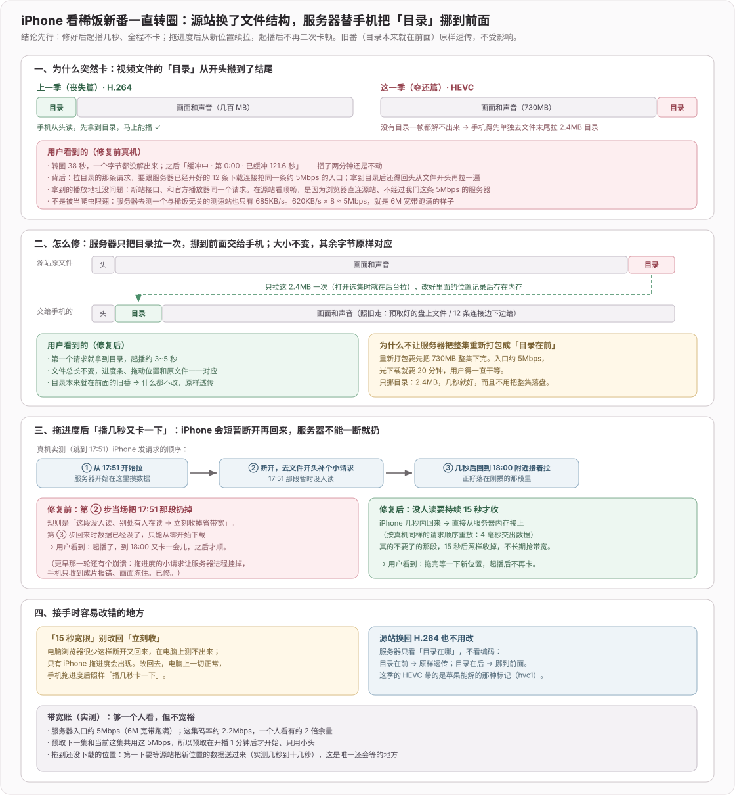

# 在线观看（2026）

> 当前实现与接手顺序见 [011 - 网页版在线观看](../ideas/011-在线观看.md)。这里仅保留近期修复记录与历史入口，新提交仍按 [DEVLOG](../../DEVLOG.md) 规则追加。

## 历史入口

- [截至 09-23 的原专题记录](archive/2026-在线观看-截至09-23.md)：桌面播放器、旧网页直连/救援/预转、09-16 重写、09-17 清理、09-21～23 修复。
- [从网页版专题迁出的早期记录](archive/2026-网页版在线观看-早期记录.md)：07-21 原型、追番绑定、Girigiri、源切换和源站跳转。
- 09-28 新稀饭协议适配见 [原 011 记录](../ideas/archive/011-在线观看-历史记录.md) 开头；并非本次新增的验收结果。

## 2026-10-06 feat(web): 播放卡顿汇总上报 Sentry

**效果**：

1. 每台播放器（换集 / 换线 / 离开页面 / 切到后台时）结算一次：卡了几次、累计多久、最长一次、打开到播放按钮可点（ready）、点播放到画面走起来（startup）、跳进度后的等待（seekWaits，单独算，不混进「卡顿」）
2. 每次都打一行 `[player:client] qos …` 到服务端终端；有卡顿、ready > 15s、startup > 10s 或单次 seek 等待 > 10s 时再报 Sentry，消息固定为 `playback qos`（聚成一个 Issue，数字在 extra 里），PC 上几秒的短卡也看得到——原来只有卡满 20 秒才报
3. 断网进入「等网络恢复」时打一行 `offline t=…`，之后的同线路重挂不再查无来由

## 2026-10-06 fix(web): 修复PC网页播放起播后反复卡顿

**效果**：

1. 稀饭 mp4 点开就由服务器 12 条连接按顺序整集下到盘上，播放器要哪段从盘上答；源站合计速度高于码率时，起播后一路不卡，往回拖、拖到已下过的位置即时
2. 拖到还没下的位置：12 条连接全部转去新位置（旧位置在飞的块当场中止），攒够 1.5MB 连续数据再出第一个字节，之后不再卡；VPS 实测死神 39 集（311MB）拖到 11:40 等约 10 秒，之后一路顺
3. 整集下完后再打开 / 换签名重开都直接用盘上那份，目录（moov）也从盘上读，播放按钮不再等源站
4. 下一集预取共用同一套下载：只在没有「正在被看且没下完」的集时才拿连接，当前这集下完（实测一集约 5 分钟）之前完全不动；每人只保留最新一个预取，换番即撤

**原因**：2026-10-06 VPS 实测源站单连接只剩约 57KB/s（12 路合计约 650KB/s，这集码率约 154KB/s），512KB 一块要 9 秒、完成顺序乱。旧的内存滑窗在开头为了快起播不设闸，第一块一到就开播、下一块晚几秒才到，就是「播 1~2 秒卡几秒」；拖进度后的闸最多等 6 秒同理。不是修移动端引入的。

```text
/playlist ──▶ warmDisk：探长度，12 路从 0 起拉 256KB 块 → DATA_DIR/prefetch/<身份>.mp4.part
/stream ──▶ faststart 映射 ──▶ serveFromDisk
              │  整集在盘 ─────────────▶ 直接读文件
              │  大 Range（新位置）────▶ 挪游标、中止别处在飞的块 → 等「连续 1.5MB」(≤20s) → 边写边读
              │  小 Range（≤1MB 探测）─▶ 只插队要那几块，不挪游标
下载优先级：正在被看的集（2 分钟内有读取）> 预取的下一集
```

**关键代码**：

- 媒体身份去掉签名参数（`disk.ts mediaKey`）：签名一换就当新文件的话，整集在盘也会重下一遍（测试实测第 40 集重开又「开始落盘 174MB」）。换签名后第一次复用在后台核一次总长度，对不上删掉重下

```ts
export function mediaKey(url: string): string {
  const u = new URL(url)
  return u.host + u.pathname
}
```

- 只有最新的大 Range 能挪下载游标（`latestReader`）：PC Chrome 拖进度后旧连接还挂在旧位置等数据，两边都能挪游标就来回抢，新位置攒不起领先
- 重试预算一份、按时间算：4xx/5xx 立即整集作废并把原因交给播放器；传输中断的块冷却 3 秒换连接再拿，连续 60 秒一块都没成才判源站不通（`TRANSPORT_GIVEUP_MS`）

**边界**：

- 拖到未下位置的等待由源站速度决定（约「一块的耗时 + 攒 1.5MB」）；源站合计速度低于码率时仍会卡，这是物理下限
- 服务器 → 观众还受 VPS 出口约 6Mbps 限制，整集在盘时拖进度画面动起来也要 2~5 秒（测试经 SSH 隧道实测）
- 未完成的 `.part` 不跨重启（「哪些块已到」只在内存）；超过 1.5GB 或探不到长度的文件仍走 `stream.ts` 内存会话
- 旧预取按整条 URL 哈希存的文件认不出来，按 4GB 回收目标自然淘汰

## 2026-10-03 fix(web): 修复移动端站内播放稀饭动漫不起播



**效果**：iPhone Chrome 在站内看稀饭新番（实测 Re:Zero 第四季 夺还篇）起播约 3~5 秒、全程不卡；拖进度后从新位置续拉，起播后不再二次卡顿。目录本来就在文件开头的旧番原样透传，不受影响

**原因**：这一季的 mp4 把目录（moov）放在 730MB 文件的末尾，上一季在开头。手机没有目录解不出任何一帧，得先单独去文件尾拉 2.4MB，这条请求还要跟服务器已开的 12 条下载连接抢约 5Mbps 的入口。播放地址本身没问题：用的是新站 `issue-web-playback`，和官方播放器同一个 `fallback` 请求

**关键决策**：

- `web/server/player/faststart.ts`：目录在尾部时，服务器把尾块只拉一次，给 `stco/co64` 里每个块偏移加上尾块长度，放到 mdat 前从内存答；其余区间偏移减尾块长度，映射回原文件，底下照旧走预取盘 / 12 路会话。文件总长不变，拖动位置一一对应。拉 playlist 时就在后台拉尾块
- 底层会话不认 Range 终点、总吐到原文件末尾，也就是已经挪走的尾块，所以映射层要按长度截断。透传分支交出的是 undici 的 Node 流（只是类型写成 Web 流），要先 `Readable.toWeb` 再读。第一版没转，真机拖进度时抛错，留下一条没人消费的上游响应；源站断开连接时进程崩溃，手机只收到成片 502
- `web/server/xifan/stream.ts`：区间没有读取端要持续 15 秒（`ABANDON_GRACE_MS`）才收。iPhone 拖进度后会断开、去文件开头补一个小请求，几秒后在原位置附近重连。原先「没人读、别处有人读就立刻收」会丢掉刚攒好的区间，实测跳到 17:51、到 18:00 卡一下
- `/api/player/stream` 每条请求结束打一行 `[player:req] range= status= first= sent= end=`，用来还原手机的请求顺序，在本机按同样顺序重放复现（`docs/web/网页移动端问题复现调试通用指南.md`）

**边界**：

- 服务器入口约 5Mbps（6M 宽带跑满；去测与稀饭无关的测速站也是 685KB/s，不是被源站限速），这集码率约 2.2Mbps，一个人看约 2 倍余量；预取下一集共用这条入口
- 拖到服务器还没下载的位置时，第一下要等源站送来新位置的数据，实测几秒到十几秒
- 解析失败时 60 秒内按原文件透传；`stco` 加偏移溢出 32 位时同样放弃改写
