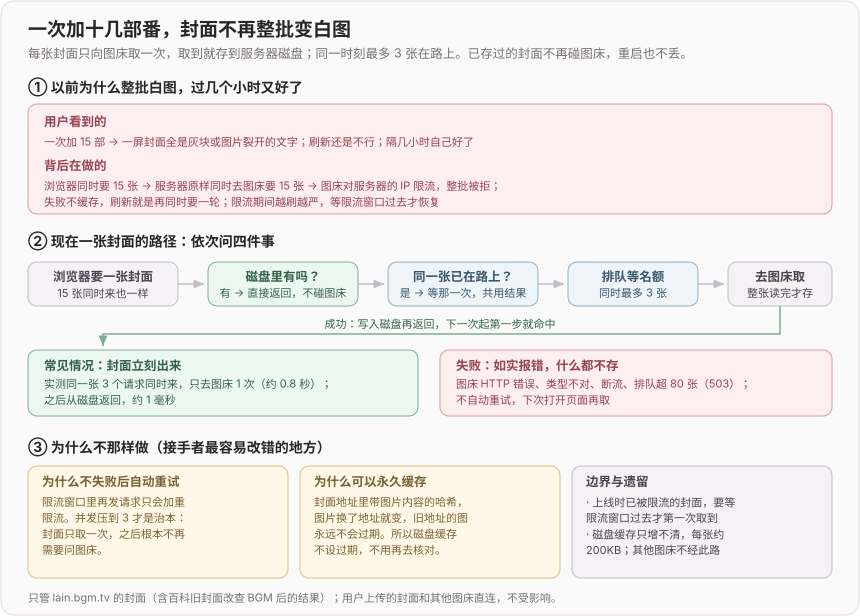
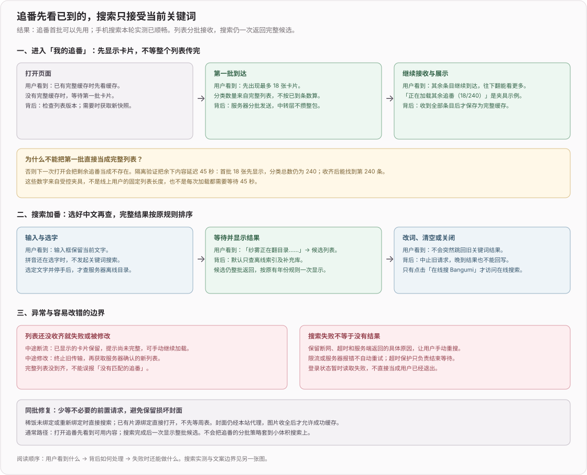
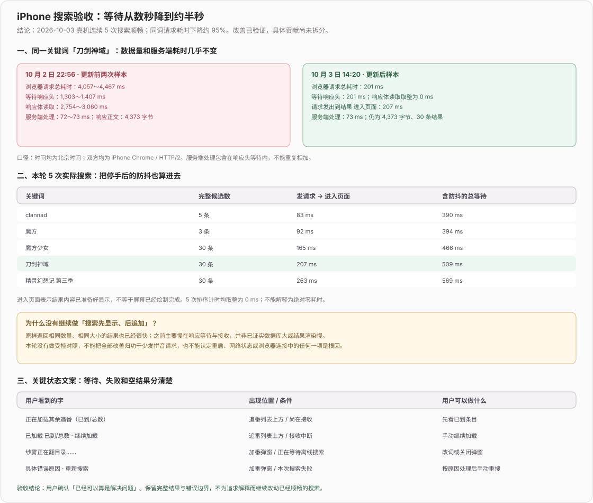

# 网页版（2026）

> 2026-10-06 收口：7～9 月已完成阶段移入归档。日常接手先看 [012](../ideas/012-网页版.md)，不用顺读旧日志；当前播放修复见 [011](../ideas/011-在线观看.md)。本次只做文档复核，不新增线上验收结论。

## 已完成阶段的结果与保留决策

| 模块 | 已落地 / 已替换 | 继续维护时保留的边界 |
|---|---|---|
| 基础与部署 | 独立 Web 子项目、周历、账号、设置、低权限 Node + HTTPS 反代 | 数据/密钥在发布目录外，监听 loopback；未知 API 返回 JSON 404，不落 SPA；旧 Oracle/serverless 选型已结束 |
| 追番与搜索 | 状态/标签/进度、手动加番、封面、公开大厅、BGM 导入、离线索引 | 本地查询默认不联网，在线搜 BGM 由用户点击；老的自动在线兜底不是现行规则；已知字段不被后台补全覆盖 |
| 多端一致性 | 服务端 revision、写入串行、生命周期读取、前台轻量校验 | 本地缓存只提速，服务端权威；整包上传事务内比较 baseRev，冲突 409；详见 [014](../ideas/014-网页版多端追番状态一致性.md) |
| 账号与邮件 | 邮箱验证码、第三方入口与配置开关 | 自动填充不是身份；已验证邮箱与提供方身份规则按当前实现区分，别照搬早期 Google 绑定表方案；见 [013](../ideas/013-邮箱快捷注册与登录.md) / [015](../ideas/015-noreply发信与第三方登录接入指南.md) |
| 点评与推荐 | 问答、草稿、发布/撤回、大厅、海报、服务器 AI/BYOK | 发布和账号公开是双门槛；草稿/问答不公开；流式要穿过生产反代验证，海报 blob 需 CSP 放行；见 [017](../ideas/017-网页版推荐与点评助手.md) |
| Agent | 历史/压缩、受控循环、来源、访客、外部 AI、追番与播放动作 | 模型提案不等于执行；用户确认与权威回执独立，阶段 9 尚待总验收；见 [018](../ideas/018-Agent助手.md) / [019](../ideas/019-Agent架构复盘.md) |
| 备份恢复 | ZIP/JSON 导入；ZIP、ZIP+Markdown、Markdown 导出 | 按更新时间合并，不删除备份缺项；他人备份只导追番；Markdown 只供阅读；下载短效票据兼容下载插件，不仅靠 Cookie |
| 放映福利 | 积分、邀请、兑换和扭蛋页面 | 唯一请求号避免重扣；播放名额已移除但福利未删，权益后续用途仍待定，见 [016](../ideas/016-慢源优先观看与抽奖营销.md) |
| 画稿界面 | 周历显影、登录遮脸、追番勾选取代旧静态布局阶段 | 装饰主要在 PC 展示；旧“设置/福利渐进上色”已撤；追番勾选按 updatedAt，改标签也可能算“动过”，不是已看片数证明 |

## 尚未关闭的事项

- 10-04 列表/搜索已有真机历史验收，但首次渐进列表收齐前不能缓存成完整快照；中断保留已收内容、显式继续加载。继续修复保留取消和代次校验。
- Agent 长历史压缩质量、其他 BYOK、生产反代/真实平板的整体验收未被阶段实现自动覆盖；反馈 SMTP 到达与手动截图上传待验，见 [用户反馈](../ideas/用户反馈.md)。
- GitHub 09-12 记录只覆盖隔离接口与 UI：当时未配置真实凭据、未真授权、未部署。本轮未验证后续线上配置，不能据日志断言今天已启用。
- 桌面↔Web 同步当前另有未提交代码改动，不并入本次文档整理；WebDAV 定期备份原待办仍未确认完成。

## 原始记录（仅特殊追溯时阅读）

- [2026-09-网页版-功能与界面](archive/2026-09-网页版-功能与界面.md)
- [2026-09-网页版-Agent](archive/2026-09-网页版-Agent.md)
- [2026-08-网页版-下半月](archive/2026-08-网页版-下半月.md)
- [2026-08-网页版-上半月](archive/2026-08-网页版-上半月.md)
- [2026-07-网页版-建设期](archive/2026-07-网页版-建设期.md)

- [早期在线观看记录](archive/2026-网页版在线观看-早期记录.md)；后续播放日志统一写[在线观看专题](2026-在线观看.md)。

## 本轮文档整理

2026-10-06：拆出原始阶段日志，当前区只留功能结果、关键取舍、未关闭事项及近期记录；关联 ideas 同步收口，原始正文完整保留。后续新日志仍按根 DEVLOG 的提交规范追加，不把“归档”解释为“全部验收完成”。

## 2026-10-07 fix(web): 修复一次加多部番时封面整批加载失败

**修改后效果**：一次加十几部番，封面不再整批变灰块或裂图。每张 BGM 封面只向图床取一次，取到后存进服务器磁盘，之后（含重启、重新部署后）直接从磁盘返回，不再碰图床。

**关键决策**：
- 原因是封面代理 `/api/cover/*` 没有缓存也不限并发：浏览器同时要十几张，服务器原样同时打到 `lain.bgm.tv`，图床对服务器 IP 限流，整批失败；失败不缓存，刷新又是新一轮并发，所以越刷越不好，过几小时限流窗口过去才恢复。这是根据症状的推断，没有抓到线上的上游状态码。
- 取图逻辑抽到 `server/bgm/cover-proxy.ts`：磁盘缓存（`$DATA_DIR/bgm-cover-cache`，在部署目录外）→ 同一张在途请求共用 → 最多 3 个并发、排队上限 80（超出 503）→ 整张读完才写盘（先写临时文件再改名）。
- 不做应用层自动重试，失败原样返回具体原因（上游 HTTP 状态、类型不符等）并打日志，符合 AGENTS 对限流的规定。
- 磁盘缓存不设过期：封面地址带图片内容哈希，图换了地址就变。

**边界 / 风险**：
- 上线时已经被限流的封面，要等限流窗口过去才第一次取到，之后才不再受限流影响。
- 磁盘缓存只增不清，每张约 200KB；追番数量增长时需要留意 `bgm-cover-cache` 的体积。
- 在途去重和排队名额在进程内存里，重启后清零，多实例各算各的。
- 只验证了脚本层：同一张 3 个并发请求只去图床 1 次，第二次约 1 毫秒从磁盘返回。没有在浏览器和线上实测。
- 前端 `coverUrl` 未改；百科旧封面经 `/api/subject-cover/:id` 重定向后同样走这条代理。

## 2026-10-04 perf(web): 优化追番列表加载和手机搜索体验

**效果**：我的追番首次加载时先显示已收到的卡片，其余条目继续传输；已有完整缓存时先显示缓存，再校验版本。加番搜索在中文选字结束后才发请求，改词、清空或关闭弹窗会取消旧搜索，旧结果不能覆盖新词；重复点击当前搜索页签也不会再永久转圈。2026-10-03 的 iPhone Chrome 真机验收中，5 次搜索从停手到结果进入页面为 390～569 ms，用户确认「已经可以算是解决问题」

**关键决策 / 数据流**：

- **列表分批接收，页面分批展示**：首次无完整缓存时采用 NDJSON 快照，首批最多 18 条并携带完整分类计数，后续继续发送；响应显式设置 `X-Accel-Buffering: no`，避免上线后被 Nginx 攒成整包。页面先渲染 18 张卡片，滚动时继续增加展示数量；传输顺序通过条目索引还原，不把首批计数冒充完整列表计数
- **半份列表不进入完整缓存**：只有收齐并校验通过的快照才保存。中途断流保留已显示内容，显示已加载数量和「继续加载」；尚未收齐时，筛选未命中也不能宣称列表中没有这部番。加载中发生修改会中止旧流，重新取得服务器确认的新快照，避免旧数据覆盖刚改的进度或标签
- **搜索保持完整结果与既有排序**：默认只查服务器离线索引及共享补充库，只有用户点击「在线搜 Bangumi」才访问在线搜索。输入保持 300 ms 防抖，拼音组合期间不发送关键词请求；取消请求之外还保留请求代次校验，防止晚到结果回写。搜索仍一次返回整批候选，按原有年份规则排序，不照搬追番列表的分批追加策略
- **失败要有明确终点和原因**：响应头与响应体共用请求截止时间，保留断网、超时及服务端错误原因，提供手动重新搜索；429/5xx 不自动重试，也不伪装成零结果。登录状态读取失败不直接广播退出，仅明确的 401 清除登录身份。超时保护负责结束等待，不作为搜索提速的证据
- **减少片源前置等待，避免缓存残缺图片**：稀饭未绑定及重新绑定直接进入搜索；已有稀饭 / Girigiri 绑定直接返回，不先等待周表。封面仍由本站代理，完整读完图片字节才返回成功缓存头，并更新封面缓存版本。同步调整手机端相关弹窗的布局
- **把浏览器阶段落到服务端日志**：按请求 ID 关联服务端处理与浏览器等待响应头、读取响应体的耗时；搜索补充输入等待、排序及 React DOM 提交计时，快速样本也上报，便于和慢样本比较。被用户取消的旧搜索不再记成失败；日志不只留在浏览器控制台。

**边界 / 还未确定的部分**：本轮真机体验与日志支持问题已解决，但前后不是网络条件严格一致的受控对照，尚不能拆分减少拼音请求、服务重启、网络状态及浏览器连接状态各自的贡献。此前的数秒等待集中在响应等待与接收，不能据此认定离线数据库规模或渲染是根因，也不能把全部改善归功于某一项改动。搜索现已整批返回且使用顺畅，未再增加渐进搜索或自动重试机制
