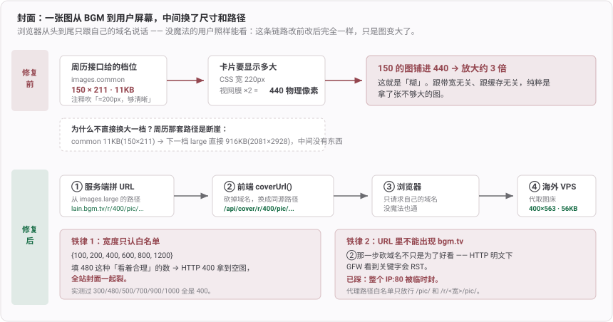
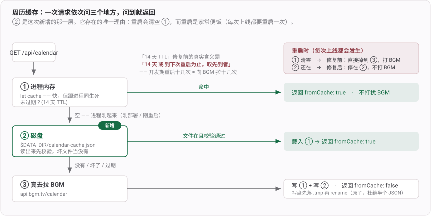
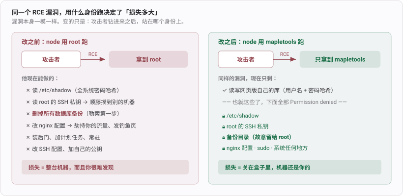
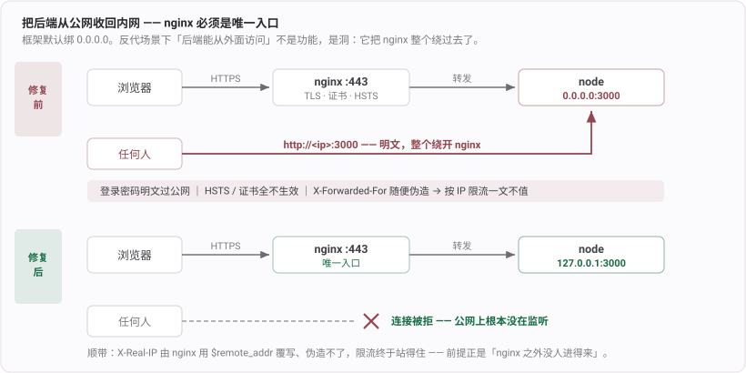
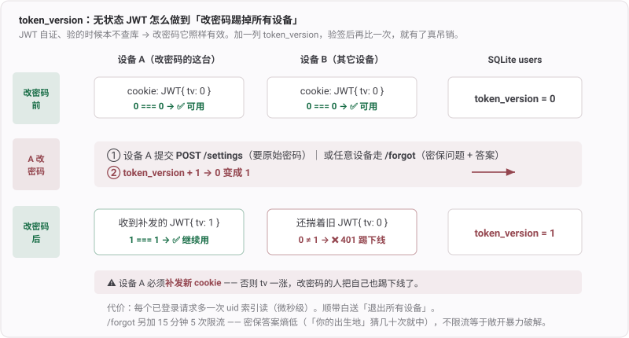
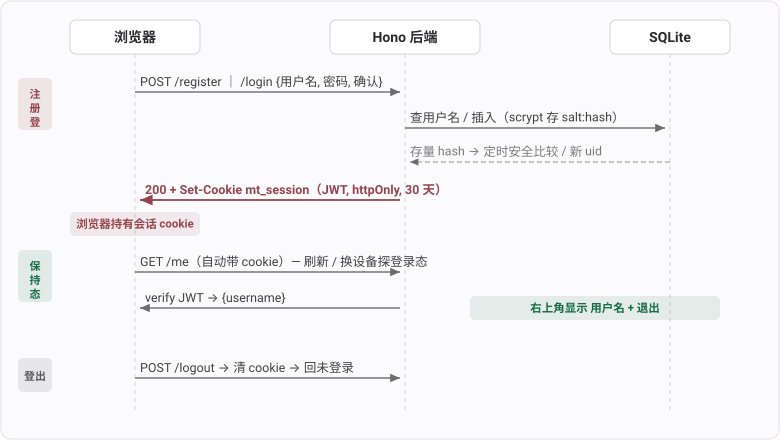

# 2026-07-网页版-建设期

> 2026-10-06 归档。原提交结果与验证范围；后续记录可能推翻早期结论。日常入口：[网页版摘要](../2026-网页版.md)，当前功能见 [012](../../ideas/012-网页版.md)。

## 2026-07-24 fix(sync): 修复追番星期、封面与拉取顺序

**效果**：

1. 从桌面端上传的本季追番可识别每周更新日
2. 外站封面不再误走 BGM 图床代理，手动添加的封面可以正常显示
3. 从网页版拉取后按桌面端原始添加顺序还原，不再被云端更新时间打乱
4. 桌面端手动条目可直接选择每周更新日

## 2026-07-24 fix(sync): 修复桌面端追番同步报错 404

**效果**：

1. 设置页可登录 MapleTools 网页版账号，登录后「我的追番」出现网页版上传 / 拉取入口
2. 同步沿用服务端 `tracks_rev` 冲突保护；两端都有改动时必须二次确认，旧 rev 上传返回 409 且不写入
3. 网页公共字段与 app 富字段分层传输，绑定、鉴赏神回、备注、小说进度和「观望」状态同步往返不丢
4. 坚果云手动同步入口保留为独立备份通道，不与网页版 rev 混用

```
renderer 追番记录 → 公共字段（网页可编辑）+ extra（app-only）
                  → 主进程持 JWT → /api/tracks/sync
```

## 2026-07-23 feat(web): 新增追番同步功能

**效果**：

1. 服务端新增 app 同步追番的能力
2. 网页实时直连、app 手动覆盖式拉取 / 上传

```
GET  /api/tracks/sync → { rev, data:[...含 extra] }
POST /api/tracks/sync → { baseRev, force?, data } → baseRev 对不上 = 409，一个字节都不写
```

## 2026-07-23 fix(web): 优化索引同步日志显示

**效果**：

1. 上游档要是出了半份，同步**不会**再把好索引换掉
2. 每周的同步任务挂了，加番弹窗里会直说「索引已 N 天没更新」

```
新库条数 < 上次 90%  →  删 tmp、不 rename、exit 1（cron 日志留痕）
                     →  确认无误要强推：--force
```

## 2026-07-23 feat(web): 搜索兜底在线补充

**效果**：

1. 搜本周刚上架、本地索引还没收录的新番也能搜到了 —— 本地一条都搜不到时，自动退回一次 BGM 在线搜。
2. 结果如实标来源：在线补上来的那批，列表顶上写「本地索引里没有，以下是 BGM 在线补充」。
3. 补不上也说人话：「BGM 限流了，过会儿再试」/「连 BGM 超时了」/「在线补充暂停中，约 N 分钟后恢复」，不糊成「网络请求失败」。

```
本地有结果 → 根本不进来（路由层保证：local.length 非 0 就 return）
├ 缓存命中（30min，含空结果）→ 不联网
├ 冷却中（连挂 3 次 → 停 10min）→ 不联网
├ 超每小时 40 次 → 不联网
├ 距上次不足 2s → 不联网（不排队：让用户干等不如让他改个词）
└ 打一次，失败不重试
```

## 2026-07-23 feat(web): 追番新增搜索功能

**效果**：

1. 追番不再只能从周历（当季）加 —— 新增「加番」搜索，覆盖 **BGM 全量约 3 万部动画**：老番 / 剧场版 / 往季都搜得到（2007 的 sola、辉夜大小姐全季…），搜到即加。
2. **搜索全程本地、零 BGM 在线请求** —— 搜的是本地 SQLite 索引（数据来自 BGM 官方离线档，每周同步一次，见下）。
3. **模糊匹配**：只记大概名字也搜得到（搜「漫画咖啡厅」出「漫画咖啡屋」），像 BGM 那样按共享片段排。
4. 加番自动补封面 + 标签（离线档没封面，加番时那一次 detail 顺带取，填进新追番）。

**数据来源**：BGM 官方数据档（`bangumi/Archive`，每周三更新，419MB zip）。`scripts/build-bgm-index.ts` 下档 → 流式解压取 `subject.jsonlines` → 只留 `type=2`（动画）→ 灌进**独立只读** `bgm_index.db`（原子替换；搜索端按 mtime 变化自动重开，不必重启）：

```
扫 65.8 万条 subject → 收录 3.05 万部动画（索引仅 5.6MB）
```

**模糊搜索**（`anime-index.ts`）—— 查询拆 **CJK 相邻二元组**、按命中片段数排，就软了：

```ts
// 漫画咖啡厅 → [漫画,画咖,咖啡,啡厅]；「漫画咖啡屋」共享 漫画/画咖/咖啡 三个 → 浮上来（拉丁词整段不拆）
const grams = queryGrams(q)
// WHERE 任一片段命中；ORDER BY 精确 > 前缀 > 整串子串 > 部分命中, 再按命中数、BGM 评分
```

搜索**只是查询层改动、不动索引**。加番默认「想看」；封面取 detail 的 `images.large`（前端 `coverUrl` 改写成 `/api/cover` 代理）。

**索引更新**：落在数据目录 `/opt/mapletools-data/bgm_index.db`，上线后先手跑一次，之后 cron 每周四（档周三更新，留一天余量）：

```bash
su -s /bin/bash mapletools -c 'cd /opt/mapletools/web && DATA_DIR=/opt/mapletools-data npm run sync:index'
```

- `DATA_DIR` **必须显式给**：那是 pm2 配置里的变量，cron / 手敲的 shell 不继承，漏了就写进部署目录里、线上永远读不到。
- 跑的时候**站点不用停也不用重启 pm2**（写 `.tmp` → rename 原子替换 → 服务端按 mtime 自动重开句柄）。
- `/api/search?q=` 空查询只回 `{ready,total,builtAt}`，当「索引同步到哪天了」的健康检查。

## 2026-07-17 feat(web): 新增我的追番

**效果**：

1. **周历卡片上能追番了**：hover 海报 → 右上角「＋追番」；已追的**整卡描边高亮**，逛周历一眼看出哪些在看。未登录不显示这个按钮。
2. **新增「我的追番」页**（`#/tracks`）：卡片墙 + 「今天更新」置顶分组（只算「在看」且今天放送的）。全部 / 在看 / 想看 / 看完四个 tab，搜索（**标题 + 别名**）、类型过滤（弹窗多选、按钮角标显示选了几个）。
3. **点封面开编辑弹窗**：改状态 / 进度 / 总集数 / 自定义标签，**没有保存按钮，改完即生效**。BGM 带来的标签不可编辑，自定义标签点一下删。
4. 进度 +/- 直接做在卡上。**在线观看按钮先占位置灰** —— 播放页还没做，位置是 `CalendarPage.tsx` 原注释就留好的。
5. 沿用 app 的既定语义：`totalEpisodes == null` = **连载中**（不是 0），徽章即手填入口；进度推满**不**自动切「看完」（用户填 12 不一定是看到 12）；只有「想看」首次 +1 自动转「在看」。

**关键代码**：

**写入一律「字段级 patch」，绝不整条替换**（ideas/012 的同步铁律）。现在还没接 app 同步，但这条从第一天就得立住，否则将来 app 推富记录过来会被 web 的瘦数据抹掉。body 里没给的字段**保持沉默、原样不动**：

```ts
// server/tracks.ts —— 只写 body 里明确给了的字段
if ('episode' in body) { sets.push('episode = ?'); args.push(...) }
if ('userTags' in body) { ... }
// 没给 → 那一列压根不进 UPDATE 语句
```

表结构同理为同步留好位置：瘦列（status / episode / 标签…）供 web 查询展示，`extra` JSON 列存 app-only 字段（goodEpisodes / bindings…）**原样过服务器往返**，现在空着但列先建好，将来接同步不用改表。

周历接口**不返标签也不返别名**，只有条目详情有 —— 没有这一步「按类型过滤」永远是空的、搜别名也搜不到。所以加追番后异步补一次 detail（服务端版的 app `ensureBgmTagsFilled`），三个细节都照抄 app：

```ts
// server/tracks.ts —— 抖动 800-2000ms 再发（防连点打出一串请求）
const jitterMs = 800 + Math.random() * 1200
setTimeout(() => {
  const recheck = oneStmt.get(uid, bgmId)          // ← 发前二次检查：这段时间用户可能已取消追番
  if (!recheck || parseList(recheck.bgm_tags).length > 0) return
  const d = await fetchSubjectDetail(bgmId)        // ← 一次请求同时拿回 标签 + 别名 + 放送日期
  // 不动 updated_at —— 这是系统回填，不是用户操作，不该影响「后写者胜」
}, jitterMs)
```

## 2026-07-17 fix(web): 番剧周历封面太糊

**效果**：

1. **周历封面从 150×211 换成 400×563**（11KB → 约 56KB）。原来取周历自带的 `images.common`，注释写「≈200px，卡片够清晰」——实测只有 **150×211**；卡片约 220px，在视网膜屏上是 440 物理像素，等于把 150 的图放大 3 倍，糊得没法看。
2. 全量 112 部约 5.8MB（原 1.2MB），但卡片是 `loading="lazy"`，实际只加载视口内那十几张 ≈ 1MB 上下。**注意周历的 14 天缓存只缓存 JSON，图片不经它**——图片挡在浏览器缓存（`immutable` 30 天）后面，服务器这边每个新访客的首屏都要真代取一次。
3. **没魔法的用户不受影响**：浏览器请求的仍是同源的 `/api/cover/...`，由海外 VPS 代取，链路改前改后一样。



**关键代码**：

周历那套老式路径没有中间档：`common` 之上直接跳到 `large`（2081×2928、916KB），只能改走图床的实时缩放接口 `/r/<宽>/pic/...`（底图就是 large）。**宽度只认白名单 `{100, 200, 400, 600, 800, 1200}`，填 480 这种看着合理的数会 HTTP 400 拿到空图、封面全裂**：

```ts
const COVER_WIDTH = 400
const m = (images.large ?? '').match(/^https?:\/\/[^/]+(\/pic\/.+)$/)
if (m) return `https://lain.bgm.tv/r/${COVER_WIDTH}${m[1]}`
```

封面代理原来只放行 `/pic/` 前缀，新形态是 `/r/400/pic/...`，白名单要跟着放宽——但仍然只认 `pic/` 那一段，不放行图床上的任意路径：

```ts
const COVER_PATH_RE = /^\/(r\/\d{2,4}\/)?pic\//
```

## 2026-07-17 fix(web): 番剧周历缓存丢失

**效果**：

1. **周历的 14 天缓存现在落盘**（`$DATA_DIR/calendar-cache.json`），重启后还在。之前缓存是进程内的 `let cache`，跟进程同生死 —— 而每次上线更新都要重启一次，于是「14 天 TTL」实际上是「14 天或到下次重启为止」，等于没有。开发期重启十几次就等于向 BGM 拉十几次。



**关键代码**：

`DATA_DIR` 的解析从 `db.ts` 抽到新的 `server/data-dir.ts`。不直接从 `db.ts` 导出，是因为 `calendar.ts` 只要那个目录，为此 import `db.ts` 会把 `better-sqlite3`（原生模块，`vite.config.ts` 里标了 `ssr.external`）拖进周历的 import 图。

写盘先落临时文件再 `rename`——直接覆盖会在崩溃 / 满盘时留下半个 JSON，之后每次启动都读到坏文件；同分区 `rename` 是原子的，要么旧的要么新的：

```ts
const tmp = `${CACHE_FILE}.${process.pid}.tmp`
writeFileSync(tmp, JSON.stringify(entry))
renameSync(tmp, CACHE_FILE)
```

## 2026-07-17 chore(web): 降低后端为低权限

**效果**：

1. **后端不再用 root 跑**（见下图）。改用专用低权限用户 `mapletools`（系统账号、密码位锁死、无 authorized_keys，登不进来）。原来是 root：万一后端出 RCE，攻击者拿到的直接就是整台机器 —— 读 SSH 私钥顺藤摸到别的机器、删光备份、改 nginx 劫持流量。现在同样的漏洞只能拿到「读写网页版自己那个库」，`/etc/shadow`、root 的 `.ssh`、备份目录、nginx 配置、`sudo` 全部 `Permission denied`。
2. **备份目录故意留给 root**（`/opt/mapletools-backup`，700 root:root）。应用用户读不到也删不掉 —— 勒索软件第一步就是毁备份，备份和它保护的东西不能待在同一个权限域里。
3. **新增 [`docs/术语.md`](../../术语.md)** —— RCE / 权限隔离 / 纵深防御 这些词的速查，只收这个项目真碰到过的。



**关键代码**：

应用换用户后，pm2 守护进程是**按用户各一份**的 —— root 敲 `pm2 list` 会是空的。正确命令得 `su` + **`cd`**，而少了那个 `cd` 会报一个指向 node 的假错误（`spawn /usr/bin/node EACCES`，其实是 cwd 继承了 root 的 `/root`、700 进不去）。这种东西靠文档提醒人早晚出事，焊进 `/usr/local/bin/mtweb`：

```bash
exec su -s /bin/bash mapletools -c "cd /opt/mapletools/web && pm2 $*"
```

root 的 cron 备份会**悄悄夺走库文件属主**：root 打开 SQLite 时若 WAL/SHM 不存在，会新建成 root 所有，应用从此写不了自己的库 —— 而且要等到凌晨 4 点之后才爆。备份脚本末尾补一行：

```bash
chown mapletools:mapletools /opt/mapletools-data/web.db{,-wal,-shm}
```

## 2026-07-17 fix(web): 堵住能绕过 HTTPS 的后端直连端口，登录加限流

**效果**：

1. **公网直连 `:3000` 关掉了**（见下图）。node 之前绑 `0.0.0.0` 且服务器没防火墙，`http://<ip>:3000` 从公网直接通 —— nginx 白装：登录密码明文过公网、HSTS/证书全不生效、`X-Forwarded-For` 随便伪造。改成只绑 `127.0.0.1`。
2. **登录 / 注册加了限流**。原来只有 `/forgot` 有 —— 因为密保答案熵低、想得到；`/login` 反而裸奔，连打错密码只会一直 401，从不 429。现在登录按 **IP 20 次 + 账号 10 次 / 15 分钟**双维度挡，注册按 IP 5 次/小时。
3. **数据库有备份了**。每天 04:00 `sqlite3 .backup` + gzip、留 14 天；库文件权限 `644 → 600`。之前线上有真用户数据、零备份。
4. **nginx 补了 HSTS + nosniff + X-Frame-Options + Referrer-Policy**。
5. **设置页「已保存」不再把整行按钮顶下去**，改成占按钮右边的常驻空位。删掉一批自曝式文案（数据存哪、为什么不回显问题、周历缓存多久…）—— 界面自明的东西再解释一遍只剩噪音，理由写进 docs 就够。
6. **补上了实际在用的部署文档**：`docs/web/唐人云部署保姆教程.md`。`docs/web/` 之前只有 Vercel 和 Oracle 两份**备选**方案的教程，真正在跑的这套（git pull + pm2 + nginx + certbot）反而没有，换机器就得从头摸。



**关键代码**：

限流的 IP 只能认 `X-Real-IP`。`X-Forwarded-For` 是**追加**的（`$proxy_add_x_forwarded_for` 把真 IP 拼在客户端伪造值的**后面**），所以退化时要取最后一段；而 `X-Real-IP` 被 nginx 用 `$remote_addr` 整个覆写，伪造不了。这两个头可信的前提，正是效果 1 那条 —— nginx 之外没人进得来：

```ts
// server/node.ts —— 默认绑回环，要裸跑再显式给 HOST
const hostname = process.env.HOST || '127.0.0.1'
serve({ fetch: app.fetch, port, hostname }, …)

// server/auth.ts
function clientIp(c: Context): string {
  const real = c.req.header('x-real-ip')
  if (real) return real
  return c.req.header('x-forwarded-for')?.split(',').pop()?.trim() || 'local'
}
```

登录两个维度都要挡，且**放在 `verifySecret` 之前** —— scrypt 很吃 CPU，先限流顺带挡住拿登录接口打 CPU 的玩法。成功后要清账，否则用户自己打错几次的额度会留着替攻击者扣：

```ts
const ipKey = `login-ip:${clientIp(c)}`
const userKey = `login-user:${username.toLowerCase()}`
// 只按账号挡不住「换着号猜」，只按 IP 挡不住「多 IP 盯一个号猜」
if (rateLimited(ipKey, LOGIN_MAX_PER_IP, WINDOW) || rateLimited(userKey, LOGIN_MAX_PER_USER, WINDOW)) {
  return c.json({ error: '尝试次数过多，请 15 分钟后再试' }, 429)
}
const ok = row ? await verifySecret(password, row.pass_hash) : await verifySecret(password, 'x:x')
if (!row || !ok) return c.json({ error: '用户名或密码错误' }, 401)
buckets.delete(ipKey); buckets.delete(userKey)   // ← 登录成功即清账
```

## 2026-07-16 feat(web): 顶栏导航 + 设置页 + 找回密码

**效果**：

1. **顶栏导航**取代原来塞在周历页右上角的登录入口 —— app 是侧边栏（桌面应用的语言），网页的惯例是顶栏，这里不照搬 app。左边品牌 + 「番剧周历」，右边未登录 = 「登录 / 注册」，已登录 = 用户名 chip → 下拉（设置 / 退出）。周历页的面包屑一并去掉：顶栏已经指明在哪，再来一层是冗余。
2. **设置页**（`#/settings`）：左栏身份卡 + 模块导航（个人信息 / 账号安全，「追番偏好 / 数据同步」占位待开发），右栏模块面板。加了 20 行 hash 路由 —— 只有两个页面，引 react-router 不划算，但纯 state 会让地址栏不变、设置页刷新就回周历也收藏不了。
3. **找回密码**：账号 + 密保问题 + 答案 + 新密码。密保问题走**预设下拉**而不是自由填写 —— 自由填写找回时要一字不差重打一遍（没人记得住），按用户名把问题显示出来又等于泄露给任何知道你用户名的人；预设下拉两头都躲开。**问题和答案设置后都不回显**，只报「设没设」（问题本身也是秘密，泄露了等于告诉别人该去查什么）。答案跟密码同样走 scrypt 哈希、比对前 trim + 转小写。
4. **账号安全设置**：新密码留空 = 只改密保。改密码和改密保**两条路都强制验原始密码** —— 否则别人借你没锁屏的电脑就能悄悄把密保换成自己的，从此随时能接管账号。
5. **改密码 / 找回密码现在能真正踢掉所有设备**（见下图）。用户名上限 20 → **12**（顶栏 chip 按内容伸缩，12 个中文 ≈ 205px 放得下，20 个会到 ≈305px）。密保没设时登录后给一条提示条引导去设置（不强制）。



**关键代码**：

无状态 JWT 默认**没法吊销** —— 它自证，验的时候不查库，所以改了 `pass_hash` 那张老 token 照样有效。加一列 `token_version` 塞进 payload，验签后再比一次，就有了真吊销：

```ts
// server/auth.ts —— 验证时多比一次 tv
export async function getSession(c: Context): Promise<Session | null> {
  const payload = (await verify(token, SECRET, 'HS256')) as unknown as Session
  const row = findById.get(payload.uid) as UserRow | undefined
  if (!row || row.token_version !== payload.tv) return null // ← 改过密码 → 老 token 当场作废
  return { uid: row.id, username: row.username, tv: row.token_version }
}

// 改密码 → tv+1 让所有老 token 失效，但得给本机补发，否则自己也被踢下线
bumpPassword.run(await hashSecret(next), s.uid)
const fresh = findById.get(s.uid) as UserRow
await issueSession(c, { uid: fresh.id, username: fresh.username, tv: fresh.token_version })
```

自绘下拉 `Select.tsx` 把 `AGENTS`「UI/样式」新增的两条固化成组件（原生 `<select>` 展开是系统弹层跟设计系统无关；浮层宽度要对齐触发器）——顶栏用户名 chip 的下拉同一套做法：外层 `relative` 收缩包裹，浮层 `w-full` 自动跟触发器同宽，用户名多长下拉多宽。

```tsx
<div className="relative">
  <button className="w-full …">…</button>
  <div className="absolute left-0 w-full …">…</div>   {/* ← 100% = 触发器宽 */}
</div>
```

## 2026-07-15 feat(web): 新增注册 / 登录

**效果**：

1. 网页版加**开放注册 + 登录**：注册（用户名 + 密码 + 确认密码）/ 登录（用户名 + 密码）/ 登出；会话是 httpOnly 签名 cookie，刷新 / 换设备自动保持登录态。数据落**本地 SQLite**（`better-sqlite3`），用户名大小写不敏感唯一，密码 **scrypt** 哈希（Node 内置，不加依赖）。
2. 登录入口**融入周历页右上角**：未登录 = 「登录 / 注册」按钮 → 弹窗（压在暗化周历上、MD3 卡片、登录 / 注册分段切换）；已登录 = 用户名 chip + 退出。**周历本身公开**，登录只是附加层（app 版没有账号，这是网页版独有）。



**关键代码**：

密码 scrypt 存 `salt:hash`、校验走定时安全比较（防时序侧信道）；会话不建 session 表，直接签 JWT 进 httpOnly cookie：

```ts
// server/auth.ts
async function hashPassword(pw: string) {
  const salt = randomBytes(16)
  const derived = (await scryptAsync(pw, salt, 64)) as Buffer
  return `${salt.toString('hex')}:${derived.toString('hex')}` // 存 salt:hash
}
// 登录 / 注册成功 → 签发会话 cookie
const token = await sign({ uid, username, exp }, SECRET, 'HS256')
setCookie(c, 'mt_session', token, { httpOnly: true, secure: PROD, sameSite: 'Lax', maxAge: 30 * 86400 })
```

DB 文件位置有部署铁律：必须放 `/opt/web` 之外（部署一条龙 `rm -rf /opt/web` 会清空），生产走 env `DATA_DIR=/opt/mapletools-data`、dev 落 `web/data/`；上线还要设 `AUTH_SECRET`（JWT 密钥）。详见 `docs/ideas/012-网页版.md`。

## 2026-07-15 fix: 修复封面无法显示问题

**效果**：

封面代理从「查询参数带完整图床 URL」（`/api/cover?u=https://lain.bgm.tv/...`）改成**路径式** `/api/cover/pic/...`：前端把图床 URL 的路径拼到 `/api/cover` 后，host 由服务器写死 `lain.bgm.tv`、只放行 `/pic/`。封面 URL 里**不出现被墙域名**，国内免魔法访问时封面也能正常显示；host 写死顺带把 SSRF 面堵死。（查询参数版为什么在国内失败，见 `docs/ideas/012-网页版.md` 的「部署纪要」。）

**关键代码**：

```ts
// server/index.ts
app.get('/api/cover/*', async (c) => {
  const path = c.req.path.replace(/^\/api\/cover/, '')   // /pic/cover/c/48/4a/xxx.jpg
  if (!path.startsWith('/pic/')) return c.text('forbidden', 403)
  const up = await fetch(`https://lain.bgm.tv${path}`, { signal: AbortSignal.timeout(15000) })
  c.header('Cache-Control', 'public, max-age=2592000, immutable')
  return c.body(up.body)
})
```

```tsx
// src/api.ts —— 前端把图床 URL 重写成不含 bgm.tv 的路径
export function coverUrl(raw: string): string {
  const m = raw.match(/^https?:\/\/[^/]+(\/.*)$/)
  return m ? `/api/cover${m[1]}` : ''
}
```

## 2026-07-15 feat(web): 新增网页版 - 番剧周期表

**效果**：

1. 新增 `web/` 子项目 = 网页版（Vite + React + Tailwind 前端 + Hono 后端），**同仓库、结构隔离**：自带独立 `package.json` / `node_modules`，根 `package.json` 一行不动，app 的 tsconfig / electron-vite / electron-builder 都扫不到它 → 对 app 零影响。开发 `cd web && npm run dev`（app 仍是根目录 `npm run dev`，两者不同目录 / 不同运行时，不会混）。
2. 首个功能 **番剧周期表** 端到端跑通：前端 → Hono `/api/calendar` → 抓 `api.bgm.tv/calendar` → 渲染。设计**照搬 app 的 AnimeCalendar**（MD3 色 token / Inter+Space Grotesk 字体 / 3:4 海报卡 / `<1200px` 切「选天 + 多列网格」响应式）；图标改**内联 SVG**（弃 material-symbols 的 3.9MB 字体 —— 网页版按网络下载算这 3.9MB 太亏，app 本地读则无所谓）。
3. 抓取逻辑从 app `src/main/bgm` **拷来、只换传输层**（Electron `net` → `fetch`），app 侧零改动（见 `docs/ideas/012-网页版.md`）。
4. 服务器 / 部署定**海外香港 CN2 VPS**（阿里云大陆机实测 `curl` BGM 超时、够不着 → 走海外）；后端 Hono 一套代码本地 / Vercel / VPS 通吃（`server/node.ts` = `@hono/node-server` 服务 `dist` + `/api` 的生产入口）。

**关键代码**：

封面必须走服务器代理 —— **BGM 图床 `lain.bgm.tv` 国内被墙**，浏览器直连拿不到（国内免魔法用户封面会全裂）；由海外服务器代取，只放行 `bgm.tv` 防 SSRF，并取 `common` 小图（937KB → 11KB，省 6M 小机带宽）：

```ts
// server/index.ts
const COVER_HOST_RE = /(^|\.)bgm\.tv$/
app.get('/api/cover', async (c) => {
  const url = new URL(c.req.query('u')!)
  if (url.protocol !== 'https:' || !COVER_HOST_RE.test(url.hostname)) return c.text('forbidden', 403)
  const up = await fetch(url.toString(), { signal: AbortSignal.timeout(15000) })
  c.header('Cache-Control', 'public, max-age=2592000, immutable')
  return c.body(up.body)
})
```

传输层可挂代理 —— Node 的 `fetch`（undici）默认**不读系统代理**，跟 app 当年 Node `https` 直连 fake-ip 黑洞是同一个坑；`EnvHttpProxyAgent` 认 `HTTPS_PROXY` 环境变量（本地 Clash 非 TUN 时用得上，香港机 / Vercel 没这变量 → 直连）：

```ts
// server/http.ts
setGlobalDispatcher(new EnvHttpProxyAgent())
```
