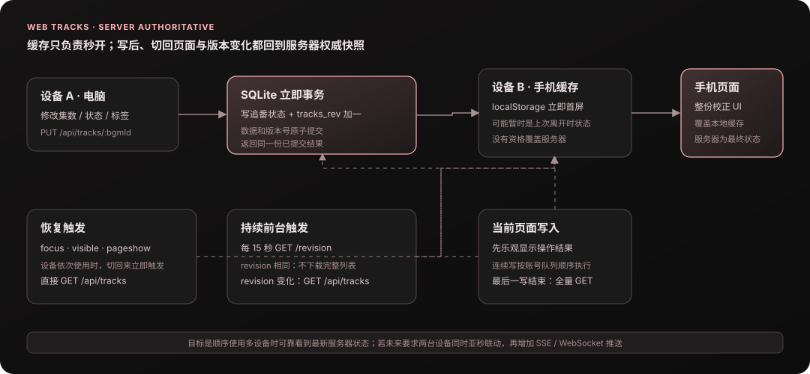
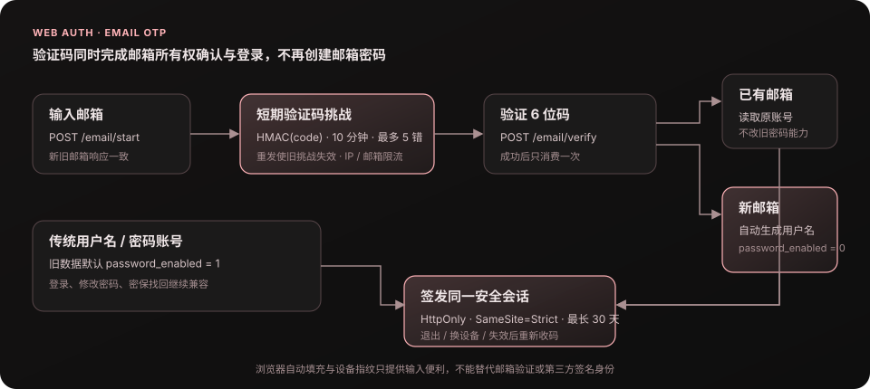

# 2026-08-网页版-上半月

> 2026-10-06 归档。原提交结果与验证范围；后续记录可能推翻早期结论。日常入口：[网页版摘要](../2026-网页版.md)，当前功能见 [012](../../ideas/012-网页版.md)。

## 2026-08-15 fix(web): 修复今天更新误收非连载番剧

**效果**：

1. 当天分组同时要求 `totalEpisodes == null`，只保留项目语义中的连载中番剧；填写了总集数的条目回到「其余」，页头今天更新数量同步减少
2. 保留「想看」中的连载番剧也能进入当天分组的既有行为；全部 / 在看 / 想看 / 看完的状态统计、搜索与标签过滤不变

**关键判定**：

```text
今天更新 = 今天放送 && 状态不是看完 && 总集数未填写（连载中）
```

## 2026-08-15 feat(web): 复用已添加番剧的 BGM 在线搜索结果

**修改前 / 修改后**：

1. 修改前：离线索引没有的新番会访问 BGM 在线搜索；结果只在当前进程保留 30 分钟，服务重启或缓存过期后，其他用户搜索同一条目仍会再次请求 BGM。
2. 修改后：搜索顺序调整为「每周离线索引 → 已成功加番的共享补充库 → BGM 在线搜索」。在线候选只有在用户真正新增进追番后才进入补充库；只搜索、添加失败或重复添加都不落盘。
3. 补充记录按 BGM ID 全局去重并长期保留。离线索引以后收录同一条目时仍优先返回离线结果，补充记录不删除，也不会被每周索引替换覆盖。

**关键数据流**：

```text
搜索：bgm_index.db 命中 → 直接返回
                     └─ 零结果 → web.db 共享补充库命中 → 直接返回
                                             └─ 零结果 → BGM 在线搜索 + 签发候选凭证

加番：验证服务端候选凭证 → 新追番与共享补充记录在同一事务写入
      无凭证 / 伪造凭证 / 已有追番 → 只执行原有追番逻辑，不写共享补充记录
```

**关键代码决策**：

1. 补充数据放进持久化 `web.db` 的全局公共表，不写入会被整体替换的 `bgm_index.db`，也不混入按用户删除和同步覆盖的追番记录。
2. 客户端不能直接提交全站共享的番剧元数据；在线结果附带由服务端签名的短期凭证，加番时验签后只写入服务端实际返回过的候选，避免登录用户伪造标题污染其他人的搜索。
3. 离线索引与共享补充表复用同一套模糊匹配和排序规则，防止两个数据层对相同关键词给出不同的相关性行为。

**边界 / 风险**：

1. 本功能减少的是重复在线搜索请求；首次加番后原有的详情补全请求仍会按既有节流规则执行，不能把它描述成所有后续 BGM 请求都消失。
2. 不回填上线前已经存在的追番；共享补充库从本功能上线后成功新增的在线候选开始积累。
3. 三级检索以离线索引正常就绪为前提；索引文件缺失时继续返回原有的 `ready=false` 运维故障状态，不用共享补充库掩盖同步或部署问题。

## 2026-08-15 docs(web): 新增二次元新波普前端设计稿

**修改前 / 修改后**：

1. 修改前：网页版沿用通用 MD3 暗色界面，页面之间能用但缺少统一、可识别的视觉主题；历史设计稿只解决局部页面或触控布局，不能约束后续整站视觉。
2. 修改后：新增一套独立可交互的整站原型，以「二次元编辑部 × 孟菲斯新波普粗野主义」统一导航、周历、我的追番、设置和登录弹窗，并用和泉纱雾主题角色素材建立固定品牌识别。
3. 原型同时覆盖桌面与窄屏布局、筛选和弹窗等真实状态，并作为后续重构的视觉基准；本次不修改 `web/src`，审查确认后再进入真实页面实现。

**关键设计决策**：

1. 用粗描边、错位硬阴影、贴纸标签和几何纹样表达新波普；主体内容仍保持稳定网格、清晰层级和足够触控尺寸，不用布局位移制造 hover 反馈。
2. 角色只承担品牌入口与空白区视觉锚点，追番封面、状态、进度和操作仍是信息主角，避免二次元装饰压过功能。
3. 原型使用本地素材并保留在 `docs/design-mockups/`，不依赖临时外链；真实项目后续必须复用同一套色彩、字体、边框、阴影和响应式规则，不能再次随意另起风格。

**边界 / 风险**：

1. 当前交付是设计审查阶段，不代表真实网页版已经重构；数据请求、账号状态和播放器行为仍以现有实现为准。

## 2026-08-15 fix(web): 多端切回页面时自动刷新追番状态

**效果**：

1. 同一账号在另一台设备修改后，旧页面重新获得焦点、从后台恢复可见或由浏览器恢复时会立即全量读取服务器；页面持续停留前台时每 15 秒只检查一次轻量 revision，变化后才拉完整追番列表。
2. `localStorage` 继续负责首屏秒开，但不参与新旧裁决；服务器快照始终是最终状态，并同时校正页面与缓存。
3. 同一账号的连续写入按用户操作顺序串行执行，避免先点的旧操作反而最后落库；队列最后一个请求无论成功或失败都会再拉一次权威快照，写入期间返回的旧 GET 与单条响应都不能长期覆盖服务器结果。

**关键数据流**：



**边界 / 风险**：

1. 本次按「设备依次使用」设计：切回页面立即刷新，持续前台页面最迟约 15 秒发现其他设备的修改；没有为小规模站点常驻 WebSocket / SSE 连接。若以后要求两台设备同时操作并亚秒显示，再单独增加服务端推送。
2. revision 只用于判断用户追番状态是否变化；恢复前台仍执行全量读取，因此不递增 revision 的系统元数据回填也能在下一次切回时显示。

## 2026-08-15 fix(web): 防止追番同步覆盖并发修改

**效果**：

1. 桌面端整包上传的 `baseRev` 比对、追番集合替换与 `tracks_rev` 递增改在同一个 SQLite 立即事务中完成；事务开始前若网页已经写入新状态，旧整包固定返回 `409`，不会再误报成功并覆盖它。
2. 网页新增、编辑、删除追番与版本号递增一并提交；删除不存在的记录不再制造虚假版本变化，接口返回的状态与 revision 对应同一份已提交数据。
3. 追番状态读写不再等待最长 4～10 秒的 BGM 详情或周历网络请求；附属元数据改为后台补空值，并在落库前重新读取，避免覆盖等待期间由同步写入的较新字段。

**关键数据流**：

```text
旧：读 baseRev → 等外部周历 → 网页 PUT + rev → 旧整包覆盖 → 仍返回 200

新：整理上传数据 → BEGIN IMMEDIATE
                    ├─ 当前 rev != baseRev → ROLLBACK + 409
                    └─ 当前 rev == baseRev → 替换集合 + bump rev + COMMIT

网页 PUT / DELETE → BEGIN IMMEDIATE → 修改记录 + bump rev → COMMIT → 返回同一版本状态
```

**边界 / 风险**：

1. `tracks_rev` 只表示用户追番状态的变更；后台补标签、别名、首播日与封面不递增它，避免纯系统元数据让桌面端上传产生无意义冲突。

## 2026-08-15 feat(web): 邮箱验证码页支持快捷打开常用邮箱

**效果**：

1. 邮箱地址步骤新增 Gmail、Outlook、QQ 邮箱与 163 邮箱后缀按钮：已有本地部分时追加或替换域名，未填写本地部分时把光标放在 `@` 前继续输入。
2. 验证码步骤按邮箱域名显示对应官方收件箱入口，并兼容 `googlemail.com`、`hotmail.com`、`live.com`、`126.com` 与 `yeah.net`；非匹配邮箱不显示错误入口。
3. 发送、重发与校验结果共用固定高度的状态位，提示变化时不再挤动提交按钮。

**边界 / 风险**：

1. 后缀按钮只补全邮箱地址，收件箱按钮也只是打开固定官网；两者都不是 OAuth 或第三方免验证登录，MapleTools 仍以收到的 6 位验证码确认身份。
2. 收件箱链接不携带邮箱地址、挑战编号或验证码，并使用新标签页隔离、禁止 opener 访问和来源页传递。

## 2026-08-15 feat(web): 邮箱快捷注册与登录改为仅验证码

**效果**：

1. 邮箱入口统一为「邮箱地址 → 6 位验证码」：已有邮箱验证后直接登录，新邮箱验证后自动生成用户名、创建账号并登录，不再要求设置或确认密码。
2. 新邮箱账号明确标记为无密码账号；传统用户名 / 密码账号及已有邮箱账号继续兼容，密码登录、设置和找回接口不会把无密码账号误当成可验证密码的账号。
3. 登录成功后的 30 天安全会话保持不变；同一浏览器会话有效时无需重复验证，退出、换设备或 Cookie 失效后仍必须重新验证邮箱。

**关键数据流**：



**边界 / 风险**：

1. 新邮箱账号的新设备登录依赖 SMTP 正常投递；本次不批量关闭旧账号密码，避免邮件服务异常时影响已有用户。
2. 浏览器自动填充和设备信息不作为身份凭据；Google、Microsoft、QQ 等第三方授权登录需要平台应用凭据与服务端令牌校验，不在本次邮箱验证码流程里伪装实现。

## 2026-08-15 fix(web): 只显示与当前追番匹配的 Girigiri 候选

**效果**：

1. 点击某部追番的 Girigiri 入口时，周表候选只保留与当前标题或别名有明确关联的条目，不再因为都带「第二季」等通用后缀而混入其他番剧。
2. 低于有效相似度的结果会进入原有「Girigiri 全站搜索」兜底，仍由用户确认后才建立 `bgmId ↔ Girigiri` 绑定。

## 2026-08-15 feat(web): 设置页接入稀饭账号登录

**效果**：

1. 设置页新增「稀饭账号」模块，支持站点验证码登录、远端状态检查和退出
2. 受限播放页可直达 `#/settings/xifan`；登录成功后，等待中的播放页会自动重新加载
3. 登录页与全站搜索共用站点验证码，任一标签刷新验证码时，其他标签会立即作废旧图片和输入

**关键流程**：

```text
#/settings/xifan → 检查状态 → 未登录：取验证码 → 提交登录
        │                                      │
        └──── storage 事件 ← 登录成功 / 验证码刷新 ─┘
                       ├─ 等待中的播放页重新加载
                       └─ 其他标签作废旧验证码
```

**边界 / 风险**：

1. 浏览器直接登录稀饭不会把 Cookie 复制给网页服务，必须在该设置模块中单独登录一次。

## 2026-08-15 feat(web): 稀饭播放复用账号登录态

**效果**：

1. 网页服务新增稀饭登录状态、登录与退出接口，并对账号和来源 IP 分别限制失败尝试次数
2. 登录、验证码、全站搜索、播放列表和切换线路共用当前 MapleTools 用户的稀饭会话
3. 匿名受限页返回「需要登录」，已登录仍受限则返回「账号权限不足」；登录结果缓存按用户和会话代次隔离

**关键流程**：

```text
MapleTools uid ─┬─ auth / captcha / search ─→ 同一稀饭 Cookie 会话
                └─ playlist / resolve ──────→ 匿名共享缓存
                                           └→ 登录用户 + 会话代次缓存
```

**边界 / 风险**：

1. 稀饭会员权限仍由源站判定，登录成功不代表账号拥有所有资源权限
2. VPS 无法复用 Electron 的隐藏 Chromium；遇到 UAM / Cloudflare 浏览器检查时只提示稍后再试，没有模拟或绕过挑战

## 2026-08-15 feat(web): 持久化稀饭账号会话

**效果**：

1. 每个人稀饭账号拥有独立的稀饭 Cookie 会话，服务重启后仍可恢复有效登录态

**关键流程**：

```text
MapleTools uid → 稀饭 Set-Cookie → AES-256-GCM 密文 → xifan_session
       ↑                                                    │
       └────────────── 服务重启后按 uid 解密恢复 ────────────┘
```

## 2026-08-08 fix(web): 防止用户名占用接口路径

**效果**：

1. 网页接口、页面和用户身份形成固定的三层命名空间：接口只走 `/api/*`，页面继续走 `#/...`，用户名只作为数据，不会参与服务端路由匹配。
2. 普通注册与邮箱注册共用用户名规则，新账号不能使用 `/` 等路径字符或 `api`、`assets` 等系统保留段；邮箱自动生成用户名也走同一校验，避免旁路。
3. 未定义的 `/api` 请求固定返回 JSON 404，不再被 VPS 的 SPA 兜底误返回成 `200 + index.html`；已有账号不迁移、不改名，登录不受影响。

**关键流程**：

```text
请求路径
├─ /api/*     → 已定义 Hono 接口 → 未命中则 JSON 404
├─ /assets/*  → 前端静态资源
└─ 其他 GET   → SPA index.html → 前端 #/ 路由

新用户名 → 字符白名单 + 路径保留段校验 → SQLite 身份数据（不拼接 URL）
```

## 2026-08-08 fix(web): 修复多端追番状态不一致

**效果**：

1. 同一账号在电脑、手机刷新后，追番总数与「在看 / 想看 / 看完」分类统一以服务器数据为准，不再被各设备的旧缓存长期分叉。
2. 仍保留追番页秒开：`localStorage` 先用于首屏展示，`GET /api/tracks` 返回后自动校正页面并覆盖缓存；上线后无需用户手动清缓存。
3. 若用户恰好在后台校验期间修改追番，当前标签页的内存计数会丢弃更早发出的读取结果，避免该旧响应立即盖回刚点击的状态。

> **2026-08-15 复核更正**：这里的「写操作版本号」不是服务器 `tracks_rev`，也不跨标签页或设备；当时只丢弃旧 GET，没有等待写入结束后补拉，更没有让持续打开的另一台设备自动刷新。因此它解决的是「刷新后旧 `localStorage` 反压服务器」，不能解释成实时多端同步。后续由「多端切回页面时自动刷新追番状态」补齐请求触发与写后权威校正。

**根因与关键流程**：

旧逻辑把浏览器缓存和服务器数据按每条记录的 `updatedAt` 做“谁新用谁”合并，但缓存时间戳可能来自旧部署、设备时钟或未完成的乐观更新。只要本机缓存时间大于服务器，该设备即使刷新并成功请求接口，也会继续保留旧分类。

```text
旧：本机缓存 ─┐
              ├─ 比 updatedAt ─→ 本机旧状态可能覆盖服务器 ─→ PC / 手机分叉
服务器数据 ───┘

新：本机缓存 ─→ 仅首屏秒开
    服务器数据 ─→ 整份校正页面 + 覆盖缓存
                     └─ 若本页已有写操作：丢弃更早发出的 GET 快照（当时没有补拉）
```

## 2026-08-08 feat(web): 新增邮箱快捷注册与登录

**效果**：

1. 注册登录增加「邮箱快捷登录 / 注册」：输入邮箱获取一次性验证码；已有邮箱账号验证后直接登录，新邮箱验证后设置密码，后续可用「邮箱 + 密码」登录。邮箱不会自动绑定旧用户名账号，避免无提示合并账号。
2. 验证码只存 HMAC，不存明文；10 分钟过期、单次使用、最多 5 次错误，按 IP / 邮箱限流，重发会使旧验证码失效；设置密码等原有凭证入口也继续按 IP / 账号限流。邮箱未配置 SMTP 时只停用新入口，不影响原有账号。
3. 浏览器自动填充邮箱只用于减少输入，不当作真实性证明；邮箱验证后写入 `users.email_verified_at`，在个人信息页显示邮箱凭据状态，并在登录态提示条中视为可恢复凭据。
4. 邮件通过 Nodemailer SMTP 发送：开发环境默认输出控制台验证码，生产通过部署目录外环境变量配置 SMTP。Google 登录的服务端验证边界与后续接入要求记录在 `docs/ideas/013-邮箱快捷注册与登录.md`。

**关键代码**：

```text
邮箱 → POST /email/start → email_challenge(HMAC(code), 10 min)
                         ↓
             POST /email/verify
                ├─ 已有邮箱 → 直接签发 httpOnly 会话
                └─ 新邮箱   → POST /email/register → 设密码 + email_verified_at
```

## 2026-08-08 fix(web): 加强 XSS 防护与会话安全

**效果**：

1. 存储型数据继续保留原文，但所有网页输出都走 React 文本节点；Bangumi 链接改由数字 ID 生成，封面和播放地址只接受安全协议，封面代理拒绝 HTML / SVG 等非栅格内容，避免恶意数据变成可执行资源。
2. 反射型与 DOM 型入口收紧：播放器的 `animeId` / `ep` 先在服务端校验，播放页内联脚本改用每次响应随机 nonce；统一 CSP、`nosniff`、禁止被嵌套、来源策略和权限策略，页面代码不使用 `innerHTML` / `eval` 等危险 sink。
3. 会话防护加固：生产缺少至少 32 字符的 `AUTH_SECRET` 时拒绝启动；会话改为 `__Host-mt_session; Secure; HttpOnly; SameSite=Strict`，账号 / 追番接口不缓存，写请求增加同源来源校验。密码修改 / 找回原有的 token version 失效机制继续生效。
4. 修复 Hono / Node adapter / Undici 以及开发构建链的已知依赖漏洞；生产依赖和完整依赖审计均为 0 vulnerabilities，Vite 开发页的 HMR 不被生产 CSP 误伤。Node adapter 升级后网页版运行时要求 Node.js 20+。

**关键代码**：

```text
用户输入 / 外部站点数据
        │
        ├─ JSON / SQLite ──→ React 文本节点（自动 HTML 编码）
        ├─ href / img / video ──→ https 协议与固定站点路径校验
        └─ 播放器 query ──→ 服务端参数校验 + URLSearchParams + textContent
                                      │
                                      ↓
                    CSP（self + 本次 nonce）/ nosniff / frame-ancestors
                                      │
                                      ↓
             HttpOnly + Secure + SameSite + __Host- Cookie（脚本不可读）
```

## 2026-08-01 fix(web): 修复追番列表被更新时间打乱顺序

**效果**：

1. 改进度、改状态、加标签这类编辑不会再把那条追番顶到列表最前面

**关键代码**：

`/api/tracks` 一直是 `ORDER BY updated_at DESC` 查的，编辑一条就会 bump 它的 `updated_at`，下次拉取列表这条就跳到最前——本地起服务验证过：加三条测试记录、编辑中间那条的集数，前后顺序都是 `[111111, 222222, 333333]`，改完不再乱序：

```sql
-- server/tracks.ts listStmt（GET 列表和 app 同步共用同一条语句）
-- id 是自增主键、插入顺序，UPDATE 不会挪它
ORDER BY updated_at DESC  →  ORDER BY id ASC
```

## 2026-08-01 perf(web): 番剧周历 / 我的追番加缓存

**效果**：

1. 切一次 tab（周历 ⇄ 追番）不用再重新等一轮网络
2. 番剧周历信 14 天缓存窗口，跟服务端自己的缓存、桌面端一致；「刷新」按钮仍可强制绕过
3. 我的追番改成「秒开缓存 + 后台校验」：有缓存立刻渲染，同时后台悄悄拉一次最新数据按 `updatedAt` 合并（谁更新用谁）——手机改完电脑看、电脑改完手机看，最终都能看到最新数据，不会一直卡在旧的上
4. 追番列表和绑定数据按账号分开缓存，不同用户互不干扰
5. 两页共享同一份追番列表缓存（周历卡片的「已追」高亮和追番页列表本来就是同一批数据），谁先加载过谁替对方省一次请求

> **2026-08-15 复核更正**：本提交的后台校验只在页面挂载时执行一次；「最终都能看到最新数据」要求另一设备重新进入 / 刷新页面，并不覆盖持续打开的页面。现由后续「多端切回页面时自动刷新追番状态」增加恢复前台刷新与 revision 校验。

**关键代码**：

新增 `dataCache.ts`（localStorage 持久化，刷新页面/开新标签页也能秒开）和 `tracksSync.ts`（合并逻辑）：

```ts
// tracksSync.ts —— 以 server 的 id 集合为准，同一条谁 updatedAt 更新就用谁的内容
function mergeByUpdatedAt(server: Track[], local: Track[] | undefined): Track[] {
  const localMap = new Map((local ?? []).map((t) => [t.bgmId, t]))
  return server.map((s) => {
    const l = localMap.get(s.bgmId)
    return l && l.updatedAt > s.updatedAt ? l : s
  })
}
```

## 2026-08-01 style(web): 重构番剧周历 / 我的追番布局

**效果**：

1. 追番角标、BGM 外链、继续看、取消追番这几个核心操作，从「不 hover 就看不见」改成卡片上常驻显示——手机上第一下点击常被浏览器当成「模拟 hover」，不常驻的话这几个操作在触屏上几乎摸不到
2. 番剧周历的星期选择条不再置顶，只有顶部导航栏置顶，滚动时不会再出现画面断层
3. 卡片描边去掉了纯装饰性的 hover 变色

**关键代码**：

已追番的整卡描边之前用 `box-shadow: inset`，会被封面 `` 盖住只在信息区露出一截，看起来像断层；改成两态统一 2px 的真 `border`（只变颜色，不挤动布局），border 是盒子边缘的一部分，不会被子元素内容盖住：

```tsx
<div className={`... border-2 ${on ? 'border-primary' : 'border-outline-variant/15'}`}>
```
