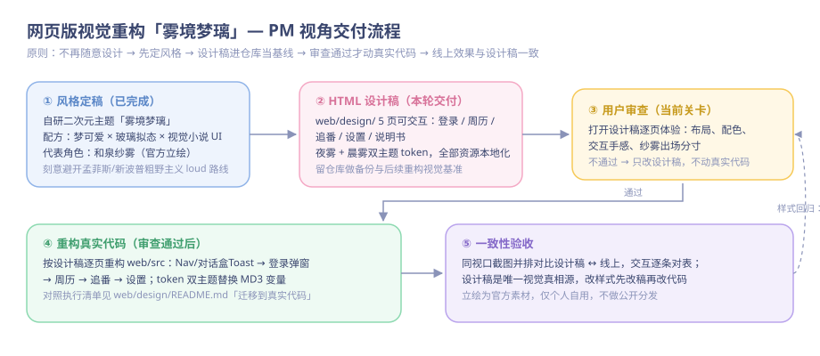
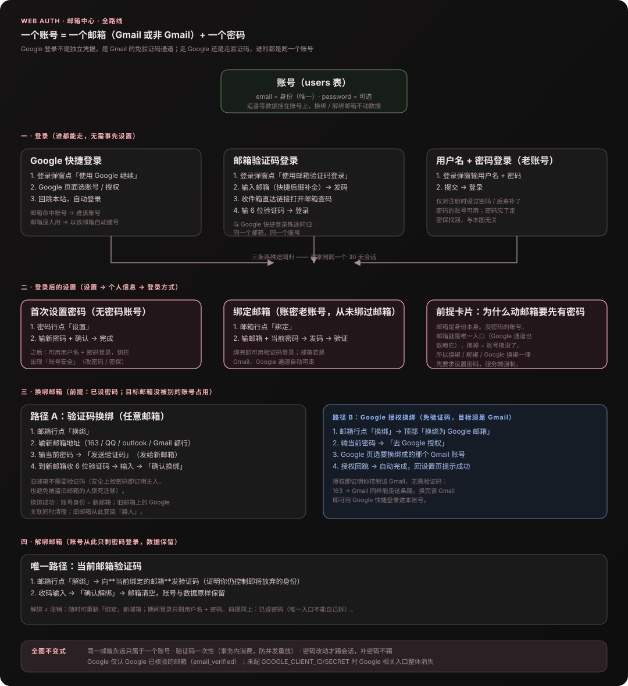
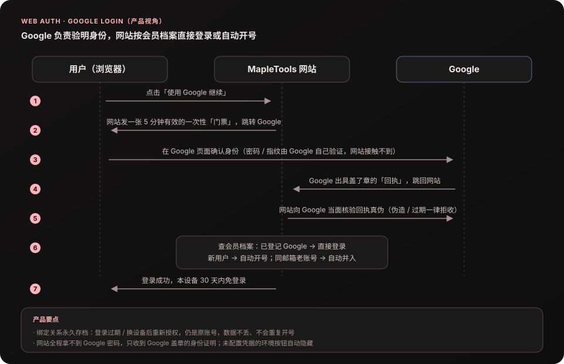

# 2026-08-网页版-下半月

> 2026-10-06 归档。原提交结果与验证范围；后续记录可能推翻早期结论。日常入口：[网页版摘要](../2026-网页版.md)，当前功能见 [012](../../ideas/012-网页版.md)。

## 2026-08-30 fix(web): 修复番剧绑定源错误

**效果**：

1. 挑源弹窗里，已认出来的源在源名右侧显示 `《源站名》`（占满源名和「不对，重认」之间的空间，超出省略号），点「重认」带 `rebind` 重走定位 / 搜索，选新候选后 `putBinding` 直接覆盖旧绑定

**边界**：绑定是全站共享事实，换绑会影响所有人；历史上已写错的绑定需要手动或经此入口更正一次

## 2026-08-30 fix(web): 优化放映福利低余额交互与文案

**效果**：

1. 积分不足时扭蛋和兑换按钮不再提前变灰；点击后由纱雾便签提示“还差多少星光”，用户仍能看懂入口和价格
2. “优先通行”统一收敛为“免券”：资产区直接显示剩余天数，兑换与扭蛋奖品改为“7 天免券 / 30 天免券”
3. 删除资产卡和兑换区里重复解释操作结果的大白话；邀请文案只保留“邀请一位得 100 星光”，其余短提示改为纱雾式口吻

**文案原则**：

1. 主界面只保留资产、动作、价格与必要概率，使用规则不在每张卡上重复讲一遍
2. 角色拟态控制在短句，不用长台词遮住商品名和动作；“放映券 / 免券”仍保持一眼可懂
3. 低余额是点击后的反馈，不是入口不可用；只有请求进行中或活动关闭才真正禁用按钮

## 2026-08-30 feat(web): 新增放映福利页面

**效果**：

1. 桌面书脊和手机底栏新增「放映福利」入口，登录用户可以直接查看星光积分、放映券和优先通行期限
2. 好友招待券可一键复制邀请链接；积分兑换所接通单张 / 五张放映券与七日 / 月度优先资格，操作完成后即时刷新余额
3. 幸运扭蛋接通真实服务端结果，固定展示全部奖品概率；抽取时胶囊动画等待服务端结算，结果和积分在同一页收口

**页面结构**：

```text
放映福利
  → 星光放映手册：积分 / 放映券 / 优先通行
  → 好友招待券：邀请码 + 复制邀请链接
  → 幸运扭蛋：20 星光一次 + 完整概率 + 本次结果
  → 积分兑换所：四种确定权益
```

**关键边界**：

1. 页面只在登录后开放；活动总开关关闭时显示收起状态，不把不可用按钮伪装成可操作
2. 所有兑换和抽取继续使用唯一请求编号，连点或网络重发不会重复扣积分；临时结果区固定高度，不因文案出现挤动布局
3. 复用现有画稿纸、胶带、印章和纱雾素材，没有引入新 UI 库；已在 1440×900 和 390×844 检查，手机无横向溢出

## 2026-08-29 feat(web): 三种注册方式接入邀请奖励

**效果**：

1. 带 `invite` 的站内链接会在首次注册前保留邀请关系；用户名密码、邮箱验证码和 Google 快捷注册创建新账号后统一发放邀请奖励
2. 邀请人获得 100 积分，新用户获得 50 积分；已有账号登录、同一注册回调重放、自邀或当月超过 10 次均不会重复发奖
3. Google 邀请码随签名 OAuth 短期状态往返，只在回调确实创建新账号时生效；Google 命中已有邮箱账号时只登录

**注册链路**：

```text
邀请链接 ?invite=CODE
  → 浏览器短期保留邀请码
  ├─ 用户名注册：创建账号 → 建立邀请关系
  ├─ 邮箱验证码：验证并确实创建账号 → 建立邀请关系
  └─ Google OAuth：签名状态携带邀请码 → 回调验签 → 确实创建账号 → 建立邀请关系
  → 邀请双方积分事件按新用户 ID 幂等入账
```

**边界**：

1. 有效邀请只要求通过邀请链接首次创建账号，不增加注册满 72 小时、跨日登录或添加追番条件
2. Google 明确返回 `email_verified=true` 的邮箱直接视为已验证；未验证邮箱不参与账号命中或创建

## 2026-08-29 feat(web): 建立慢源准入与积分权益底座

**效果**：

1. 网页版新增与片源无关的慢源容量池：按账号维护普通 / 优先候补、五分钟保留、暂停与离线释放，同一套规则可继续接 Girigiri 等来源
2. 新增不可变积分账本、放映券、时效优先资格、邀请关系、积分兑换与幸运扭蛋；重复兑换、抽取和奖励事件只结算一次
3. 空位可向已验证邮箱发送一次通知；积分、邀请、扭蛋和候补分别受运行时开关控制，生产默认不开放营销能力

**关键规则**：

```text
慢源容量池
  → 有空位：保留 5 分钟，真实建立观看会话后占用
  → 已满：月卡 / 自动锁券进优先候补，其余进普通候补
  → 放行：连续 2 位优先后放 1 位普通，同级严格 FIFO

积分事件 / 兑换 / 扭蛋
  → 唯一事件或请求编号
  → 积分扣除与权益发放在同一事务完成
  → 网络重发返回原结果，不重复扣除或发奖
```

**边界**：

1. 本提交提供公共服务、持久化和前端调用合同，不新增营销页面；页面视觉由后续设计接入
2. 支付不在范围内，积分不能购买、转账、提现或兑换现金
3. 当前公共慢源容量默认 2 人，扩容必须依据真实出口带宽测试，不能只调高配置

## 2026-08-29 feat(web): 新增追番列表查看方式

**效果**：

1. 「我的追番」新增「卡片 / 列表」切换，列表模式可连续浏览更多追番，不必逐张翻封面
2. 列表行只显示番名、当前要看的集数和最爱程度，不显示封面、标签、步进器或状态编辑区
3. 每行保留「继续看 / BGM / 鉴赏神回」三个入口；继续看沿用现有选源与播放流程，鉴赏神回沿用原弹窗

**关键决策**：

1. 列表是只读速览，视图切换只改变前端展示，不新增接口、不改变追番数据
2. 列表与卡片共用绑定源和播放入口，避免两套播放定位逻辑产生差异；列表不提供改集数、改状态或改最爱控件
3. 桌面端用紧凑横向行展示；手机端改为标题/元信息与三按钮两段布局，并保留足够触控高度

**边界**：

1. 卡片模式保持原有封面、标签、集数步进、状态分段和编辑入口，不受列表样式影响
2. 列表中的「鉴赏神回」仍会打开可编辑弹窗；列表本身不直接写入集数、状态或最爱程度

## 2026-08-29 style(web): 优化手机端追番卡片信息布局

**效果**：

1. 手机端追番卡改为单栏信息卡，隐藏大封面和卡片标签，标题、看到第几集、状态更容易扫读
2. 「继续看 / BGM / 鉴赏神回」三个入口在同一行，状态分段独占一行；更窄的手机仍保持按钮不横向溢出
3. 封面和标签没有被删除：手机卡片新增「详情」入口，仍可打开原有编辑弹窗查看与修改

**关键决策**：

1. 只在 `≤640px` 调整卡片布局，桌面端封面、标签、网格和操作排列保持不变
2. 移动端只隐藏卡片展示层的 `.trk-cover` / `.tagx-row`，编辑弹窗继续复用完整封面与标签控件，不改数据/API
3. 详情入口使用现有编辑回调，避免封面隐藏后手机端失去编辑入口；`≤360px` 仅收紧按钮内边距，不降低触控高度

**边界**：

1. 手机端仍保留移出、鉴赏神回和 BGM 操作；详情弹窗中的封面上传、标签编辑行为不变
2. 本次只改网页版 `web/src`，不影响根目录 Electron 应用

## 2026-08-27 feat(web): 引入异常与性能监控

**效果**：

1. 网页端可按环境变量启用 Sentry：浏览器采集未处理异常、React 可恢复错误、页面 / 请求性能与 Web Vitals；Hono 服务端采集未处理异常与请求性能
2. 每个服务端响应新增 `X-Request-ID`，同一 ID 写入监控事件和 span；未处理异常同时把该 ID 打到 pm2 终端日志
3. 未配置 DSN 时完全停用上报；前端 SDK 也不会进入普通生产构建的首屏包
4. `public/white-screen-probe.js`：独立静态脚本（生产 CSP `script-src 'self'` 拦内联），`load` 后 4s 检查 `#root` 仍为空则经 `window.__mapleMonitoring` 上报 `fatal`，兜住「主包加载了但没渲染」

**监控边界**：

```text
浏览器：页面 / API span + Web Vitals + 未处理异常
           │ 只向本站 /api 传播 trace
           ▼
Hono：request isolation scope → 稳定路由名 → 5% 默认采样 → Sentry
           └─ 未处理异常强制 capture，并在 serverless 返回前短暂 flush
```

1. 浏览器和服务端都关闭默认 PII；事件出站前再次清除查询串、Cookie、请求体和用户身份，请求头仅保留 `User-Agent`（Sentry 据此解析 browser/os/device；Cookie/Authorization/Referer 丢弃），不采集 Session Replay
2. 服务端只采样 API，静态资源和 `/api/health` 不占性能额度；动态数字 ID、UUID 和长 token 会归一为稳定路径，避免按每个用户 / 条目制造无限 transaction 名
3. 性能采样率默认 5%，可分别通过前后端环境变量调整；异常不随性能采样丢弃

**边界 / 风险**：

1. `VITE_SENTRY_*` 是构建时变量，pm2 运行时补配不会改变已经生成的浏览器包；服务端 `SENTRY_*` 则是运行时变量
2. source map 上传走 `@sentry/vite-plugin`，仅在构建时注入了 `SENTRY_AUTH_TOKEN` 才启用（`vite.config.ts`）：`sourcemap: 'hidden'` 产出 map 但不写 `sourceMappingURL` 注释，上传后 `filesToDeleteAfterUpload` 立即从 `dist` 删除 —— `server/node.ts` 的 `serveStatic` 会把整个 `dist` 对外暴露，留一个 `.map` 即源码泄露。未注入 token 的构建完全跳过，dist 里不出现 map

## 2026-08-22 fix(web): 修复手机端番剧周历按钮重叠与设置省略号

**效果**：

1. 手机上番剧周历的海报卡恢复两列宽卡：追番圆章不再被挤成 4 列窄卡挤在一起
2. 设置页个人信息里「密码 / 邮箱」的长描述不再省略成「已设置，登录页可用用户名 + 密…」，显示完整内容，标签列与值的空隙收窄

**根因**：

```css
/* 改动前 sketch-ui.css */
@media (max-width: 960px) { .film { --film-cols: 3; } }   /* 定义在先 */
@media (max-width: 640px) { .film { --film-cols: 2; } }   /* 定义在先 */
.film { --film-cols: 4; ... }                              /* 基础规则在后 */
```

`.film` 的响应式断点写在基础规则之前。两条规则选择器相同（都是 `.film`），CSS 由**源顺序后者生效**，于是基础规则的 `--film-cols: 4` 永远盖掉断点值——无论窗口多窄，手机都按 4 列排约 66px 的窄卡，追番圆章挤在一起、封面也糊。

**关键修法**：

1. 把三条 `.film { --film-cols }` 断点移到基础 `.film` 规则**之后**，让断点真正按视口生效（≤640px 两列、≤960px 三列、≥1500px 五列）
2. 设置页键值行在 ≤640px 收敛：`.kv-label` 从固定 `width: 92px` 改成内容宽（`min-width: 56px`），`.kv-val` 允许换行。原固定 92px 标签列在窄栏里空出一大段，值列被挤到只剩一小截，密码/邮箱的长文本就被截成省略号；收窄标签 + 换行后整段放得下、不再截断

**边界 / 风险**：

1. 桌面端（>640px）键值行保持原样：标签列仍 92px、值单行对齐，按钮靠右，未受影响

## 2026-08-22 fix(web): 优化追番封面缓存与调整封面浮层

**效果**：

1. 番剧周历和我的追番共用浏览器持久封面缓存；同一张 Bangumi 封面第一次成功加载后，切换页面、刷新网页都优先直接复用本地缓存
2. 封面图上的“详情”浮层移除，图片临时加载失败时不会在空白封面左上角留下孤立的图标和“详情”文字

**关键边界**：

1. Service Worker 只拦截公开且内容地址稳定的 `/api/cover/*`；用户上传的 `/api/tracks/<id>/cover-file` 继续沿用账号私有 HTTP 缓存，不能放进跨账号共享的 Cache Storage
2. 缓存最多保留 360 张封面，超过后按最早写入顺序淘汰；Service Worker 不可用时自动退回既有的 HTTP 缓存，不影响封面正常加载

## 2026-08-20 fix(sync): 修复桌面端上传后网页版数据不对齐

**效果**：

1. 桌面端上传追番到网页版后，新数据两端不再各存一份

**关键修法**：

```text
web/server/db.ts   启动时一次性迁移：status='plan' 且 extra.appStatus='considering' 的行
                    → 正式写成 status='considering'，并按受影响用户各 bump 一次 rev
                    （schema_meta 打 marker，不会重复跑）

同步协议 syncSchema=2：
  桌面 toWebSyncTracks 直接发 status='considering'（不再折叠）
  服务器 syncStatus() 双认：新格式直发 / 老格式 status=plan+extra.appStatus 兜底

主进程 webAccount.ts push-tracks：
  POST /api/tracks/sync 200
    → 立刻 GET /api/tracks/sync 回读（同 Cookie / origin）
    → rev、条数、accountId、username 四项对不上就报错，不更新本地同步基线
```

**边界 / 风险**：

1. 已安装的旧版桌面端仍会用折叠格式上传，服务器兼容读取不受影响；但要拿到「观望」独立列的完整体验（如观望次数），仍需升级到本版
2. 迁移只跑一次且在服务器启动时执行，靠 `schema_meta` 表打 marker 防重跑；线上是 pm2 单进程 + `better-sqlite3` 单文件库，不存在多实例并发跑迁移的场景，此处不是当前需要处理的风险

## 2026-08-19 feat(web): 支持从 Bangumi 一键导入追番

**效果**：

1. 设置 → 数据同步可保存 Bangumi 数字 UID / 自定义用户名；“我的追番”工具栏新增导入入口，弹窗实时展示处理进度与新增 / 更新 / 失败计数
2. 首次导入直接新增，重复导入按字段合并：Bangumi 有值的标题、日期、评分、封面、状态和进度覆盖本站；Bangumi 没有的字段保留，自定义标签、`extra`、观望次数、BGM 标签 / 别名和两类播放绑定不动
3. 不存在、私密、限流、超时与上游故障分别反馈；任务按账号单飞，同目标的重复启动接回原任务，不同目标明确拒绝

**数据流与护栏**：

```text
POST /api/tracks/import/bgm
  → 同账号任务去重 + 全局小时上限 / 连续失败冷却
  → BGM collections 每页 50 条（条目元数据随收藏返回）
  → 全局请求队列：分页之间休息 1~2 秒，不逐条请求 subject detail
  → 全部分页校验完成
  → 单个 IMMEDIATE 事务按最新本地行合并 + tracks_rev 只加 1
  → 提交后清理被网图顶替的本地封面
  → GET /api/tracks/import/bgm/status 每秒返回进度
  → runTracksMutation 触发权威全量 GET，列表与缓存一起收口
```

**关键实现**：

1. `total_episodes` 继续遵守新老番边界：近 180 天 / 日期未知一律 `NULL`，老番只在 BGM `eps > 0` 时覆盖；`ep_status > 0` 才覆盖进度并按总集数夹取
2. 导入先完成全部网络读取，再拿写锁重读本地行；任何分页失败都不会留下半批数据，等待期间发生的网页 / 桌面端修改也不会被请求前快照覆盖
3. BGM 网图顶替本地封面时，事务内同步写 `cover`、清 `cover_mime`、登记孤儿；事务提交后才删文件。固定文件路径的上传与删除再按 `(uid, bgmId)` 串行，删除前复查 DB，避免旧 `unlink` 晚到后删掉新上传
4. 进度区和三项计数使用固定尺寸；设置页“已保存”绝对定位，状态变化不参与文档流，不挤动按钮与弹窗

**边界**：

1. 只导入公开动画收藏（`subject_type=2`）；导入不写别名与 BGM 标签，新增记录保持为空、既有记录保留原值，不为此逐条请求详情
2. 任务、限流和封面操作锁是单进程内存状态，匹配当前单机 VPS 部署；多实例部署前需换成共享协调层

## 2026-08-18 feat(web): 我的追番新增「观望」

**效果**：

1. 网页版有了第四个状态「观望」，与桌面端 `considering` 一一对应
2. 观望卡**不显示集数、步进器、进度条**——观望的番没在看，那一整套是「看到第几集」的语义

**状态与数据流**：

```text
桌面 app          同步(JSON)              网页 server            网页 UI
considering  ──►  status:'considering' ──► status 列           ──► 观望 tab
observeCount ──►  observeCount(正式字段) ──► observe_count 列   ──► 眼睛章 / data-heat
                        ▲
                  老数据：status='plan' + extra.appStatus='considering'
                  → fromWebSyncTracks 的 legacyConsidering 兜住，下次上传自动痊愈
```

`observeCount` 从 `extra` 里**提升为正式列**：网页现在也要读写它，继续两处各存一份必然对不上。服务端 `asObserve()` 仍认老数据 `extra.observeCount`

## 2026-08-18 fix(web): 修复扩展拉丁字体被 CSP 拦截

**效果**：

1. `ā ē ō` 等扩展拉丁字形不再掉回 fallback 字体——`yusei-magic-latin-ext` 子集此前**在线上被 CSP 直接拦掉**，控制台只留一条报错，页面照常渲染，所以一直没被发现
2. 顺带：CSS `62.74 → 58.98 kB`（gzip `16.75 → 13.25 kB`）—— base64 比原始字节大 33% 且几乎压不动，从 CSS 里挪出去是净赚

**根因**：

```text
Vite 默认内联阈值 4096 字节
  ├─ yusei-magic-latin-400-normal.woff2      17,412 字节 → 超阈值 → 独立文件 → 一直正常
  └─ yusei-magic-latin-ext-400-normal.woff2   2,844 字节 → 低于阈值 → 内联成 data: URI
                                                              ↓
                                          CSP `font-src 'self'` 不含 data: → 拦截
```

**只坏一半**正是它难发现的原因：常用字符走 latin 子集，看着一切正常。

**修法取舍**：改构建、不放 CSP。CSP 本身是对的，内联才是那个越界行为；为一个 2.8KB 的字体
永久放开 `data:` 不划算。故在 `vite.config.ts` 把字体钉死为独立文件（顺带覆盖 ttf/otf/eot，
以后换字体不会再踩）：

```ts
assetsInlineLimit: (filePath) => /\.(woff2?|ttf|otf|eot)$/i.test(filePath) ? false : undefined,
```

> 另：控制台那条 `frame-ancestors 通过 <meta> 下发被忽略` 是**噪音，不是漏洞**——
> `server/security.ts` 已通过 HTTP 响应头下发同一条 CSP，`frame-ancestors 'none'` 实际生效中；
> HTML 里那份 meta 只是冗余副本。

## 2026-08-18 perf(web): 其余角色立绘转 WebP

**效果**：

1. 剩下四张角色立绘全部转 WebP，`public/assets/` 里不再有 PNG：**1,760,722 → 316,110 字节（省 1.44MB、小 5.6 倍）**

| | PNG | WebP q82 | PSNR |
|---|---|---|---|
| `sagiri-mascot` | 1,008,780 | 208,310 | 43.2dB |
| `chara_03` | 269,376 | 39,548 | 45.0dB |
| `sagiri-face` | 257,715 | 40,332 | 43.9dB |
| `chara_04` | 224,851 | 27,920 | 46.9dB |

2. 尺寸、alpha 全部原样保留（透明通道 99dB），q82 下 PSNR 43–47dB，肉眼无差

**待办（本次没做）**：这批图**分辨率本身就远超显示尺寸**，比 WebP 更大的一笔在这儿——
`sagiri-mascot` 源图 800×1200、实际只显示 `width: 118px`（`.empty .mascot`）；
`sagiri-face` 源图 550×500、显示 `28–34px`（`.avatar`）。按 3x DPR 缩到实际尺寸还能再降一个数量级。
没顺手做是因为改分辨率有肉眼风险，值得单独一次改动 + 真机看过再定。

## 2026-08-18 fix(web): 修复本地封面孤儿文件，立绘转 WebP 并补静态资源缓存

**效果**：

1. 从 app 删番、或 app 推网图顶掉本地上传的封面，服务器上的图片文件现在会跟着删——以前只删 DB 行，`coversDir` 里的文件只增不减
2. 修掉「`cover` 是网址、`cover_mime` 却说本地还有文件」的错位态：这种行会让 `GET /cover-file` 继续吐早该失效的旧图
3. 开屏立绘 `sagiri-full` 转 WebP：**199,978 → 30,610 字节（小 6.5 倍）**，PSNR 46.5dB、alpha 保留。线上实测这张图 total 1.05s，首次进站看到空画框是**没下完**、不是没解码完（400×917 解码只要几毫秒）；preload 补 `fetchpriority="high"`
4. `/assets/*` 补上 `Cache-Control`（此前只有 `Last-Modified`，浏览器全靠启发式缓存瞎猜）
5. 备份脚本纳入 `covers/`（文档）——以前只备 `web.db`，恢复后封面会全变「封面文件丢失」且不可再生

**关键实现**：

1. 同步是**整包覆盖**，删除靠「app 没带上来的就是删了」，所以清理必须挂在那个循环里，不能只改单条 `DELETE` 路由。文件删除记账到 `orphaned[]`、**等事务提交后**再 `unlink`——放事务里一旦回滚，图已经删了找不回来
2. 区分「顶替」和「原样推回」是这次的坑：app 拉取时拿到的就是哨兵路径 `/api/tracks/<id>/cover-file`，它再推回来时若也判成顶替，就会把用户自己的本地图删掉。故抽 `coverSentinel()` 比对：

```ts
if ('cover' in t && String(t.cover ?? '')) {
  const nextCover = String(t.cover)
  put('cover', nextCover)
  if (existing.get(id)?.cover_mime && nextCover !== coverSentinel(id)) {
    put('cover_mime', '')   // 网图顶替 → 两半一起失效
    orphaned.push(id)
  }
}
```

3. 缓存头必须按**文件名带不带 hash** 分档：vite 产物（`index-C5FkBqn7.js`）内容一变名就变 → `immutable` 一年；`public/` 原样拷的立绘**不带 hash** → 只给一天 + `must-revalidate`，否则以后换图线上一年刷不掉。HTML 不加缓存头（加了就发布不生效）：

```ts
const hashed = /-[A-Za-z0-9_-]{8,}\.[a-z0-9]+$/.test(new URL(c.req.url).pathname)
```

## 2026-08-18 fix(web): 修复开屏动画bug

**效果**：

1. 首次进站不再出现「只看到一个空画框，绘画和盖章全没了，刷新一次才正常」——现在无论首屏多卡，描线→上色→盖章一定完整播完（卡的时候是整段变慢，不是跳过）
2. 顺手修掉偶发的「主界面闪一下再进开屏」
3. 立绘解码完成（或 1.5s 超时）才起画，不会对着空卡片描线；`index.html` 补 `<link rel="preload" as="image">` 让立绘与 JS 包并行下载

## 2026-08-18 feat(web): 新增开屏动画「なぞる」

**效果**：

1. 进站先放一段 ~3.2s 的开屏：画稿纸上一张相片卡贴着和纸胶带落下 → 铅笔画框自己描一圈 → 纱雾**先出线稿、再上色**（一道墨线带着笔尖从下往上扫）→ 网点/集中线/星芒浮出 → 盖「紗霧」印章 → 手写标题 `MapleTools` + 铅笔双线 → 整张纸以左缘为轴掀走，露出周历
2. 一次会话只放一次（`sessionStorage`）；点一下或按任意键立刻跳过；`prefers-reduced-motion` 下**整个组件不挂载**
3. 设计稿同步进原型目录：`docs/design-mockups/web/anime-sketchfolio/splash.html`（页内可重放），CSS 与真实源码同一份

**关键实现**：

1. 「先描线后上色」= 同一张官方立绘叠两层，都用 `clip-path: inset(100% 0 0 0) → inset(0)` 自下而上擦除，线稿层加 `grayscale/contrast` 冒充铅笔稿并**早 0.42s 起跑**；彩稿追上来就是上色。笔尖那条墨线单独动 `bottom: 0 → 100%`，与线稿层同起同止
2. 画框走 `pathLength=100` + `stroke-dasharray/dashoffset 100 → 0`（自绘线的标准做法）；`viewBox` 是 `preserveAspectRatio=none` 拉伸的，靠 `vector-effect: non-scaling-stroke` 才不会把竖边拉细
3. 「放一次」的判定放**模块级常量**而不是 `useState` 初始化：StrictMode 会把初始化函数跑两遍，第二遍读到自己刚写的 `sessionStorage`，开屏会永远不放

## 2026-08-16 feat(web): 新增「雾境梦璃」二次元风格设计稿

**效果**：

1. `web/design/` 新增**可交互设计稿**（纯 HTML/CSS/JS，零依赖、全资源本地化、双击即开），作为网页版视觉重构的基线，审查通过后再按稿重构 `web/src`：
   - `index.html` 设计说明书：风格来源、色板/圆角/阴影/字体 token、组件总览、交互规约
   - `login.html`（登录弹窗/整页双形态：密码/验证码/注册/找回四模式、倒计时、错误抖动、Google 按钮）→ `calendar.html`（7 列海报墙、hover 遮罩、今日缎带、窄屏日选）→ `tracks.html`（进度/标签/搜索加番/移除确认/今天更新置顶）→ `settings.html`（身份卡、三模块、换绑两步流、稀饭验证码）
2. 风格定稿：自研二次元主题**「雾境梦璃 Misty Yume-Glass」**= 梦可爱（色彩母题）× 玻璃拟态（结构）× 视觉小说 UI（交互语法：立绘、名牌对话盒、选项肢按钮、打字机）；代表角色和泉纱雾（官方立绘），夜雾/晨雾双主题；刻意避开孟菲斯-新波普粗野主义 loud 路线
3. 全局通知改为**对话盒 Toast**（纱雾名牌 + 打字机，失败变珊瑚色）；背景为渐变天空 + 极光斑 + 星屑/花瓣粒子画布（夜雾星屑、晨雾花瓣，`prefers-reduced-motion` 与页面隐藏时停用）

**关键决策**：

1. 设计稿进仓库而非 scratchpad（AGENTS 已踩过坑）；本轮**只交付设计稿不动真实代码**——任务约定"审查没有问题之后再考虑重构"，效果一致性验收以本稿为唯一视觉真相源
2. Token 双主题放 CSS 变量（`html[data-mist]`），形状/阴影/动效曲线同层；文字对比度按 WCAG 公式核算（晨雾 sub 文字调到 .80 透明度才达 4.5:1）
3. 立绘只用官方素材（Aniplex 美版官网角色页，官网 HTML 明确标注「和泉紗霧」）且**只大出面两处**：登录 hero 全身 + 空态/头像半身——功能页克制避免贴纸感；个人自用不分发
4. 设计稿全程贯彻 AGENTS UI 红线：临时提示绝对定位不挤布局、自绘下拉（浮层与触发器同宽）、统一 4px 滚动条、hover 只用 transform/filter
5. 交互验证方式：浏览器 DOM/locator 断言 + HTTP 日志确认字体/立绘实际加载（Baloo 2 600/700/800 均命中）；视觉模型分析因配额受限，改用 WCAG 数学核算兜底对比度



**边界 / 风险**：

1. 设计稿海报为 CSS 占位（渐变+首字），真实海报走 `/api/cover` 代理，重构时只迁移海报框/遮罩样式
2. 周历假数据为 2026 夏季番（虚构集数），仅示意
3. 真实代码重构未开始；迁移执行清单已写在 `web/design/README.md`（token 替换、字体包、逐页顺序、验收口径）

## 2026-08-16 feat(web): 登录方式支持密码与换绑管理

**效果**：

1. 设置 → 个人信息「登录方式」区块（密码一行 + 邮箱一行）：
   - **密码**：无密码账号（Google / 验证码注册）行内**首次设置密码**；设置后可用用户名 + 密码登录、侧栏出现「账号安全」；已设置的显示「修改」跳账号安全
   - **邮箱**：一行内合并「换绑」「解绑」两个按钮——换绑提供两条路径：**Google 授权**（仅 Gmail 且 Google 已启用，免验证码，授权即证明控制新邮箱）或**任意邮箱 + 验证码**；解绑向**当前邮箱**发验证码证明仍控制它；邮箱为 Gmail 时行内显示「快捷登录已开通」小标
2. **用户名可修改**：随机 `maple-xxxx` 是系统生成给验证码 / Google 用户的，他们没选过——设置 → 个人信息用户名行内「修改」：有密码账号验当前密码，无密码账号用当前邮箱验证码；改完本机会话同步新用户名（服务端补发会话），新用户名立即可登录、旧用户名失效
3. Google 登录：已核验邮箱命中账号即登录、未命中以该邮箱建号——**不再有独立的 Google 身份绑定**，`oauth_identity` 表退出登录匹配（保留表结构，换绑/解绑时清理旧行）
4. 保护规则（服务端强制）：同一邮箱只能属于一个账号（唯一索引 + 事务，409）；用户名沿用注册规则（2–12 字符、保留词、NOCASE 唯一）；**换绑 / 解绑邮箱的前置是账号已设密码**——邮箱是身份，没密码的账号动邮箱等于自锁；有密码的账号换绑 / Google 换绑 / 解绑前都要验当前密码（或验证码证明控制现邮箱）
5. **全站密码框支持明暗切换**：新增共享组件 `PasswordInput`（右侧眼睛 icon 切 text/password，带 aria-pressed / title），替换了设置页（首次设密码、各处当前密码、账号安全改密、稀饭登录）与登录弹窗（登录 / 注册 / 找回）的全部 9 处原始密码框——手输长密码时可以核对，暗文仍是默认态

**关键代码决策**：

1. **首次设密码不验旧凭据、不踢会话**：无密码账号没有「原始密码」可验，门槛是登录态本身；`enablePassword` 不 bump token_version——补密码不是「旧凭据泄露」事件（与 `/settings` 改密码的踢会话语义区分），已有密码再调 409 指去账号安全

**全路线图**（用户视角的完整链路，含每条路的操作顺序）：


2. **Google 换绑走 POST + 密码前置**而非 GET 直跳：有密码的账号换邮箱前必须验密码（借来的会话换不了身份），验过返回授权 URL 由前端整页跳；回调在 bind 模式下按 HMAC 签名短效 cookie 里的 `uid + tv` 校验（SameSite=Strict 的会话 cookie 不随跨站回跳带回）
3. **解绑验证码发往当前邮箱**：证明「你仍控制即将放弃的这个身份」，而非新邮箱；消费挑战与清空邮箱在同一事务，验证码一次性；`/email/current-start` 是「向当前邮箱发码」的公共入口（解绑 / 改用户名共用），业务前置由各自的 verify 把关
4. **改用户名不动账号身份**：账号的身份锚点是 uid + 邮箱，用户名只是账密登录时的「查找名」（报名字找行，密码才是证明）；改名后新用户名可登录、旧用户名立即失效，但 uid / 邮箱 / 密码 / 数据全不动。改名不 bump token_version、不踢其它设备——token_version 只留给「凭据可能泄露」的事件（改密码 / 重置）；当前设备改名后补发带新名的会话，其它设备因 `getSession` 与 `/me` 每次实时读库，刷新即见新名。条件 UPDATE + NOCASE 唯一索引双防并发撞名
5. 换绑 / 解绑邮箱时顺带 `DELETE oauth_identity WHERE user_id=?`——邮箱变了，旧邮箱上的 Google 关联即失效，不留僵尸数据
6. 挑战的消费仍在各流程自己的事务里，绑定事务先独占 challenge 再占邮箱，被并发抢先整体回滚
7. 新增接口全部要求登录态且无用户可控 ID 参数：`POST /password/set`、`POST /username/change`、`POST /email/bind-start|bind-verify`、`POST /email/current-start|unbind-verify`、`POST /oauth/google/rebind-email`；`/oauth/providers` 带 `email` 字段，`/me` 回显已核验邮箱（密保仍只报「设没设」）

**边界 / 风险**：

1. 邮箱未绑定时（老用户名注册未绑邮箱、或解绑后）Google 登录按钮仍可用——登录路径按「该邮箱建号」处理，与设置页的换绑语义互不影响
2. dev 控制台模式下验证码打在服务端控制台，生产行为由 SMTP 配置决定

## 2026-08-16 feat(web): 优化邮箱快捷登录并新增 Google 账号登录

**效果**：

1. 登录 / 注册 / 邮箱弹窗顶部新增「使用 Google 继续」，下接「或」分隔线再进本地凭据表单，点击整页跳转 Google 授权页，授权后回跳本站自动登录，30 天会话与既有登录一致
2. 首次 Google 登录自动建无密码账号；Google 已核验邮箱与本站既有邮箱账号相同时直接并入该账号（不产生重复账号），其余情况一律新建
3. `GOOGLE_CLIENT_ID` / `GOOGLE_CLIENT_SECRET` 任一未配时按钮与分隔线整体不出现（providers 接口回 `google:false`）——本地未注入凭据看不到按钮是**预期行为**
4. 用户在 Google 授权页点取消时静默返回原页面；其余失败（state / 签名 / token 环节）回跳带 `?oauth=failed`，前端摘掉参数后弹出登录框提示
5. 验证码邮件发件人显示为 `MapleTools <发信地址>`；邮箱快捷后缀补 126 / Foxmail / iCloud，收件箱直达同步覆盖（Foxmail 复用 QQ 邮箱网页版入口，iCloud 用自家邮件入口）
6. 新增接入指南 [`docs/ideas/015`](../../ideas/015-noreply发信与第三方登录接入指南.md)：按本站现状（香港服务器 + 已备案的阿里云域名）选定 Brevo 发信路线（含地址联想组件要点选建议的坑），及四家第三方登录的平台注册步骤；回调地址约定 `https://anime.alcmaple.cn/api/auth/oauth/<provider>/callback`

**关键登录流**：

```text
点击「使用 Google 继续」
  → GET /api/auth/oauth/google/start
      生成 state + nonce + PKCE verifier → HMAC 签名短效 cookie（SameSite=Lax, 5 分钟）
      302 → accounts.google.com（openid email profile + S256 + select_account）
  → 用户授权 → Google 302 回 /api/auth/oauth/google/callback?code&state
      核对 state → POST token 端点换 id_token（带 code_verifier）
      JWKS 验签 + iss/aud/exp/nonce 核对 → 拿到 sub + email(仅 email_verified)
      事务：oauth_identity(provider+subject) 命中 → 登录
            未命中 + 邮箱命中现有账号 → 绑定后登录
            未命中 → 建无密码账号 + 绑定 → 登录
      签发会话 cookie → 回跳 returnTo
```

**产品视角流程**（同一条链路，给非技术读者）：



**关键代码决策**：

1. 账号键用 `provider + subject`（Google 的 `sub`）而非邮箱 —— 邮箱会改名、回收、复用，sub 才是身份提供方保证不变的标识；`oauth_identity.email` 只存快照供展示，不参与匹配（`server/db.ts`）
2. 自动并入现有邮箱账号的前提是 `email_verified === true`：Google 的身份证明上，「邮箱」字段只有盖了「已核实」章才拿来匹配老账号 / 写入新账号；**没盖章的邮箱当空白处理**（当作此人没提供邮箱，建一个仅靠 Google 身份登录的无密码账号）——防止拿未核实的他人邮箱冒名并号
3. state / nonce / PKCE verifier 不落库，塞进 HMAC 签名的 5 分钟 cookie 回调一次性消费；必须 `SameSite=Lax`（回调是 Google 发起的跨站顶层 GET，Strict 不回传），Path 限定 `/api/auth/oauth`
4. id_token 用 Google JWKS 现场验签（RS256，kid 未命中强制刷新缓存），iss / aud / exp / nonce 逐项核对（`server/oauth.ts`）；首次建号与邮箱验证码共用 `reg:<IP>` 注册限流，start 另有 20 次 / 15 分钟限流
5. 品牌按钮白底黑字：Google 官方暗色页同款处理，比描边幽灵按钮更醒目也更「官方」；Apple / Microsoft / QQ 未注册凭据前**不做假按钮**，接入时往同一位置追加
6. 邮件只加显示名不默认改 `noreply@`：noreply 是发信域名 DNS 授权（SPF / DKIM）后的产物，个人邮箱冒充会被判伪造；显示名拼 `From` 头前剥离 `"` 与 `\` 防头注入

**边界 / 风险**：

1. 本地联调两步：Google 客户端登记 `http://localhost:5173/api/auth/oauth/google/callback`（Google 允许 localhost 用 http），启动时注入 `GOOGLE_CLIENT_ID` / `GOOGLE_CLIENT_SECRET` 环境变量，按钮才会出现
2. 生产部署后在部署目录外的 env 配 `GOOGLE_CLIENT_ID` / `GOOGLE_CLIENT_SECRET` 并重启 node；设置页暂未做「第三方登录」管理——定位是：给账密 / 验证码账号**主动绑定** Google（绑完即可快捷登录）、展示已连接的账号（让自动并入可被看见），解绑要求至少保留一种登录方式（Google-only 账号先补密码 / 邮箱，否则等于自我锁死）
3. Apple 登录需 Apple Developer Program（约 99 美元 / 年）、QQ 互联需已备案域名（本站已备案），见 [`docs/ideas/015`](../../ideas/015-noreply发信与第三方登录接入指南.md)
