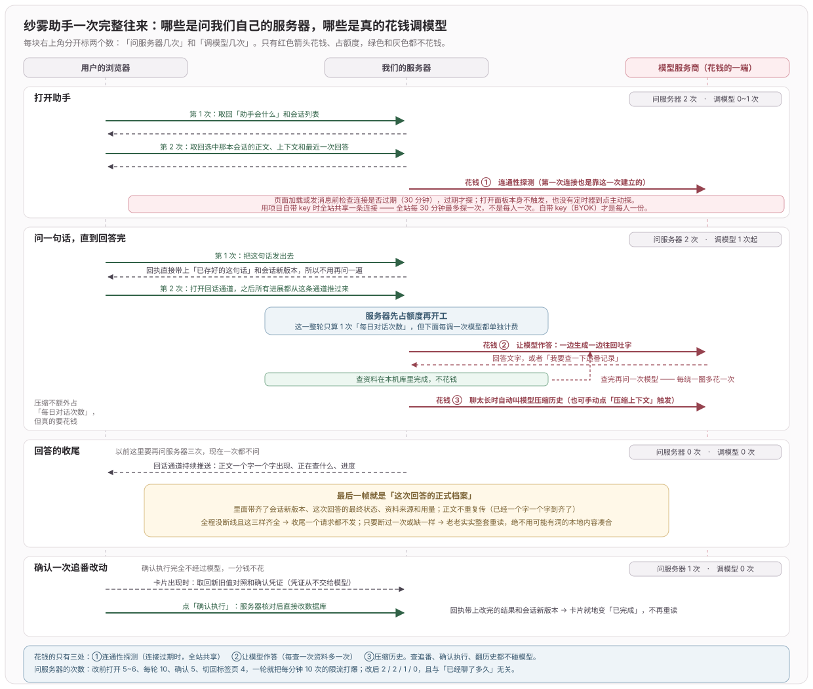

# 2026-09-网页版-Agent

> 2026-10-06 归档。原提交结果与验证范围；后续记录可能推翻早期结论。日常入口：[网页版摘要](../2026-网页版.md)，当前功能见 [012](../../ideas/012-网页版.md)。

## 2026-09-09 feat(web): Agent 一次确认走完「改进度 → 认片源 → 打开播放页」

**效果**：说「我要看夺还篇最新一集」，纱雾推出集号后只发一张卡。点一次确认，追番改成在看并把进度记到那一集、把这部番认到稀饭片源、新标签页打开播放页——三件事按序做完。以前这三步分别要用户自己点。

**思路：Agent 的工具就是人在这个网页上本来能点的按钮**

改状态改进度、认片源、打开播放页在网站上早就是现成接口，缺的只是接进 Agent：

| 人的操作 | 现成接口 | 接法 |
|---|---|---|
| 改状态 / 改进度 | `PUT /api/tracks/:bgmId` | 阶段 7 的 `proposeTrackChange` 原样复用 |
| 首次「继续看」定位片源 | `POST /api/xifan/locate` | **用户点认源那一下**才调用（见下） |
| 认源确认 | `POST /api/xifan/bind` | **确认那一下**才调用 |
| 打开播放页 | `GET /api/xifan/play-page` | 已接 |

**认源为什么必须押后到确认那一下**

```sql
CREATE TABLE xifan_binding (bgm_id INTEGER PRIMARY KEY, xifan_id INTEGER, ...)
--                          ↑ 没有 user_id
```

绑定是**全站共享**的一条事实，认错了所有人都跟着错。所以预览阶段只 `locate`（解析周表、不落库），把候选名字写进卡片让用户看清要绑哪个；`bind` 留到 `open()` 里执行，且排在写追番之前——它是签发播放页地址的前提，失败时还没有任何用户数据被改动。低于 `BIND_MIN_SCORE`（0.75）或周表不通就退回原来的「去找片源」，宁可少做一步也不写歪全局表。

连带的一个安全边：`GET /actions/:id/open` 原本只拦「要写追番」的动作，现在认源也是写操作，同样只能走 POST（同源守卫不覆盖 GET）。

**认源能力由组装根注入，store 自己不 import 稀饭**

```ts
// run-runtime.ts
new AgentPlaybackStore(db, Date.now, knowledgeVersion, agentActionStore, {
  locate: (bgmId, titles) => locateXifan(bgmId, titles),
  bind: (bgmId, id, name) => { bindXifan(bgmId, Number(id), name) },
})
```

「Agent 会打哪些外站请求」这一问只需要看这一处；playback-store 也因此仍能离线单测——测试注入的是可编排的假周表，一次真实源站请求都不发。

**认源为什么不能放在预览里**

第一版把周表定位塞进了 `prepare`，结果每次提案都 `TIMEOUT`——`proposePlaybackOpen` 的工具预算是 **1 秒**，而周表定位实测 **7194ms**：

```
纱雾：我尝试为你生成播放预览，但这次查询超时了
     查询结果: TIMEOUT
```

慢的那一步移进用户手势里：`prepare` 只读本地库（快，够 1 秒），没绑过片源就给「去找片源」；卡片上的认源面板在用户点击时才打周表。等待有了明确反馈，也不占模型的轮次预算。

**组合动作的追番那一步不能带 messageId**

第一次真机点「去选片源」直接报「这条动作记录没有找到」：

```
pb.message_id  = 04d04a9e-…      act.message_id = 04d04a9e-…（同一条消息）
消息里登记的动作: [ 'pb-3a16dd8f-… playback_open' ]   ← act- 不在里面
```

组合动作**只发播放这一张卡**，追番那条 `act-` 从不登记进消息的 `actions_json`；但它带着 `message_id`，`apply()` 于是去回写一条不在列表里的记录 → `history-store.ts:337`。改成建这条隐藏步骤时 `messageId` 传 `null`，它的回执本来就走 `open()` 的响应。

测试全部用 `messageId: null`，这条路径一次都没被走到 —— 新增的 P28 造出真实形态（助手消息带着 pb- 卡落库、播放动作挂上 messageId）才复现得出来。

**认源面板：两级，都在卡片里完成**

1. **周表定位**——精确、免验证码，当季新番一步到位（分数 ≥ 0.75 直接认下）
2. **站内搜索**——周表里没有的老番才走：要验证码就把图显示出来 → 用户敲数字 → 过了直接列出候选 → 点一个，回到「确认并打开」

四条接口都是 POST（取一张新图会作废源站会话里的旧图，不是 GET 的语义）。

**验证码全程绕开模型**

```
浏览器 ──图──> 我们的服务端 ──> xifanSessionFor(uid) 的 cookie 罐 ──> 源站
       <─数字──
```

图片和用户敲进去的数字都不进对话历史、不进模型上下文。验证码要证明的正是「此刻有个人在」，让模型经手这件事本身就没意义了；系统提示词里也明写它既看不到也不要索要。

**候选按下标挑，不接受客户端传 id**

```ts
pickSource(uid, actionId, index)   // 不是 pickSource(uid, actionId, xifanId, name)
```

搜索结果存在动作行的 `source_candidates` 上，返回给前端的只有名字和「更新到第几集 / 年份」，没有 `xifanId`。让调用方指定 id，就等于开放对全局绑定表的任意写入。

## 2026-09-09 feat(web): Agent 播放预览可携带加追番一步

**效果**：说「我要看夺还篇最新一集」，纱雾给**一张**预览卡，写清两步；点一次确认，先把番加进追番并回读，再打开播放页。

**改前的死结**：`proposePlaybackOpen` 要求番剧已在看番里（「继续看」本来就只长在看番卡片上），不在就 `NOT_FOUND`。模型于是改调 `proposeTrackChange`、再回头重试播放，一轮里反复试探，最后并排甩出两张一模一样的待确认卡，用户不知道该点哪个。

改成不报错：番剧不在看番里时，把「先加入追番」挂进同一张预览。

```text
proposePlaybackOpen(bgmId, source, episode?)
  番剧已在看番  → 纯播放预览（addsToTracks=false）
  不在          → 顺带调用阶段 7 的 actionStore.prepare 生成 act-*，
                  用 track_action_id 挂到 pb-* 上（addsToTracks=true）
用户点一次确认
  ① actionStore.apply(act-*)  ← 事务、前置 revision、权威回读，一样不少
  ② 推进 pb-* 回执 → 返回同源播放页地址
```

追番那一步完全复用阶段 7 的执行路径，没有另起一套写入逻辑；确认凭证只在服务端之间传递，从不进模型、也不进 URL。**写失败就整个停在第一步**——宁可没打开播放页，也不要写了一半还宣布成功。取消组合动作时把挂着的那条追番预览一并作废，不在手帐里留无人认领的卡。

**为什么组合动作不能沿用纯播放那条 `<a href>` 的 GET 路径**

纯播放的确认是个同源 GET（`<a target="_blank">` → 302 → 播放页），因为它不写任何数据。组合动作带了一次真实写入，而 `sameOriginGuard` 只覆盖 POST/PUT/PATCH/DELETE——把写入挂在 GET 上等于自己开一个 CSRF 口子。服务端因此显式拒绝：`addsToTracks` 的预览走 GET 一律 400。

但 POST 又撞上弹窗拦截：`await` 之后再 `window.open` 必被拦。解法是**先在点击手势里把空白标签开出来**，等 POST 回来再给它导航：

```js
const tab = window.open('about:blank','_blank')   // ← 仍在用户手势内
const result = await api(`/actions/${id}/open`,'POST',{})
if (result.url) tab.location.replace(result.url)
```

同源播放页，所以不加 `noopener`——加了按规范 `window.open` 返回 `null`，就没法再给它导航了。写入失败则把空白标签关掉。

**边界 / 未覆盖**：真机点击与弹窗拦截的实际表现没测（`window.open` 在脚本环境里造不出真实手势），拦截兜底只做到「追番已经记好了，去我的追番点继续看」这句提示。片源未认过的组合动作仍是两段体验：确认写追番 + 跳进选片源弹窗，认好片源才真正开播。playback 19 项通过（新增组合预览、顺序执行、取消连带、GET 拒绝四条），十一套脚本 308 项全绿。

## 2026-09-09 feat(web): 新增 Agent 集数推算工具

**效果**：问「夺还篇最新一集是第几集」，纱雾能答，且不联网、不花额外的钱、不编造。

**这题根本不需要联网**。本地已经有全部原料，只是一直没人用：放送日期（`tracks.air_date` / 离线索引 `anime.date`）、更新星期（`tracks.air_weekday` / 周历缓存）、总集数（`tracks.total_episodes`）。

```text
latestEpisode = min(总集数, floor((今天 − 开播日) / 7) + 1)
```

新增只读工具 `readAiringSchedule`，资料优先级是**追番记录 → 离线索引与本地补充表**，周历缓存只用来补「星期几更新」。总集数以用户自己的追番记录为准，不被索引的 `eps` 覆盖（测试里 101 就是这个案例：索引说 12 集、追番记录说 28 集，取 28）。

**只推算，不断言**。结果带 `basis` 四态，模型据此如实转述：

| basis | 含义 |
|---|---|
| `air_date_weekly` | 按每周一集推算；停播 / 合并 / 分割放送会有偏差 |
| `not_started` | 开播日在未来，记 0 集 |
| `completed` | 推算集数已达总集数 |
| `insufficient_data` | 没有放送日期，照实说资料不足，**不得推出任何集数** |

系统规则里补了一条：问「最新一集」走这个工具，别靠记忆或猜。模型自身的训练截止之后开播的番，凭记忆必然答错或幻觉。

**边界 / 未覆盖**：只按「每周一集」这一种放送规律推算，季番拆分、周更两集、特别篇都会偏。放送日期本身来自离线资料，索引陈旧就一起陈旧。data 33 项通过（含两条新用例），十套脚本全绿。

## 2026-09-09 fix(web): 修正 Agent token 估算与费用额度

**效果**：一句「我要看某部番，帮我打开」不再中途 `COST_LIMIT` 失败。同一场景下单轮可用的模型调用次数从 **1 次 → 16 次**（设计允许 13 次）。

**病根一：叫「估算 token」的函数返回的是字节数**

```js
// 改前 —— context-provider.ts:19
export const estimateContextTokens = (data) => Buffer.byteLength(JSON.stringify(data), 'utf8') + 512
```

一个汉字 3 字节却只有约 0.6 token，中文负载被高估约 5 倍。实测同一次调用：估算 **34,477**，provider 实报 **7,938**（比值 4.34）。后果是两处同时失真——128k 档位实际只当 43k 用，$0.03 的单轮费用上限实际只当 $0.007 用。

改成 `Math.ceil(bytes / 3)`。取 3 而不是实测的 4.34 是刻意留 1.45 倍保守余量：宁可早一点压缩，也不要低估到真的超窗。有原生 tokenizer 的 provider 仍走 `count()` 的 native 分支，不受这里影响。

**病根二：费用预授权按满额 `max_tokens` 冻结**

```js
const settle = quota.reserve(input, /* 8192 */ output, price, ...)   // 改前
```

实测回答只有 60～500 token，却按 8192 冻结 $0.0108/次——加油站按整箱油预授权的那种毛病。改成按 `RESERVED_OUTPUT_TOKENS = 1024` 预授权；`settle()` 本来就会按 provider 实报补差，**真实花费一分不少收**，单次最多低估 `max_tokens - 1024` 的输出费用，下一次调用前就会被上限拦住。窗口检查（`CONTEXT_BUDGET`）仍按满额算——模型真有可能写满，那是硬错误。

价格预警的 `ceiling` 同步改成一样的口径：原来按满额算，每次调用都超过 `warningCost`，等于没有预警。

**病根三：额度表装不下自己允许的回合**

`AGENT_LIMITS.toolRounds = 12` 意味着一个合法回合最多 13 次模型调用，而 `turnCost` 只有 $0.03——连一半都装不下。`userTurns=30` × 正常回合 $0.010 = $0.30，也超过 `userDailyCost` $0.1。**上限必须装得下设计上合法的最长回合**，否则两个限制自相矛盾。按修正后的实测重新标定：

| | 旧 | 新 | 依据 |
|---|---|---|---|
| `turnCost` | 0.03 | **0.08** | 满 12 轮回合实际 $0.059 |
| `userDailyCost` | 0.1 | **0.5** | 30 轮普通回合 $0.225 |
| `guestTurnCost` | 0.01 | **0.04** | 访客 4 轮上限 |
| `guestDailyCost` | 0.02 | **0.15** | 访客 10 轮 |
| `globalDailyCost` | 1 | **5** | 随 userDailyCost |
| `warningCost` | 0.005 | **0.02** | 单次调用 $0.0077，只对异常大的调用预警 |
| `dailyTokens` / `turnTokens` | 1M / 256k | **3M / 400k** | 费用先于 token 触顶，这两项只作错价兜底 |

记账链路（结算按实报，预授权只决定「这次还让不让发」）：

```text
reserve(est_input, 1024)  → 检查 turn.cost + 本次预授权 > turnCost ?
   ↓ 放行
provider 返回 usage.prompt_tokens / completion_tokens（权威）
   ↓
settle(actual) → 按实报补差额，turn.cost 回落到真实值
```

**四处夹具随新口径重算**：`test-agent-context` 三处、`test-agent-loop` 一处，都是「历史长到跨过 64k 压缩线」「固定原文撑爆预算」这类按 token 反推长度的用例，估算值降到 1/3 后内容需放大约 3 倍才能表达同一意图。已在每处写明反推公式，注明改 `BYTES_PER_TOKEN` 要同步重算。

**边界 / 未覆盖**：真实付费调用下的对账未做（全部用夹具与本机 HTTP）。3 字节/token 是按中文为主的负载标定的，纯英文会议记录一类的内容会被高估更多（偏保守，不会超窗）。DeepSeek 走 `chat_completions`，没有原生 token 计数接口可用；换成有 `count_tokens` 的 provider 时应优先走 native 分支而不是这个估算。十套脚本回归通过（history 30 / context 29 / loop 38 / external 36 / contract 45 / data 31 / tracks 15 / playback 14 / ui 50 / experience 11）。

## 2026-09-09 feat(web): 新增 Agent 播放动作回执

**效果**：跟纱雾说「我想看《大小姐才不会格斗游戏》」，她能给出一张播放预览卡，点一下就在新标签打开那一集；卡片上的状态跟着播放页的真实事件走，不是她自己说的。

```text
搜索命中 bgmId → （不在看番里就先走阶段 7 的加追番）
  → proposePlaybackOpen  ← 模型只到这里为止，不解析片源、不打开任何页面
  → 预览卡：番名 / 片源 / 集数 / 会打开哪张页面
  → 用户点「打开播放页」
      已认片源  → GET /actions/pb-…/open → 302 → /api/xifan/play-page?…&agentAction=pb-…
      没认片源  → 导航意图 → 追番页既有的「继续看 → 选片源」弹窗 → 认好后播放页链接自己捎上 actionId
  → 播放页回报事件 → prepared → user_confirmed → dispatch_started
                    → navigation_committed → player_ready → source_selected → media_canplay → playing → completed
```

**为什么确认按钮是 `<a href>` 而不是 `onClick` 里 fetch 完再 `window.open`**

后者必然被弹窗拦截：异步请求一旦 await，浏览器就不再认为这次 `open` 属于用户手势（追番页的候选行早就是这么处理的，见 `sourceModals.tsx` 顶部注释）。所以确认入口做成一个同源 GET：浏览器在手势内直接开标签，服务端在 302 之前把回执推到 `dispatch_started`，前端一次 await 都没有。

**状态只能由服务端映射，页面不能自称成功**

播放页发的是「刚才发生了什么」（`page_ready` / `media_canplay` / `playing` / `cross_origin` …），事件名 → `(state, origin)` 的表写死在 `playback-store.ts`，再过 `permitsActionTransition` 逐级校验。事件名白名单里没有任何 `complete` / `success` 字样，页面想直接报 `completed` 只会拿到 400。

- **`completed` 的判据是累计前进 15 秒**，不是收到过一次 `playing`：起播就暂停、或点开发现是错的那一集，都不该记成看完了这次打开。
- **退到源站自己的 iframe 就只能到 `unknown`**：跨域之后父页面读不到任何播放状态，之后的事件一律不再推进。
- **乱序 / 重放不算错误**：状态机只收严格的下一步，不合的原样返回权威回执（200），因为这是遥测不是用户操作。播放页那侧把上报串成一条 Promise 链，避免网络乱序把中间态打散。

**只有中间态不写聊天卡片**：`player_ready` / `source_selected` / `media_canplay` 只更权威回执。每次改写消息卡片都会顶一次 session revision，一集播放能顶出五六次，前端反而看不清；回到卡片的只有 `navigation_committed` / `playing` / `completed` / `failed` / `unknown`。

**两套回执不共表**：追番动作 `act-`、播放动作 `pb-`，前缀即路由。`agent_actions` 的 `change_kind` 有 `CHECK(... IN ('add','update'))`，SQLite 改不动 CHECK，为塞进播放而重建一张有真实用户数据的表不划算；另立 `agent_playback_actions`，`/apply` 与 `/playback-event` 互相 404。

**本次暴露出的一个更大的问题**：加第 8 个工具合同后，`test-agent-loop` 的 64k 压缩用例开始报 `CONTEXT_BUDGET`——查下去发现固定原文卡在离窗口只差 8 token（55800 / 55808）。当时按夹具校准处理了，但真因不在夹具：`estimateContextTokens` 返回的是 UTF-8 字节数而非 token，中文被高估约 5 倍。已在下一条日志单独修正，本条的夹具长度也随之按新口径重算。

**边界 / 未覆盖**：真实源站播放的端到端联调未做（本轮全部是本机 HTTP + 状态机夹具，`sourceSiteRequests: 0`）。播放页那段内联脚本没有单测，只靠两张页面共用同一份 `PLAYBACK_BEACON` 源码保证一致。`watched` 用 `timeupdate` 累计，用户全程倍速或长时间 seek 的计数偏差未测。十套脚本回归通过（playback 14 / ui 50 / loop 38 / contract 45 / history 30 / context 29 / tracks 15 / data 31 / sources 11 / experience 11）。

## 2026-09-09 perf(web): 减少 Agent 请求预算并修复限流

**效果**：Agent 不再动不动就「刚才点得有点快」



「请求次数」与「模型调用次数」是两回事：花钱的只有三处 —— 连通性探测、让模型作答
（每绕一次工具循环多一次）、压缩历史（`operation` 分别是 `probe` / `model` / `compact`）。查追番、确认执行、翻历史都不碰模型。

**病根：Hono `route('/', sub)` 会把子应用的 `use('*')` 提升为父路由的全局中间件**

`history-api.ts` 把三个子应用全挂在 `'/'` 上，于是 `createExternalApi()` 里那句「AI 连接专用」的中间件套在了每一条在它之后注册的 agent 路由上——限流、8 KB body 上限、重复 `getSession` 全部外溢。日志里同一条请求打印两遍 `[agent:provider]` + `[agent:run-api]`

改法是给它自己的挂载前缀 `history.route('/provider', createExternalApi())`，路由内路径改成相对的，对外 URL 一个字没变。

```text
route('/', external)  → use('*') 变成 /api/agent/* 的全局中间件
  ⇒ GET /knowledge、POST /sessions/:id/runs、SSE 全部计入 agent-provider 的 10/min
  ⇒ 26 个请求的一轮对话必然 429，而前端把所有 429 改写成「点得有点快」
```

**探测不再消耗每日轮次**：`externalQuota.turn()` 新增 `counted` 参数，`connectExternal()` 传 `false`。连接 30 分钟过期后前端会自动重连，把探测算成一轮等于用户什么都没做也在掉额度。探测仍占并发租约、仍计 token 与费用。

**请求预算怎么减少的**「让响应自己带状态」：

1. `POST /sessions/:id/runs` 返回 `{ run, session, userMessage }`——落库后的会话与用户消息随响应回来，发送后那 3 次对账消失。幂等重放返回 `null`，客户端回退整套回读。
2. **终态 SSE 帧即权威记录**：`finish()` 把 `session` + 权威 `run` + 定型消息（`sources` / 工具摘要 / `usage` / 最终状态，**正文不重复**，已由 delta 落地）写进终态事件。客户端全程未断线且三样齐全 → 收尾 0 请求；任一不成立就整套回读，绝不用可能有洞的本地状态糊弄。实测这份元数据中位 ≈1.6 KB，占单条事件上限 1.3%、单回合上限 1.1%，省下的两个 HTTP 的头部开销远不止这些。
3. 打开路径合并读取：`GET /bootstrap`（knowledge + 会话列表）与 `GET /sessions/:id?include=context,runs`（正文 + 上下文 + 最近回合）。`/actions/:id/apply|cancel` 也返回 `session`，确认后就地改写卡片。

**关键决策**：

- `/bootstrap` 放在 `run-api` 而不是 `history-api`。第一版合并进 `history-api` 的 `/sessions?include=knowledge`，测试立刻红——`knowledge` 由 `createAgentRunApi` 注入，从 `history-api` 引 `currentAgentKnowledge` 等于**造出第二个 knowledge 来源**，夹具里注入的与生产的当场就不一致。合并读取可以省往返，但不能引入第二份数据来源。
- `?include=` 取出后必须重建查询对象再交给下游：`query()` 用 `Object.defineProperty` 建的属性不可配置，`delete` 会抛错，而下游 schema 是 `additionalProperties:false`。
- 前端 429 不再一律改写成「点得有点快」：只有 code 真是 `RATE_LIMITED` 才用那句，`DAILY_QUOTA` / `COST_LIMIT` / `GLOBAL_BUSY` 原样透出，否则用户永远查不出卡在哪。
- 新增 `server/agent/diagnostics.ts`（dev 默认开，`AGENT_DEBUG=0` 关）：两个 `onError`、限流命中、额度消耗，以及此前**只把 code 落库、原始错误整个丢弃**的两处回合失败路径（`run-service.ts` 的 `launch().catch` 与运行循环 catch），全部在吞掉之前打一行原因。

**用变异测试查证的一件事（结论是「不补测试」）**：`follow()` 收尾那两处 `stream!==controller` 守卫**没有测试覆盖**——拆掉它们，整套 UI 测试在改动前后都仍然全绿。追下去发现终态事件会把 `syncing` 置 `true`，而 `mutate()` 在 `syncing` 期间拒绝一切用户操作，所以那次读悬着的时候建不出新通道，也就没有可被覆盖的状态；我找不到能到达它的路径。守卫作为廉价保险保留，在 `controller.ts` 就地写清「为什么没覆盖、什么时候需要重估」，没有硬凑一个为绿而绿的测试。此前误以为「删掉那次读会让该测试失去保护」——它当初挂掉报的是 `UI_FIXTURE_WAIT_TIMEOUT`（探针没插上），不是断言失败。

**边界 / 未覆盖**：真实付费 AI 下的端到端联调未做（本轮全部用夹具与本机 HTTP/SSE）。生产反代下 SSE 终态帧变大后的表现未验。`bytesPerRun` 接近上限的极端回合，终态事件变大理论上会提高收尾写入失败的概率，实测最大回合仅占上限 1%。九套脚本回归通过（ui 50 / loop 38 / external 36 / contract 45 / history 30 / context 29 / tracks 15 / data 31 / experience 11）。

## 2026-09-08 feat(web): 新增 Agent 追番变更确认与执行

**效果**：登录用户可让纱雾预览「追番添加」和状态、进度、标签的改动。模型只出预览，消息里附一张动作卡；用户核对新旧值后点「确认执行」，服务端才按字段级 patch 写入追番、递增 `tracks_rev` 并回读权威记录，卡片随之转为「已完成」。点「取消」不写。访客没有这个工具，也没有这些接口。删除、下载、封面、导入、播放仍未开放。

**链路**：

```text
模型调用 proposeTrackChange（服务端会话固定账号）
  → 读当前追番 + tracks_rev → 算改前/改后 + 影响说明
  → 写权威回执（prepared，10 分钟过期，随机凭证只存库不进模型）+ 消息动作卡
前端凭 owner 身份 GET /actions/:id 取回预览与凭证 → 展示新旧值 + 确认/取消
点确认 → POST /actions/:id/apply（请求号固定 apply:<actionId>）
  → 校验凭证 / 未过期 / token_version 未变 / 功能版本未变 / expectedRevision 一致
  → 事务：重读记录 + 比对 tracks_rev + 字段级 patch + rev+1 + 回读
  → 回读的状态/进度/标签 == 改后 且 新 rev == 旧 rev+1 才 completed，否则整体回滚
取消 / 过期 → 回执置 cancelled，不写追番
```

**关键决策**：

- 确认凭证是服务端随回执生成的随机串，`trackPreview` 里没有这个字段，`APPLY_TRACK_CHANGE_SCHEMA` 又要求它——所以模型永远拿不到，只有前端用登录身份从 `GET /api/agent/actions/:id` 单独取回。聊天文字、摘要、页面资料都不是确认或权限来源。
- 幂等键固定为 `apply:<actionId>`：重复点击、断网重试、响应丢失都命中同一条已完成回执与回读结果，不重复执行；换请求号或回执已终态则拒绝。
- 预览记 `tracks_rev` 与账号 `token_version`、功能快照版本；确认时任一变化即 `REVISION_CONFLICT` / `AUTH_REQUIRED` / `CAPABILITY_CHANGED`，不沿用旧确认。事务里再比一次 `tracks_rev`，覆盖预览与确认之间的并发改动。
- 完成判定复用 `permitsActionTransition('track_change', …)`：要求 `matchingReadback` 且 `actualRevision === expectedRevision + 1`，回读对不上就回滚记未完成。
- `add` 只接受离线索引已收录的正数条目，用离线标题落库，**不联网补全**（不触发 `fillDetailLater`）；`update` 走 `status` / `episode` / `userTags` 字段级写入，其余列沉默不动。
- 新增 `add_custom`（自己记一条）：离线库没有这部番时，模型给用户确认过的标题，服务端分配负 bgmId（`MIN(bgm_id)-1`）建自定义条目，等价页面「自己记一条」——不需要 bgmId、不联网、不执行页面 JS。仍走预览→确认→回读，`change_kind` 存 `'add'`、负 bgm_id 作为自定义标记（不动表的 CHECK 约束）。系统提示词相应改为：离线索引没有的番，确认标题后用 add_custom 加入。
- 运行循环放开 `proposal` 模式工具（此前只允许 `read`）；动作卡有 `prepared` 时会话保持忙碌，确认或取消后才解锁。回执状态同步回消息动作卡（`updateActionSummary`），同步失败不回滚已完成的追番写入。

**同一提交里顺带做的**（开发中遇到 / 用户当场提出，一次性合并）：

- **编辑并重新提问**（`§edit`）：用户消息上的「编辑」按钮取代原「固定原文」按钮（助手消息不再有固定按钮，后端 `pin` 接口与自动固定保留）。点编辑把该条放回输入框，发送时先 `POST /sessions/:id/truncate {fromSeq}` 从这条起（含）删除后续所有消息，再走正常发送。类似 ChatGPT 的编辑重发但不做多分支；截断作废该会话摘要与上下文任务（`context_generation++`，触发器清 run 行），当前番剧与已确认偏好不动。会话有进行中的回复或待确认动作时 `expectIdle` 挡住，不能编辑。
- **系统提示词放开「用自身知识」**：原提示词「资料缺失就说明缺失，不补造番剧」把模型自己的动漫知识也压掉了，用户说个不精确的番名就只会「没找到」，像预制机器人。改成：**模型可用自身知识识别作品、解释剧情、按画面/情节推断集数、比较作品**（标注为判断、可能有误）；但**项目专属数据**（追番状态/进度/标签、周历缓存、公开点评统计、追番写入所需 bgmId）只能来自工具，工具没返回就直说没有，来源卡 ID 和成功回执绝不虚构。没有联网工具——识别出的番不在离线索引里，可讲解但加不进追番，给手动入口。
- **dev 无索引也能加番，且保留线上相关度排序**：页面 `/api/search` 早有「localhost + 非生产借线上离线结果」的兜底，Agent 的 `searchOfflineAnime` 没有。补 `devIndexFallback`（`server/bgm/dev-index-borrow.ts`，同款门控）：`!index` 时借线上 `mode=local` 结果（线上已按二元组模糊匹配），写入 `bgm_search_additions` 并**按线上给的相关度顺序直接返回**——此前把这批命中并进本地 `hits[]` 再按 BGM 评分重排，会让「辉夜大小姐」(评分 8.x) 盖过关键词更贴的「感谢对战。～大小姐才不玩格斗游戏～」(7.1)。现在 `!index` 单独一条分支，只套年份/集数/标签结构化筛选、不本地重排。`proposeTrackChange` 的 `add` 标题回退到补充表 / 当前会话页面资料。生产有索引，永不进这条路径，也不碰 BGM 在线搜索。
- **回合进行中的错误横幅**：两处后台对账失败会把正在流式回答的成功回合报成 `externalError` 兜底文案「这次请求已停止，请检查后手动重试」——(1) `send()`/`resume()` 尾部的 `refreshCurrent()`/`list()` 用 try/catch 包住；(2) `scheduleRefresh()`（SSE 每个 `tool_finished` 事件触发的后台刷新）的 `.catch(this.fail)` 改成 `.catch(()=>{})` 静默。进度以 SSE 为准。
- **回合结束后 SSE 断开不再弹「连接断开」**：`follow()` 的 catch 里先回读 `GET /runs/:id`，回合已终态就静默对账，只有仍 `running` 才提示重连。
- **SSE 掉线 / 429 一律不弹惊吓横幅、不锁输入、不留卡死态**（实测复现修的）：dev 用 `@hono/vite-dev-server` 挂 Hono，SSE 流**每次都在 `reconnectAttempt=0` 立刻断**（该适配器不好好托长连接）。原逻辑一断就弹「进度连接断开」，重连几次失败后把 `watchingRun` 永久卡在 `running` + `syncing:true` → 输入框永久锁死、发不出去；`scheduleRefresh` 2.5s 一轮 3 个 GET 又把 120/min 只读额度打爆成 429，429 走 `external-api` 通用文案「这次请求已停止」。整套改法：
  - `follow()` 掉线 catch → `retryFollow()`：**放弃反复重连 SSE，改用 `GET /runs/:id` 退避轮询**（1.5s→8s），到终态就 `refreshCurrent()` + `clearStale()` + `connection:'idle'`；**永不放弃**（一直轮到终态或切会话），攒够 6 次 GET 失败才给一次**非 `is-error`** 的「还在自动重连…」，仍继续轮。
  - `refreshCurrent()` 万能自愈：任何一次对账，只要权威 `run` 已终态而 `watchingRun` 还 `running`（同 id），就拉平 + 清掉 `STREAM_DISCONNECTED` 横幅 + 杀掉重连定时器。SSE 漏了收尾事件、本地还挂着流式消息的，按 `run.state` 定型。
  - `AgentHost.locked` 不掺任何「连接态」——`watchingRun` 转终态输入框就自然解锁。
  - `api()` 遇 `429` 一律抛 `RATE_LIMITED` + 平和文案「刚才点得有点快，等几秒再试就好」，**绝不显示通用「请求已停止」**；动作不丢，可直接再点确认。
  - `scheduleRefresh` 节流 2.5s→8s；`refresh()` 不再在已有重连定时器时重复起 `follow()`。
- **切标签页回来不再蹦横幅**：`visibilitychange`/`focus` 触发的 `c.refresh(true)` 走 `silent` 分支——失败静默，屏上数据不动，下次交互再拉；只有横幅里「重新读取」按钮和改 AI 配置走非静默。
- 实测（Browser pane + 真 DeepSeek）：识别→预览→确认→回读全通，`add` / `update` / `add_custom` 三条路都写入成功（`tracks` 里核对到 `处刑少女の生きる道` plan、`大小姐格斗番` watching ep 12）；掉线不弹横幅、正文照常落地；429 显示平和文案且动作不丢。`test-agent-ui` U21/U22/U23 覆盖。
- **待确认预览 TTL 10 分钟 → 24 小时**：用户切走标签页、去核对是哪部番再回来是常规操作，10 分钟就作废导致「确认执行」点不动。真正的防串改是 `apply` 时的 `revision` 校验（期间追番被改过就 `REVISION_CONFLICT` 重新预览），与 TTL 无关。
- **动作卡不再显示「无标签」**：`trackLine()` 空标签直接省略。标签在用户打开「我的追番」时由页面自动回填，卡片写「无标签」会让用户以为拿不到、继续追着纱雾要。
- **去掉「聊聊这部」手动入口**：追番卡 / 编辑弹窗 / 点评页 / 周历页上把番剧带进纱雾的铅笔按钮（`AgentContextButton`）全部移除，连同 `.agent-context-button` 样式。方向是 Agent 自动感知当前页面/弹窗，替代手动按钮（自动感知待做）。用户消息上的「编辑」铅笔是另一个按钮，保留。
- **注释误导修正**：`server/index.ts` 的 `searchFromDeployedWeb` 旁注「旧站点没本地结果会自动在线兜底」描述的是早已不存在的历史版本，当前 `/api/search` 在 `mode=local` 下没有在线回退分支；已改写成「这是对旧版本的防御」。并在 `AGENTS.md`「代码注释」加一条：判断行为回到代码本身，不把注释当事实来源，发现注释与代码不符（尤其安全相关断言）当场改。

**边界 / 未覆盖**：真实付费 AI 联调、生产反代下的 SSE、真实平板实机验收未做。回读不一致目前只在合同层挡住（`permitsActionTransition`），未构造真实的写入部分失败场景。脚本 `test:agent-tracks` 覆盖预览只读、确认回读、越权、篡改/重放、并发冲突、取消/超时/响应丢失、身份与功能版本变化、消息卡片同步与访客/跨源拒绝；既有八套脚本回归通过。

## 2026-09-08 feat(web): 接入 Agent 外部 AI 与运行控制

**效果**：登录用户可连接项目 DeepSeek 基线或核准 BYOK，回答与压缩共用连接、权限和费用限制；未登录可使用临时对话询问网站用法、周历缓存与公开大厅。收起继续，刷新清空；访客不进入账号历史，没有偏好/归档/摘要/BYOK，也不执行个人查询、追番写入或播放。

**关键流程**：

```text
有 key 默认开放 / 选择 BYOK → 页面后台检查 JSON / 工具能力 → 本轮身份与功能快照
  → 并发、token、日额度、费用预留 → 流式回答 / 白名单只读工具
  → usage 结算 + 来源校验 → 账号历史或访客页面内存
取消 / 断开 / 失败 → 保留已到片段；未知费用保留预留，不自动重试模型
```

- 服务器默认仍为 `deepseek-v4-flash-vision-exp`，无 fake / 免费替代或自动降档；升级需要基线失败记录及维护者审批。有 key 默认开放发送，页面后台准备连接；探测成功才标记就绪。准备过程不进入对话，发送即出现回复占位；失败保留草稿且不自动重试；管理员可显式关闭。
- BYOK 只允许核准 HTTPS endpoint / model，校验 DNS 并固定地址、禁止重定向；凭据只在内存短期保留，不进入账号配置、响应或日志。连接失败保持所选 BYOK 来源，不偷偷返回服务器模型。
- 修复连接竞态：先锁定账号与目标连接再写配置，探测完成重验配置快照和身份；退出/清除连接同时中止未完成探测，迟到结果不重新激活。仅供应商级故障短期共享，个人额度/身份/取消不缓存为全局故障，其他等待者不继承个人错误也不自动补发付费探测。
- SQLite 事务预留费用和 token，账号/IP 日额度与全局租约不会随刷新重置；回答、探测、压缩都走同一闸门。用户可见用量与价格预警；预留过大在外部调用前停止。
- 登录、退出和换账号清理界面及请求，迟到响应不迁移；退出还取消账号的活动任务和临时 BYOK 连接。访客每个 HTTP 流只保留有界临时状态，断开即取消，幂等记录不含正文。
- 本地固定 DeepSeek 域名自动兼容 Fake-IP，不再要求特殊启动参数；其他 BYOK 端点及生产环境维持公网地址检查，TLS 校验不变。
- 回复等待与工具状态跟随真实事件，用简短纱雾口吻呈现；不把缓存查询写成联网。正文边接收边渲染 Markdown，支持代码复制、表格/代码内滚动；HTML 转义、危险链接和图片自动请求保持关闭。修复字段换序导致流式片段延迟，首段立即下发。移除访客输入框下方刷新提示。
- 公开统计来源合并成一个可展开组，按真实查询展示指标/值/筛选/口径/时间，并提供固定“查看大厅”入口。来源证据由服务端生成并随历史保存，不在回答请求中重复附送；重复快照合并，不同指标或筛选不丢失，旧记录缺失明细时明确提示。
- 同步功能说明、注册映射及路由清单；保留 52px 图集头像、四项偏好、首次发送取题及历史独立归档语义。

## 2026-09-08 feat(web): 接入 Agent 离线与公开数据工具

**效果**：六个白名单工具接入本机离线索引、本地补充条目、当前页面快照、周历缓存、当前账号追番和公开大厅统计/点评。功能知识扩展到 Web 当前入口，配置未启用或账号不具备资格的功能不宣称可用。

**数据流**：

```text
已核验账号 + 会话 → 注册只读工具 → 参数及身份检查
  → 本机只读索引 / 缓存 / 当前账号 / 公开投影 → 来源与输出合同 → 既有运行循环
页面点击 → 有界资料快照 + revision → 当前会话；换番清除旧资料
维护者核对功能与路由 → 同步说明和清单 → 构建一致性检查 → 同版本说明产物
```

**关键决策**：

- 不复用会在线回退或补全的搜索、周历、追番接口。索引缺失、缓存过期、资料未知分别表达；没有可靠完结状态时不猜测，标签相似只代表标签重叠。
- 私人查询绑定服务端账号和会话；公开查询同时检查公开开关、发布状态及动画条目资格。访客仅准备最小公开工具与知识合同，不开放聊天、历史、写入或播放动作。
- 页面文字作为不可信资料，模型不能指定任意会话/用户/文件。快照计入历史额度，清空会话清除快照；工具没有写入能力。
- 维护者显式同步已核对的功能说明和路由清单；新增未登记路由、入口失效或说明不一致阻断构建。运行服务核对同版本说明产物，不把尚未加载的源码当成上线能力。

## 2026-09-07 feat(web): 新增 Agent 悬浮对话界面

**效果**：

1. PC / 平板新增右下角「纱雾的小手帐」，可收起、切会话、保留草稿、查看历史/来源/动作状态；手机隐藏入口。浮层不占主布局，平板避开底部导航，短视口保留功能菜单。
2. 接入 SSE 未读与进度、取消/恢复、失败重试入口、压缩状态、摘要版本、原文固定及确认偏好；未接入的模型或动作不会用假回复/假成功代替。
3. 周历、追番/公开卡片和详情提供当前番剧 chip；普通搜索等降级入口只在用户点击后进入既有流程，目标页再次检查账号和条目资格。
4. 服务端版本指纹包含前端代码，构建注入客户端版本；页面过旧时提示点击刷新，有草稿先提醒收好。

**状态流**：

```text
登录账号 → 读取会话 / 功能快照 → 打开手帐 → 发送或继续查看
收起 → 保留草稿和后台进度 → 新内容计未读 → 再打开续读
取消 → 停止本轮 → 回读权威消息 / revision → 保留片段
切会话 / 退出账号 → 中止旧读取并隔离状态 → 迟到响应不回填
模型 / 工具失败 → 保留原文 → 用户选择重试或相关网页入口
```

**关键决策**：

- 用独立 portal + fixed 面板，不锁主页面滚动、不改页面宽度；按 visualViewport 适配缩放和键盘高度，底部导航只避让、不推动。
- 对话、来源和动作只按结构化数据/纯文本显示。待确认动作展示状态，实际确认执行保留到后续阶段；偏好仍须用户单独确认。
- 服务端响应携带经登录校验的归属，前端读取 JSON / SSE 前核对；跨标签页身份通知只触发清理与重新请求登录态，不把通知当作授权。
- 请求与 SSE 绑定账号和会话代次；正文重放按消息 ID 对齐，终态先回读再解除同步状态，避免重复文本及旧 revision 操作。偏好/管理操作确认成功后才清理编辑框。
- 开屏「就绪」与「真正播完才弹公告」分开通知，修复刷新或跳过开屏后入口缺失，同时保留原公告规则。
- 当前默认真实回答入口仍未就绪，界面明确提示；测试夹具只由专用测试命令启动，不进入普通 Web 运行入口。

## 2026-09-07 feat(web): 建立 Agent 只读运行循环

**效果**：

1. 新增单账号只读循环、回合列表、SSE 进度、取消与显式恢复；上下文准备接入上一阶段，聊天原文与失败片段保留。
2. 模型输出、工具白名单/参数/结果、来源及账号状态逐层核对；只读测试工具不进入生产入口，真实回答模型与在线数据源本阶段不接入。
3. 每轮/恢复使用运行中的服务器功能快照，长回合继续调用前再校验；发布、回滚、开关或权限变化后旧回合暂停，明确继续后读取新快照。
4. 构建生成代码与登记说明的指纹，进程加载后固定本次版本；不一致时标记待同步。当前仅登记 Agent 后端服务，完整站点功能与入口在阶段 5 补齐。

**状态流**：

```text
用户发起 → 账号锁与原文落盘 → 当前功能版本 / 上下文准备
  → 模型输出校验 → 已登记只读工具 → 结果 / 来源校验 → 下一轮或完成
取消 / 失败 → 保存已有片段，晚到结果停止落库
轮数 / 活动时长 / 无进展 / 版本变化 → 保存为暂停 → 用户继续 → 重新读取版本
断线 → 服务端任务保留 → 按事件序号续读，不重放模型请求
```

**关键决策**：

- 一个账号仅一个活动回合；每轮最多 12 轮工具、每组最多 4 个请求。3 分钟软提示、8 分钟长任务、10 分钟暂停，累计 30 分钟要求新回合。
- 15 秒 heartbeat 不喂活 60 秒进展看门狗；事件落盘后立即通知本进程订阅者。订阅断开不取消任务，重连最多 2 次，HTTP 失败不自动重试。
- 运行状态、检查点与顺序事件存入账号隔离的 SQLite；进程租约过期只暂停，不自动重放付费调用。恢复不复用旧版本的待执行请求。
- 原始 provider 包、提示词、内部检查点不进入公开状态/SSE；正文按文本处理。模型、工具、压缩用量分开记录，缺失的 token/费用保持未知。
- 回合存储受数量、字节与账号总空间限制；会话清空同步清理回合，旧阶段清空 SQL 同样生效。源码回滚保留用户数据库。

## 2026-09-05 feat(web): 新增 Agent 上下文压缩

**效果**：

1. 新增上下文准备、精确 `/compact` 命令、手动/阈值压缩、任务状态与取消接口；完整聊天原文保留，只在校验通过后切换活跃摘要。
2. 摘要保存版本、父版本、恢复来源、原文区间、模型、质量与用量，支持查看、编辑和恢复；保留最近 10 轮、固定消息、未完成动作与未回应问题，并通过正文 FTS 和来源/动作编号回填旧原文。
3. 偏好卡默认待确认，用户确认后才跨会话生效，支持编辑和删除；模型摘要不创建长期偏好或额外权限。
4. OpenAI / Claude 原生压缩及 Chat Completions 应用摘要适配器已实现。默认服务器联调需显式开启，未配置时保留历史且没有 fake 接管；通用 Agent 循环、聊天界面和完整 BYOK 连接仍按后续阶段接入。

**压缩链路**：

```text
锁定本次任务 → 预算与固定内容预检 → 旧工具结果去重 / 原文分段
  → JSON 抽取 → 权威字段核对 → 独立模型核验 / 缺失原文回填
  → 分层合并并再核验 → 可用时保留原生压缩窗口
  → 写事务内再次核对来源 → 激活新摘要
失败 / 取消 / 超时 / 资料变动 → 旧活跃摘要保持不变
```

**关键决策**：

1. 原文、摘要和当前发送视图分离。摘要引用的来源可回读，但该检查不是整段会话的语义召回率；真实模型质量仍需真实用例评测。
2. 原生窗口绑定账号、provider 配置和偏好版本；OpenAI 返回的完整窗口原样保留，Claude 汇总 compaction iterations 的用量。原生数据不进入可见历史/导出，编辑与恢复走结构化摘要路径。
3. 固定内容本身超预算时先停止；自适应只在固定原文确需更多空间时扩档。超过窗口、摘要容量或任务预算均保留旧数据，不无限调用模型。
4. 清空/删除会话同步清理摘要、任务和全文索引；已确认偏好独立保留。压缩中的来源变更会使候选失效，迟到的结果不覆盖已取消任务。
5. [Web Agent 功能说明](../../web/Agent功能说明.md) 同步更新实现状态和入口映射；没有把服务器功能知识自动加载或聊天浮层提前标为已完成。

## 2026-09-05 feat(web): 保存 Agent 对话历史

**效果**：

1. Web 新增账号私有的会话与消息服务，支持新建、列表、重命名、归档/恢复、清空、删除和完整 JSON 导出；同账号另一客户端可恢复已保存的正文、来源卡片、工具摘要、动作状态与用量记录。
2. 重复创建/发送请求返回已有结果，两端同时修改通过 revision 检查避免覆盖；进行中的回复/动作阻止清空、删除与归档，失败时已保存正文保留，最终回复不被晚到更新改写。
3. 历史独立保存在现有 SQLite 中，不影响追番同步版本或公开大厅。浏览器只写用户正文，助手来源和动作摘要只由服务端写入；聊天浮层、模型调用、压缩和实际动作执行仍留在后续阶段。

**数据链路**：

```text
登录 Cookie → 当前账号 → 会话 / 消息接口
  → 请求编号 + revision → SQLite 事务保存正文及摘要
  → 权威会话快照 → 另一客户端继续读取

未来服务端循环 / 动作执行器 → 可信记录写入 → 同一历史快照
```

**关键决策**：

1. 所有历史接口使用 no-store、同源写入校验、严格字段与请求大小限制；跨账号资源统一返回未找到。读、写、导出分别限流，存储上限到达时保留旧内容，不自动删数据。
2. 消息与来源/动作摘要在同一行原子更新；清空不重置消息序列。删除级联清理内容，短期只保留创建请求号墓碑，避免迟到的创建重试让已删会话重新出现。
3. 历史层不把模型文本当执行证据，也不代替动作执行器的确认/回读校验。动作摘要可在正文结束后独立更新，终态与旧事件序号受保护。
4. [Web Agent 功能说明](../../web/Agent功能说明.md) 随本阶段维护，明确目前是后端接口、页面入口尚未开放；自动功能知识装配仍按后续阶段接入。

## 2026-09-05 docs: 建立 Web Agent 能力与工具文档

**效果**：

1. 固定 9 个模型工具的参数/结果 JSON 合同、人格与上下文层级、账号/在线访问边界、动作状态、历史/偏好/摘要字段和维护者可配置的额度/价格口径
2. 提供 28 条口语评测夹具和独立运行命令；fake 仅在测试脚本使用，缺 API key 不会成为 Agent 免费来源。未接入 Agent 路由、数据库或前端入口
3. 明确后续只读工具不得复用会补周历资料的追番列表接口，也不得用会在过期时联网的周历读取；默认模型固定 `deepseek-v4-flash-vision-exp`，更换服务器模型需失败基线与更强模型审批记录
4. 计划补充服务器功能知识更新机制：以实际运行代码和已启用能力为准，功能说明随代码发布/回滚，新旧会话下一轮读取当前知识，长回合执行前重验；阶段 3～5 接入、阶段 9 验收，当前未实现实时功能感知

**合同链路**：

```text
人工口语样例 → 测试专用 fake 输出 → 同一份 JSON 合同校验
  → 只读请求 / 网页按钮意图 / 变更预览
用户确认接口另行校验 → 未来阶段执行 → 权威回读或播放器事件
```

**关键决策**：

1. schema 和纯函数不导入数据库、模型配置或网络模块；`applyTrackChange` 只定义用户确认接口参数，不暴露给模型。正文/摘要都不驱动动作状态，跨域导航不等于播放成功。
2. 上下文四档按 provider 实际上限截断并扣输出预留，78% 触发压缩；仅支持兼容格式不代表具备原生压缩。摘要字段有原文锚点，压缩流水线与持久化留到阶段 2。
3. 费用按未命中输入、命中输入、输出分别计算；未知价格保留 null，预警与硬停阈值由维护者配置。运行时锁、额度预留和 SSE 恢复留到后续阶段实现
4. 新功能由实现者同步维护用户说明和入口/工具映射；发布检查代码与知识版本，旧摘要不覆盖当前能力。只向模型提供整理后的功能知识，不读取源码或私密运维资料
