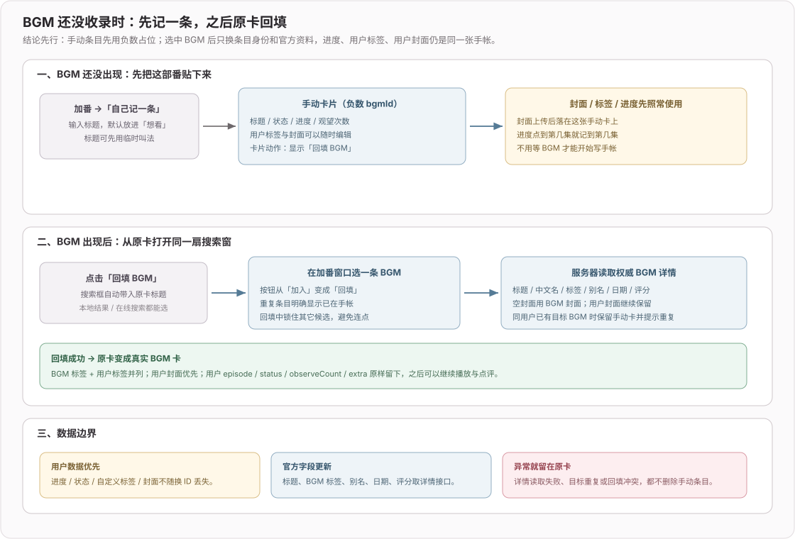
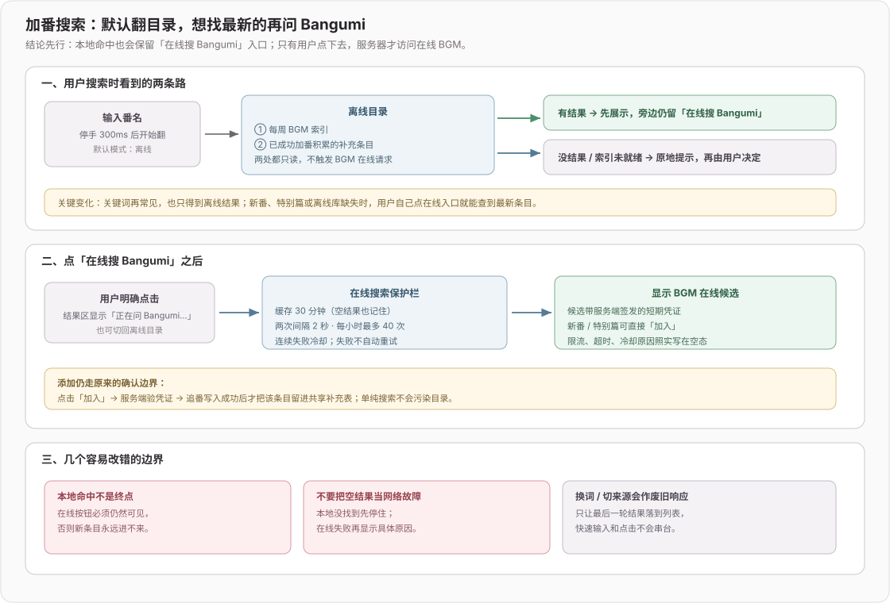

# 2026-09-网页版-功能与界面

> 2026-10-06 归档。原提交结果与验证范围；后续记录可能推翻早期结论。日常入口：[网页版摘要](../2026-网页版.md)，当前功能见 [012](../../ideas/012-网页版.md)。

## 2026-09-30 feat(web): 登录时纱雾举起数位板挡脸

**效果**：登录弹窗左栏的纱雾抱着一块数位板，默认就是彩色的（不用等 hover）。密码框里一有内容、小眼睛关着，她就把数位板举起来挡住脸；打开小眼睛，数位板放低到眼睛下方，她从上面偷看；密码清空，数位板放回胸前。举起 / 放下约 0.5 秒，开关小眼睛约 0.3 秒。只在 PC 上出现，跟其他画稿同一条规则。

**素材怎么来的**（`web/public/assets/pop/shy/00～20.webp`）：

```text
原图 → nano banana 生成两张关键帧：抱着数位板（首）、挡住脸（尾）
     → Kie.ai 上的 Kling 图生视频，同时给首帧和尾帧，3 秒
     → 截 0.5～2.2 秒，每秒 12 帧抽出 21 帧 → 抠绿底、去绿边 → 300px 宽 webp（共约 485KB）
```

- 为什么不用图片模型逐帧生成：每一帧都是独立重画，领结颜色、数位板大小会一直漂移，改提示词也收敛不了；视频模型在生成过程中会保持人物一致，动作也是连贯的
- 偷看不用单独生成：视频里第 13 帧数位板正好停在眼睛下方，倒回那一帧就是偷看

**关键决策**（`web/src/AuthModal.tsx` 的 `useShySketch`）：

- 判断依据是密码本身，不是焦点：带「显示密码」按钮的输入框里，任一个有内容且处于隐藏状态 → 挡脸；都是明文 → 偷看；都空 → 放下。注册页有两个密码框，任一个藏着字就挡脸
- 跟着 `password` / `confirm` / `mode` 的状态重新判断，所以切换登录注册、提交后被清空都会跟上；小眼睛的开关没有对应的状态，用 `onClickCapture` 捕获
- 只换 `src`，向目标帧逐帧前进或倒退，不做补间：举起 / 放下每帧 1/40 秒，开关小眼睛每帧 1/24 秒，留出「偷看」的犹豫感；打开弹窗时预解码 21 帧，切换时不闪白；弹窗重开时帧号归零，因为图片会重新挂载回第 0 帧

## 2026-09-30 feat(web): 追番便签划掉今天的功课

**效果**：撤掉上一条里设置（显影）、福利（星点）、登录（边填边画）的上色，这三处恢复为静态画稿；追番改成不是「从无色到上色」的机制，而是对用户在页面上做的事作出反应：

- **我的追番**：页头便签上手写着「今天的功课」，列出今天更新的番。你在下面的卡片上点 +1（或做任何改动），便签上对应那一行打上 ✓，并被一道铅笔线划掉；全部划掉时，便签上盖下一个「済」字印章

**关键决策**：

- 是否划掉，看这部番的 `updatedAt` 是不是今天。它是服务端时间戳，换设备也算数；乐观更新（`applyLocal`）也会把它写成当前时间，所以点下去当场就划
- 划线用 `::after` 的宽度从 0 过渡到满：只有 `done` 这个类是「新加上」时才会播放动画，首屏已经完成的行直接显示为划掉
- 画稿组件（`SketchSheet`）新增 `children`，用来放这类跟页面联动、压在人物之上的东西

**还存在的问题**：改标签也会被算成「看过」（数据里没有单独的「看了一集」时间）；设置、福利、登录的画稿暂时是静态的，只保留 hover 上色。登录弹窗试过一块速写本滑上来挡脸，但单张立绘加一块矩形不像「她拿起数位板」，已撤掉，等多帧原画。

## 2026-09-30 feat(web): 各页画稿跟着用户的进度上色

**效果**：除了周历，其他几页的画稿也有了自己的故事：用户在这一页做的事，就是纱雾画这张稿子的进度。每页的画法都不一样。另外，所有画稿和动画都只在 PC 上出现：屏幕宽度 ≤1024px，或者设备不支持 hover（手机、平板，包括横屏 iPad），一律不显示。

| 页面 | 故事 | 数据 | 画法（`PaintMode`） |
|---|---|---|---|
| 我的追番 | 今天的功课：今天更新的番里，今天动过进度的有几部，画完签名出现 ✿ | 追番的 `updatedAt`（服务端时间戳，换设备也算数） | `blocks`：几部更新就分几块，从左往右填 |
| 设置 | 拍立得显影：邮箱、密码、密保整理好几项 | 账号状态 | `develop`：从空白相纸慢慢浮现 |
| 放映福利 | 攒星光：攒够 20 颗画完，花掉后颜色也跟着退回去 | 星光数 | `stars`：星点一颗颗亮起 |
| 登录弹窗 | 你一边填，她一边画；提交的那一下画完 | 表单填写进度 | `rise`：从下往上涂 |

**关键决策**（`web/src/SketchSheet.tsx`）：

- 四种画法都是给同一个彩色图层换遮罩，线稿底图不变；星点的位置是固定的，刷新后同一进度亮的是同一批
- 进度一变，纸会轻轻一抖（独立的 `scale` / `rotate` 属性，不覆盖纸原本的倾斜角度），表示「你刚做的那件事被画上去了」；周历的 `rise` 跟着滚动连续变化，不抖
- 「今天的功课」看的是任意一次改动的时间，改标签也会被算成看过——没有单独的「看了一集」时间戳

**还存在的问题**：进度变化时的抖动没有逐帧验证过。

## 2026-09-30 feat(web): 番剧周历滚动时纱雾把页头线稿画完

**效果**：往下翻这一周，就是看纱雾把页头那张线稿画完。页头画稿一滚出视野，就缩成一张拍立得，飞到右下角纱雾按钮的上方，一边滚一边从下往上上色，签名显示「画到周二…」；滚到今天那一栏刚好涂完，签名变成「9.30 紗霧」。点这张拍立得，或者滚回顶部，它会飞回页头，页头那张也已经是完整上色、带签名的样子。

**关键决策**（`web/src/CalendarPage.tsx` 的 `useSketchbook`）：

```text
scroll（rAF 节流）
  → 进度 = (scrollY − 周历顶部) / (今天那一栏 − 周历顶部)，以视口 40% 高度为基准线
  → 只增不减：画好的颜色不会因为往回翻就褪掉
  → SketchSheet paint：彩色图层加遮罩，从下往上推，带 12% 柔边
IntersectionObserver(页头画稿)
  → 离开视口上方 → 停靠；FLIP：从页头画稿当前位置飞到角落（560ms 回弹），反向 380ms
  → 飞回途中仍要可见，动画结束后才隐藏
```

- 停靠位放在纱雾助手按钮的上方，没有替换按钮本身：按钮属于助手浮层，有自己的定位逻辑
- 系统设置了减少动态效果时，不播放飞行动画

**还存在的问题**：窄屏下停靠拍立得隐藏；停靠时会压住最右一列海报的右下角。

## 2026-09-30 fix(web): 我的追番空状态只留一句去加番的提示

**效果**：我的追番空状态去掉了拍立得插画和「去番剧周历」按钮，只留一句文案：未登录显示「登录后就能开始追番」，没有追番显示「还没有在追的番，点上面的「加番」开始吧」。原来那句「追番数据存在账号里，换设备也在」是在对用户解释系统实现，一并删掉。

## 2026-09-29 feat(web): 插画改成贴在页上的画稿

**效果**：上一版的波普插画格全部换成「画稿」。每处都是一张贴在页面上的纸，纱雾平时是铅笔线稿，背后透出淡淡的水彩；鼠标移上去瞬间上色，像刚把这张稿子画完。各处用的纸不一样：

| 位置 | 纸 |
|---|---|
| 周历页头 | 方格画纸 + 两条和纸胶带 + 手写日期签名 |
| 我的追番页头 | 樱粉便签，签名写今日更新数 |
| 设置、追番空状态、追番大厅空状态 | 拍立得 |
| 福利页 | 撕页 |
| 福利未开放 / 出错 | 便签 |
| 登录弹窗 | 方格画纸 |

**关键决策**（`web/src/styles/sketch-sheet.css`）：

- 为什么放弃波普：照搬 xh 的黑色硬投影、斜切色块和爆炸线，放进手账站永远像外来物，细节调到头也只有「好看但不属于这里」。从 xh 借的是「用网站自己的媒介重新演绎角色」这个思路，不是它的外观
- 人物用 `grayscale + multiply`：白色区域透出纸面，只剩铅笔线落在纸上，水彩从线稿底下透出来
- 纸由独立的 `.sketch-paper` 画出来，不直接裁剪人物，这样头部可以探出纸面（`--lift`）；撕页的锯齿用 `clip-path` 只作用在纸上

**还存在的问题**：窄屏下页头画稿隐藏，移动端待定；hover 上色在内置浏览器里无法触发，靠 CSS 规则核对过，未实际验证。

## 2026-09-29 refactor(web): 立绘调整为波普插画格

**效果**：网页版原来的全身立绘和对话气泡全部撤掉，换成统一处理的插画格：人物去色，只有背后爆炸线的颜色从头发等中间调透出来；hover 时瞬间上色并跳一下。周历、我的追番两页的页头改成舞台：右侧一块斜切的浅色块，人物站在页头墨线上，每页的斜块方向和点缀各不相同。设置、福利、空状态和登录弹窗暂时用的是带框的插画格。窄屏下全部隐藏，移动端待定。

**关键决策**（`web/src/styles/pop-art.css`）：

```text
人物图 → grayscale + contrast → mix-blend-mode: luminosity
  白色区域 → 仍是白（皮肤 / 衣领不染色）
  中间调（头发阴影）→ 吸收背后爆炸线的色相 → 几道色线
```

- 不要给图加 brightness 压暗：白色一旦变灰，就会被整片染色（第一版设计稿踩过）
- 抠图腰部的硬裁切线正好压在页头墨线上。试过渐隐（像在溶解）和压线探出（露出裁切痕迹），都不好看
- 页头按钮收到标题下方：圆润的手账按钮和硬边斜块是两套视觉语言，放在一起会打架

**素材**：`web/public/assets/pop/*.webp`，由用户图库原图抠出上半身。抠图流程：nano banana 只负责生成纯绿底图，用它的绿底当蒙版套回原图，所以人物像素全部来自原图，清晰度不损失。

**删除**：周历的可拖动立绘（包括拖动坐标记忆、台词轮换）及其测试脚本 `web/scripts/test-calendar-rig.ts`。

**还存在的问题**：设置、福利、空状态、登录弹窗还没做成和页头咬合的构图；移动端没有插画。

## 2026-09-19 feat(web): 新增备份导入导出

**效果**：设置页新增「备份与恢复」口袋（纱雾口吻、贴纸式单选）。先挑形态再按一个「抄一份给我」：ZIP（`data.json` + 本地上传封面，可导回）、ZIP + 一页速览（再附 `README.md`）、仅 Markdown（只供阅读）。导入只认 `.zip` / `.json`，按条目合并、后写者胜，账号里有备份里没有的不删。别人的备份只导追番、不导点评。意图与取舍见 [docs/intent/web-import-export.md](../../intent/web-import-export.md)。

**导入数据流**（`web/server/backup.ts`）：

```text
multipart file（≤20MB）
  → unpack：PK 头 → unzipSync（忽略 __MACOSX/；data.json 允许套一层目录）| 否则按裸 JSON
  → 校验整批（format/version、bgmId、status、extra ≤16KB、条数 ≤5000）；一条不合法整批拒绝
  → coverFile 只认 covers/ 裸文件名，按魔数识别 png/jpeg/webp/gif ≤4MB，不合格计 missing、回退 cover 网址
  → withCoverFileLocks(所有带图 bgmId) → 一个 db.transaction：
      追番：无 → 整行插入；有且 file.updatedAt > db.updated_at → 整行更新；否则 skipped
            封面文件在事务内 writeFileSync，事务抛错则 unlink 刚写的
            备份条目更新但没带图、账号里已有上传封面 → 保留账号里的图
      点评：exportedBy.userId === uid 才处理；追番不存在跳过；content / draft 各自比 updatedAt
      有增改 → bumpRev 一次（桌面端下次同步拿到）
  → fillCalendarMetadataLater 补空字段
```

- 本地封面在 DB 里只剩哨兵路径、原网址不保留，所以导出时 `cover` 置空 + `coverFile`；导回缺图就走既有「cover 为空 → 周历回填」。
- 下载先 `POST /export-ticket` 拿一张 2 分钟有效、锁定 format 的 JWT 票据，再用带票据的普通链接触发：NeatDownloadManager 一类插件会把 http 下载链接抢去自己请求、不带本站 Cookie，`fetch → blob:` 插件又接管不了（用户要用它提速）。票据挂在 URL 上两边都吃。
- 本地 dev 曾一直「Connection was Closed」：Vite 默认只监听 `[::1]`，NDM 把 localhost 解析成 `127.0.0.1` 连不上，与票据无关。`vite.config.ts` 钉 `server.host: '127.0.0.1'`（浏览器访问 localhost 会 v6/v4 都试；不用 `::` 免得对局域网开放）。线上是 nginx 真域名，不受影响。
- 导出格式参数是 `zip` / `zip-md` / `md`——原本叫 `zip+md`，`+` 在 query 里会被解成空格。
- 新入口按构建检查要求登记为 Agent 功能 `web.backup`（只讲解、不代操作），并同步路由清单

## 2026-09-12 feat(web): 新增 GitHub 快捷注册与登录

**效果**：登录 / 注册窗口新增「使用 GitHub 继续」，桌面与 Google 并排、手机自动堆叠；两项 GitHub 凭据齐配才显示。按已核验主邮箱登录现有账号或注册新账号，不重复建号、不重复发邀请奖励。取消授权静默返回；失败、缺少有效主邮箱和限流分别提示。

**关键身份与状态流**：

```text
点击 GitHub 链接 → 站内 start（保留 returnTo / 邀请码）
  → 签名短效 Cookie：state + PKCE verifier + provider=github
  → GitHub 授权（仅 user:email）→ 回调核对签名 / 有效期 / state / provider
  → 服务端用授权码换 token → 读取已验证主邮箱（允许私密邮箱）
  → 同邮箱账号：直接登录；新邮箱：共用邮箱注册事务 → 仅新账号处理邀请
  → 签发本站 HttpOnly 会话 → 清理跳转 Cookie → 返回原站内页面
```

- 沿用项目现有「邮箱是身份」模型，GitHub 是邮箱核验通道，不建立永久 GitHub ID 绑定，不按可改名的 GitHub 用户名匹配账号。变更 GitHub 主邮箱会改变其对应的本站邮箱落点；本站邮箱验证码 / Google 仍按同邮箱进入同一账号。
- access token 仅在本次回调内使用，不入库、不发给前端、不记日志；请求有 10 秒超时、不跟随重定向、不自动重试。上游失败仅记录阶段、HTTP 状态和错误类型。
- GitHub 与 Google 票据相互隔离；共用 returnTo 清理补上反斜杠 / 控制字符拦截，防止站外跳转。新账号共用注册限流，额度耗尽不阻碍已有邮箱账号登录。
- 同步 Agent 功能开关、只讲解不操作凭据的能力说明与路由清单；保留构建一致性检查，未配置 GitHub 时不向 Agent 宣称已启用。

**验证**：

- `cd web && npx tsx scripts/test-github-oauth.ts`：18 项通过；`--disabled`：1 项通过。覆盖 state / PKCE、私密已验证主邮箱、新老账号、会话、邀请幂等、取消、过期 / 篡改 / 混用票据、上游失败无重试、异常邮箱、回跳与限流。
- `cd web && npx tsx scripts/test-agent-data.ts`：33 项通过；临时数据库，无外网和真实 AI 调用。
- `cd web && npx tsc --noEmit`、`npm run build`、`git diff --check`：通过。首次构建被路由登记检查拦下，核对新增入口并同步登记后通过，未放宽检查。
- 浏览器核对 1280px / 390px 注册窗口、链接目标（保留 hash）和未配置时隐藏 GitHub。浏览器夹具内点击未观察到导航，未据此声称实际授权链路验证完成；服务端 start → callback → 本站会话由隔离接口测试覆盖。

**待配置 / 边界**：本地 `GITHUB_CLIENT_ID`、`GITHUB_CLIENT_SECRET` 均未配置。未创建真实 OAuth App、未进行真实 GitHub 授权、未部署；凭据配置、回调地址与联调步骤见 [web/README.md](../../../web/README.md#github-快捷注册--登录)。旧 Google 的完整 OIDC 回调未做新的真实授权验证；其入口和跨提供方票据校验已回归。无数据库迁移，应用版不变。

## 2026-09-12 fix(web): 支持周历纱雾贴纸在整个视口内拖动

**效果**：纱雾立绘和气泡可一起拖到整个页面可视区域，包括左侧栏上方，不再受宽屏 32% 位移和手机 ±16px 限制。四周留 8px 防止贴纸丢到屏幕外；刷新保留位置，双击 / Home / Escape 归位。横向、纵向布局共用同一个位置。

**关键决策 / 状态流**：

```text
周历原位置 → 只作为归位锚点（手机保留原占位）
人物 + 气泡 → body 固定层 → 指针位移 → 按可视视口和贴纸实际尺寸夹取
松手 / 取消 → 结束捕获 → 保存视口坐标
窗口缩小 / 气泡尺寸变化 → 重新校正边界；滚动页面不带走贴纸
旧偏移数据 → 转为视口坐标 → version: 2；存储失败仅不跨刷新保存
```

- 固定层空白处不接收点击，只有贴纸本身接收拖动；层级低于弹窗，不覆盖弹窗操作。页面卸载时贴纸随组件移除。
- 不再查询周历容器的 `offsetLeft` 推算范围，使用元素引用与实际尺寸；同步更新坐标引用，快速连续拖动不会从旧位置起跳。
- 窄屏仍使用并排小贴纸，低高度窗口缩小人物高度；极端缩放导致贴纸比可视区域还大时优先保留左上抓取点。

**验证**：

- `cd web && npx tsx scripts/test-calendar-rig.ts`：7 项通过（四边、内部位置、桌面转窄屏、缩放偏移、极小窗口、气泡变高）。
- 原代码隔离复现：1280px 宽、初始左侧 978px，往最左拖仍停在 568px；修改后真实浏览器拖到左侧 8px。
- 浏览器：右下边界、刷新保留、390×844 窄屏左上拖动与 Home 归位、布局切换无横向溢出通过；页面滚到 11872px 时贴纸仍留在视口内。
- `cd web && npx tsc --noEmit`、`npm run build`、`git diff --check`：通过。仅网页版 UI；未改周历接口、缓存、追番数据、应用版或部署。

## 2026-09-12 fix(web): 完善追番大厅默认文章与个人评分展示

**效果**：

1. 打开番剧文章页时，有点评优先点评，仅有推荐默认推荐；切换番剧重置选择，同一番剧仍可手动切换两个标签。默认标签直接由返回数据决定，不再先显示空点评再切推荐。
2. 点评 / 推荐文章明确显示「我的评分 N / 10」；追番行为公式算出的 0 分在 API、文章、分享图全链路保留，海报同时保留独立的 BGM 综合分。

**关键决策 / 数据流**：

```text
进入番剧 → 无手动选择 → 点评存在？点评：推荐存在？推荐：空点评
切换标签 → 使用手动选择；切换番剧 → 清除上部番的选择与海报
作者追番信号 → 既有公式 → 个人分（含 0）→ 文章 / Canvas 分享图
BGM 综合分 → 独立字段 → 海报辅助评分，不冒充作者个人分
```

**边界**：不改评分权重，不补造历史评分；作者追番卡已删除时，仍沿用旧的显式分数兜底，旧字段默认 0 仍视为缺失。应用版、线上部署和数据迁移均不涉及。

**验证**：

- `cd web && npx tsx scripts/test-community-reviews.ts`：10 项通过，含隔离数据库公开接口、四种内容组合首屏和 Canvas 绘制指令；改前副本可复现零分丢失与推荐首屏为空。
- `cd web && npx tsc --noEmit`、`npm run build`、`git diff --check`：通过。
- 隔离浏览器夹具使用实际页面与海报组件：验证仅推荐 → 两类都有默认回到点评；实际 Canvas PNG 预览显示个人 0 分和 BGM 4.1。未使用线上账号数据。

## 2026-09-09 fix(web): 共享 AI 连接不再被发起者刷新页面掐断

**效果**：刷新页面不再每次重新付费探测连接。终端里那条 `[vite] Client connection prematurely closed` 也随之基本消失——它就是被掐断的那次探测本身。

**病根：全站共享的连接，生命周期却绑在「碰巧第一个到的人」身上**

```js
// 改前 external-runtime.ts
serverPreparation = connectExternal(uid, owner, {source:'server'}, signal, true)
//                                                                 ↑ AbortSignal.any([c.req.raw.signal, timeout])
```

项目自带 key 时全站共用一条 30 分钟连接，谁先来谁发起。但发起者一刷新，`c.req.raw.signal` 中止 → 探测被取消 → **连接没缓存、钱照付**（`settle(null)` 按 unknown 保留整笔预留，取消并不退钱）→ 下次加载只能再探一次。日志里两次 `kind=probe`、cost 从 0.0175 涨到 0.0183，就是同一次刷新造成的双份支出。

改成共享探测跑在自己的超时信号上。各调用者仍用自己的 signal 停止**等待**（`waitBounded` 那层没动），但共享的活会做完并缓存。中途取消既不省钱又丢结果，跑完则只付实际用量还换来 30 分钟连接——两边都更划算。

**连带发现：`test-agent-connections` 有 7 条用例一年多没执行过**

C11/C12 在等一个 `DAILY_QUOTA`，而 `connectExternal` 早在 `perf(web): 减少 Agent 请求预算并修复限流` 里就改成 `counted=false`（探测不消耗每日轮次），这个拒绝再也不会出现；探测又没人 resolve，于是两条用例永久挂起，把后面 5 条一起带走。进程以退出码 13 结束，但 `npm run test:agent-external` 的 JSON 汇总来自先跑完的另一个脚本，看起来一切正常。

按现在真正成立的语义重写了这两条，17 条用例全部恢复执行；其中 C14 正是本次改动的回归（发起者离开后等待者照样拿到连接、不再补第二次付费探测）。

**注意**：这也意味着**用管道接 grep 读退出码是不可靠的**——`cmd | grep` 拿到的是 grep 的退出码。后续回归一律直接读 `$?`。

**顺带**：稀饭代理的启动探测原来 4.5 秒超时，冷启动经 TUN 出网要现做 DNS 劫持与上游选路，实测热路径 1.1 秒的请求冷启动会超窗，于是误报「直连不通」。候选代理都没验过时再给直连一次 12 秒宽限；仍不通才提示，且措辞改为「仍按直连继续」——全局 dispatcher 本来就没被改动过，真实请求失败时还有 `refreshProxyAfterFailure()` 兜底。

**边界 / 未覆盖**：共享探测现在最长自己跑 30 秒，期间没有调用者也会跑完（这是有意的：钱已经付了，拿到连接才不亏）。冷启动宽限只加在原本要误报的那条慢路径上，正常启动不受影响。十一套脚本 308 项 + connections 17 项，全部按真实退出码验证通过。

## 2026-09-09 fix(web): 待确认动作不再阻塞追问

**效果**：预览卡等确认时仍然可以继续发消息——用户正是因为拿不准才要追问。卡片也不再被埋在屏幕外。

**问题一：待确认的预览把输入锁死了**

```js
// 改前 history-store.ts —— prepared 也算 pending，appendUser 直接 SESSION_BUSY
"... WHERE (status = 'streaming' OR pending_actions = 1)"
```

服务端拦、客户端 `locked` 里却没有这一项，于是输入框看着能用，打完字发出去才报错。拆成两级：

- `expectSendable`（发消息）：只等**真正在跑**的事——回复还在写、上下文在整理
- `expectIdle`（截断 / 清空 / 删除）：仍拦未结动作，因为这些操作会连预览所在的那条消息一起毁掉

`run-store.resume()` 那道同样的闸门一并放开，口径保持一致。

**问题二：动作卡真的会晚到很久——终态 SSE 帧漏了 `actions`**

一开始误判成「卡片被挤出可视区」，把它移到正文正下方就算完。用户反馈已经滚到底、等了很久才出现，重查才找到真因：

```js
// 改前 run-store.finish() —— 终态帧的 message 少了一项
message: { id, seq, status, sources, toolSummaries, usage }
```

客户端 `settle()` 有条捷径：流全程没断且终态帧齐全，就**完全跳过整套回读**，只调 `syncActions()`。而 `syncActions()` 遍历的是 `messages[].actions` —— 终态帧没给，这里就是空的，一张卡都画不出来，得等别的东西（可见性变化、下一次刷新）触发全量回读才冒出来。

补上 `actions` 之后，客户端 `TerminalMessage` 类型和合并同步跟进，并把 `settled` 的判据加上 `Array.isArray(finalized.actions)`：旧服务端不带这一项时退回整套回读，而不是静默丢卡（与该处原有的「缺任何一样都记为不完整」保持同一套约定）。

卡片位置的调整保留——它本身也是对的，只是不是这次的病根。

**顺带堵掉一类静默失败**：`agent-ui-fixture` 里手抄了一份「已注册工具」清单。抄的那份漏掉新工具时，功能说明里引用它的条目会被判成 `pending_sync`，表现是**发送没反应**（run 为 null），而不是任何工具报错——本次加集数推算工具就踩了一次，查了一轮才定位。改成直接引用生产的 `READ_DATA_TOOLS`，让它不可能再漂移。

**问题三：并排出现两张一模一样的「待确认」**

`prepare()` 每次都 `randomUUID()` 插新行，没有任何去重。而模型会重试同一个提案——这次是 `proposeTrackChange` → `proposePlaybackOpen`（要求番剧已在看番里，于是 `NOT_FOUND`）→ 再来一遍，7 次工具调用换来两张内容完全相同的卡，用户不知道该点哪个，点两次还会撞 `REVISION_CONFLICT`。

两个 store 都加幂等：同一会话里内容完全相同、仍在等确认的预览直接复用原 `actionId`。追番按 `(bgmId, changeKind, after)` 比对，播放按 `(bgmId, source, episode)`；换集数、换源或换一本手帐仍然是新提案。

**边界 / 未覆盖**：陈旧预览的生命周期没变——仍靠 TTL 与 revision 冲突兜底，不会因为用户接着聊天就自动作废。「先加追番才能开播放」这个前后依赖当时仍会让模型多调几次工具（去重只消掉重复的卡、没减少调用次数），已在下一条日志里改成组合预览。history 30 / tracks 16 / playback 15 / loop 38 项通过（新增终态帧带 actions、两处去重、H16 挡清空不挡追问），十一套脚本 304 项全绿。

## 2026-09-04 fix(web): 修复手机端后台恢复后页面卡在加载

**效果**：

1. 手机浏览器把网页标签页挂起较长时间后再回到页面，旧入口也能继续拿到对应脚本，页面直接恢复显示。
2. 新入口 HTML 每次回源校验，未知资源路径返回明确的 404；监控分片仍在旁路加载，不参与首屏成败。
3. 入口资源仍未完成时，白屏探针会立即捕获脚本 / 样式错误；回到前台后只触发一次带恢复参数的入口重载，并清理恢复参数。

**根因链路**：

```text
入口 HTML 没有缓存策略 + 构建清掉旧 hash 资源
  → 手机恢复时拿到旧 HTML
  → 旧 JS URL 被 SPA 兜底成 index.html（200 + text/html）
  → nosniff 拒绝模块脚本
  → 页面停在空白加载
```

**修复链路**：

1. HTML 响应改为 `no-cache, must-revalidate`，让挂起标签恢复时重新确认入口版本。
2. 构建保留带内容 hash 的旧资源，资源路径单独 404，避免旧页面拿到 HTML 冒充脚本。
3. 监控动态导入保持非阻塞，React 先挂载，旁路监控完成后再接收可恢复错误。
4. 白屏探针放到主模块之前，从执行时开始计时；监听 `error`、`unhandledrejection`、`pageshow` 和 `visibilitychange`，隐藏态停止计时，前台恢复后再检查

## 2026-09-04 fix(web): 修复追番进度输入与拖动反馈

**效果**：

1. 集数输入框只在进入编辑时执行一次聚焦和全选；连续输入 `12` 会保留两个数字，输入过程中焦点与光标位置稳定
2. 拖动进度条时，卡片右上角集数和 EP 控件跟随指针实时变化；进度条普通点击保持原值，按住拖动从当前进度起算，松手直接写入最终集数，不弹确认框，也不为每个指针移动发请求
3. 已知总集数的桌面宽度在悬停进度条时显示滑动变阻器风格的手帐滑块按钮；手机 / 平板断点不显示该悬停按钮，触控仍可按住进度条调整
4. 未填总集数时，填充按 `集数 / (集数 + 12)` 渐近增长并封顶 99.5%；补上总集数时先保留轨道当前填充位置，再把前段与剩余段分别均匀铺到起点和最终一集，避免 26→28 这类短尾段挤在一起

**交互链路**：

```text
点击 EP n
  → 进入编辑时一次性全选
  → 连续输入 / 回车 / 失焦
  → 统一夹取并写回

桌面悬停已知总集数进度条
  → 滑块按钮提示可操作
  → 按住按钮：以当前集数为起点进入拖动
  → pointerdown / move：本地集数预览 + 卡片数字实时同步
  → pointerup：直接写入最终集数

手机 / 平板
  → 不显示 hover 图标
  → 点击不跳转；按住进度条后按指针位移保持相对距离
```

**关键代码决策**：

1. `focusPending` 将「进入编辑」与「输入中变更」分开，避免每次 `onChange` 都重新 `select()` 导致第二个数字覆盖第一个。
2. `episodePreview` 提升到卡片层，进度组件通过 `onPreview` 更新展示态；`commitEpisode` 仍是唯一写入口，拖动结束时清理预览并只提交一次。拖动记录起始指针与原集数，点击不移动时保持原值，移动后按指针位移保持相对距离。
3. 滑块按钮采用手帐纸片 + 竖向握持纹的变阻器风格，放在独立轨道容器上并跨在细条两侧，不被 12px 进度条裁掉；用 `@media (hover: hover) and (min-width: 961px)` 限制展示范围，平板 / 手机不依赖 hover 发现功能。
4. 轨道与滑块统一使用 `grab` 光标，拖动中切换 `grabbing`，悬停区域的鼠标形状保持一致。
5. 总集数从空变为确定值时由进度组件捕获旧的渐近百分比；锚点前按 `0 → 旧位置` 均匀回退，锚点后按 `旧位置 → 100%` 线性补齐，最后一集稳定落在 100%。到达最终集后消费锚点，后续回退恢复普通 `episode / total` 均匀刻度

## 2026-09-04 feat(web): 支持追番进度直接输入与拖动调整

**效果**：

1. 「我的追番」卡片里的 `EP n` 改成可点按的集数入口：输入目标集数后按回车或移开焦点一次提交，`Esc` 放弃；已知总集数自动夹到 `0~总集数`，连载中的番可直接输入任意非负集数。
2. 已知总集数的铅笔进度条支持点击 / 拖动定位，拖动过程只更新本地描线，松手时才提交一次，避免连续拖动发出成串写请求；键盘聚焦后可用方向键逐集调整，`Home` / `End` 直达首尾。
3. 「想看」第一次把进度改到正数时仍自动转为「在看」，推到总集数仍保持用户手动状态语义；连载中进度条保留原来的渐增展示，直接输入作为精确定位入口。网页版源 CSS 与服务端静态副本同步。

**交互链路**：

```text
点击 EP n
  → 输入数字 → Enter / 失焦
  → 0~总集数夹取（连载中不设上限）
  → 单次 TrackPatch(episode)

已知总集数
  → 点击 / 拖动铅笔进度条
  → 指针位置换算为 0~total 的集数（本地预览）
  → 松手提交最终集数
  → 方向键 / Home / End 走同一提交入口

连载中（totalEpisodes = null）
  → 进度条只展示趋势
  → 点 EP n 直接输入目标集数
```

**关键代码决策**：

1. 集数输入与进度条共用 `commitEpisode`，因此步进器、直接输入、拖动和键盘调整都复用同一套夹取与「想看 → 在看」规则，不会出现入口之间的边界差异。
2. 拖动状态留在 `EpisodeProgress` 内，指针移动只改变 `dragEpisode`；`pointerup` 才调用父层写入，且使用 Pointer Capture，手指 / 鼠标移出细条后仍能收口。
3. 进度条在总集数未知时改用 `progressbar` 语义并停用拖动，避免拿一个猜测上限误导连载进度；EP 输入仍可精确跳到任意集数。已知总集数使用 `slider` 语义并补齐方向键、首尾键和读屏文本。
4. 只增加边框色、光标和焦点描线等反馈，不改变步进器尺寸；`.ep-progress` 与 `ep-num-button/input` 的样式同时写入 `web/src/styles/sketch-ui.css` 和 `web/public/styles/sketch-ui.css`。

**验证**：

- `cd web && npx tsc --noEmit`：通过。
- `cd web && npm run build`：Vite 生产构建与播放器监控 bundle 通过。
- `git diff --check`：通过。
- `sh -n` 交互验证脚本：通过；已知总集数点击 / 拖动、方向键边界和连载中输入夹取样例通过。

## 2026-09-04 feat(web): 优化分享海报的个人评分计算

**效果**：

1. 分享海报的「我的评分」不再把 0~6 颗爱心直接当成分数；爱心、鉴赏神回和有文字备注的鉴赏神回会共同折算成 0~10 分，分数可出现 6.3、7.8 等一位小数，不再只有 6 个档位。
2. 鉴赏神回和备注都按同一个集数基准归一化：已知总集数用总集数，连载中用 `max(12, 已看集数, 鉴赏神回数)`，长番不会因为集数多而天然占便宜，短番在各项信号齐全时仍能达到满分。
3. 追番页、公开追番卡和番剧点评页的海报走同一套公式；BGM 综合分继续单独显示，不会再被误标成「我的评分」。发布点评时也不再把 BGM 分写进个人评分字段。

**计算公式**：

```text
episodeBase = totalEpisodes > 0
  ? totalEpisodes
  : max(12, watchedEpisodes, goodEpisodeCount)

我的评分 = round1(min(10,
  favorite(0~6)
  + 2 × min(goodEpisodeCount / episodeBase, 1)
  + 2 × min(notedEpisodeCount / episodeBase, 1)
))
```

爱心是明确的主观态度，最多 6 分；鉴赏神回和「确实写下感受」各贡献最多 2 分。两个行为信号共享分母，避免 100 集番只因可标记的集数更多就占优势；未知总集数的连载番以 12 集作为保守起点，随着观看进度增长。

**数据流**：

```text
追番卡 / 公开追番卡
  favorite + goodEpisodes.length + 有内容的 goodEpisodeNotes
  + totalEpisodes / episode
      → poster-score.ts 统一折算
      → PosterInput.scoreSignals
      → Canvas「MY SCORE / 我的评分」

番剧点评页
  作者追番卡 LEFT JOIN
  → 服务端按同一公式投影 score
  → 生成海报时作为个人分；tracks.score 仍是 BGM 综合分
```

**关键代码决策**：

1. 公式放在 `web/shared`，浏览器 Canvas 与公开点评 API 共用同一份纯函数；调用方只组装当前追番卡信号，不在不同页面复制权重和四舍五入规则。
2. `scoreSignals` 优先于旧的显式 `userScore`，保证带追番卡数据的海报始终反映最新爱心 / 鉴赏神回 / 备注；没有追番卡的历史点评才保留旧字段作为兜底。
3. `scoreShown` 不再由点评发布流程写入 BGM 综合分；公开页仅在作者追番卡不存在时读取旧显式值，避免把公共评分冒充作者态度。

**验证**：

- `cd web && npx tsc --noEmit`：通过。
- `cd web && npm run build`：Vite 生产构建与播放器监控 bundle 通过。
- `npx tsx -e` 公式样例：爱心单独 `6`、半数鉴赏神回 `4.5`、满信号 `10`、100 集稀疏标记 `6.2`、连载中 `3.7`，均在 0~10 且不是固定整数档。
- `git diff --check`：通过。

## 2026-09-04 fix(web): 优化移动端追番状态页签布局

**效果**：

1. 手机宽度（≤640px）下「全部 / 在看 / 想看」固定在第一行，「观望 / 看完」落到第二行，五个页签不再因为两位数、三位数徽章被挤出横向滚动条。
2. 页签继续保持手帐文件夹样式与触控尺寸，数字徽章、当前态颜色和桌面端单行布局不变；只扩大移动端两行布局的生效范围。
3. 真实网页、服务端播放页静态 CSS 与手帐原型同步采用同一断点，避免不同入口出现不同的页签排布。

**布局链路**：

```text
追番状态页签
  ├─ 桌面（>640px）→ 保持原单行排列
  └─ 手机（≤640px）→ 3 列换行
                   → 第一行：全部 / 在看 / 想看
                   → 第二行：观望 / 看完
```

**关键代码决策**：

1. 沿用已有的 3 + 2 顺序，只把移动断点从 480px 扩到 640px；不改状态数组和筛选逻辑，避免把「看完」单独塞到错误位置。
2. 移动布局仍用固定上限的页签宽度与 `overflow: visible`，让第二行自然换行且不生成水平滚动容器；三位数计数在每个页签内部消化，不改变相邻控件位置。
3. 同步 `web/public/styles/sketch-ui.css` 与设计原型 CSS；桌面端不进入该媒体查询，批准过的 PC 视觉保持原样。

**验证**：

- `cd web && npx tsc --noEmit`：通过。
- `cd web && npm run build`：Vite 生产构建与播放器监控 bundle 通过。
- `git diff --check`：通过。

## 2026-09-04 feat(web): 支持标签搜索过滤

**效果**：

1. 「我的追番」的「类型」下拉新增标签搜索框，打开后自动聚焦，输入关键词即可即时筛出匹配标签，不用在长列表里逐项翻找。
2. 搜索支持中英文大小写不敏感的包含匹配；无匹配时显示明确空态，搜索框带清空按钮，已选标签仍可继续勾选或清空过滤。
3. 标签列表独立滚动，搜索框和「清空过滤」固定在下拉内，沿用手帐描线、青色聚焦和 4px 细滚动条，不改变触发按钮尺寸或页面其他布局。

**交互链路**：

```text
点击「类型」
  → 下拉打开 + 搜索框自动聚焦
  → 输入关键词 → 标签名即时包含匹配 → 勾选 / 取消标签
  → 清空搜索恢复完整标签列表；「清空过滤」移除已选标签
```

**关键代码决策**：

1. 搜索词只存在于 `TagFilter` 的临时状态，关闭下拉时清空；不会写入追番数据，也不会改变外层番名搜索和标签筛选的 OR 语义。
2. 搜索仅过滤展示集合，选中集合仍由原来的 `Set` 管理；因此关键词换来换去时，已选标签不会被误删，计数也继续表示该标签命中的番数。
3. 下拉增加独立的搜索头、列表和底部操作区；列表使用 `min-height: 0` + 独立滚动，避免标签变多时把页面撑高或让搜索框滚出视口。服务端播放页复用的静态组件 CSS 同步更新。

**验证**：

- `cd web && npx tsc --noEmit`：通过。
- `cd web && npm run build`：Vite 生产构建与播放器监控 bundle 通过。
- `git diff --check`：通过。

## 2026-09-04 fix(web): 修复生产环境点评流式问题与分享图缺字段

**效果**：

1. 点评 / 推荐助手的正文在线上恢复逐字出现，不再是「等一会儿整段一次性蹦出来」。
2. 分享图弹窗的预览图在线上能正常显示，不再是裂图（此前只能靠「保存图片」盲存）。
3. 追番大厅生成的分享图重新带上评分卡：发布时勾的评分 → BGM 评分 → 喜爱程度，逐级兜底；标签同样兜到追番卡上的自定义 / BGM 标签。
4. 「在线搜 Bangumi」加进来的追番卡不再永久缺放送日期和评分 —— 分享图的「放送」卡因此能画出来。

**四处根因各不相同，且都只在生产复现**：

```text
① 流式 → nginx proxy_buffering 默认 on，把整条 SSE 攒满缓冲再一次性下发
   dev 直连 node、没有反代 → 看着正常
   修：SSE 响应加 X-Accel-Buffering: no（应用侧，不用动服务器 nginx 配置）

② 预览裂图 → CSP img-src 少了 blob:（海报是 Canvas → toBlob → objectURL）
   下载走 <a download> 不受 img-src 管 → 症状是「能存下来但看不见」，像是没生成
   ⚠ CSP 有**两份**：server/security.ts 的响应头 + vite.config.ts 注入的 <meta>。
     两条策略取交集，只改响应头那一轮完全无效 —— 两处都得改，且 meta 要重新 build
   修：两份 img-src 同时补 blob:，并互相写上交叉引用注释

③ 分享图缺评分 / 标签 → 追番大厅那条路径没有兜底链
   TracksPage：scoreShown → track.score → material；tagsShown → userTags → bgmTags
   CommunityPage：只读 score_shown / tags_shown，发布时没勾就是空
   修：/api/community/reviews/:bgmId LEFT JOIN **作者本人**的 tracks（不能拿别人的），
       补 score → extra.favorite、user_tags → bgm_tags 兜底

④ 放送日期永久为空 → fillDetailLater 的闸门是「bgm_tags 非空就当都齐了」
   在线搜 Bangumi 的条目自带标签、却没有日期和评分 → 一次都不发详情请求，永久停在缺态
   修：闸门换成 needsDetail()（标签 / 别名 / 日期 / 评分缺任一就发），并顺手补 score
```

**边界**：④ 只对**此后新加**的追番生效；库里已经缺日期的老卡不会自愈，要单独补一次数据。

## 2026-09-04 feat(web): 支持自定义追番与 BGM 回填

**效果**：

1. 加番窗口改成「找 BGM 条目 / 自己记一条」页签：入口始终在同一行，手动页只保留一个标题输入框，不再把同一关键词显示两次；找 BGM 仍默认翻离线目录，需要最新条目时再点「在线搜 Bangumi」。
2. 「自己记一条」会建立待回填手动卡，默认状态为「想看」，照常可以推进集数、贴自定义标签和上传封面；卡片上的「回填 BGM」会带着原标题打开同一扇搜索窗口。
3. 选中本地或在线 BGM 候选后，服务端读取权威详情并把原卡变成真实 BGM 卡：标题 / 中文名、BGM 标签、别名、日期、评分和集数信息更新，观看状态、已看集数、观望次数、鉴赏神回、最爱、自定义标签和用户封面继续留在原卡；本地封面文件同步迁移到新的 BGM ID。
4. 卡片把状态分段与「移出」收进右侧尾组：宽卡靠右排列，窄卡尾组整体换行后仍贴右缘；桌面双列、平板单列和 iPhone SE 宽度都不再把「移出」掉到左下角。
5. 小屏手机端（≤480px）「全部 / 在看 / 想看 / 观望 / 看完」按 3 + 2 排版：容器贴内容左缘、每个页签的文字与数字居中；更宽的移动 / 平板宽度保持单行，纸张边框、底色和当前态继续保留。
6. 加番弹窗外框锁定统一高度，切换「找 BGM 条目 / 自己记一条」时保持同一张便签的尺寸，结果区仍维持固定滚动高度。

**回填数据流**：



```text
加番窗口
  ├─ 找 BGM 条目页签 → 默认离线索引 / 显式在线搜索 → 加入真实 BGM 卡
  └─ 自己记一条页签 → 负数 bgmId 手动卡（进度 / 用户标签 / 封面先落库）
                                ↓ 卡片「回填 BGM」
      同一窗口预填标题 → 用户选择 BGM 候选 → 服务端权威详情 + 有序文件锁 + 事务归并
        负数 bgmId → 正数 + BGM 标题 / 标签 / 别名 / 日期 / 评分
        episode / status / observeCount / extra / userTags 保留
        本地封面 uid_负数 → uid_正数；网图继续用用户版本；空封面才用 BGM 封面
```

**关键代码决策**：

1. 页签是加番方式的一级选择，搜索框只属于「找 BGM 条目」；切到「自己记一条」会作废搜索请求并清空结果，避免旧响应回写，也避免重复输入。回填模式只显示一个「找 BGM 条目」页签，原标题直接作为搜索词。
2. 负数 `bgmId` 沿用桌面端手动条目协议，0 仍是保留值；网页 PUT、删除、鉴赏神回和封面上传都识别这类条目，手动卡不触发 BGM 详情请求或播放源定位。
3. 新增 `/api/tracks/:customBgmId/backfill`：先读取 BGM 详情，再在同一事务里检查目标重复、更新主键和官方字段、晋升共享搜索补充；失败或同账号已有目标 BGM 时，原手动卡完整保留。
4. 回填期间对旧 / 新 ID 取得有序封面文件锁，先复制本地封面再提交 DB；成功后清旧文件，事务失败只清临时新文件，避免封面与记录错位。
5. `.trk-tail` 统一包住状态与移出，尾组按内容宽度靠右；空间不足时尾组整体换行，状态与移出保持相邻，不把移出挤到左下角。
6. 小屏状态页签使用可换行 flex 而非固定网格：容器锁定为紧凑宽度并贴左，三项与两项分别居中；480px 以上沿用 PC / 平板单行；悬停状态采用颜色 / transform，交互反馈轻量且不污染手帐底色。
7. `.dlg-add` 使用 `height: min(560px, calc(100vh - 32px))`，搜索页与手动页共享外框高度；短视口沿用弹窗滚动边界。

**边界 / 风险**：

1. BGM 详情读取属于用户点击回填触发的单次请求，超时 / 限流会在弹窗里提示，手动卡仍可继续使用并稍后重试。
2. 同一账号已有目标 BGM 时不自动合并两张卡，返回重复提示，避免误吞另一张卡的进度或标签。
3. 回填后的真实 BGM 卡恢复继续看、BGM 详情与点评入口；手动卡阶段只显示回填动作，不把无效的 BGM / 播放链接暴露出来。
4. 375px 以内的弹窗和卡片采用单列布局；搜索与手动页签、结果区、尾组均设置最小宽度与换行边界，长标题走省略 / 换行而不撑破视口。

**验证**：

- `cd web && npx tsc --noEmit`、`npm run build`、`git diff --check`、`node --check docs/design-mockups/web/anime-sketchfolio/js/app.js`：通过。
- 临时账号实测：手动卡推进到第 7 集、贴 2 个自定义标签并上传封面后回填，响应中的 `episode`、`userTags` 和本地封面哨兵均保留；BGM 标题、4 个 BGM 标签、别名、日期、评分与正数 `bgmId` 已更新，旧封面文件名已清理。
- Chrome 视口实测 1200×800 与 375×667：加番入口页签同一行，手动页只有一个标题框；卡片尾组的「移出」在两种宽度均位于右缘。静态原型同步验证通过。
- 375×667 DOM 位置实测：状态页签容器贴左内容缘，第一行三项文字居中、第二行两项整体居中；加番页签悬停规则只改变颜色与位移。
- 375×667 DOM 位置实测：弹窗搜索页与手动页外框均为 560px；状态尾组的状态分段与「移出」相邻并贴右。

## 2026-09-04 feat(web): 加番支持显式在线搜索

**效果**：

1. 加番弹窗默认只翻离线目录与已积累的补充条目；即使已经搜到结果，「在线搜 Bangumi」仍然常驻，刚公布的第二季、特别篇或离线库漏收的条目可以主动查到。
2. 在线结果与离线结果在同一块列表里展示，在线查询完成后可一键翻回离线目录；本地无结果时空态也提供同一入口，索引未就绪时仍可主动在线搜索。
3. 默认输入不再隐式访问 BGM。在线查询仍沿用缓存、最小间隔、小时配额、失败冷却与具体错误提示；点击「加入」的签名候选继续走原有验签和共享补充表晋升流程。

**搜索数据流**：



```text
输入关键词
  → 默认离线：bgm_index.db → 共享补充表 → 展示结果 +「在线搜 Bangumi」
  → 用户点击在线入口：mode=online → BGM 在线搜索保护栏 → 在线候选
                                   → 加入成功 → 验签 → 追番写入 + 共享补充表
```

**关键代码决策**：

1. `/api/search` 增加显式 `mode=online` 分支；默认分支在本地与补充表都无命中时停在空态，不再自动调用在线接口。在线分支独立于索引状态，索引缺失或已有本地结果都能查最新条目。
2. 弹窗以「模式」和「来源」分开记状态：换关键词自动回到离线，切换来源会清空旧列表；请求代次只接纳最后一轮响应，快速输入或在线响应晚到时不会串台。
3. 在线候选仍携带服务端短期签名凭证，客户端不直接提交可写入共享目录的元数据；搜索本身不落盘，只有追番写入成功后才晋升补充表。

**边界 / 风险**：

1. 在线搜索是用户主动动作，仍受 BGM 的单机单 IP 限速策略约束；限流、超时和冷却只显示明确提示，不自动重试。
2. 离线与在线结果按当前模式替换展示，不做两边的无界合并；需要比较时可在弹窗内来回切换，已加番条目仍显示「已在看番」。
3. 本地开发缺少索引时，默认模式只接受部署站点返回的离线来源；在线模式直接走本地服务端的受控在线入口。

## 2026-09-04 style(web): 清理 SSE 模块注释

**效果**：

- 移除共用 SSE 消费器上的 JSDoc，只保留协议边界说明，符合项目代码注释规范；运行逻辑与请求行为不变。

**验证**：

- `cd web && npx tsc --noEmit`、`cd web && npm run build`、`git diff --check`：通过。

## 2026-09-04 deploy(web): 发布推荐与点评助手并配置外部 AI key

**效果**：

1. 唐人云 VPS 已从旧版 `706c55c` 更新到最终发布 `0b04ed8`，推荐与点评助手的服务器路由、流式生成和 BYOK 前端代码已上线；站点继续由单进程 PM2 + nginx 提供服务。
2. 服务器 AI key 写入仓库外 `/opt/mapletools-data/.env.ai`（`600`、`mapletools` 可读），PM2 ecosystem 通过 `MAPLETOOLS_ENV_FILE` 注入；线上运行时确认使用默认 DeepSeek 地址与 `deepseek-v4-flash-vision-exp`，key 内容未进入代码、构建产物、数据库或日志。
3. BYOK 仍按实施计划走浏览器直连：用户 key 留在当前浏览器 `localStorage`，本站只提供番剧资料和保存草稿，不代理用户的模型请求；Sentry trace 目标不包含第三方 endpoint，Authorization 不会进入本站监控。

**发布 / 回滚锚点**：

```text
发布前备份
  /opt/mapletools-backup/releases/20260903T164103Z/
  ├─ web.db
  ├─ covers.tar.gz
  └─ ecosystem.config.cjs

代码
  706c55c → git fetch/reset origin/main → 0b04ed8
  → npm ci → Vite + player-monitor 构建 → PM2 start --update-env
```

**验证**：

- 本机与公网 `/api/health` 均返回 `{"ok":true}`；PM2 为 `online`，监听 `127.0.0.1:3000`。
- `GET /api/reviews/1` 未登录返回 `401`（路由已存在）；运行时外部 env 检查 `configured=true`，不打印 key。
- 服务器使用外部 key 请求 DeepSeek `/models` 返回 `200`，默认模型与上游认证均有效；没有发送真实点评内容，避免额外消耗额度。
- 构建时 source map 已上传 Sentry，远程 `dist` 中 `*.map` 数量为 `0`；随机 JS 的 `.map` 请求回 SPA `index.html`（`text/html`），未暴露源码。
- 读取 `/opt/mapletools-data/.env.ai` 的真实 key 扫描 `dist` / `server` / `src` 命中数为 `0`。

`npm ci` 报告的 2 个 high 级依赖审计项未在本次发布中擅自升级；回滚使用备份目录和远程 `backup-before-ai-20260903T164103Z` 分支，不触碰用户库的写入内容。

## 2026-09-04 fix(web): 补齐推荐点评助手的 SSE 模块

**效果**：

1. 将推荐与点评助手共用的浏览器 SSE 消费器纳入 Git；此前它被根目录通用的 `lib/` 忽略规则遮住，本机能构建，干净服务器 checkout 会在 BYOK / 初稿流式模块解析阶段失败。
2. 服务器 AI 初稿流和 BYOK 浏览器直连流现在共享同一份已跟踪的 SSE 解析代码，生产构建与本地构建使用同一份源码集合。
3. 增加 `web/src/lib/` 的 Git 忽略例外，后续新增浏览器源文件不会再次落成只存在于开发机的文件。

**验证**：

- `cd web && npx tsc --noEmit`、`cd web && npm run build`：通过。
- 远程干净 checkout 的首次构建命中缺失文件问题后，补齐该文件并重新发布；远程构建结果记录在后续部署条目。

## 2026-09-04 fix(web): 将生产 AI 密钥移出仓库目录

**效果**：

1. 生产模式不再扫描 `/opt/mapletools/web` 里的 `.env` / `.env.local`；服务器 AI 只从已注入的进程环境，或 PM2 指向的仓库外 `MAPLETOOLS_ENV_FILE` 读取。
2. 本地开发仍可用被忽略的 `.env.local` / `.env`，不影响推荐与点评助手的联调；`AI_API_KEY`、接口地址和模型的环境变量说明已补齐。
3. 部署教程明确区分两条 AI 链路：服务器 AI key 留在 `/opt/mapletools-data/.env.ai`；BYOK key 留在当前浏览器 `localStorage`，浏览器直连用户自己的 endpoint，本站只处理番剧资料和草稿保存。

**密钥数据流**：

```text
服务器 AI
  /opt/mapletools-data/.env.ai (600)
    → MAPLETOOLS_ENV_FILE
    → PM2 进程环境
    → server/secrets.ts
    → /api/reviews/* 调用 DeepSeek
    （不下发浏览器，不写 web.db，不进入 prompt / Sentry / 普通日志）

BYOK
  浏览器 localStorage
    → 浏览器直接请求用户的 OpenAI-compatible endpoint（Authorization 只在该请求）
    → 本站 /api/reviews/material + 草稿保存
    （本站不代理模型请求，不接收用户 key）
```

本次只改变密钥加载边界和部署说明，不改变推荐 / 点评 API、草稿数据结构或 BYOK 调用协议。

**验证**：

- `cd web && npx tsc --noEmit`：通过。
- `cd web && npm run build`：Vite 生产构建与播放器监控 bundle 通过。
- 生产模式外部 env loader fixture：确认外部文件能注入 key、base URL、model；确认生产模式忽略工作区 `.env.local`。
- `node --check docs/design-mockups/web/anime-sketchfolio/js/app.js`、`git diff --check`：通过。

## 2026-09-04 style(web): 优化加番弹窗纱雾文案

**效果**：

1. 加番弹窗的副标题、搜索框占位、加载 / 空态 / 无结果 / 索引提示、在线补充提示、已在手帐状态和操作按钮统一成短句纱雾口吻；打开空弹窗就能感受到手帐主题，同时保留「想看」和搜索范围等关键信息
2. 搜索框补上可访问标签；索引未就绪时不再把同步脚本和服务器操作直接摊给用户看

**关键文案流**：

```text
打开弹窗
  → 哼，挑一部想看的，贴进纱雾的手帐里吧。默认先放在「想看」哦。
  → 输入番名 → 纱雾正在翻目录……
      ├─ 没输入 → 把番名写进来，让纱雾帮你翻翻……
      ├─ 有结果 → 「贴进手帐」；已存在 → 「已经在手帐里啦」
      ├─ 只命中在线补充 → 本地没翻到，纱雾再去 Bangumi 找找看……
      └─ 没结果 → 没有找到「关键词」……换个名字再试试？ + 具体失败原因
  → 点击「加入」 → 追番状态写为「想看」 → 纱雾便签确认
```

## 2026-09-03 feat(web): 新增番剧周历双布局与立绘拖动

**效果**：

1. 周历默认回到截图里的横向卡片浏览：宽屏每个星期一行，卡片可以继续向右拖动；窄屏保留日期章选天和单日横滑，不让右侧立绘占掉卡片宽度。
2. 顶部提供「横向」与「纵向」两种看法，采用常见的布局切换文案。前者保持横向卡片和箭头翻页，后者把周一至周日的所有卡片换行铺开，整页只纵向滚动。
3. 纱雾立绘和气泡合成一张可拖动贴纸：鼠标按住任意一处即可移动，拖动过程中不会丢失指针；桌面 hover 自动淡出，移开后恢复，避免挡住封面和标题。位置及看法会保存在浏览器，下次打开仍沿用；双击或按 Home / Escape 可归位立绘。

**关键交互与状态流**：

```text
页面进入
  → layoutMode = localStorage.calendar-layout（默认 horizontal）
  → horizontal：宽屏 = 7 个横滑卡片行；窄屏 = 日期章 + 当前日横滑
  → vertical：7 个星期节头 + 可换行卡片网格，无横向翻页器

立绘贴纸
  → pointerdown 捕获指针
  → pointermove 更新 x/y（按视口边界收口）
  → pointerup 保存位置到 localStorage
  → hover opacity 0.14；双击 / Home / Escape 清回默认位置
```

布局开关只改变渲染方式，不改变周历请求、14 天缓存或追番写入链路；所有卡片仍复用原来的封面代理、追番角标和乐观同步。

**边界 / 风险**：

1. 立绘位置仅保存在当前浏览器；localStorage 不可用时仍可在本次页面内拖动，刷新后回到默认位置。
2. 竖直模式不再创建横向滚动容器，卡片数量增加只会拉长页面；横向模式继续保留拖拽惯性和箭头分页。
3. 立绘拖动范围会按桌面 / 窄屏边界收口，避免误拖造成页面横向溢出；API 数据与登录追番状态保持原有行为。

# 网页版（2026）

> 专题开发日志。新记录在上；记录规则和总入口见 [`DEVLOG.md`](../../../DEVLOG.md)。

## 2026-09-01 feat(web): 新增推荐与点评助手

**效果**：

1. `看完` / `在看` 的番剧卡片多一个「点评」入口：选 `观后点评` / `推荐文` → 选语气·篇幅·剧透范围 → AI 出 4~6 道**选择题**（每题 4~6 个写好的口语化候选答案，单选 / 多选，每题带「＋ 其他」可手打补充）→ 用户勾选 → **初稿逐字流式写出**（SSE，能看着字冒出来）→ 可编辑 → 保存草稿 / 发布 / 复制 / 下载海报
2. 每账号每番每模式各留一份草稿 + 一份当前内容；两模式独立，重新提交只覆盖对应模式；发布清空草稿（含问题、答案）
3. 账号公开开关打开且已发布 → 点评 / 推荐进入大厅
4. **分享海报**：自己的追番卡「分享图」、别人手帐的点评弹窗、番剧点评页每条点评。规则：番剧维度只出一张，两模式都有时用点评
6. 服务器 AI 默认用 DeepSeek（`deepseek-v4-flash-vision-exp`，关 thinking）；设置页「点评助手」可切自配 API（浏览器直连，key 只落本机 localStorage，不入库、不同步）
7. AI 不可用时问答 / 编辑 / 保存 / 发布 / 海报全部照常，只是不出 AI 文本

**数据边界**：

```text
review_drafts    (user_id,bgm_id,mode) 唯一   写作全过程临时态，发布/删除即整行清掉
  questions  JSON [{q, options[], multi}]        选择题
  answers    JSON {picks:{题号:[选中选项原文]}, custom:{题号:补充文本}}   勾选 + 逐题补充
review_contents  (user_id,bgm_id,mode) 唯一   「当前内容」，published=1 是公开门槛之一，撤回置 0 保留正文
users.ai_config  JSON {provider,endpoint,model}   —— API key 绝不入库，只在浏览器 localStorage
```

两张表是网页端自有数据：不进 `tracks.extra`、不参与 `tracks_rev`（桌面同步不受影响）

**AI 调用链**：

```text
服务器 AI:  questions  → server/ai.ts chat()         DeepSeek stream:false + response_format json_object
            generate   → server/ai.ts chatStream()   DeepSeek stream:true；idle 看门狗 + 断线自动续写（≤5 次）
              hono streamSSE 透传 {t:delta|retry|done|error} 给前端
              前置：server/reviews.ts buildMaterial（读 BGM /v0/subjects）+ 限流校验，都过了才开流
              流结束（含续写用尽仍没写完）都落库 review_drafts.body
BYOK:       前端 GET /api/reviews/:id/material 拿资料 → 浏览器直连用户 endpoint（byokChatStream 同样 SSE）
              → 生成结果回存 PUT /api/reviews/:id/:mode/draft（草稿恢复不依赖 AI 来源）
前端 SSE 消费统一走 src/lib/sse.ts consumeSSE
```

**边界 / 风险**：

1. `AI_API_KEY` 走 `web/.env.local1；生产在部署环境配`
2. BGM `/v0/subjects` 抖动时资料退化为追番表里的标题，仍可生成 / 手写
3. 海报封面走 `/api/cover` 代理，加载失败画占位块仍出图
4. 追番卡操作行加「点评」后是 4 个按钮：看完 / 在看的卡（`.has-review`）把「状态分段 + 移出」收进 `.trk-tail` 靠右组（药丸留左侧），移出不再落到左下角；`row-gap` 从给观望气泡留的 32px 收回 8px（这类卡没有那个气泡）。观望 / 想看卡结构不变
5. 写作设置「选项 + 一行说明」
6. 初稿采用流式（`stream:true` + SSE），正文一段段冒出来。生产是唐人云 VPS 上的长驻 Node 进程（`server/node.ts` + `@hono/node-server`）
   - **韧性层**（`chatStream` / `byokChatStream`，智能体对话窗口以后复用同一套）：
     - idle 看门狗：`STREAM_IDLE_MS`(25s) 内没有新 token → abort 当前连接，算一次中断
     - 中断（连接失败 / 提前结束 / 卡死 / 5xx / 429）自动重连，最多 `STREAM_MAX_ATTEMPTS`(5) 次；绝对上限 5min 兜底
     - 已写出一部分的，重连时把这部分 + 最后半句接回上下文让模型**续写**（`[...msgs, {assistant: 已写}, {user: 从「半句」处补完再写到结尾}]`），不是从头再来。DeepSeek 无真正断点续传，这是最接近的效果
     - 按句尾标点定位断点交给模型补，缝得平；再叠一层 50 字内前缀去重兜底模型重复开头
     - `finish_reason` / `[DONE]` = 真写完，不会把已完成的误判成中断再重连
     - 4xx（请求本身错）直接失败，不重连；5 次连接全废才抛错让用户手点重来；有半截就带 `truncated` 返回、照常落库
   - SSE 事件：`{t:delta|retry|done|error}`；`retry` 让前端显示「网络抖了下，重连中…（第 N 次）」
   - 计费：每次点「照这些写一版」最多 `STREAM_MAX_ATTEMPTS` 次连接，续写只重发已写部分当 prompt（几百 token）+ 生成剩余，不是整篇重来；按用户 30 次/时限流兜底；每次连接日志打 `耗时 / 第几次连接 / tokens / 字数`（`[ai]` 终端，`[byok]` 浏览器 console）
