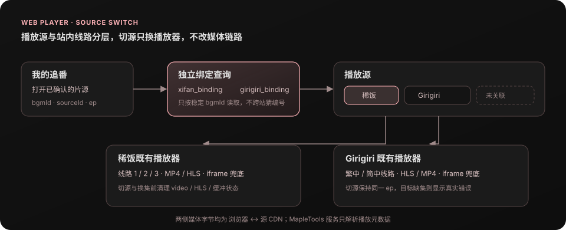
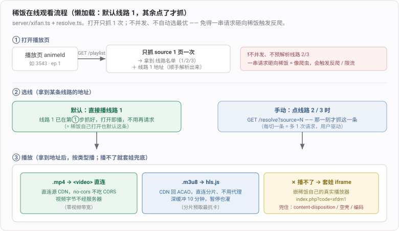

# 网页版在线观看早期记录

> 2026-10-06 从网页版日志迁入；原始提交记录按原顺序保留，不代表当前实现。当前入口：[011](../../ideas/011-在线观看.md)。

## 2026-08-29 fix(web): 跳转源站自动选择快源

**效果**：

1. 在看番卡片选择「跳去源站看」后，稀饭会先按已验证的线路策略定位快源，再进入对应的源站线路页，不必手动再切一次
2. 继续看弹窗里的候选链接也复用同一跳转链路；点击时先打开本站地址，解析完成后再 302 到源站，浏览器弹窗不会被异步请求拦截
3. Girigiri 同样接入同源重定向入口，当前保持源站线路 1 为默认，解析失败明确回落线路 1

**关键链路**：

```text
用户点击「跳去源站看」
  → /api/xifan/source-page 或 /api/girigiri/source-page
  → 稀饭复用现有快源判定（默认线路慢时只补看下一条）
  → 302 到具体源站线路页
```

**边界 / 风险**：

1. 只优化用户明确选择的「跳去源站」路径；站内播放页仍保持懒加载，不自动解析全部线路
2. 定位失败不阻断源站入口，回落到线路 1；失败原因写入服务端终端，不向用户伪装成已完成快源定位
3. 本次只调整跳转地址与服务端解析，不改变追番数据、绑定关系或视频流代理

## 2026-08-15 feat(web): 在线播放页支持切换稀饭与 Girigiri 源

**效果**：

1. 稀饭和 Girigiri 播放页新增独立「播放源」层；两站都已关联时可在播放器内直接切换，并保持当前集数，站内「线路」继续独立切换。
2. 播放链接携带稳定 `bgmId`，服务端分别读取 `xifan_binding` 与 `girigiri_binding`，不拿一个站点的编号猜另一个；换集后仍保留跨源上下文。
3. 切源、换集和离开页面都会先清理当前 video、HLS、iframe 与缓冲状态，再进入另一张既有播放页；媒体仍由浏览器直连源 CDN，不经过 MapleTools 服务器。

**关键流程**：



**边界 / 风险**：

1. 未关联的源会明确显示「未关联」，仍需回「我的追番」完成一次候选确认；本次不在裸播放器里重复实现全站搜索和验证码弹窗。
2. 切源保持用户当前选择的集数，不猜测两站集数是否齐全；目标源没有该集时显示该播放器原有的真实错误。

## 2026-08-08 perf(web): 优化稀饭线路一跳转后卡顿

**效果**：

1. 稀饭线路一从内嵌官方播放器改为网页原生 `<video>` 直连：播放页统一使用 `no-referrer`，可正常播放 `apn.moedot.net → pan.wo.cn` 的附件型 MP4；若个别浏览器直连失败，仍自动回退官方 iframe。
2. MP4 跳转或播放耗尽缓冲时，不再反复「播几秒、停几秒」：播放器先保留原进度与播放状态，以静音 1/16 倍速保持浏览器持续拉流；前向缓冲达到 10 秒后回到原进度、恢复原倍速与静音状态再播放。
3. 视频数据仍由浏览器直接向源 CDN 获取，不经过 MapleTools 服务器；HLS 线路继续沿用原有 hls.js 深缓冲，不受本次改动影响。

**关键流程**：


## 2026-08-07 feat(web): 新增 Girigiri 在线观看源

**效果**：

1. 追番卡片从只有稀饭一个在线入口变成稀饭 / Girigiri 两个并列入口；两个站点分别维护绑定，已绑定的资源直接打开，未绑定的资源先按官网周表匹配并让用户确认。
2. Girigiri 周表覆盖不到往季、剧场版时，可以进入 Girigiri 全站搜索；搜索沿用官网验证码流程，验证码 cookie 按 MapleTools 账号隔离，选中结果后保存 `bgmId ↔ GV…` 绑定。
3. 新增 Girigiri 播放页：读取官方 `/playGV{id}-{source}-{ep}/` 的 `player_aaaa`，支持 `encrypt=2` 的地址解码、繁中 / 简中线路切换和整季选集；HLS / MP4 地址由浏览器直接播放，直连失败时回退官方播放器 iframe，视频字节不经过 MapleTools 服务器。

**关键代码**：

官网入口会从 `bgm.girigirilove.com` 跳转到 `ani.girigirilove.com`。周表请求使用官网的 `POST /index.php/ds_api/weekday`，播放页使用 MacCMS 路由；`player_aaaa.url` 在 `encrypt=2` 时按「Base64 → percent decode」还原为 CDN `m3u8` / `mp4` 地址

```text
追番卡片
  ├─ 稀饭入口   → 稀饭周表 / 搜索 → 用户确认 → bgmId ↔ animeId → 稀饭播放页
  └─ Girigiri 入口 → Girigiri 周表 / 搜索+验证码 → 用户确认 → bgmId ↔ GV… → 播放页
                                                                    ↓
                                      player_aaaa → CDN m3u8 / mp4 → 浏览器 video
                                                                    └→ 直连失败 → 官方播放页 iframe
```

## 2026-08-07 fix(web): 修复继续看集数偏移

**效果**：

1. 追番卡片计数为 N 时，「继续看」显示并播放 EP N，不再错误跳到 EP N+1
2. 尚未开始的 0 集仍从 EP 1 播放；达到总集数时停留在最后一集，不再生成不存在的下一集链接

## 2026-08-07 feat(web): 稀饭支持搜索非周历资源播放

**效果**：

1. 往季旧番、剧场版等不在稀饭本季周表里的追番，点「继续看」后可改用稀饭全站搜索；完成验证码、选择正确资源后会记住绑定并直接进入现有播放页
2. 验证码 cookie 按登录用户隔离，不同用户同时搜索不会串验证码；错误验证码按接口 JSON 的精确 `code` 判断，不再把 `code=1002` 误判成成功
3. 本地开发缺少 `bgm_index.db` 时，「加番」搜索自动借线上公开搜索 API 返回结果；账号、追番数据和稀饭会话仍使用本地服务，生产环境继续读取自己的离线索引

**关键流程**：

```text
继续看 → 本季周表有候选 ──→ 选择资源 ──────────────────────┐
       └→ 无候选 → 全站搜索 → 验证码 → 搜索结果 → 选择资源 ─┤
                                                            ↓
                                              保存 bgmId ↔ xifanId → 播放
```

服务端为每个登录用户维护一个 15 分钟的短时稀饭 cookie 会话；搜索只负责定位 `xifanId`，视频仍走原有 `/playlist` + `/resolve` 浏览器直连链路，不经过 MapleTools 服务器传输。

## 2026-07-22 fix(web): 修复稀饭直连失败问题

**效果**：

1. 追番卡片「继续看」按钮激活（原是灰占位）：点一下 → 定位到稀饭对应番剧 → 直接开播到**下一集**（EP = 已看 +1），跳过「开稀饭 → 搜索 → 输验证码 → 找番 → 翻集」整套。这就是 012 说的「追番 = 在线观看的快捷定位引擎」落地。
2. **首次点弹「选择稀饭片源」**让用户确认是哪部（按名字匹配周表候选），确认即**建绑定并记住**；之后同一部直接是链接、秒开，不再弹。
3. **绑定跨季持久**：周表换季后原番从周表消失，绑定仍在、照常开播。
4. **播放页参考 app 播放器重做**：标题 + EP 徽标、**集数网格**（整季一格一集、当前高亮，点即换集，从 watch 页扒集数列表）、线路卡片，玫瑰主色对齐 app/web 暗色主题。
5. **网盘下载型线路秒切 iframe**：`apn.moedot.net`→`pan.wo.cn/openapi/download` 这类**下载链接**，`<video>` 喂它会触发浏览器**下载 400MB**（还播不了）、白等几秒才切套娃 —— 现在按 URL **直接判死**走 iframe，不碰 `<video>`（`classify()` 里加的规则，各端一致、非 localhost 专属）。

**关键机制**：追番存 **BGM id**，稀饭播放页要**稀饭自己的 animeId**，两套编号、无确定映射，唯一联系是标题；而稀饭 search 有验证码（过不了）。突破口 = 稀饭「追番周表」的数据接口**不设验证码**，直接给出 animeId：

```
追番卡片「继续看」
  ├─ 已绑定 ───────────────────────────────→ 播放页(animeId, EP=已看+1)
  └─ 未绑定 → 周表匹配(免验证码) → 候选选择框 → [点确认 = 建绑定·落库] ─┘（之后走上面那条）
```

```ts
// server/xifan/weekday.ts —— POST 一个中文星期就回那天全部在播番，每条自带 animeId
//   POST /index.php/ds_api/weekday   body: weekday=一   (一/二/…/日)
//   → { code:1, list:[{ vod_id:3552, vod_name:"最强废渣皇子…", vod_remarks:"03|周一22:00" }] }
// vod_id 就是 animeId、vod_name 是中文名 —— 拿它跟追番标题比，把 bgmId 定位到 animeId
```

```tsx
// 卡片：绑过 → 原生 <a>（无异步、不吃弹窗拦截）；没绑 → 点了去周表定位、弹候选让用户确认
{binding
  ? <a href={playPageUrl(binding.xifanId, nextEp(t))} target="_blank">继续看 EP {ep}</a>
  : <button onClick={onContinue}>继续看 EP {ep}</button>}
```

播放路由（`resolve.ts` `classify()`）—— 下载型链接直接判 iframe：

```ts
if (/\.m3u8(\?|$)/i.test(url)) return 'hls'                                   // hls.js
if (/apn\.moedot\.net|pan\.wo\.cn|\/openapi\/download/i.test(url)) return 'iframe' // 302→网盘 download，直接套娃
return 'mp4'                                                                  // xfvod 干净直链 → <video> 直连
```

## 2026-07-21 test(web): 新增稀饭在线观看

**效果**：

1. web 新增稀饭在线观看后端 + 播放器原型（`server/xifan.ts` + `server/xifan/resolve.ts`）：给定稀饭 animeId → **浏览器直连源 CDN 播放，视频字节不经服务器**（零视频带宽，符合 012「视频不给服务器加码」）。目前是独立测试页 `/api/xifan/play-page`，**还没接追番卡片「继续看」按钮**。
2. **懒加载选线**：打开只抓 **1 次**（拿线路 1 地址 + 全部线路名单），线路 2/3 **点了才解析**。不并发、不自动选最优 —— 一串请求砸向稀饭像爬虫、会触发反爬 / 限流。
3. **按类型播 + 套娃兜底**：`.mp4` → `<video>` 直连；`.m3u8` → hls.js（CDN 回 ACAO 直连分片 + 深缓冲 10min、暂停也灌）；直连播不了 → 嵌稀饭真实播放器 iframe，兜住 content-disposition / 空壳 manifest / 编码。
4. **免验证码 + 秒回**：验证码只在 search，播放页 / 周表页都不设 → 当季番从周表页直接拿 animeId；解析结果进共享缓存，刷新 / 换人秒回。



**关键代码**：

打开只抓 **source 1 页一次**，就同时拿到「线路 1 地址」和「全部线路名单」—— 名单靠正则扒源 tab（web 侧不为几个 `<a>` 加 cheerio），**不用逐条解析**；线路 2/3 等用户点了才抓：

```ts
// server/xifan/resolve.ts —— getPlaylist
const body  = await fetchHtml(`/watch/${animeId}/1/${ep}.html`) // 一次
const first = parsePlayerData(body)?.url        // 线路 1 地址（顺手，打开即播）
const lines = parseSourceTabs(body)             // 源 tab → [{source,name}]，全部线路名，零额外请求
// 线路 N 等 resolveLine(animeId, ep, N) 在点击时才抓，绝不一次性并发（防反爬）
```
