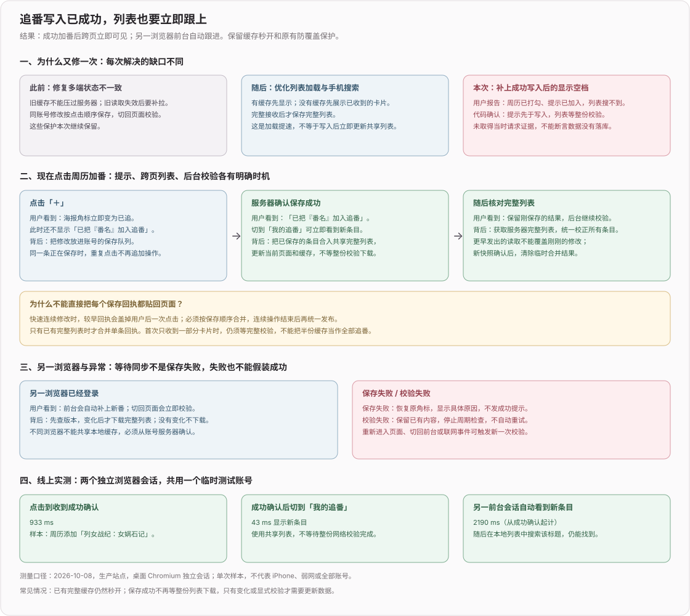

# 014 - 网页版多端追番状态一致性

> 开始：2026-08-15
> 2026-10-06 复核：保留为现行一致性合同，不归档。基础修复已有历史验证，但桌面同步正在另行修改；下面的 08-15 测速不是今天的验收。10-04 列表已支持 NDJSON 分批读取，只有完整快照才进缓存；“全量读取”指权威集合完整性，不要求单包返回。

> 2026-10-08 更新：成功写回执先合入共享完整集合，再由全量读取校正；前台版本检查改为 3 秒。当前流程与新实测见下文；完整排查记录见 [10-08 DEVLOG](../devlog/2026-网页版.md#tracks-write-sync-20261008)。08-15 的旧证据保留历史口径。

## 结论

1. 2026-08-08 的修复只解决了「页面挂载 / 刷新后，旧 `localStorage.updatedAt` 反过来压过服务器」；它没有实现另一台持续打开的设备自动刷新。
2. 当时所谓「当前会话的写操作版本号」是当前浏览器标签页内存里的递增计数，不是 SQLite 的 `tracks_rev`，不跨标签页、浏览器或设备。GET 发出后若本页开始写入，它只会丢弃那份 GET；旧实现没有等待写请求结束，也没有再拉一次服务器。
3. 历史（2026-08-15）：当时暖态接口实测为毫秒级，旧页面长期陈旧源于没有下一次读取；这不代表当前网络等待总是很短。10-08 另确认成功回执没有即时更新共享列表、周历提示先于写入完成，不能据此断言报告当时未落库。
4. 当前使用「服务器权威 + 生命周期刷新 + 轻量版本校验」：切回页面立即校验；有完整快照且无待收口写入时先查 revision / viewRev，只有变化才拉完整列表，否则确保一次完整读取。前台每 3 秒检查版本，读取失败后停止周期检查。当前不常驻 SSE / WebSocket。
5. `localStorage` 继续只做展示缓存，不能和服务器按时间戳竞争。已有完整集合时，把成功写回执按写队列合入临时确认集合，连续写结束后立即发布给页面与缓存；后续权威完整快照仍整份校正，并清除临时确认集合。

## 原说法究竟表示什么

旧流程实际是：

```text
页面挂载：记住当前标签页内存计数 n → 发 GET
用户修改：计数变成 n + 1 → 发 PUT / DELETE
旧 GET 返回：发现计数不再是 n → 丢弃整份 GET
```

这能避免「用户刚点到第 5 集，较早发出的 GET 又把画面盖成第 4 集」，但有两个缺口：

- 丢弃后没有补拉，所以这份 GET 里其他设备已经改好的其他记录也一起丢了。
- 另一台设备若页面持续打开，没有挂载、聚焦或轮询触发，根本不会发送 GET，可以一直停在旧状态。

因此「等写请求收口」不是旧代码真实行为，DEVLOG 已明确更正。

## 客户端状态流程

每个账号在浏览器进程内维护一份协调状态，追番页与周历页共用：

```text
已有完整快照 / 临时确认集合 ──立即展示──→ 页面
    └─ 挂载 / focus / visible / pageshow / online ──→ 校验
          ├─ 有完整快照且无待收口写入 → 检查 revision + viewRev
          └─ 版本变化或缺少完整快照 → GET /api/tracks → 权威校正

前台每 3 秒 ──→ 检查 revision + viewRev
                   ├─ 未变 → 不下载列表
                   └─ 变化 → GET /api/tracks → 权威校正
读取失败 ──→ 停止周期检查，保留内容；生命周期事件或手动重载再校验

本页 PUT / DELETE → 乐观 UI → 同账号按用户操作顺序串行发送
    ├─ 成功回执 + 已有完整集合 → 按保存顺序合入临时确认集合
    └─ 最后一个连续写结束
          ├─ 有临时确认集合 → 立即通知共享页面与缓存
          └─ 无论成功 / 失败 → GET /api/tracks → 权威收口，清除临时集合
```

具体约束：

- 全量读取单飞；生命周期事件在短窗口内合并，不因 `focus + visibilitychange` 连发重复请求。
- 同账号的 PUT / DELETE 共用写入队列；即使前一项失败也继续后一项，避免 5→6 的请求按 6→5 落库。
- 写入期间已发出的旧 GET 会失效；最后一个写结束后固定安排新的全量读取。
- 页面不直接拿单条 PUT 回执覆盖 UI；成功回执由写队列按顺序合并，连续写结束后统一通知。合并基底必须是完整集合，不能把首批流式内容存为完整缓存。
- 401 或网络失败只显示读取错误，不会解释成「追番列表为空」并清掉缓存。
- 同源其他标签页改写追番缓存时，通过 `storage` 事件触发服务器复核，而不是盲信另一个标签的乐观值。

## 服务端一致性与响应速度

用户追番字段与 `tracks_rev` 必须属于同一事务：

```text
网页 PUT / DELETE
  → BEGIN IMMEDIATE
  → 修改记录（删除仅在确有记录时成立）
  → tracks_rev + 1
  → COMMIT

桌面端 POST /sync
  → 在事务外完成请求体校验
  → BEGIN IMMEDIATE
  → 读取并比较 baseRev
      ├─ 不一致：ROLLBACK，返回 409
      └─ 一致：整包替换 + tracks_rev + 1 → COMMIT
```

旧实现先在事务外比较 `baseRev`，再等待外部周历，最后才整包覆盖。这个间隙允许网页 PUT 成功后又被旧整包覆盖，而且两边都返回成功。现在 revision 比较、集合替换与 bump 位于同一个 SQLite 立即事务，过期整包只能得到 409。

BGM 详情与周历是附属元数据，不应阻塞账号状态：

- GET / PUT / DELETE / 同步上传先读取或提交 SQLite 后立即响应，不等待最长 4～10 秒的外部请求。
- 周历按用户单飞后台补空字段；详情网络返回后再次读取当前行，只填写仍为空的标签、别名、日期和封面。
- 系统元数据回填不递增 `tracks_rev`，避免桌面端上传虚假冲突；当前代码另用 `tracks_view_rev` 标记网页元数据变化。前台同时检查两种版本，视图版本变化也会重新获取完整列表。

## 为什么现在不做服务器推送

百度同步空间类产品通常有常驻客户端、变更日志和长连接；本站当前是小规模网页，且实际需求是电脑、手机依次使用。此时：

- 从后台切回设备时立即校验，不等待周期检查。
- 两个页面持续前台时，每 3 秒读取两种版本，仅变化时下载完整列表；网络和响应体传输仍会增加可见延迟，检查间隔不是端到端保证。
- SSE / WebSocket 还需要连接保活、重连、代理超时、会话失效和多实例广播；在没有「两台设备同时亚秒联动」要求前，这些复杂度没有对应收益。

若以后需求变为两台设备同时操作并接近实时显示，应另立功能增加服务端变更推送；当前 revision 接口仍可作为断线后的补偿校验。

## 验证证据（2026-08-15）

- 隔离 `DATA_DIR` 的暖态本地接口连续三次全量 GET 为约 0.9～3.7ms，revision GET 为约 0.6～0.7ms；服务端响应速度不是旧页面长期陈旧的原因。
- 两个真实浏览器页面共用同一测试账号：第二页面保持前台且初始为 0 部，外部会话新增后在一个 15 秒周期内自动变成 1 部；页面进入后台后外部会话把进度改为第 7 集，切回 0.9 秒内显示 EP 7。
- 延迟 Promise 竞态覆盖「旧 GET 与写交错、连续写顺序、首写失败后继续、切页订阅、旧 full 的聚焦后补拉、revision、storage、401」，没有留下测试脚本或引入测试框架。
- 隔离 SQLite 并发覆盖：过期 `baseRev` 整包上传返回 409 且保留并发 PUT；两个相同 `baseRev` 的整包上传恰好一个 200、一个 409；重复删除不存在记录不递增 revision；延迟详情回填不覆盖同步期间写入的新字段。

## 验证证据（2026-10-08）



- 本地与服务器 20 项加载 / 搜索回归通过；新增成功回执即时发布、连续写顺序与失败清理、聚焦时发现其他会话变化覆盖。移除即时通知后新回归出现断言失败，恢复后通过。
- 生产站点两个隔离桌面 Chromium 会话共用临时测试账号，周历新增“列女战纪：女娲石记”：点击到成功确认 933 ms，成功确认后切页显示 43 ms，另一前台会话从确认起 2190 ms 自动出现新条目，搜索可找到；测试数据已清理。单次样本，不代表手机或弱网。
- 此次验证网页加番与浏览器会话同步，没有重新验收桌面整包上传的并发冲突处理。部署标识、备份位置和排查路径见 [10-08 DEVLOG](../devlog/2026-网页版.md#tracks-write-sync-20261008)。

## 验收条件

1. 设备 A 收到成功回执后，已有完整集合时切到另一追番页面立即显示合并结果；设备 B 切回立即校验，持续前台按 3 秒周期检查变化，之后还需完成必要的网络读取。
2. 本页初始 GET 与写请求交错时，旧 GET 不覆盖乐观结果；所有写结束后一定存在一次新 GET。
3. 连续写严格按用户调用顺序落库；其中一项失败后仍继续后续操作，页面与缓存最终恢复为服务器完整列表。
4. 过期 `baseRev` 整包上传与网页 PUT 竞争时，PUT 保留、整包上传返回 409；两个相同 `baseRev` 的整包上传恰好一个成功。
5. 数据写入与返回 revision 属于同一事务；重复删除不存在记录不递增 revision。
6. 外部 BGM 请求缓慢或失败时，追番状态读写仍能立即完成，后台旧元数据不能覆盖等待期间写入的新字段。
