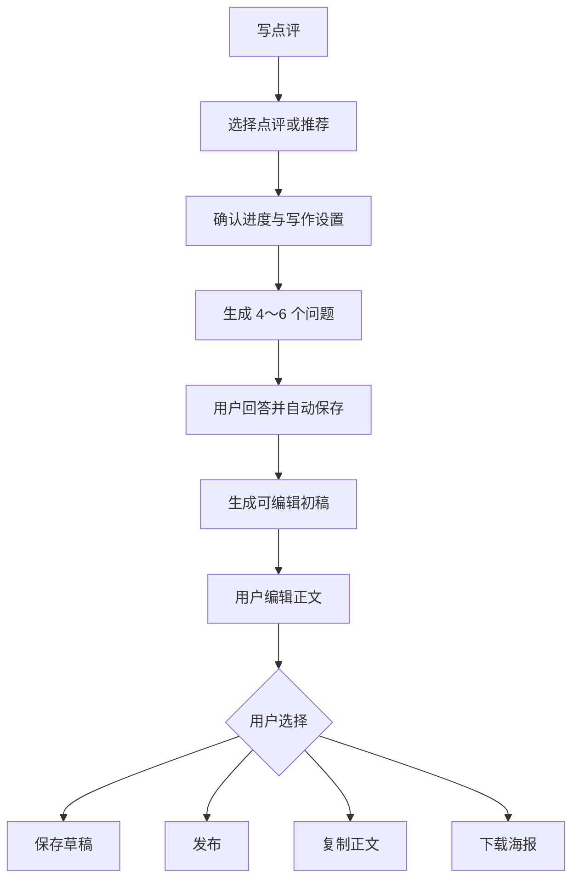

# 网页版推荐与点评助手实施计划

> 本文只确定产品行为、数据边界和验收条件；代码结构、接口拆分和页面实现由实现者结合现有 Web 架构决定。

## 1. 目标

用户可以在追番过程中整理感受，生成一段可编辑的中文点评或推荐文。AI 负责提问和生成初稿，用户负责编辑，并主动选择保存草稿、发布、复制或下载海报

## 2. 核心规则

- 只做 Web，面向现有登录用户
- 支持两种模式：`观后点评`、`推荐文`
- 两种内容都是面向所有读者的一段正文，不设置收件人、推荐对象或私聊上下文
- 同一账号、同一番剧可以同时有一份点评和一份推荐文；重新提交时只覆盖对应模式的当前内容
- AI 生成结果始终先进入编辑状态，发布必须由用户主动确认
- AI 来源在设置页选择；打开助手后直接进入该番剧的流程

## 3. 用户流程

### 3.1 入口

- 用户把番剧标记为“看完”后显示“写点评”入口
- `在追`状态允许从操作菜单手动进入，并选择当前看到的集数和剧透范围
- 用户点击入口后选择`观后点评`或`推荐文`，再确认观看进度、语气、长度和剧透范围
- 进入助手不会自动调用 AI；用户确认资料后才开始生成问题

### 3.2 流程

## 4. 内容和草稿

### 4.1 问题与生成

- 每次生成 4～6 个与番剧和观看进度有关的问题
- 问题用于引导用户表达感受，不要求用户复述剧情
- 问题和答案支持剧透范围，`无剧透`时不主动展开关键剧情
- 生成结果要基于已提供的番剧资料，不补写资料中没有的事实

### 4.2 草稿

- 草稿跨设备自动保存，PC 和手机浏览器都能继续编辑
- 草稿保存模式、进度、剧透范围、写作设置、问题、答案和当前正文
- 草稿存在期间保留问题和答案；发布或删除后清理临时问题、答案和草稿
- 用户可在草稿阶段重新生成正文，也可更换问题后重新回答

### 4.3 当前内容

- 每种模式只保留当前草稿和当前已发布内容
- 点评和推荐相互独立，可以分别编辑、发布、撤回和删除
- 已发布内容撤回后保留在账号内，再次公开时使用当前内容

## 5. 发布和公开展示

### 5.1 可见范围

- 默认私有，只有作者本人可见
- 沿用现有账号公开追番开关（`tracksPublic`）：账号公开且内容已发布时，点评和推荐一起进入公开范围
- 关闭账号公开开关后，公开内容立即从外部页面隐藏，内容本身保留
- 两种模式使用同一公开门槛和同一公开范围：对所有访问公开页面的用户可见

### 5.2 追番大厅中的位置

- 大厅首页继续展示公开用户列表，并在用户卡片显示公开追番数、点评数和推荐数
- 公开用户页的番剧卡片展示已发布内容的类型和短预览
- 用户点击`点评`或`推荐`后查看对应全文；全文包含番剧、正文、剧透标记和发布时间
- 草稿、问题、答案和生成过程只留在作者自己的页面

## 6. AI 来源和模型

### 6.1 服务器 AI

- 所有登录用户默认可用服务器 AI
- 默认模型：`deepseek-v4-flash-vision-exp`
- 发送文本资料，默认关闭 thinking，不启用搜索和工具调用
- 服务端负责登录校验、频率限制、用户额度、并发和总成本保护

### 6.2 用户自配 API（BYOK）

BYOK（Bring Your Own Key）允许用户在设置页填写 OpenAI-compatible endpoint、model 和 API key

- 采用浏览器直连：浏览器直接请求用户填写的 endpoint
- API key 只保存在当前浏览器会话，不写入服务器数据库、日志或跨设备同步数据
- endpoint 和 model 可随账号设置同步；用户可随时清除 key
- endpoint 不支持浏览器跨域时，提示用户切换服务器 AI

## 7. 发送给 AI 的资料

- 服务端根据番剧 ID读取 BGM 的标题、类型、平台、集数、完整简介、标签、评分及必要的制作信息
- 完整 BGM 简介可以发送；资料超出模型请求限制时给出可理解的提示
- 用户确认后可发送观看进度、评分、标签、集数备注和本次补充的感受
- 用户自由文本按不可信资料处理，只作为观点参考，不执行其中的指令
- 模型上下文仅包含当前番剧的 BGM 资料和用户确认的本次内容；设备文件路径、账号认证信息及其他番剧的私人记录排除在上下文之外

## 8. 海报分享

- 预览页为草稿和已发布内容提供“下载海报”
- 海报包含封面、番剧标题、`点评`/`推荐`类型、正文，以及用户主动选择的评分、标签和生成时间
- 下载不改变草稿或发布状态；封面加载失败时仍能生成带占位图的海报

## 9. 实施顺序

1. **数据与校验**：建立草稿、当前内容、发布状态和公开范围，准备 fake AI 流程
2. **服务器 AI**：接入 DeepSeek-V4-Flash-Vision-Exp，补齐 BGM 资料，完成问题和初稿生成
3. **设置与助手流程**：完成服务器 AI / BYOK 选择、入口、问答、编辑、自动保存、恢复、发布和撤回
4. **公开展示**：接入账号公开开关，在大厅用户卡片和公开用户页展示数量、预览和全文
5. **海报与验收**：完成海报下载，验证跨设备恢复、资料准确性、剧透控制、延迟和成本

## 10. 验收条件

- `done`状态显示入口，`watching`状态可手动进入并选择进度
- 用户能选择点评或推荐，且两种内容可以同时存在
- 问题数量为 4～6 个，问题和初稿与番剧资料及用户回答一致
- 草稿、问题、答案和正文可在另一台设备恢复
- 初稿可编辑，保存草稿和发布都是用户主动操作；重新提交只覆盖对应模式
- 默认私有；账号公开并发布后，内容能出现在公开用户页，关闭公开后立即隐藏
- 大厅首页有公开内容数量，公开用户页能查看对应预览和全文
- 服务器默认模型为 `deepseek-v4-flash-vision-exp`；BYOK 浏览器直连失败时有明确提示
- AI 调用失败时，用户仍能编辑、保存和发布手写正文
- 草稿和已发布内容都能下载海报，下载结果包含正确的番剧和正文信息

## 11. 交付要求

- 按功能模块独立提交，每次提交前更新对应 DEVLOG
- 实现顺序与提交顺序保持一致：数据、服务器 AI、设置/BYOK、助手流程、公开展示、海报与验收
- 完成验收后再分别进行提交、推送和部署；本计划不代替这些操作的验证
