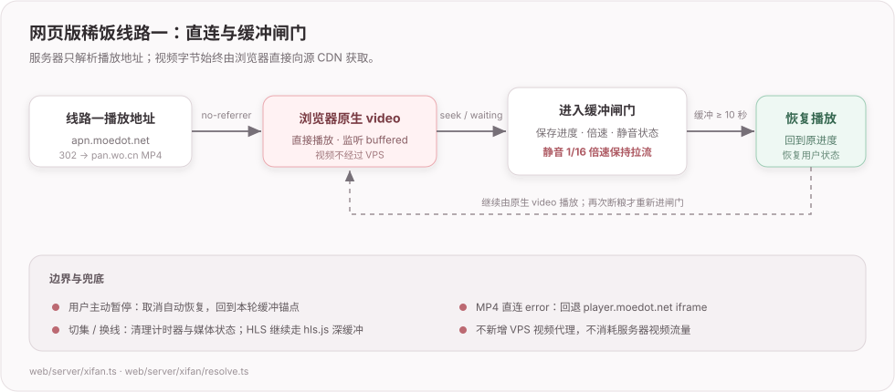

# 012 中的网页版在线观看早期方案

> 2026-10-06 抽离。直连、iframe、旧站验证码与缓冲闸门属于旧实现；不要据此修当前播放器。当前入口：[011](../011-在线观看.md)。

### 视频怎么流畅（2026-07-13 结论：靠 browser-direct + 客户端边下边看，不靠服务器）

用户担心「花钱也买不到全源流畅」。探讨结论：**视频流畅主要是代码 / 架构问题，跟服务器强弱基本
无关**，所以普通 CN2 VPS 够用、**不必为视频加码**。

- **核心 = 浏览器直连源 CDN（方案 B）**：国内盗版源的 CDN 本就服务国内、很快。让**浏览器直接从源
  CDN 播**，视频字节**不经过你服务器** → 服务器强弱与视频无关，土豆机也行；服务器只干「解析出播放
  地址」这点活。
- **边下边看 = 更深的缓冲**（不是「下载更快」，同一条路速度一样）：只要平均网速 ≥ 码率，往前多灌
  就不卡。渐进式 mp4 在 `<video>` 里浏览器本就贪婪缓冲；要更狠可自己 fetch 整集。HLS 调大缓冲窗口。
- **预下载下一集**：用户一集集看，提前灌 ep2 —— **只在方案 B 下划算**（不烧服务器带宽）。
- **跳转不是问题**（如跳到第 2 集第 10 分钟）：mp4 用 HTTP Range、HLS 用分片，从任意点开始拉 ——
  拖进度条本就这么工作，预下载只是顺路往前灌。
- **P2P / 服务器缓存：≤6 人不做**。P2P 是规模技术（要「同一集很多人同时看」，6 人几乎不可能同时撞
  同一集）；方案 B 下源 CDN 已负责分发，也不需要缓存（还惹「把盗版视频存自己服务器」的麻烦）。
- **躲不掉的残余**：挡 browser-direct 的源（HLS 要 CORS、或校验 Referer 防盗链）没法直连 → 退服务器
  中转（弱机吃力）或让用户自己挂魔法。所以「**全源**一致流畅」给不了；但**能直连的源（尤其渐进式
  mp4 的国内 CDN）在便宜服务器上就流畅**。到在线观看那档**一个源一个源实测**。

### 在线观看原型纪要（2026-07-21，稀饭已跑通浏览器直连）

到「在线观看」这一档先拿稀饭做原型，结论都是实测出来的（别再回头讨论）：

- **绕开了「服务端流代理」那条重路**（012 原本担心带宽是硬约束）：稀饭的 mp4 线（xfvod）和 HLS 线
  （playxf）**都挂在 Cloudflare 后、回 ACAO** → 浏览器能**直连源 CDN**（mp4 走 `<video>` no-cors；HLS 走
  hls.js），**视频字节不经服务器 = 零视频带宽**。app 那边「盗版 CDN 不给跨源、HLS 必须服务器代理」的假设
  **在稀饭不成立**。「视频三选二」里最贵的分支（服务器中转）这就拿掉了。
- **懒加载选线（2026-07-21 改，掉头去掉了「并行解析 + 自动选最优」）**：打开只抓 **1 次**
  （`getPlaylist`：source 1 页 → 线路 1 地址 + 正则扒源 tab 拿全部线路名），线路 2/3 **用户点了才
  `resolveLine` 抓那一条**。**为什么不再并行解析所有源自动挑最优**（原设计）：一串请求瞬间砸向稀饭像爬虫、
  会触发反爬 / 限流（项目抓取红线本就要求礼貌）；而且用户多半只看默认线路，预解析其余是白费。
  播放层按类型分派：`.mp4` → `<video>` 直连、`.m3u8` → hls.js，**直连播不了就套娃**（稀饭真实播放器
  `player.moedot.net/player/index.php?code=xfdm1&from=cf&url=`）。所以**不必预探 content-disposition / HLS
  空壳**，交给「播不了 → 套娃」统一兜（content-disposition 在 localhost 拦 = 011 老坑；CS 线偶尔是空壳
  `#EXTM3U` 9 字节，hls.js 报 manifestParsingError → 套娃）。
- **定位分两路**：图片验证码闸门只在 search / 账号登录；周表本身不闸。当季番从**周表页**
  `/index.php/label/weekday.html` 直接拿 animeId（标题 → `/watch/{id}/…`），日常追更全程不碰验证码；往季旧番、
  剧场版等非周历资源由用户主动进入全站搜索，完成站点验证码后选择结果。部分 watch 页另有稀饭账号 / 会员权限闸门；
  登录、搜索、播放共用按 MapleTools uid 隔离的 Cookie，会话加密落库，内存对象 15 分钟不用即回收后可从库恢复。
- **「比稀饭更顺」要校准预期**：视频流的瓶颈是**源 CDN 速度**，我方播放器和稀饭用**同一个 CDN** → 流本身
  **快不过**稀饭，只能靠**更深的缓冲**（hls.js 目标拉到 10 分钟垫子、暂停照灌）赢，而这**只在「网速 ≥ 码率」时
  兑现**。web 版真实价值是**快捷定位**（追番一键直连、省掉搜索-验证码-找番-点进去）+ **换集预下**（待做），
  **不是「流更顺」**。（原生 `<video>` 缓冲 30-60s 就停、暂停停下载，这也是 mp4 单流会卡、HLS+hls.js 更稳的原因。）
- **踩坑：缓冲读数别只挂 `timeupdate`** —— 它**暂停时不触发**，缓冲还在涨但界面数字冻住，看着像「暂停不缓冲」（排查了半天，其实 hls.js 后台一直在灌）。改用 `setInterval` 定时刷，再加个 `FRAG_LOADED` 分片计数：暂停时分片数还在 +1 = 确实在缓冲。
- **缓存分域**：匿名成功结果仍按 `(animeId, ep, source)` 全站共享（进程内 Map，1h TTL）；带稀饭登录态的结果
  按 MapleTools uid + 会话代次隔离，登录、退出或远端失效会切换代次，不能把受限地址串给其他用户或下一个账号。
  **不并行、不预解析**（见上条懒加载）。地址是静态路径（xfvod/playxf 无签名、pan.wo.cn 入口 apn.moedot.net
  也稳）。GET 的传输层瞬时故障只重试一次，登录 POST 和 HTTP 429 / 5xx 不自动重试。
- **形态**：播放页 `/api/xifan/play-page?animeId=&ep=`（+ `/playlist` 拿名单+线路1、`/resolve?source=N` 懒解析单条、
  自托管 `/hls.js`）。**2026-07-22 已接上追番卡片「继续看」**（周表免验证码建绑定，见下「继续看 · …绑定」一节）。
- **残余**：真实流畅度是**纯速度问题**，Mac + Clash 绕海外够国内 CDN 慢、给不了真实答案，**要部署后手机
  无魔法国内实测**才算数。Electron 可用持久 Chromium 等待稀饭 UAM，VPS 网页服务没有这个运行环境；若服务器
  出口遇到浏览器检查，只能提示用户稍后再试。嗷呜屏蔽境外、香港服务器够不着（见「海外节点的两个坑」）。

### 稀饭账号登录（2026-08-15）

- 设置页 `#/settings/xifan` 提供站点验证码登录、远端状态检查和退出。账号、密码、验证码只在一次 HTTPS
  请求中转发给稀饭，不写 SQLite；登录成功必须同时满足接口 `code=1` 与返回有效 `user_id` Cookie。
- 每个 MapleTools uid 单独保存一份 Cookie 罐；持久化内容使用从 `AUTH_SECRET` 域分离派生的密钥做
  AES-256-GCM 加密。轮换 `AUTH_SECRET` 会让 MapleTools JWT 与稀饭 Cookie 一起失效，这是预期的重新登录边界。
- 账号登录、全站搜索和播放解析复用同一会话。匿名遇到受限页返回“需要登录”，已登录仍被站点拒绝则返回
  “当前账号权限不足”；登录成功后，等待中的播放页通过跨标签事件重新加载。
- 验证码也是同一会话状态。任一标签开始刷新时先通知其他标签作废旧图和输入，避免两张只能有一张有效的验证码
  同时被显示为可提交。

### 稀饭 / Girigiri 播放源切换（2026-08-15）

- 两张已经验证过的裸 HTML 播放页继续各管自己的线路、HLS / MP4、缓冲和 iframe 兜底，不合并播放器核心；
  新增的「播放源」只负责在两张页面之间切换，避免一次功能改动重写两套媒体状态机。
- 播放链接新增稳定 `bgmId`。服务端分别查询 `xifan_binding` 与 `girigiri_binding` 后生成保持当前 `ep` 的目标地址，
  绝不从 animeId 推断 GV id，或反过来。点选集时也保留 `bgmId`，否则换一次集就会丢掉跨源上下文。
- 切源前销毁 video / HLS / iframe / 缓冲状态；若旧页进入浏览器 bfcache，后退恢复时主动重载，避免复原出已销毁的空播放器。
  目标源缺少同一集时沿用该播放器的真实错误，不自动夹取或偷偷换集。
- 未关联源常驻但标明「未关联」，绑定仍回到「我的追番」沿用现有周表候选 / 全站搜索 / 验证码流程；不在裸播放器里
  复制一套搜索状态机。视频路径保持「浏览器 ↔ 源 CDN」，服务端仍只抓播放元数据。

### 继续看 · bgmId ↔ 稀饭 animeId 绑定（2026-07-22，接上追番卡片）

- **两套 id、无确定映射**：追番存 BGM id，稀饭播放页要稀饭自己的 animeId，唯一联系是标题；而 search 有验证码。
  突破口是稀饭「追番周表」的数据接口**不设验证码**——
  - **坑：周表页是 AJAX 渲染的**，静态 HTML 只有 7 个空 `#week-list{1..7}` 容器（一堆 `href="javascript:"`），
    番单在 `script.js` 里 `POST /index.php/ds_api/weekday`、body 是**中文星期**（`weekday=一`，一/二/…/日）拉。
    返回 `{code:1,list:[{vod_id,vod_name,url,vod_remarks}]}`——`vod_id` 就是 animeId，`vod_name` 中文名，
    `vod_remarks`（`"03|周一22:00"`）带更新到第几集。**别去 grep 静态 HTML 的 `/watch/` 链接（没有）**，要打这个 POST。
- **匹配模糊 → 候选让用户确认，绝不自动认**（跟 app「源只按显式 bindings 关联、绝不模糊匹配自动绑」同一条原则）：
  `locate.ts` 归一化（NFKC + 去标点空格 + 只留汉字/假名/字母数字）后按「相等 / 互相包含 / 二元组 Dice」打分排序，
  前端弹「选择稀饭片源」候选框，点一个才算。季度后缀（第二季/Ⅱ）、简繁、日文原名都可能对不齐——人眼确认一次最稳。
- **绑定表全局、不按用户**（`xifan_binding`，主键 `bgm_id`）：`bgm→xifan` 是客观事实、对所有人一样，一人确认全体命中。
  **不塞进 `tracks.extra`**——那列留给 app 富字段原样过路（同步铁律），web 不该碰；绑定是 web 自己的数据，另立一张表。
- **持久 + 跨季**：落库后周表换季、原番消失也照常开播（不再依赖周表）。周表只负责当季免验证码定位；
  周表没有候选时弹框转入全站搜索，验证码通过后仍由用户点结果确认，绝不因模糊标题自动绑定。
- **落集数 = 已看 +1**（`nextEp`）：「继续」就是往下看，周更用户打开时新集刚好这一集。真开到没更新的集，靠**集数网格**
  点回去即可——不指望默认落点永远对，给个能纠的口子。
- **前端不吃弹窗拦截**：绑过的卡片「继续看」直接是原生 `<a target=_blank>`（无异步），没绑的才是 `<button>`（点了去定位、
  弹候选，周表候选行和全站搜索结果行本身都是 `<a>`）——全程真实用户手势开新标签，不触发 popup blocker。
- **播放页参考 app 播放器重做**（2026-07-22）：标题 + EP 徽标 / 线路卡片 / **集数网格**（从 watch 页 `.anthology-list` 正则扒
  整季集数、当前高亮、点即换集），玫瑰主色对齐 app/web 暗色主题。app 那套 `mtmedia://` 主进程流代理 web 没有，播放机制不照搬。
- **下载型链接按 URL 判死走 iframe**（修正原型纪要「不预探 content-disposition」那条）：`apn.moedot.net/d/…` 会 **302 跳
  `pan.wo.cn/openapi/download`**（联通网盘），`<video>` 喂它=浏览器**下载 400MB 附件**（还播不了）、白等几秒才切套娃、
  甚至触发下载器弹窗。这是**服务端 attachment、各端一致**（区别于 011 那种 origin 相关的 content-disposition），值得在
  `classify()` 里按 URL **直接判 iframe**、跳过 `<video>`；真·origin 相关的失败才留给播放层「直连失败→套娃」兜底。

### 稀饭线路一 MP4 直连与缓冲闸门（2026-08-08）

用户用「尼古喵喵」线路一复现：跳到约 53 秒后会播几秒、停几秒；和桌面版是同一条慢源，
但网页没有 Electron 自定义协议，不能照搬多 Range 本地缓存。

- **更正上面的旧结论**：`attachment` 不是这条链接必然只能 iframe。稀饭官方
  `player.moedot.net` 整页使用 `no-referrer`；用真实 Chromium 对照后确认，只有 `<video>` 或 iframe
  属性不足以改变这条媒体请求，播放页响应头设 `Referrer-Policy: no-referrer` 后，
  `apn.moedot.net → pan.wo.cn` 可以直接作为 MP4 播放。因此线路一恢复 `<video>`，拿回
  `waiting / seeking / buffered` 的控制权；直连 `error` 仍回退官方 iframe。
- **不能暂停等待**：第一版在 `waiting` 时 `pause()`，真实 Chromium 的缓冲到约 2.338 秒便不再增长，
  目标 10 秒永远到不了。最终保留用户的进度、倍速和静音状态，以浏览器可用的最低值 1/16 倍速
  静音播放，让同一媒体请求继续拉取；缓冲达到 10 秒后跳回缓冲前锚点，再恢复原状态。
  用户主动暂停会取消自动恢复并回到锚点，切集、换线、出错都会清理计时器与状态。
- **首播不能误进中途缓冲闸门（2026-08-31 复盘）**：`canplay` 收起首次加载纸片后，用户点击原生播放控件会触发第一枚
  `playing`；这枚事件只代表“用户终于开始看”，不能因为缓冲领先不足目标值就再次显示「描线中」。首播要单独记一枚
  “尚未开始 / 已开始”的状态：首次只设置媒体地址并保持暂停，首次 `playing` 只收起初始提示；之后的 `waiting` 或 `seeking`
  才启动缓冲闸门。否则“首次起播”和“播放中途卡顿”共用一个预先为真的开关，就会出现纸片消失 → 用户点播放 → 纸片闪回的假故障。
  回退官方跨域 `iframe` 时，父页面不模拟点击、不读取其状态；iframe 内的播放按钮和缓冲提示属于对方播放器，不能与主页面 `<video>` 状态机混用。
- **首播回归序列（以后改播放事件必须保留）**：`src/load → canplay → paused → 用户点击原生控件 → 首次 playing（纸片保持隐藏）→
  后续 waiting/seek（才可显示缓冲闸门）`。移动端若不先发 `canplay`，首次用户 `play` 手势也只负责收起初始纸片，不能触发自动播放或
  首播缓冲预热。改动后至少做一次这条本地事件序列，不访问第三方源站。
- **严苛回归**：真实 141 秒 MP4 被限到约 70KB/s（低于其约 90KB/s 的正常播放消耗），
  在 53 秒处积到约 12 秒缓冲后恢复，随后正常速度连续播放 20.28 秒，`waiting=0`、
  `stalled=0`，未使用 iframe。视频仍是浏览器 ↔ CDN，服务器只解析地址，不承担视频带宽。

